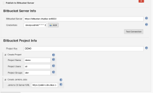
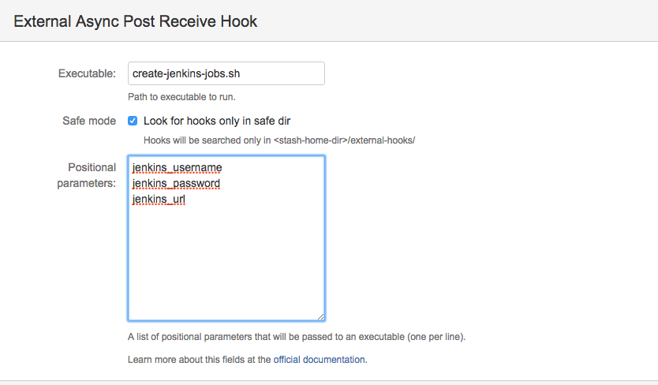

[[PublishtoBitbucketPlugin-HowitWorks:]]
== How it Works:

[[PublishtoBitbucketPlugin-]]
== [.confluence-embedded-file-wrapper .confluence-embedded-manual-size]##

Let's say you have been working day in, day out on a new
spike/code/project locally on your laptop with a local git repo. And now
ready to publish this to the Bitbucket server. This would require
following steps:

{empty}1. Create a project on Bitbucket server.

{empty}2. Create the repository under the new project.

{empty}3. Assign users/group with write permissions to the project and
repository.

{empty}4. Finally import your code into the remote repository by adding
remote "origin" and pushing the code.

{empty}5. As an add-on, if you have Jenkins CI server, and want to run
the one
time https://marketplace.atlassian.com/plugins/com.ngs.stash.externalhooks.external-hooks/server/overview[external
async post receive
hook. ](https://marketplace.atlassian.com/plugins/com.ngs.stash.externalhooks.external-hooks/server/overview).
The hook is disabled after pushing the code.  +
    (Note: The external post receive hook will be enabled with the
settings as shown below. The jenkins user/password is taken from the
credentials selected in plugin configuration).
[.confluence-embedded-file-wrapper .confluence-embedded-manual-size]## +

____
 This plugin does all of the above for you. 
____

Creates a Bitbucket repository (and associated project) from the current
code.

 +
*Features*

* Creates Bitbucket repository based on the current code in the
workspace
* Creates Bitbucket projects for the repository if needed.
* Assign users with read/write permission to the repository
* Assign group with read/write permission to the repository

[[PublishtoBitbucketPlugin-Potentialupcomingfeatures]]
=== Potential upcoming features

* Support for github
* Support for pipeline

[[PublishtoBitbucketPlugin-Requirements]]
== Requirements

* Existing Bitbucket server.
* Bitbucket user with permission to create the repository/project

[[PublishtoBitbucketPlugin-Jenkins]]
=== Jenkins

Jenkins https://jenkins.io/changelog-stable#v1.625.3[version 1.625.3] or
newer is required.

[[PublishtoBitbucketPlugin-Version1.0(March27,2017)]]
=== Version 1.0 (March 27, 2017)

* Initial release
