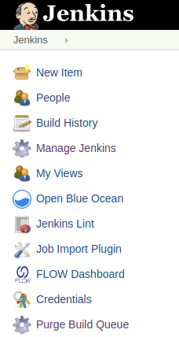

[[PurgeBuildQueuePlugin-PurgeBuildQueuePlugin]]
== Purge Build Queue Plugin

This plugin provides a mechanism to delete all jobs from the build queue
at once. 

'''''

Ordinarily, you can only remove jobs from the build queue one by one.
 This is inconvenient when the build queue contains many jobs.

This plugin adds a __Purge Build Queue__ button to the top-level Jenkins
page.

[.confluence-embedded-file-wrapper .confluence-embedded-manual-size]## +

Click _Purge Build Queue_ to clear all jobs from the build queue.

[[PurgeBuildQueuePlugin-Changelog]]
=== Changelog

[[PurgeBuildQueuePlugin-1.0(released2011-08-25)]]
==== 1.0 (released 2011-08-25)

* fully I18N
* initial implementation
