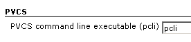
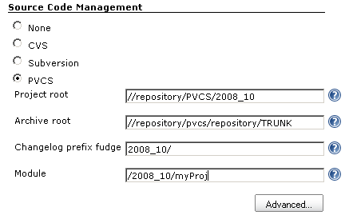
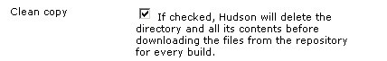

This plugin provides integration with Serena's PVCS Version Manager SCM.

[[PVCSSCM-Configuring]]
== Configuring

Configuration of the PVCS plugin should be fairly straightforward, but
my experience with PVCS is that _nothing_ about PVCS is straightforward,
simple, or in line with how other SCM systems work. This plugin was
developed around the PCLI command-line tool, and I basically had to
bludgeon that utility into submission....

[[PVCSSCM-System-levelconfig]]
=== System-level config

[.confluence-embedded-file-wrapper]##

Specify the path to the `+pcli+` executable, or just use "pcli" if it is
in the environment path of the user running Jenkins.

[[PVCSSCM-Basicconfig]]
=== Basic config

[.confluence-embedded-file-wrapper]##

[[PVCSSCM-Projectroot]]
==== Project root

Specify the root of your project in this field. It is the path used by
all PVCS clients (including the desktop GUI) to access your source.

[[PVCSSCM-Archiveroot]]
==== Archive root

This is the path to the actual archive files on the PVCS server's
filesystem. This is required to determine which files were changed from
build to build; you can go back and set this later, if you need to,
without modifying your builds.

[[PVCSSCM-Changelogprefixfudge]]
==== Changelog prefix fudge

This is prefixed to the archive path of a file when determining the
changes made to a build, after the "Archive root" (above) has been
stripped off.

[[PVCSSCM-Module]]
==== Module

This is the path to the directory which will be recursively retrieved
from the project root. It must start with a leading "/".

So, to tie it all together, let's say the top-level `+pom.xml+` for your
Maven project is at `+/2008_10/myProject/pom.xml+`, with a PVCS project
root of `+//repository/PVCS/October_Release+`. The archive files are
stored on the PVCS server's filesystem at
`+//repository/pvcs/repository/TRUNK+`, so
`+/2008_10/myProject/pom.xml+` actually resides at
`+//repository/pvcs/repository/TRUNK/myProject/pom.xml+`.

You would specify:

* the project root as `+//repository/PVCS/October_Release+`
* the archive root as
`+//repository/pvcs/repository/TRUNK/myProject/pom.xml+`
* changelog prefix fudge as `+2008_10/+`
* module as `+/2008_10/myProject+`

[[PVCSSCM-Advancedconfig]]
=== Advanced config

[.confluence-embedded-file-wrapper]##

Since PVCS is too brain-dead to tell you when a file is deleted, it is
best to leave this box checked so that all checked-out files will be
deleted before a build is started. This ensures that your workspace
accurately reflects the current state of the repository.

[[PVCSSCM-ChangeLog]]
== Change Log

[[PVCSSCM-Version1.2(Jan23,2018)]]
=== Version 1.2 (Jan 23, 2018)

* [.jira-issue .conf-macro .output-block]#
https://issues.jenkins-ci.org/browse/JENKINS-49024[[.aui-icon .aui-icon-wait .issue-placeholder]##
##JENKINS-49024] - [.summary]#Getting issue details...#
[.aui-lozenge .aui-lozenge-subtle .aui-lozenge-default .issue-placeholder]#STATUS#
#

[[PVCSSCM-Version1.1(Jul21,2010)]]
=== Version 1.1 (Jul 21, 2010)

* Add ability to provide loginid, pvcs workspace, promotion group,
version label while generating the pcli command
* Fix help links
* Updated code for more recent Hudson

[[PVCSSCM-Version1.0(Nov5,2008)]]
=== Version 1.0 (Nov 5, 2008)

* Initial release
