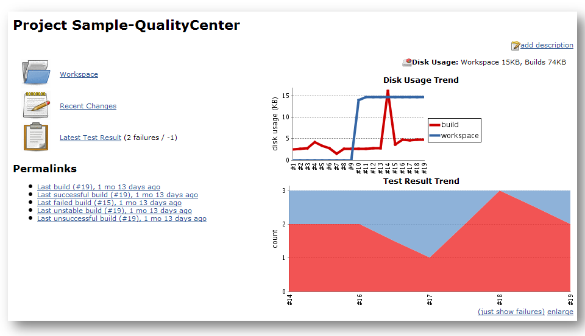
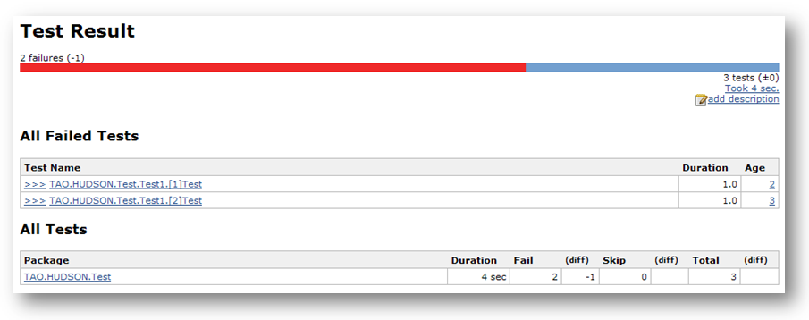
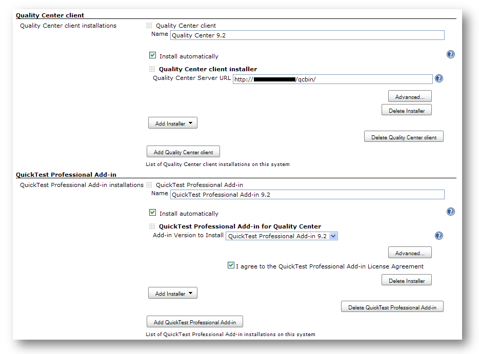
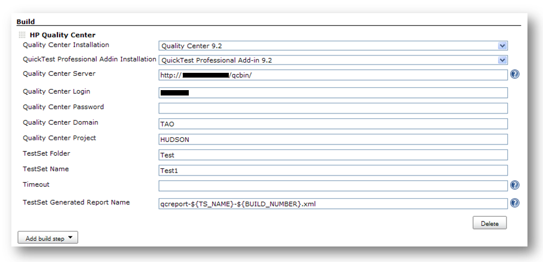
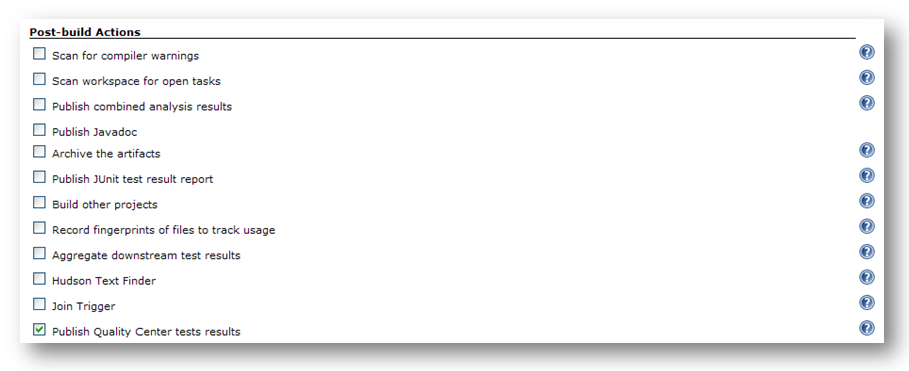

This plugin allows Hudson to trigger HP Quality Center test sets.

[.aui-icon .aui-icon-small .aui-iconfont-warning .confluence-information-macro-icon]#
#

If you identified bugs or want to submit enhancement requests, please
use http://issues.jenkins-ci.org/[JIRA]. The component for this plugin
is the `+qc+` one.

[[QualityCenterPlugin-Aboutthisplugin]]
== About this plugin

[.aui-icon .aui-icon-small .aui-iconfont-error .confluence-information-macro-icon]#
#

If you are using HP Application Lifecycle Management (ALM) 11.00 or
higher and QuickTest Professional 11.00 or higher, or if you want to
call Unified Functional Testing (UFT) or Service Test (ST) tests, use
the
*https://wiki.jenkins-ci.org/display/JENKINS/HP+Application+Automation+Tools[HP
Application Automation Tools]* plugin.

This plugin allows to trigger HP Quality Center test sets as a build
step and then to present the results in Hudson's UI like for JUnit:

[.confluence-embedded-file-wrapper .image-center-wrapper]##

[.confluence-embedded-file-wrapper .image-center-wrapper]##

This plugin currently supports at least:

* HP Quality Center 9.0 (installation of QC/installation of QTP
Add-in/triggering of test sets)
* HP Quality Center 9.1 (installation of QC/installation of QTP
Add-in/triggering of test sets)
* HP Quality Center 9.2 (installation of QC/installation of QTP
Add-in/triggering of test sets)
* HP Quality Center 10.0 (triggering of test sets only)

Other versions may work since HP Quality Center's API is fairly stable
across versions.

[[QualityCenterPlugin-Userguide]]
== User guide

[[QualityCenterPlugin-ConfiguringQualityCenterclientandQuickTestProfessionalAdd-ininstallations]]
=== Configuring Quality Center client and QuickTest Professional Add-in installations

Before using the *HP Quality Center* build step, the plugin must be
configured by (1) defining one or several installations for the *Quality
Center client* tool and (2) one or several installations for the *Quick
Test Professional Add-in* tool. You do this by going to the standard
*Manage Hudson* screen:

[.confluence-embedded-file-wrapper .image-center-wrapper]##

*Note:* You can choose an automatic installer for both tools. In the
case of the *Quality Center client* one, the installer will be
downloaded from your Quality Center server. In the case of the *Quick
Test Professional Add-in* tool, it will be downloaded from HP's update
site.

[[QualityCenterPlugin-ConfiguringtheHPQualityCenterbuildstep]]
=== Configuring the HP Quality Center build step

[.aui-icon .aui-icon-small .aui-iconfont-warning .confluence-information-macro-icon]#
#

A job which uses an *HP Quality Center* build step MUST run on Windows.

To trigger test sets from a job, add an *HP Quality Center* build step.
It is configured as follow:

[.confluence-embedded-file-wrapper .image-center-wrapper]##

*Note:* It's unadvised to change the value of the *TestSet Generated
Report Name* field.

Once the build step has been added, it is stronly advised to enable the
*Publish Quality Center test results* publisher. This publisher will
read the test results from the file defined using the *TestSet Generated
Report Name* field and will provide the Hudson integration like for
JUnit.

[.confluence-embedded-file-wrapper .image-center-wrapper]##

[[QualityCenterPlugin-Versionhistory]]
== Version history

[[QualityCenterPlugin-Version1.2.2(notyetreleased)]]
=== Version 1.2.2 (not yet released)

* Improved logs: Test steps are now displayed in the console output
* Fixed
https://issues.jenkins-ci.org/browse/JENKINS-12536[JENKINS-12536]: There
was a `+NullPointerException+` in the *Publish Quality Center test
results* publisher if no test results reports were generated

[[QualityCenterPlugin-Version1.2.1(01/12/2012)]]
=== Version 1.2.1 (01/12/2012)

* Fixed
https://issues.jenkins-ci.org/browse/JENKINS-12384[JENKINS-12384]: There
was an error while saving test set reports when multiple tests were run
* Fixed
https://issues.jenkins-ci.org/browse/JENKINS-12389[JENKINS-12389]: There
was a `+NullPointerException+` in the *Publish Quality Center test
results* publisher when some of the tests could not be run

[[QualityCenterPlugin-Version1.2(12/07/2011)]]
=== Version 1.2 (12/07/2011)

* Implemented
https://issues.jenkins-ci.org/browse/JENKINS-11773[JENKINS-11773]: It is
now possible to trigger several test sets in just one build step
* Fixed
https://issues.jenkins-ci.org/browse/JENKINS-12023[JENKINS-12023]:
Quality Center plugin was failing when timeout was not set

[[QualityCenterPlugin-Version1.1(06/20/2011)]]
=== Version 1.1 (06/20/2011)

* New *Run Mode* and *Run host* fields to control where the tests are
run
* Improved logging: More information is brought into the generated test
report
* Fixed https://issues.jenkins-ci.org/browse/JENKINS-8098[JENKINS-8098]:
Cf. the JIRA issue for a detailed description
* Fixed https://issues.jenkins-ci.org/browse/JENKINS-9267[JENKINS-9267]:
The RunTestSet script was failing if the *Planned host name* field was
empty in Quality Center

[[QualityCenterPlugin-Version1.0(10/22/2010)]]
=== Version 1.0 (10/22/2010)

* Initial release
