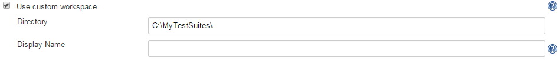
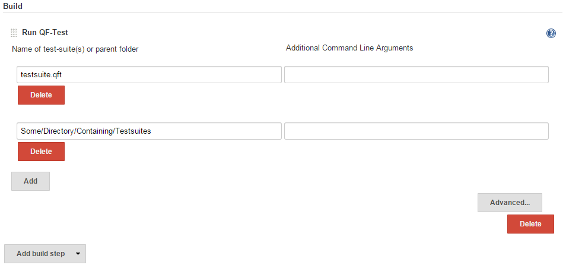
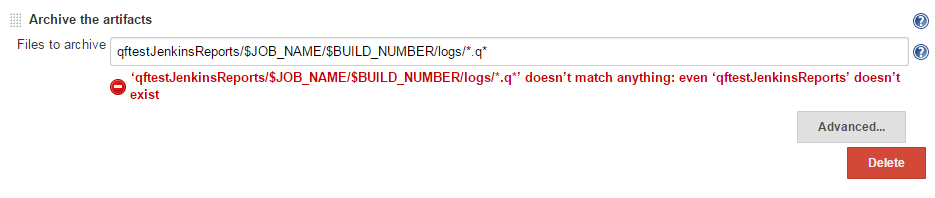
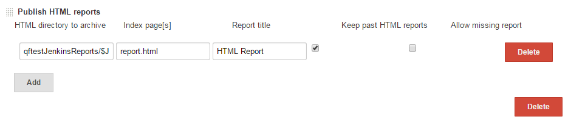
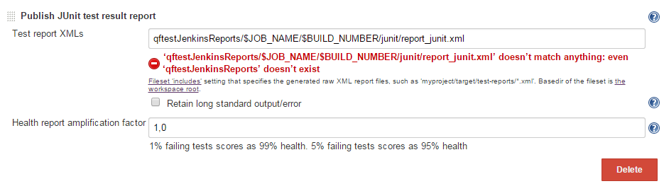

Allows users to run QF-Test suites as part of the build step

 +
This plugin enables http://www.qfs.de/[QF-Test] integration with
Jenkins.

http://www.qfs.de/[QF-Test] is a cross-platform software tool for the
GUI test automation specialized on Java and Web

applications.

For an in-depth look at the plugin and all of its available features,
please have a look into the video tutorials
(https://youtu.be/8LkLKUroMW4[English] / https://youtu.be/71ocMrKPNOQ[German])
or visit the https://www.qfs.de/en/qftest/manual.html[QF-Test manual].

[[QF-TestPlugin-QuickInstallationGuide:]]
== Quick Installation Guide:

* Go to Jenkins → Manage Jenkins → Manage Plugins → Available
* Select the QF-Test Plugin and click on the 'Install' button
* Restart Jenkins

[[QF-TestPlugin-HowtousetheQF-TestPlugin:]]
== How to use the QF-Test Plugin:

* If you don't already have a Jenkins project for QF-Test, you might
want to create one (usually a Freestyle project).

[[QF-TestPlugin-Configuretheproject:]]
== Configure the project:

* In the 'Advanced Project Options' section click on 'Advanced...'
* Select 'Use custom workspace' and enter the path to the folder
containg the test-suites. +

[.confluence-embedded-file-wrapper .image-left-wrapper]## +
 +
 +
 +
 +
 +
 +

* In the 'Build' section click on 'Add build step' and select 'Run
QF-Test'.
* In the left field enter the name of the test-suite or a folder with
test-suites you want to run.
* In the right field you can enter additional command line arguments as
described in the „Test execution“ section of the
https://www.qfs.de/en/qftest/manual.html[QF-Test manual].
* By using the 'Add' and 'Delete' buttons, you can specify multiple
test-suites if necessary. \\\\

[.confluence-embedded-file-wrapper .image-left-wrapper]## +
 +
 +
 +
 +
 +
 +
 +
 +
 +
 +
 +
 +
 +
 +
 +
 +
 +
 +
 +
 +
 +
 +
 +
 +
 +

[[QF-TestPlugin-Configurereporting:]]
== Configure reporting:

The next steps are used to process test results and archive QF-Test
run-logs and HTML reports.

[[QF-TestPlugin-Storerun-logsasartifacts]]
=== Store run-logs as artifacts

* In the 'Post-build Actions' section click on 'Add post-build action'
and choose 'Archive the artifacts'.
* Under 'Files to archive' copy and paste this path:
*qftestJenkinsReports/$JOB_NAME/$BUILD_NUMBER/logs/*.q***

[.confluence-embedded-file-wrapper .image-left-wrapper]## +
 +
 +
 +
 +
 +
 +
 +
 +
 +
 +

[[QF-TestPlugin-PublishHTMLreports]]
=== *Publish HTML reports*

* Add post-build action 'Publish HTML reports' .
* Click on 'Add' .
* In the HTML directory to archive copy and paste this path:
*qftestJenkinsReports/$JOB_NAME/$BUILD_NUMBER/html/*
* Change the Index page from index.html to report.html .
* Check the box 'Keep past HTML reports', if you want to keep all HTML
reports.

[.confluence-embedded-file-wrapper .image-left-wrapper]## +
 +
 +
 +
 +
 +
 +
 +
 +
 +
 +

[[QF-TestPlugin-Processtestresults]]
=== *Process test results*

* Add post-build action 'Publish JUnit test result' .
* In the 'Test report XMLs' textfield copy and paste this path:
*qftestJenkinsReports/$JOB_NAME/$BUILD_NUMBER/junit/report_junit.xml*

[.confluence-embedded-file-wrapper .image-left-wrapper]## +
 +
 +
 +
 +
 +
 +
 +
 +
 +
 +
 +
 +
 +
 +
 +

* Click on 'Save'.

Troubleshooting

[.aui-icon .aui-icon-small .aui-iconfont-info .confluence-information-macro-icon]#
#

Always check the console output of your build, in case of problems. +
It may also be helpful to add the command line argument '-dbg' to get
additional debug information in the console output. +
If that doesn't help you to solve the problem, please take a look at the
QF-Test manual or contact the QFS support.
