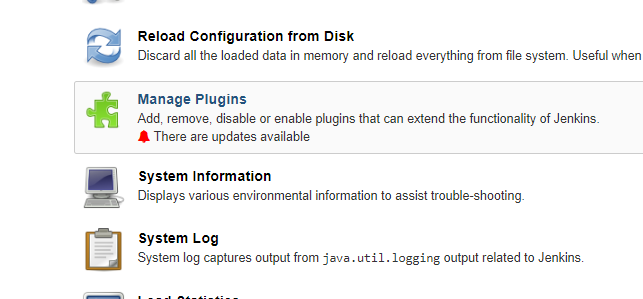
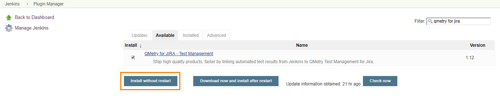
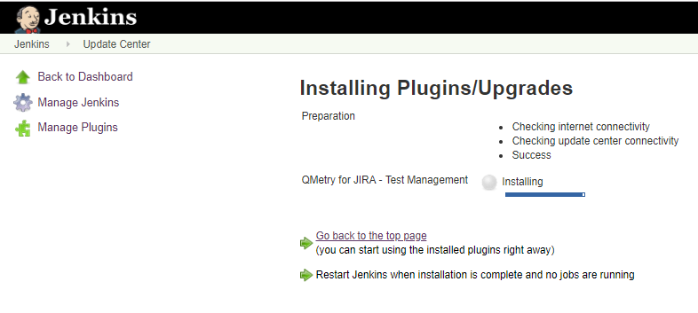
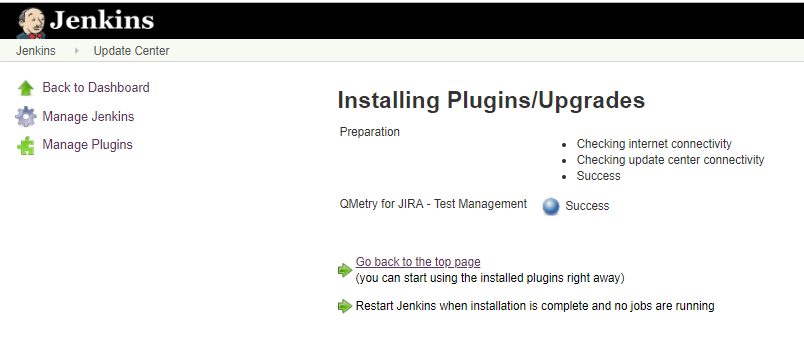
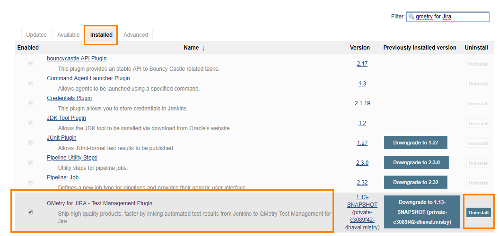
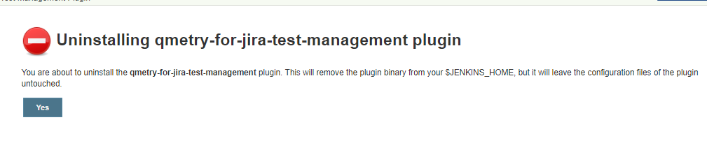

[.conf-macro .output-inline]##

[cols="",options="header",]
|===
|Plugin Information
|View QMetry for JIRA - Test Management
https://plugins.jenkins.io/qmetry-for-jira-test-management[on the plugin
site] for more information.
|===

[.aui-icon .aui-icon-small .aui-iconfont-error .confluence-information-macro-icon]##

The current version of this plugin may not be safe to use. Please review
the following warnings before use:

* https://jenkins.io/security/advisory/2019-11-21/#SECURITY-727%20(2)[Plain
text password shown in configuration form]

[.aui-icon .aui-icon-small .aui-iconfont-info .confluence-information-macro-icon]##

Older versions of this plugin may not be safe to use. Please review the
following warnings before using an older version:

* https://jenkins.io/security/advisory/2019-11-21/#SECURITY-727%20(1)[Credentials
stored in plain text]

* +
*

* +
*

[[QMetryForJiraTestManagementPlugin-AboutthePlugin]]
== About the Plugin

QMetry Test Management for JIRA plugin for Jenkins has been designed to
seamlessly integrate your CI/CD pipeline with QMetry.

Easily configure Jenkins to submit your test results to QMetry without
needing to write any code or deal with REST API. Your Test Results could
be from any automation framework like Cucumber, Test NG, JUnit, QAF and
more.

For more info
visit http://www.qmetry.com/qmetry-test-management-for-jira/[QMetry Test
Management for JIRA].

[[QMetryForJiraTestManagementPlugin-Pre-requisites]]
== Pre-requisites

. QMetry Test Management for JIRA installed in Server/Data Center or
Cloud
. Jenkins installation

[[QMetryForJiraTestManagementPlugin-InstallQMetryForJiraTestManagementPlugin]]
== Install QMetry For Jira Test Management Plugin

{empty}1. Open the Jenkins instance and click on *Manage Jenkins* on the
left panel.

 +

[.confluence-embedded-file-wrapper .confluence-embedded-manual-size]##

 +

{empty}2. Select *Manage Plugins* on the next screen.

 +

[.confluence-embedded-file-wrapper .confluence-embedded-manual-size]##

 +

{empty}3. Open the *Available* tab.

{empty}4. Search for QMetry for Jira plugin. The plugin will be short
listed.

{empty}5. Select the *QMetry for Jira - Test Management* plugin and
click on the *Install without restart* button.

 +

[.confluence-embedded-file-wrapper .confluence-embedded-manual-size]##

 +

The installation process is initialized.

 +

[.confluence-embedded-file-wrapper .confluence-embedded-manual-size]##

 +

Once the plugin in stalled, the Success status is displayed.

 +

[.confluence-embedded-file-wrapper .confluence-embedded-manual-size]##

 +

[[QMetryForJiraTestManagementPlugin-UnintallQMetryForJiraTestManagementPlugin]]
== Unintall QMetry For Jira Test Management Plugin

 +

{empty}1. Open the Jenkins instance and click on *Manage Jenkins* on the
left panel.

[.confluence-embedded-file-wrapper .confluence-embedded-manual-size]##

 +

{empty}2. Select *Manage Plugins* on the next screen.

 +

[.confluence-embedded-file-wrapper .confluence-embedded-manual-size]##

 +

{empty}3. Open the *Installed* tab.

{empty}4. Search for QMetry for Jira plugin. The plugin will be short
listed.

{empty}5. Select the *QMetry for Jira - Test Management* plugin and
click on the *Uninstall* button.

 +

[.confluence-embedded-file-wrapper .confluence-embedded-manual-size]##

 +

The confirmation message appears. Click Yes to proceed.

 +

[.confluence-embedded-file-wrapper .confluence-embedded-manual-size]##

 +

 +

*Read More*

* https://wiki.jenkins.io/display/JENKINS/QMetry+For+Jira+Test+Management+Plugin+4.0+and+above[QMetry
For Jira Test Management Plugin 4.0 and above]
* https://wiki.jenkins.io/display/JENKINS/QMetry+For+Jira+Test+Management+Plugin+3.3+and+below[QMetry
For Jira Test Management Plugin 3.3 and below]
* https://wiki.jenkins.io/display/JENKINS/Specflow[Specflow]
* https://wiki.jenkins.io/display/JENKINS/Define+Parameters[Define
Parameters]

 +

 +

[.aui-icon .aui-icon-small .aui-iconfont-info .confluence-information-macro-icon]#
#

https://www.qmetry.com/privacy-policy/[QMetry Privacy Policy]

 +

 +
