[[QMetryTestManagmentPlugin-AboutthePlugin]]
== About the Plugin

QMetry Test Management plugin for Jenkins has been designed to
seamlessly integrate your CI/CD pipeline with QMetry.

Easily configure Jenkins to submit your test results to QMetry without
needing to write any code or deal with REST API. Your Test Results could
be from any automation framework like Cucumber, Test NG, JUnit, QAF and
more.

For more info visit
https://www.qmetry.com/qmetry-test-management/[QMetry Test Management]. 

Read the following topics on this page:

. Pre-requisites
. How to install QMetry Test Management Plugin for Jenkins
. Configuring a standard Jenkins Job.
. Configuring QMetry Plugin job as a post build action.
. Triggering the job and publishing results in QMetry.

[[QMetryTestManagmentPlugin-Pre-requisites]]
== Pre-requisites

. QMetry Test Management installed on Server or Cloud
. Jenkins installation

[[QMetryTestManagmentPlugin-HowtoinstallQMetryTestManagementPluginforJenkins]]
== How to install QMetry Test Management Plugin for Jenkins

. Login to Jenkins and go to Manage Jenkins.

 +

[.confluence-embedded-file-wrapper .confluence-embedded-manual-size]#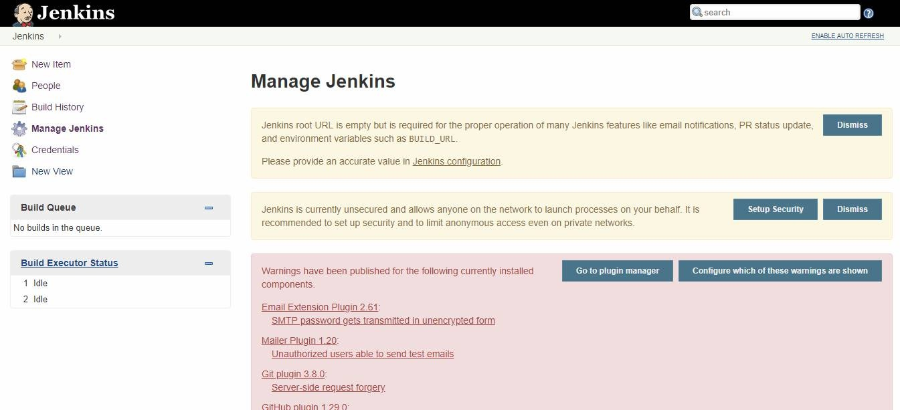#

 +

{empty}2. Locate the *Manage Plugins* section.

 +

[.confluence-embedded-file-wrapper .confluence-embedded-manual-size]#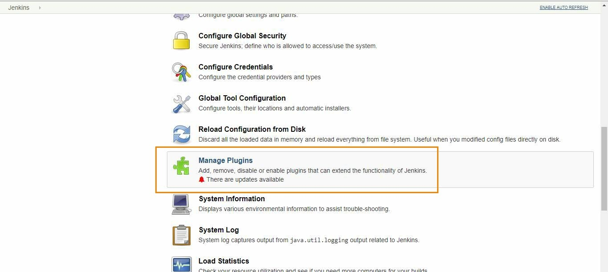#

 +

 +

{empty}3. Open the *Available*  tab and search for "QMetry Test
Management".

 +

[.confluence-embedded-file-wrapper .confluence-embedded-manual-size]#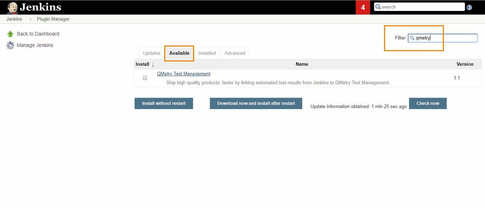#

 +

{empty}4. Locate and select the QMetry Test Management Plugin. Choose
install option either *Install without Restart* OR *Download Now and
install after restart*.

 +

[.confluence-embedded-file-wrapper .confluence-embedded-manual-size]#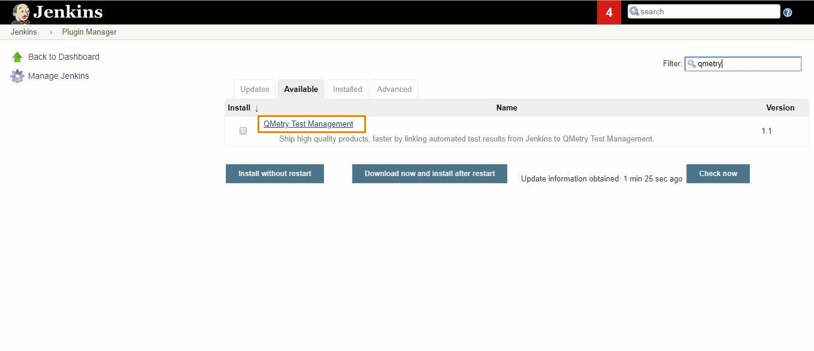#

[.confluence-embedded-file-wrapper .confluence-embedded-manual-size]#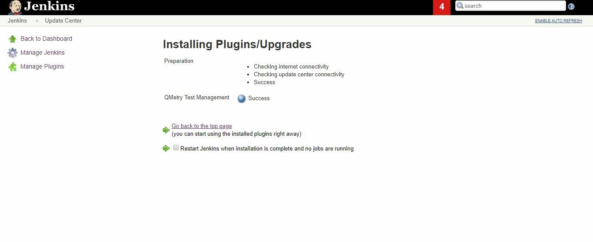#

[[QMetryTestManagmentPlugin-ConfiguringaStandardJenkinsjob]]
== Configuring a Standard Jenkins job

You can configure Jenkins job through either of the following options:

* Freestyle Project
* Pipeline

[[QMetryTestManagmentPlugin-Freestyleproject]]
=== Freestyle project

Let’s create a standard Freestyle job in Jenkins.

. To create a new Jenkins job, click on the *New Item* option on the
*Jenkins* menu.

[.confluence-embedded-file-wrapper .confluence-embedded-manual-size]#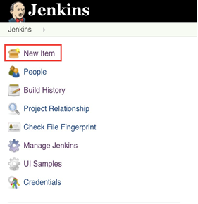#

{empty}2. Provide a name for your job.

    Select *Freestyle project* on the screen and then click OK.

 +

 [.confluence-embedded-file-wrapper .confluence-embedded-manual-size]#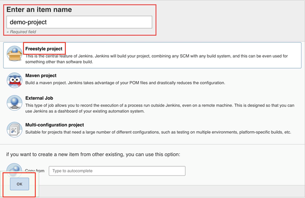#

 +

{empty}3. Next, the configuration page appears where you can configure
your job by various categories: General, Source Code Management (SCM),
Build Triggers, Build, and Post build actions.

    

 [.confluence-embedded-file-wrapper .confluence-embedded-manual-size]#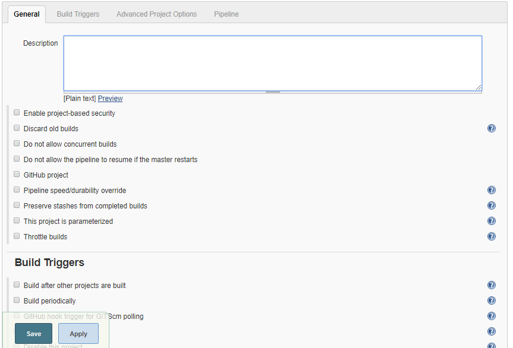#

 +

{empty}4. On the *Source Code Management* tab, select the appropriate
option in which you have your source code. For example, here it is
“Git”. So, select “Git” and provide the necessary information. (Note:
You need to configure GitHub plugin in global configuration).

[.confluence-embedded-file-wrapper .confluence-embedded-manual-size]#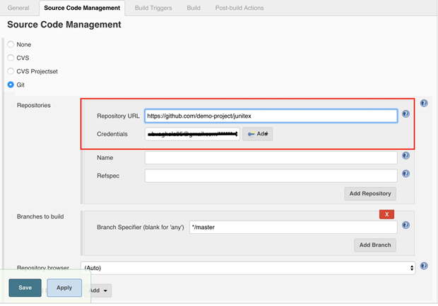#

 +

{empty}5.  Optionally, you can set Build Triggers.

Select the *Build Triggers* tab. Let’s just add a periodic trigger which
triggers build every minute – every hour – every day (Schedule: * * * *
*).

[.confluence-embedded-file-wrapper .confluence-embedded-manual-size]#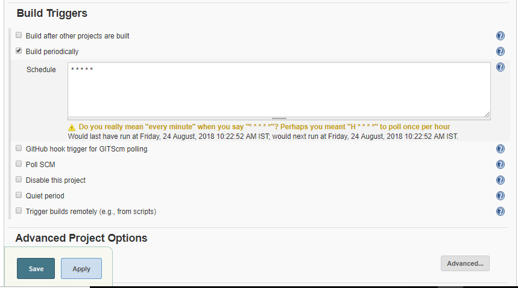#

 +

{empty}6. Next, Select a build step. You can select from various
options: Ant, Maven, Windows batch process, etc. For example, for a
maven project, trigger a maven build and specify goals.

 +

[.confluence-embedded-file-wrapper]#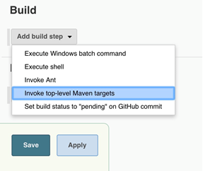#

 +

[.confluence-embedded-file-wrapper .confluence-embedded-manual-size]#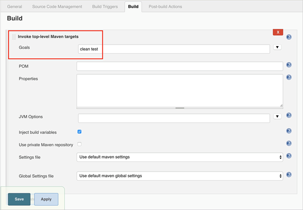#

 +

Next step is to add *Post-build Actions*. Here, add the plugin: “QMetry
Test Management Plugin”.

 +

[[QMetryTestManagmentPlugin-ConfiguringQMetryTestManagementPluginasaPost-buildAction]]
==== Configuring QMetry Test Management Plugin as a Post-build Action

Jenkins works as a bridge between QMetry Test Management and automation
frameworks. To publish results in QMetry, define another post-build
action.

{empty}1. On the *Add post-build Actions* drop-down, select the "Publish
test result to QMetry" option.

 +

[.confluence-embedded-file-wrapper]#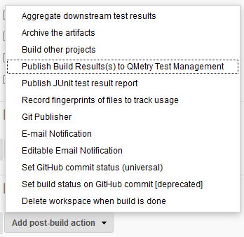#

 +

2.  Fill in the required data. You can get more information regarding
fields by clicking on the Help icon for respective fields. It explains
what to enter in that particular field.

 +

[.confluence-embedded-file-wrapper]#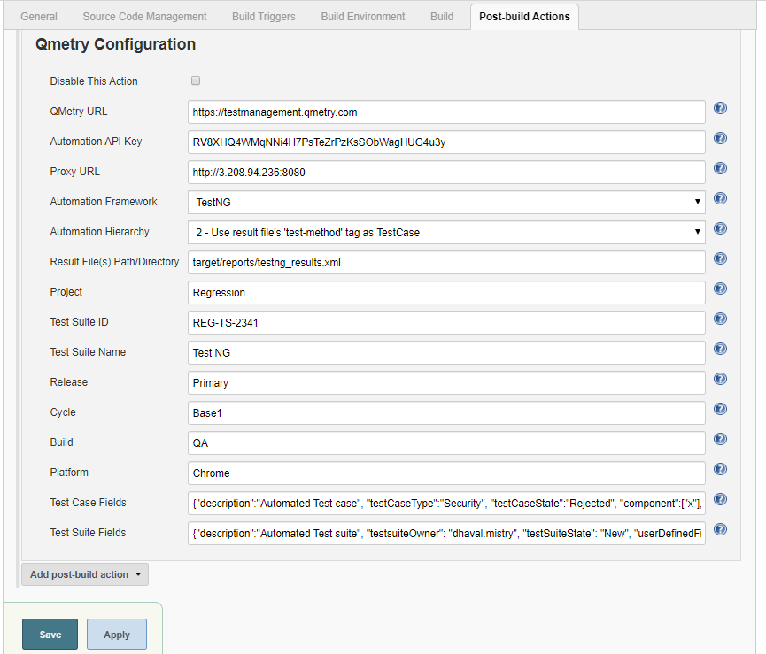#

 +

 +

*Parameters *

[cols=",,,",options="header",]
|===
|*Parameter* |*Type* |*Required* |*Description*
|QMetry URL |_string_ |Yes |QMetry Test Management URL

|Automation API Key |_string_ |Yes |Your API Key. API Key is unique for
a specific user in a single project. The result will be imported for the
project associated with the given API Key.

|Proxy URL |_string_ |No |Enter Proxy URL if you have configured any
Proxy.

a|
Automation Framework 

 +

|_string_ |Yes a|
Format of result file to be imported. Supported formats:

[cols=",,,,",options="header",]
|===
|Cucumber |TestNG |JUnit |QAS |HP UFT
|===

|Automation Hierarchy |_string_ |No a|
Hierarchy which will be used to parse test result files on QTM.
Supported formats are :-

*JUnit*

1 - Use current Hierarchy in which JUnit Testcase is treated as TestStep
and Testsuite is treated as Testcase (_default_)

2 - Use Junit Testcase as Testcase and link all those (from all
testsuites and all files of Junit) to one Testsuite

3 - Create Multiple Testsuites and then link their respective testcases
in corresponding Testsuites

*TestNG*

1 - Use class 'name' as Testcase and test-method as TestStep (_default_)

2 - Use test-method as Testcase

3 - Use test 'name' as Testcase and test-method as TestStep

|Result File(s) Path/Directory |_string_ |Yes |Path wherein your result
file to be uploaded. Supported file extensions: .json, .xml and .zip
(zip file must contain files of the format given in the 'Automation
Framework' param).

|Test Suite ID |_string_ |No a|
Key of the test suite exists in QMetry. In the absence of Key, a new
test suite will be created.

*Note:* If for Junit - 3 - Create Multiple Testsuites and then link
their respective testcases in corresponding Testsuites - is chosen, then
the parameter Test Suite ID will be ignored.

|Test Suite Name |_string_ |No a|
If existing "testsuiteId" is not being used and auto-generated name for
the new test suite is not desired, then a custom test suite name can be
entered for this parameter.

*Note:* If for Junit - 3 - Create Multiple Testsuites and then link
their respective testcases in corresponding Testsuites - is chosen, then
this parameter will be ignored. +

|Project |_string_ |Yes |ID/Key/Name of the Project within which the
test suite will be created.

|Release |_string_ |*No |ID/Name of the Release in which the test
execution will be created. If Release is not mentioned, then Default
Release will be considered.

|Cycle |_string_ |No |ID/Name of the Cycle in which the test execution
will be created. If Cycle is not mentioned, then Default Cycle will be
considered.

|Build    |string |No |Build Name/Id. In the absence of a value, it will
create the default build.

|Platform |_string_ |No |Name of Platform on which test run to be
executed.

|Test Case Fields |JSON |No a|
Mention system defined fields and user defined fields for test case as
shown in  Test Case JSON format below.

All the mandatory fields other than Summary should be mentioned in this
parameter.

|Test Suite Fields |JSON |No a|
Mention system defined fields and user defined fields for test case as
shown in  Test Suite JSON format below.

All the mandatory fields other than Summary should be mentioned in this
parameter.

This parameter will be ignored if existing Test suite Id is used to
upload results. 

|===

*** **Release is mandatory if Cycle is mentioned.

 +

*Supported Fields*

 +

* *Field Name* as mentioned in QMetry > Customization > Manage Fields >
Field Name
* For Look up list and multi lookup list fields
** If the value does not exist in Project and Auto Create value feature
is on for Project, the value will get added in the list and it will be
assigned to the test case.
** If the value does not exist in Project and Auto Create value feature
is off for Project, the value will not be added in the list and Test
Case field will be blank or have default value in it. 
** If a new value is added to Multi Look Up List, the older value will
remain unchanged and the new value will be added to the list.
** List values are added to the same version of the test case.

 +

Field

Example

Test Case

Test Suite

Notes

"component"

"component" : ["Label1, "Label2"]

Yes

No

Old values will persist and new value will get set e.g., L1 and L2 are
set and L3 is assigned, then the updated values for component will be
L1, L2 and L3.

 +

"priority"

"priority" : "Minor"

Yes

No

As mentioned for Look Up and Multi Look Up lists above.

"testCaseState"

"testCaseState":"Open"

Yes

No

"testCaseType"

"testCaseType":"UI"

Yes

No

"testcaseOwner"

"testCaseType":"John"

Yes

No

userAlias should be passed in request. Owner will not be set if the
requested user is not found or the user doesn't have right for the Test
Case module.

"description"

"description":"Sample Description."

Yes

Yes

This will be set as requested.

"estimatedTime"

"estimatedTime":6

Yes

No

This will be set as requested.

"testSuiteState"

"testSuiteState":"Open"

No

Yes

A new Status value will be added if it does not exist in the project.

"testsuiteOwner"

"testsuiteOwner":"lizamathew"

No

Yes

userAlias should be passed in request. Owner will not be set if the
requested user is not found or the user doesn't have right for the Test
Suite module.

 +

 +

*User Defined Fields*

[cols="<,<,<,<",options="header",]
|===
|Custom Field Type |Validation Rule |Example |Notes
|STRING |It accepts text in a single line |"tagName": "Sample test
asset." +
 + |The field value will be set as requested.

|LARGETEXT |It accepts text in multiple lines |"additionalComment":
"this is a sample test asset" +
 + |The field value will be set as requested.

|LOOKUPLIST |It accepts a single value on the list |"country": ["United
States"] +
  a|
Lookup type will be set as requested if its list value exists.

* If the value does not exist in Project and Auto Create value feature
is on for Project, the value will get added in the list and it will be
assigned to the test case.
* If the value does not exist in Project and Auto Create value feature
is off for Project, the value will not be added in the list and Test
Case field will be blank or have default value in it. 

|MULTILOOKUPLIST |It accepts comma separated multiple values
| "langaugePreference": ["English",Portuguese"] a|
Multi Lookup will be set as requested if its list value exists.

* If the value does not exist in Project and Auto Create value feature
is on for Project, the value will get added in the list and it will be
assigned to the test case.
* If the value does not exist in Project and Auto Create value feature
is off for Project, the value will not be added in the list and Test
Case field will be blank or have default value in it.
* Additional value will be selected keeping the old values unchanged. +
E.g., A and B are set and we update with C then updated values for the
list will be A, B and C.

|DATEPICKER |It accepts the Date format that has been set in user
profile |"reviewedDate": "08-30-2019" +
 + |The field value will be set as requested.

|NUMBER |It accepts any number with decimal |"executionTime": 4 +
 + |The field value will be set as requested.
|===

 +

*Test Case Fields with UDFs in JSON format*

 +

[source,syntaxhighlighter-pre]
----
{

"component":["com1", "com2"],
"priority":"High",
"testCaseState":"Open",
"testCaseType":"Manual",
"testcaseOwner":"lizamathew",
"estimatedTime":60,
"description":"Sample Description",

"userDefinedFields" : {

"reviewedDate": "08-30-2019",
"executionTime": 40,
"tagName": "Sample test asset.",
"additionalComment": "This is a sample test asset"
"country": ["United States"]
"langaugePreference": ["English",Portuguese"]

}

}
----

*Test Suite Fields with UDFs in JSON format +
*

 +

[source,syntaxhighlighter-pre]
----
{

"testSuiteState":"Open",
"testsuiteOwner":"lizamathew",
"description":"Testing 8.5.4 API Changes",

"userDefinedFields" : {

"reviewedDate": "08-30-2019",
"executionTime": 40,
"tagName": "Sample test asset.",
"additionalComment": "this is a sample test asset"
"country": ["United States"]
"langaugePreference": ["English",Portuguese"]
}

}
----

 +

The following table depicts probable import result according to the
scenario.

[cols="<,<,<,<",options="header",]
|===
|*Is System Field/UDF Mandatory?* |*Is Auto-Create Enabled?* |*Does UDF
Value exist?* |*Import Result*
|No |No |No |Fail

|No |No |Yes |Success

|No |Yes |No |Success

|No |Yes |Yes |Success

|Yes |No |No |Fail

|Yes |No |Yes |Success

|Yes |Yes |No |Success
|===

 +

{empty}3. On successful completion of the process, you can see the
console output. It displays success message for uploading the result
file.

[.confluence-embedded-file-wrapper]#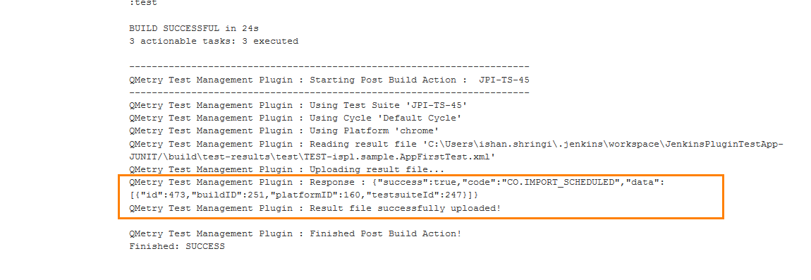#

{empty}4. Finally check test execution page in QMetry and review your
test run results.

 +

[.confluence-embedded-file-wrapper .confluence-embedded-manual-size]#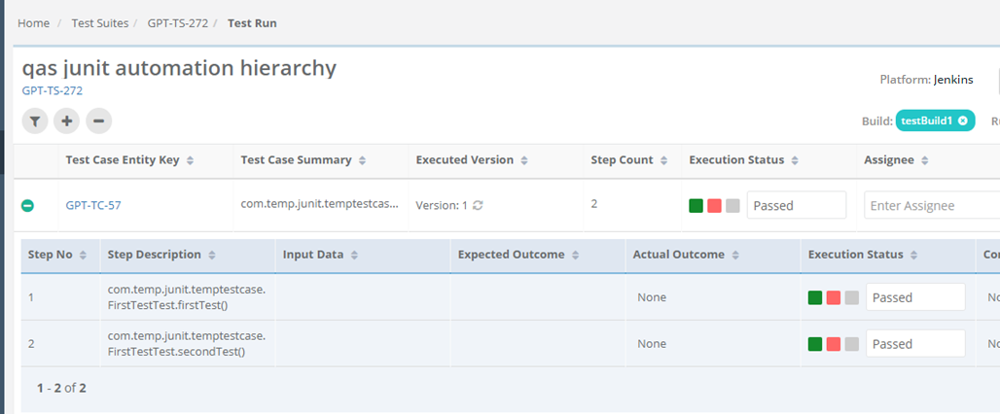#

 +

[[QMetryTestManagmentPlugin-Pipeline]]
=== Pipeline

QMetry Test Management supports Jenkins Pipeline for implementing and
integrating continuous delivery pipelines into Jenkins.

Let’s create a standard Pipeline job in Jenkins.

 +

{empty}1. To create a new Jenkins job, click on the *New Item* option on
the *Jenkins* menu.

 +

[.confluence-embedded-file-wrapper .confluence-embedded-manual-size]##

 +

{empty}2. Provide a name for your job.

    Select *Pipeline* on the screen and then click OK.

 +

[.confluence-embedded-file-wrapper .confluence-embedded-manual-size]#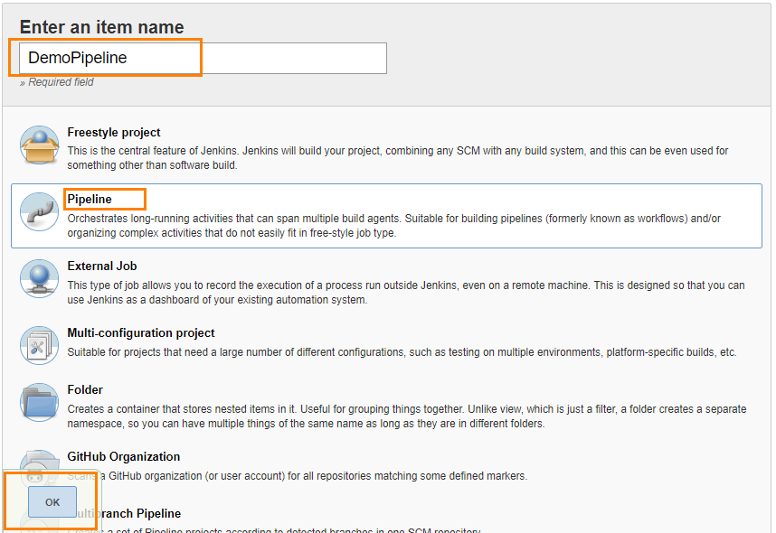#

 +

 +

{empty}3. Next, the configuration page appears where you can configure
your job by various categories: General, Build Triggers, Advanced
Project Options, and Pipeline.

    

[.confluence-embedded-file-wrapper .confluence-embedded-manual-size]##

 +

{empty}4.  Optionally, you can set Build Triggers.

Select the *Build Triggers* tab. Let’s just add a periodic trigger which
triggers build every minute – every hour – every day (Schedule: * * * *
*).

 +

[.confluence-embedded-file-wrapper .confluence-embedded-manual-size]##

 +

{empty}5. Advanced Project Options: This is optional. You can give
*Display Name* which will replace the name you gave earlier to the
Pipeline project.

 +

[.confluence-embedded-file-wrapper]#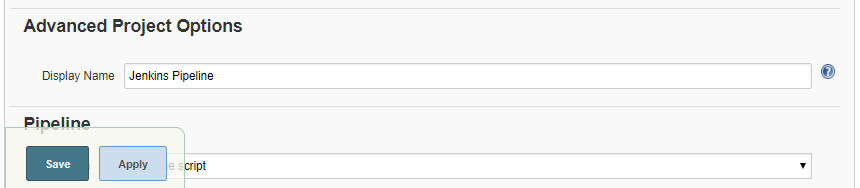#

 +

{empty}6. Jenkins works as a bridge between QMetry Test Management and
automation frameworks. To publish results in QMetry, provide Pipeline
script.

Enter Pipeline script to define your code repository, generate test
result and upload test results into QMetry Test Management.

 +

*Code Snippet*

 +

*Pipeline Script*

[source,syntaxhighlighter-pre]
----
stage('Upload Result to QTM'){
       step([$class: 'QTMReportPublisher', disableaction:false, qtmUrl: 'https://newuiqa.qmetry.com/', automationFramework: 'JUNIT', automationHierarchy: '2', testResultFilePath: '/cucumber', qtmAutomationApiKey: '4FR2Oo1g42vUnb5NtDgi3JIjzrFOvUUV8QJBk38D', project : '7242', release: 'Release 1', cycle: 'Cycle 1', buildName: 'testBuild1', platformName: 'Jenkins', testSName: 'junit pipeline', proxyUrl:'', testSuiteName: 'TC2-TS-116'     
       testcaseFields: '{"description":"Automated Test case", "testCaseType":"Automated", "testCaseState":"Open", "component":["UI"], "priority":"Blocker", "testcaseOwner":"liza.mathew", "estimatedTime":"143", "userDefinedFields" : {"Integrate" : "Custom Field Testcase"}}',
       testsuiteFields: '{"description":"Automated Test suite", "testsuiteOwner": "liza.mathew", "testSuiteState": "New", "userDefinedFields": {"Integrate" : "Custom Field Testsuite"}}'
       ])     
    }   
----

 +

_*Note:* testSName is "Test Suite Name" and testSuiteName is "Test Suite
ID" of the test suite._

 +

Syntax of _automationFramework_:

* CUCUMBER
* TESTNG
* JUNIT
* QAS
* HPUFT

 +

[.confluence-embedded-file-wrapper .confluence-embedded-manual-size]#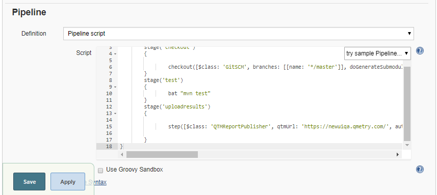#

 +

*Parameters +
*

Refer to the *Parameters section* for *Freestyle Project* above.

 +

{empty}7. On successful completion of the process, you can see the
console output. It displays success message for uploading the result
file.

 +

[.confluence-embedded-file-wrapper .confluence-embedded-manual-size]#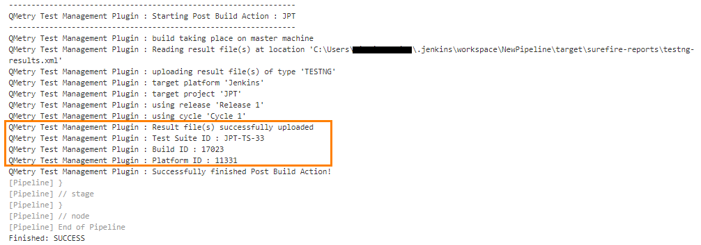#

 +

{empty}8. Finally check test execution page in QMetry and review your
test run results.

 +

[.confluence-embedded-file-wrapper .confluence-embedded-manual-size]##

[[QMetryTestManagmentPlugin-DefineParameters]]
=== Define Parameters

To define parameters for your job, select the *This project is
parameterized* check box.

The *Add Parameter* drop-down is enabled with the list of parameter
types. Use the drop-down button to add as many parameters as you need.

 +

 [.confluence-embedded-file-wrapper .confluence-embedded-manual-size]#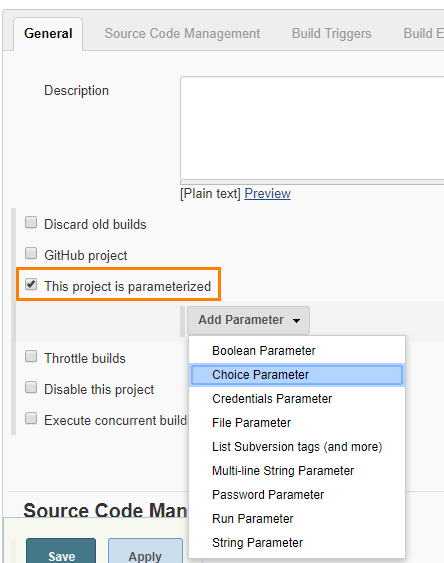#

 +

There are different parameter types available. The way parameters take
effect according their respective parameter type.

For example,

Choice Parameter and String Parameter are selected, and corresponding
parameters are added as shown below.

 +

[.confluence-embedded-file-wrapper .confluence-embedded-manual-size]#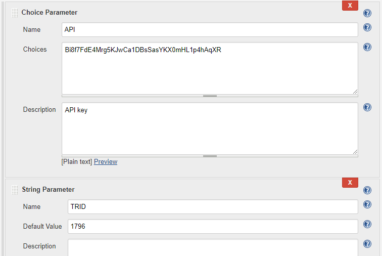#

 +

The above parameters will be parsed dynamically at the run time.

The field values should be entered in the following syntax:

_$\{ParameterName}_

For example,

For the parameters created above, the field value would be $\{API} and
$\{TRID} respectively. The parameter values will be parsed accordingly
for the corresponding fields.

 +

[.confluence-embedded-file-wrapper]#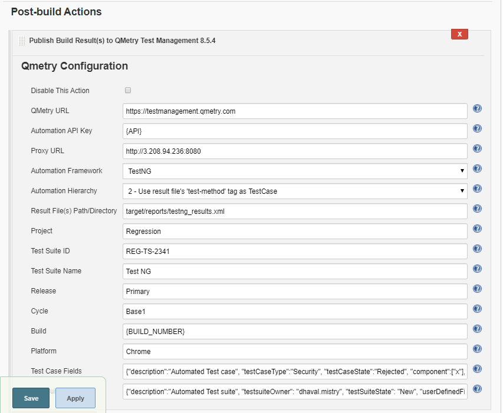#

 +
 

The values can also be changed before triggering the Jenkins build.

 +

 [.confluence-embedded-file-wrapper .confluence-embedded-manual-size]#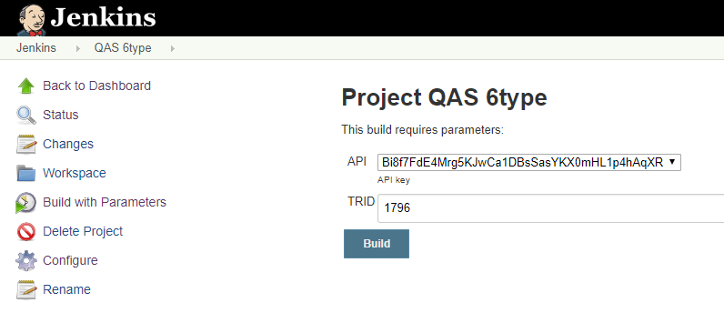#

 +

[[QMetryTestManagmentPlugin-QMetryConfigurationforSpecflow]]
== QMetry Configuration for Specflow

Specflow by default generates the output results in Specflow JSON
format. QMetry can consume it as Cucumber JSON format. The following
solution will generate the output result in Cucumber JSON format in
parallel and the result could imported to QMetry.

[[QMetryTestManagmentPlugin-PartA:MakethefollowingchangesinyourSpecflowProjecttogenerateresultfileformatasCucumberJSON]]
=== Part A : Make the following changes in your Specflow Project to generate result file format as Cucumber JSON

*Step 1 :* Add Dependencies

[source,syntaxhighlighter-pre]
----
https://www.nuget.org/packages/SpecNuts/
https://www.nuget.org/packages/SpecNuts.Json/
----

*Step 2 :* Add the below code in .cs of feature file

[source,syntaxhighlighter-pre]
----
[BeforeTestRun]
public static void BeforeTestRun() {
    SpecNuts.Reporters.Add(new JsonReporter());

    SpecNuts.Reporters.FinishedReport += (sender, args) => {

        String pathName = "specflow_cucumber.json";

        System.IO.File.WriteAllText(pathName, args.Reporter.WriteToString());

        Console.WriteLine("Result File: " + System.IO.Directory.GetCurrentDirectory().ToString() + System.IO.Path.DirectorySeparatorChar + pathName);

    };
}
----

*Step 3 :* Open Text Explorer in Visual Studio by Test > Windows > Test
Explorer -> Choose Run All

*Step 4 :* In Visual Studio console, select show output from Test and
open Report File as path given in Console

[[QMetryTestManagmentPlugin-PartB:MakethefollowingConfigurationsinJenkins]]
=== Part B : Make the following Configurations in Jenkins

*Configuration Steps*

* Install "MSBuild Plugin" and "VSTest Runner Plugin"
* Install Visual tools and Set path for MSBuild.exe and
vstest.console.exe files in Manage Jenkins > Global Tool Configuration

[.confluence-embedded-file-wrapper .confluence-embedded-manual-size]#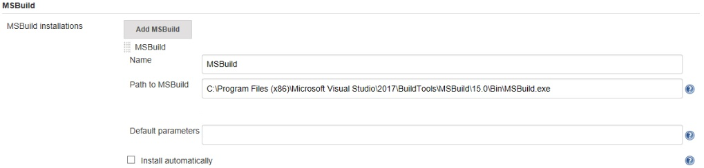#

 +

[.confluence-embedded-file-wrapper .confluence-embedded-manual-size]#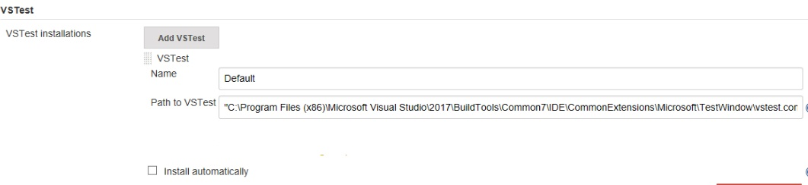# +

 +

 +

*Configure the following parameters in the Jenkins Job*

*Step 1 :* In the Build Step >> Choose - Build a Visual Studio project
or solution using MSBuild

 +

*[.confluence-embedded-file-wrapper .confluence-embedded-manual-size]#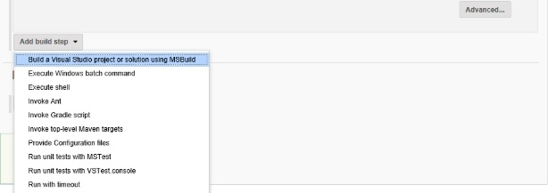# +
*

 +

*Step 2 :* Provide the MsBuild Version and relative path to solution
file

* Select "MSBuild Version" which is configured in Global Tool
Configuration
* Specify the relative path for solution file in "MSBuild Build File"

[.confluence-embedded-file-wrapper .confluence-embedded-manual-size]#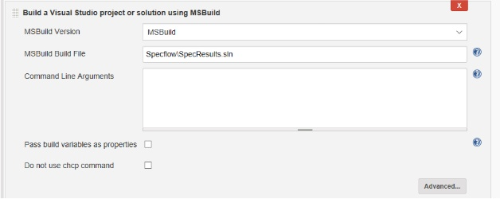# +

*Step 3 :* Select a build step for VSTest in Build Section -  Run unit
tests with VSTest console

[.confluence-embedded-file-wrapper .confluence-embedded-manual-size]#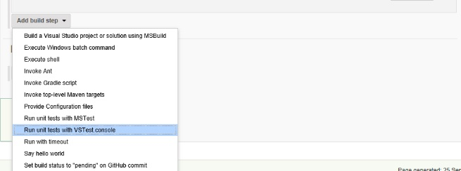#

 +

* Select "VSTest Version" which is configured in Global Tool
Configuration
* Specify the relative path to your VSTest compiled assemblies in "Test
Files"

[.confluence-embedded-file-wrapper .confluence-embedded-manual-size]#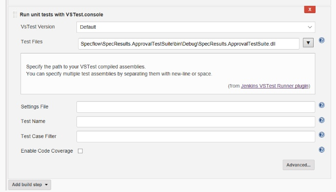# +

*Step 4 :* In post build action setup QMetry Test Management plugin

* Choose "Cucumber" format to upload
* Relative Path to result file "specflow_cucumber.json"
* Choose other relevant parameters

 +

 +

[.aui-icon .aui-icon-small .aui-iconfont-info .confluence-information-macro-icon]#
#

https://www.qmetry.com/privacy-policy/[QMetry Privacy Policy]

 +

Automation API URL
