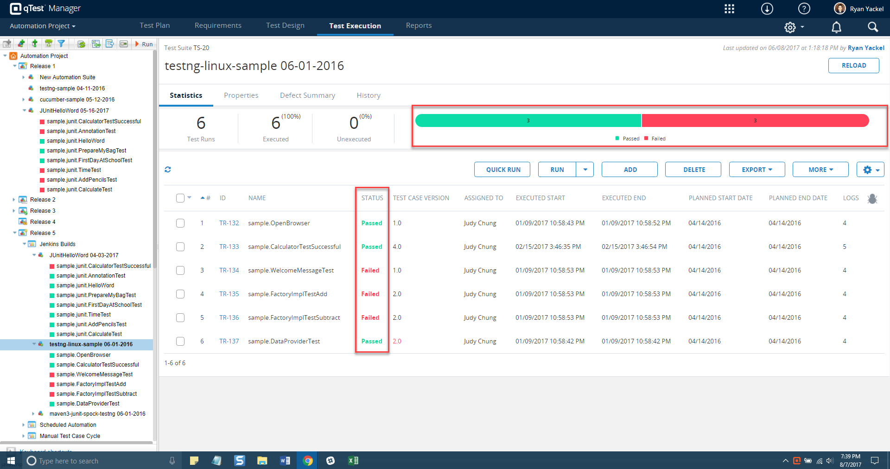
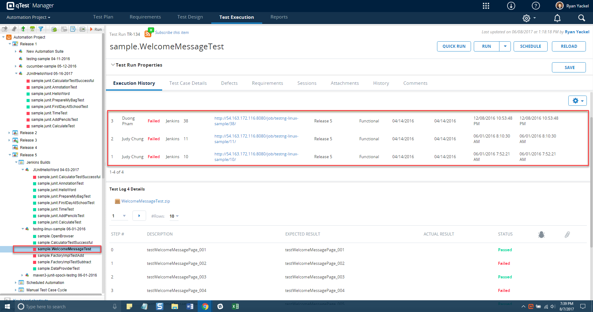
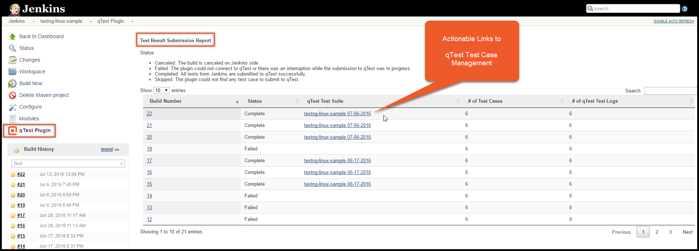
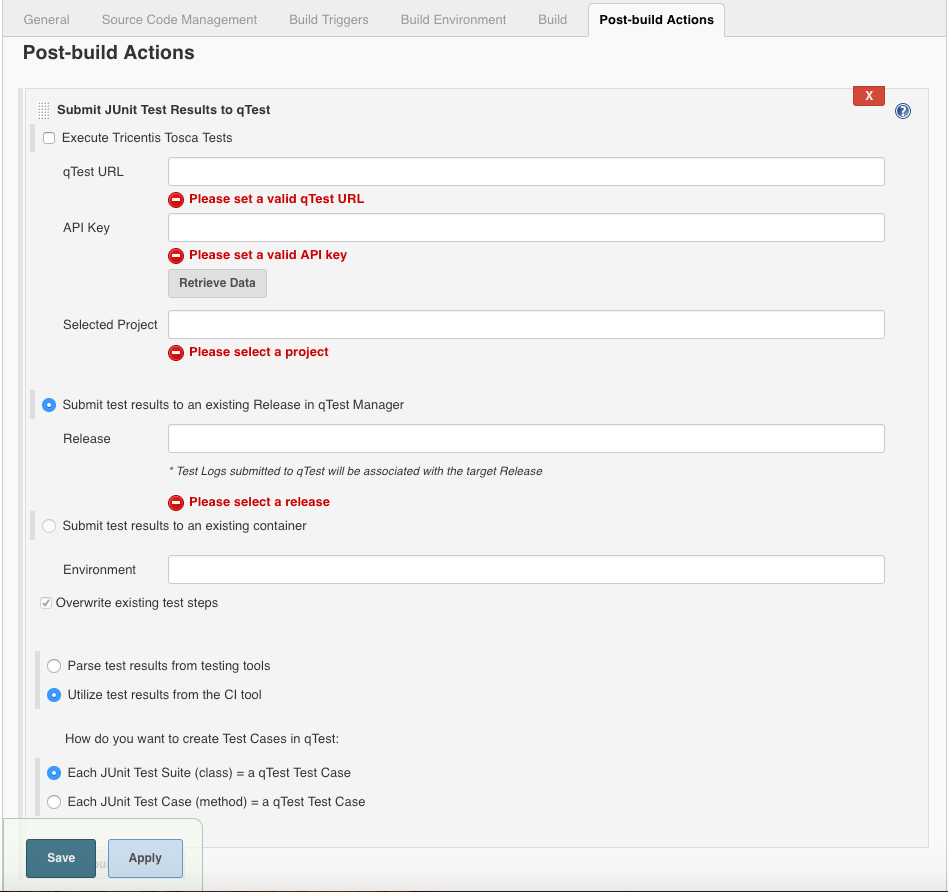
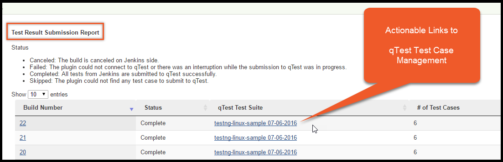

[.conf-macro .output-inline]#qTest by Tricentis now integrates with
Jenkins, helping make your Continuous Integration process more
efficient. Click
https://support.qasymphony.com/hc/en-us/articles/115002955466-Jenkins-and-Bamboo-Integration[*here*]
to access the qTest Integration with Jenkins user guide.# +

qTest by
http://www.qasymphony.com/[T]https://www.tricentis.com/[ricentis] now
integrates seamlessly with Jenkins, helping make your Continuous
Integration process more efficient.

When creating builds in Jenkins, your JUnit test results can be sent
directly
to your https://www.qasymphony.com/testing-platform/qtest-case-management/[qTest Test
Case Management] software as test runs and test logs. This lets your
team review the quality of your build process over time and across
different environments, helping you quickly identify problem areas.

[.confluence-embedded-file-wrapper]##

[.confluence-embedded-file-wrapper]##

 +

[.confluence-embedded-file-wrapper]##

[[qTestforJenkinsbyTricentis-About]]
== *About*

The qTest for Jenkins add-on will collect JUnit test results from your
builds and submit them as Test Runs and Test Logs to qTest. The qTest
plugin supports all testing frameworks that are capable of generating
JUnit XML format test reports.

After installing, you can set up a post build action and easily
configure the connection to your qTest project (shown below).

[.confluence-embedded-file-wrapper]##

Major features include:

* Test Cases, Test Runs and Test logs automatically created in qTest for
executed JUnit tests
* View JUnit test results for build deployments
* Track JUnit test results across multiple builds
* Export JUnit test execution results – Build by Build or Test by Test
* View the submission status of JUnit tests sent to qTest (shown below)
* Import test cases based of method or class 

[.confluence-embedded-file-wrapper]##

*About Tricentis*

https://www.tricentis.com/[Tricentis] is a software testing company
founded in 2007 and headquartered in Vienna, Austria. It provides
software testing and software quality assurance solutions.

[[qTestforJenkinsbyTricentis-Changelog]]
== Changelog

[[qTestforJenkinsbyTricentis-1.4.4(Aug09,2019)]]
=== 1.4.4 (Aug 09, 2019)

* https://support.qasymphony.com/hc/en-us/articles/360000353403#0-qtest-jenkins-plugin-144-august-09-2019[qTest
Jenkins Plugin 1.4.4 Release Notes - Aug 09, 2019]

[[qTestforJenkinsbyTricentis-1.4.2(Jun25,2019)]]
=== 1.4.2 (Jun 25, 2019)

* https://support.qasymphony.com/hc/en-us/articles/360000353403#0-qtest-jenkins-plugin-142-june-25-2019[qTest
Jenkins Plugin 1.4.2 Release Notes - Jun 25, 2019]

[[qTestforJenkinsbyTricentis-1.4(Aug24,2018)]]
=== 1.4 (Aug 24, 2018)

* https://support.qasymphony.com/hc/en-us/articles/360000353403#0-qtest-jenkins-plugin-14-august-24-2018[qTest
Jenkins Plugin 1.4 Release Notes - Aug 24, 2018]

[[qTestforJenkinsbyTricentis-1.3.1(Apr06,2018)]]
=== 1.3.1 (Apr 06, 2018)

* https://support.qasymphony.com/hc/en-us/articles/360000353403-Jenkins-Plugin-1-3-0-Release-Notes-Mar-12-2018#0-qtest-jenkins-plugin-131-april-06-2018[qTest
Jenkins Plugin 1.3.1 Release Notes - Apr 06, 2018]

[[qTestforJenkinsbyTricentis-1.3.0(Mar12,2018)]]
=== 1.3.0 (Mar 12, 2018)

* https://support.qasymphony.com/hc/en-us/articles/360000353403-Jenkins-Plugin-1-3-0-Release-Notes-Mar-12-2018#2-qtest-jenkins-plugin-130-mar-12-2018[qTest
Jenkins Plugin 1.3.0 Release Notes - Mar 12, 2018]

[[qTestforJenkinsbyTricentis-1.2.1(Feb08,2018)]]
=== 1.2.1 (Feb 08, 2018)

* https://support.qasymphony.com/hc/en-us/articles/360000042326[qTest
Jenkins Plugin 1.2.1 Release Notes - Feb 08, 2018]

[[qTestforJenkinsbyTricentis-1.1.8(Aug302016)]]
=== 1.1.8 (Aug 30 2016)

* Release with qTest 7.10.*

[[qTestforJenkinsbyTricentis-1.1.7(Aug242016)]]
=== 1.1.7 (Aug 24 2016)

* Release with qTest 7.10.2

[[qTestforJenkinsbyTricentis-1.1.6(Jul112016)]]
=== 1.1.6 (Jul 11 2016)

* Release with qTest 7.9.0

[[qTestforJenkinsbyTricentis-1.1.5(Jan252016)]]
=== 1.1.5 (Jan 25 2016)

* Release with qTest 7.2.2

[[qTestforJenkinsbyTricentis-1.1.4(Jan172016)]]
=== 1.1.4 (Jan 17 2016)

* Release with qTest 7.2.0

[[qTestforJenkinsbyTricentis-1.1.3(Jan042016)]]
=== 1.1.3 (Jan 04 2016)

* Release with qTest 7.1.0

[[qTestforJenkinsbyTricentis-1.1.2(Dec132015)]]
=== 1.1.2 (Dec 13 2015)

* Helios Release

[[qTestforJenkinsbyTricentis-1.1.1(Nov172015)]]
=== 1.1.1 (Nov 17 2015)

* Beta Release

[[qTestforJenkinsbyTricentis-1.0(Nov132015)]]
=== 1.0 (Nov 13 2015)

* Initial release
