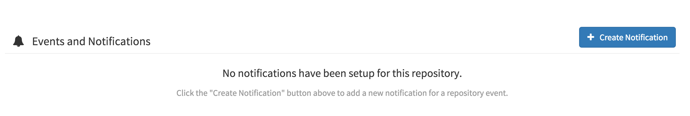
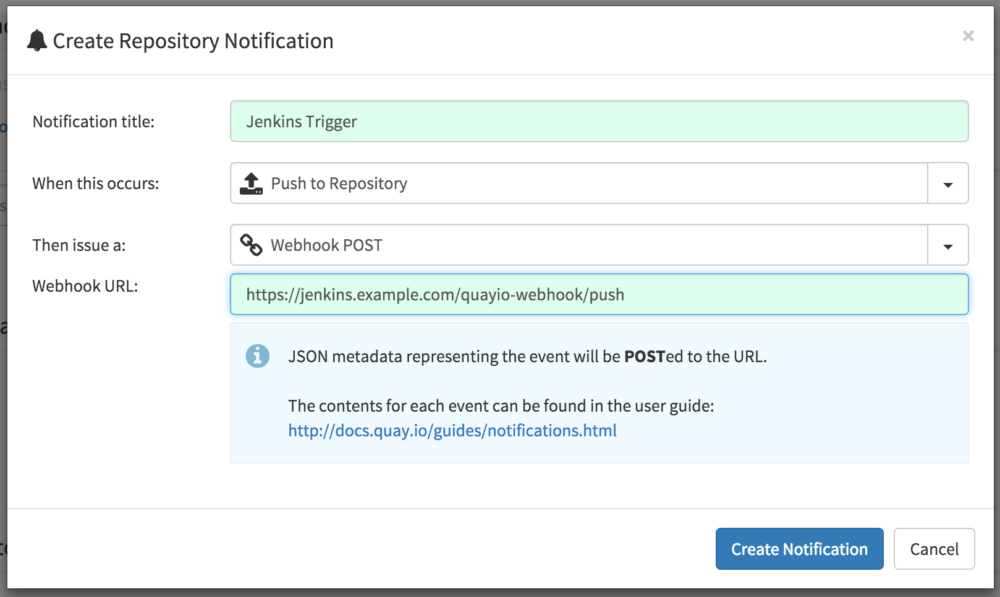
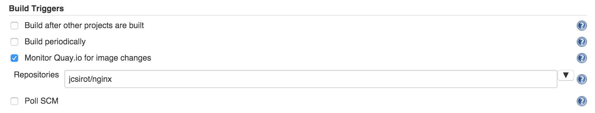

This plugin provides integration between Jenkins and
https://quay.io/[Quay.io] docker registry.

[[Quay.ioTriggerPlugin-Usage]]
== Usage

On Quay.io

. In the repository *Settings* tag click on the *Create Notification*
button +
[.confluence-embedded-file-wrapper .confluence-embedded-manual-size]##
. Fill the Repository Notification form

* When this occurs: *Push to Repository*
* This issue a: *Webhook POST*
* Webhook URL:
`+http://your.jenkins.server.tld/quayio-webhook/p+``+ush+` +
[.confluence-embedded-file-wrapper .confluence-embedded-manual-size]##

In Jenkins

. Select the Monitor *Monitor Quay.io for image changes* and enter the
list of repositories which can trigger a build +
[.confluence-embedded-file-wrapper .confluence-embedded-manual-size]##

[[Quay.ioTriggerPlugin-JobParameters]]
== Job Parameters

When a job is triggered by a Quay.io notification these parameters are
passed to the job

[cols=",",options="header",]
|===
|Parameter Name |Value
|QUAY_IO_TRIGGER_REPOSITORY |The name of the repository which triggered
the build

|QUAY_IO_TRIGGER_TAG |The updated docker image tag
|===

[[Quay.ioTriggerPlugin-OpenIssues]]
== *Open Issues*

[[refresh-module--1295294926]]
[[refresh--1295294926]][[jira-issues--1295294926]]
T

Key

Summary

Assignee

Reporter

Status

Created

[.refresh-action-group]# #

[[refresh-issues-loading--1295294926]]
[.aui-icon .aui-icon-wait]#Loading...#

[#refresh-issues-button--1295294926]##
[#refresh-issues-link--1295294926]#Refresh#
[#error-message--1295294926 .error-message .hidden]# #

[[Quay.ioTriggerPlugin-Changelog]]
== *Changelog*

[[Quay.ioTriggerPlugin-Version0.1(Jan,202016)]]
== *Version 0.1 (Jan, 20 2016)*

* Initial version
