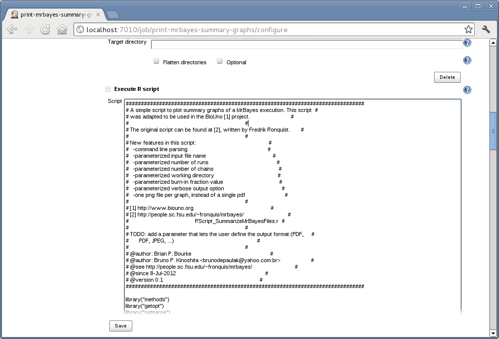

[.conf-macro .output-inline]#A simple plug-in to invoke
http://www.r-project.org/[R] interpreter and execute an R script.#

[[RPlugin-Description]]
== Description

With this script you can execute http://www.r-project.org/[R] scripts as
part of your build. This plug-in was created for use in
http://www.biouno.org/[BioUno] (sponsored by
http://www.tupilabs.com/[TupiLabs]) project, and released to Jenkins as
well. 

[.confluence-embedded-file-wrapper]##

You can also use environment variables, tokens created by other plug-ins
or parameters via 

[source,syntaxhighlighter-pre]
----
paste('Date:', Sys.getenv('BUILD_ID'))
----

This will print something similar to _Date: 2014-02-17_15-48-59_ +
*Issues*

[#jiraissues]##

[.aui-icon .aui-icon-small .aui-iconfont-warning .confluence-information-macro-icon]#
#

[[RPlugin-Sponsors]]
== Sponsors

http://www.biouno.org/[[.confluence-embedded-file-wrapper .confluence-embedded-manual-size]##] +
http://www.tupilabs.com/[[.confluence-embedded-file-wrapper .confluence-embedded-manual-size]#image:docs/images/logo1.png[image,width=300]#]

For commercial support, please get contact us
via https://twitter.com/tupilabs[@tupilabs]

[[RPlugin-ChangeLog]]
== Change Log

[[RPlugin-Release0.5(May,20,2017)]]
=== Release 0.5 (May, 20, 2017)

* https://github.com/jenkinsci/r-plugin/pull/5[pull request #5]:
[.js-issue-title]#Implement captureOutput()#
* [.js-issue-title]#https://github.com/jenkinsci/r-plugin/pull/6[pull
request #6]: [.js-issue-title]#[WIP] Create R script file in
workspace# +
#

[[RPlugin-Release0.4(Jan,13,2017)]]
=== Release 0.4 (Jan, 13, 2017)

* https://github.com/jenkinsci/r-plugin/pull/1[pull request #1]:
[.js-issue-title]#Make plugin compatible to Jenkins Pipeline plugin#
* https://github.com/jenkinsci/r-plugin/pull/3[pull request
#3]: [.js-issue-title]#Revert "Make plugin compatible to Jenkins
Pipeline plugin"#
* https://github.com/jenkinsci/r-plugin/pull/4[pull request #4]: Add
Jenkins Pipeline compatibility

[[RPlugin-Release0.3(Jul,27,2016)]]
=== Release 0.3 (Jul, 27, 2016)

* https://github.com/jenkinsci/r-plugin/pull/2[pull request #2]: Use
codemirror styles for textarea input (i.e. syntax highlighting). (thanks
to @kadrach)

[[RPlugin-Release0.2(Jul,22,2012)]]
=== Release 0.2 (Jul, 22, 2012)

* Fixing plug-in name in pom.xml and creating Wiki page.

[[RPlugin-Release0.1(Jul,10,2012)]]
=== Release 0.1 (Jul, 10, 2012)

* Initial release.

[[RPlugin-Roadmap]]
== Roadmap

* Use Jenkins built-in editor with syntax highlighting (check if it
supports R)
