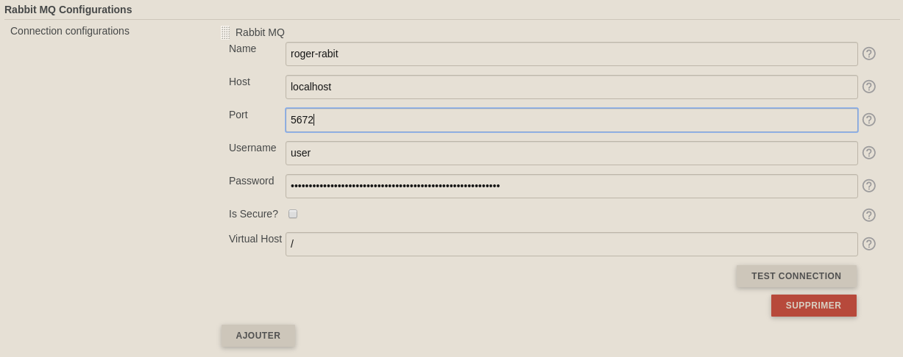
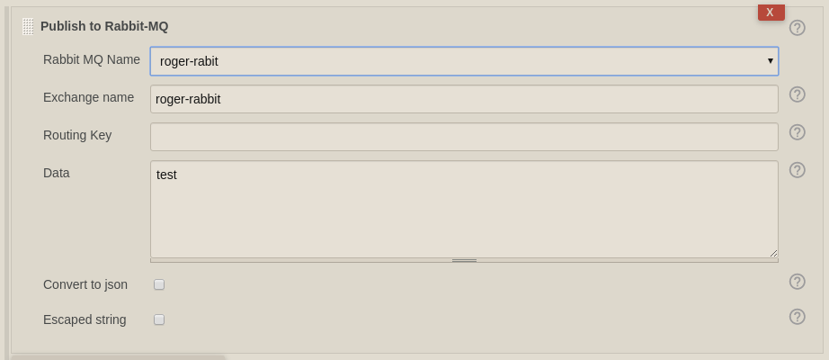

[.conf-macro .output-inline]##

[cols="",options="header",]
|===
|Plugin Information
|View Rabbit-MQ Publisher
https://plugins.jenkins.io/rabbitmq-publisher[on the plugin site] for
more information.
|===

[.aui-icon .aui-icon-small .aui-iconfont-info .confluence-information-macro-icon]##

Older versions of this plugin may not be safe to use. Please review the
following warnings before using an older version:

* https://jenkins.io/security/advisory/2019-03-06/#SECURITY-848[Credentials
stored in plain text]
* https://jenkins.io/security/advisory/2019-03-06/#SECURITY-970[Server-side
request forgery]

[[RabbitMQPublisherPlugin-Description]]
== Description

This plugin allow to create a build step which can publish a message to
Rabbit MQ

2 parts :

* Configuration of the Rabbit Host
* Configuration of the step

The message can be a raw json, or a simple string,  or a list a
key/value which can be convert to a json string

[[RabbitMQPublisherPlugin-Usage]]
== Usage

[[RabbitMQPublisherPlugin-Systemconfiguration]]
=== System configuration

add you connection configurations with the parameters :

* name : label to select the desired configuration on the build step
* host : the default host to use for connections
* port : the default port to use for connections
* username : the AMQP user name to use when connecting to the broker
* password : the password to use when connecting to the broker

Exemple : 

[.confluence-embedded-file-wrapper .confluence-embedded-manual-size]#image:docs/images/conf_job-1.3.0.png&effects=border-simple,blur-border[image,height=400]#

[[RabbitMQPublisherPlugin-Jobconfiguration]]
=== Job configuration

. Select the "Publish to Rabbit-MQ" step : +
[.confluence-embedded-file-wrapper .confluence-embedded-manual-size]##image:docs/images/image2018-4-3_12:4:40.png&effects=border-simple,blur-border[image,height=250]##[.confluence-embedded-file-wrapper .confluence-embedded-manual-size]####
. Add you configuration to publish your message  +
[.confluence-embedded-file-wrapper .confluence-embedded-manual-size]## +
 +
You can use build parameters (eg: $\{FOO} or $FOO) which will be resolve
before sending the message. You can also use $\{BUILD_USER_ID} and
$\{BUILD_USER_NAME} to retrieve the informations from the user who
launch the job.

[[RabbitMQPublisherPlugin-Version1.3.1(May22,2019)]]
=== Version 1.3.1 (May 22,2019)

* https://github.com/jenkinsci/rabbitmq-publisher-plugin/pull/7[Have a
better compatibility with old Jenkins (tested back to 2.73)]

[[RabbitMQPublisherPlugin-Version1.3.0(May16,2019)]]
=== [.message .js-navigation-open]#Version 1.3.0 (May 16,2019)#

* https://github.com/jenkinsci/rabbitmq-publisher-plugin/pull/5[Add a
conversion flag that sends tidy JSON to RabbitMQ]
* https://github.com/jenkinsci/rabbitmq-publisher-plugin/pull/6[Add
RabbitMQ VirtualHost parameter]
* Upgrade to last jenkins stable version (2.164)

[[RabbitMQPublisherPlugin-Version1.2.1(March09,2019)]]
=== [.message .js-navigation-open]#Version 1.2.1 (March 09,2019)#

* [.message .js-navigation-open]#fix issues with latest Spring version
by using previous versions#

[[RabbitMQPublisherPlugin-Version1.2.0(March02,2019)]]
=== Version 1.2.0 (March 02, 2019)

* [.message .js-navigation-open]#Enable environment variables in data +
#
* [.message .js-navigation-open]#[.message .js-navigation-open]#Adding
ability to use a secure connection protocol##
* [.message .js-navigation-open]#[.message .js-navigation-open]#Destroy
the connection after finishing sending message##
* [.message .js-navigation-open]#Security issues fixing (SECURITY-848 &
SECURITY-970)#
* [.message .js-navigation-open]#Minor bugs fixes#

[[RabbitMQPublisherPlugin-Version1.0(April03,2018)]]
=== Version 1.0 (April 03, 2018)

* first release

 +
