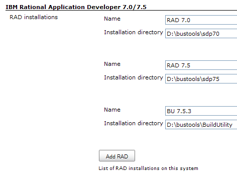
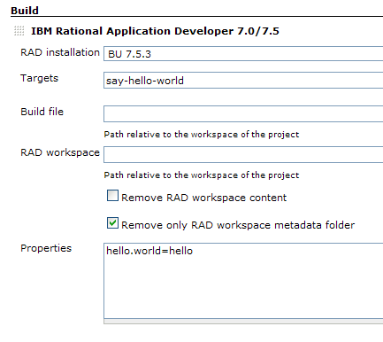

This plugin allows Jenkins to invoke IBM Rational Application Developer
as a build step.

Tutorial regarding the use of this plugin

[.aui-icon .aui-icon-small .aui-iconfont-approve .confluence-information-macro-icon]#
#

For a complete tutorial describing how to use this plugin, refer to the
http://www.ibm.com/developerworks/rational/library/10/enhancecontinuousintegrationwiththerationalapplicationdeveloperbuildutility/index.html[Enhance
continuous integration using Rational Application Developer and the
Hudson build server] article on
http://www.ibm.com/developerworks/[developerWorks].

Introduction to Rational build utility

[.aui-icon .aui-icon-small .aui-iconfont-approve .confluence-information-macro-icon]#
#

The nice
http://www.ibm.com/developerworks/rational/library/guide-rational-build-utility/index.html[guide
to the Rational Build Utility] details, on
http://www.ibm.com/developerworks/[developerWorks], how to use the
headless feature of Rational Application Developer.

[[RADBuilderPlugin-Aboutthisplugin]]
== About this plugin

This plugin is aimed at using the headless capabilities of IBM Rational
Application Developer (RAD) 7.0/7.5, which is Ant-based, to build J2EE
applications designed with RAD.

This plugin currently supports:

* RAD 7.0 (version 1.x successfully tested with RAD 7.0.0.9 and RAD
7.0.0.10 – should work with other 7.0.0.x versions)
* RAD 7.5 (version 1.x successfully tested with RAD 7.5.3, 7.5.4, 7.5.5,
7.5.5.1, 7.5.5.2 and 7.5.5.3 – should work with other 7.5.x versions)
* RAD build utility (BU) 7.5 (version 1.x successfully tested with BU
7.5.3, 7.5.4, 7.5.5, 7.5.5.1, 7.5.5.2 and 7.5.5.3 – should work with
other 7.5.x versions)
* RAD build utility (BU) 8.0 (version 1.1.4 successfully tested with BU
8.0.2 – should work with other 8.0.x version)

[.aui-icon .aui-icon-small .aui-iconfont-warning .confluence-information-macro-icon]#
#

BU is the fully headless version of RAD.

[[RADBuilderPlugin-Userguide]]
== User guide

This plugin works as the built-in Ant builder:

. The first thing to do is to define RAD/BU installations in Hudson's
configuration panel: +
[.confluence-embedded-file-wrapper .image-center-wrapper]##
. Once done, corresponding build steps can be added to the project: +
[.confluence-embedded-file-wrapper .image-center-wrapper]##

About the WORKSPACE environment variable

[.aui-icon .aui-icon-small .aui-iconfont-error .confluence-information-macro-icon]#
#

RAD uses an environment variable called `+workspace+` to define the RAD
workspace to use. It means that there's a "competition" (no matter the
case) between this variable and the one defined by Hudson (which refers
to the project's workspace). As a consequence, don't use the
`+WORKSPACE+` variable within this build step as it doesn't refer to
what's expected.

[[RADBuilderPlugin-Additionaldocumentation]]
== Additional documentation

* To get more information on the headless capabilities of RAD 7.0,
please refer to the
http://publib.boulder.ibm.com/infocenter/radhelp/v7r0m0/topic/com.ibm.etools.ant.tasks.doc/topics/tjant.html[RAD
7.0 Infocenter]
* To get more information on the headless capabilities of RAD 7.5,
please refer to the
http://publib.boulder.ibm.com/infocenter/radhelp/v7r5/topic/com.ibm.etools.ant.tasks.doc/topics/ph-antoverview.html[RAD
7.5 Infocenter]
* To get more information on BU 7.5, please refer to the
http://publib.boulder.ibm.com/infocenter/radhelp/v7r5/topic/com.ibm.etools.ant.tasks.doc/topics/trunbuinproduct.html[RAD
7.5 Infocenter].
* To get more information on BU 8.0, please refer to the
http://publib.boulder.ibm.com/infocenter/radhelp/v8/topic/com.ibm.ant.tasks.doc/topics/trunbuinproduct.html[RAD
8.0 Infocenter] too.

[[RADBuilderPlugin-Versionhistory]]
== Version history

[[RADBuilderPlugin-Version2.0(sourcecodenotyetopened)]]
=== Version 2.0 (source code not yet opened)

* Support of WebSphere Message Broker Toolkit

[[RADBuilderPlugin-Version1.1.4(03/04/2011)]]
=== Version 1.1.4 (03/04/2011)

* Fixed a bug which was preventing to display RAD installations actually
used by build steps (the first item in the installations list was always
selected)

[[RADBuilderPlugin-Version1.1.3(02/20/2011)]]
=== Version 1.1.3 (02/20/2011)

* Implemented
https://issues.jenkins-ci.org/browse/JENKINS-8652[JENKINS-8652]: Build
logs are now annotated so that the logs for Ant targets can be accessed
faster
* Fixed https://issues.jenkins-ci.org/browse/JENKINS-8545[JENKINS-8545]:
RAD Builder refused to work if the RAD installation path on a slave node
was different than the path on the master node

[[RADBuilderPlugin-Version1.1.2(03/27/2010)]]
=== Version 1.1.2 (03/27/2010)

* Improved handling of the `+WORKSPACE+`/`+workspace+` environment
variable: Now, the plugin sets RAD's workspace using `+workspace+`
(lower case letters) whether it is running on Windows or Linux

[[RADBuilderPlugin-Version1.1.1(01/24/2010)]]
=== Version 1.1.1 (01/24/2010)

* Bug fix: The "Create PROJECT_WORKSPACE variable" option now works fine
(previously, this new variable was created at the end of the build step
rather than at the beginning)

[[RADBuilderPlugin-Version1.1(12/04/2009)]]
=== Version 1.1 (12/04/2009)

* The "Delete RAD workspace" option is now checked by default
* Bug fix for the `+WORKSPACE+` environment variable on Windows: RAD/BU
expects it to be an absolute path, not a relative one
* Experimental (not yet tested): New "Create PROJECT_WORKSPACE variable"
option to provide a replacement for the `+WORKSPACE+` environment
variable

[[RADBuilderPlugin-Version1.0.1(10/12/2009)]]
=== Version 1.0.1 (10/12/2009)

* Bug fix for the `+WORKSPACE+`/`+workspace+` environment variable on
Linux
* Switch to the right `+groupId+` (org.jvnet.hudson.plugins rather than
hudson.plugins)

[[RADBuilderPlugin-Version1.0(10/11/2009)]]
=== Version 1.0 (10/11/2009)

[.aui-icon .aui-icon-small .aui-iconfont-error .confluence-information-macro-icon]#
#

If you use version a RAD or a BU installation on Linux, you need to
edit, respectively, `+bin/runAnt.sh+` or `+eclipse/bin/runAnt.sh+` to
change the `+workspace+` environment variable to `+WORSKPACE+`.
Otherwise, RAD/BU may fail complaining that no valid workspace has been
found (depending on the permissions of the user used to run RAD/BU).
This has been fixed in 1.0.1.

* Initial release
