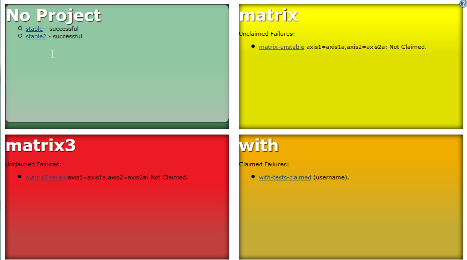
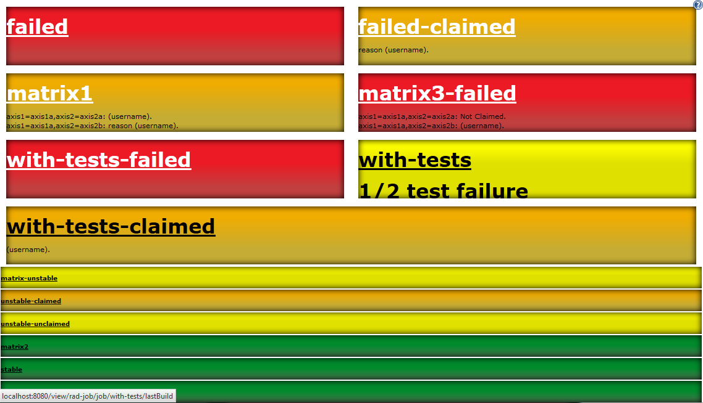

Provides a job view displaying project status in a highly visible
manner. This is ideal for displaying on a screen on the office wall as a
form of Extreme Feedback Device.

  +
Once the plugin is installed, click on the add view tab and select
"Radiator View". The job selection options are the same as the standard
list view -- either select projects to include or specify a regular
expression to select the options.  +
This plugin will be integrated with the claim plugin if it is installed
- claimed failures are displayed in a column on the right. +

[[RadiatorViewPlugin-Example:]]
== Example:

[.confluence-embedded-file-wrapper]## +
This is showing a Radiator in 'Project' based mode - jobs with a common
prefix are grouped together and represented as a single box on the
screen. 

[.confluence-embedded-file-wrapper]##

* Green boxes are shown when all jobs are successful. 
* Red boxes are shown when any jobs fail (including test failures).
Links to the failed builds and details of possible culprits if known are
also shown. 
* Amber boxes are shown when jobs fail, but all failing jobs are
claimed. Details of the claims are also shown. 

Hovering over the project name opens a list of all jobs relating to that
project as in the top-left project. Hovering over the ? button provides
configuration options. 

There are several different approaches to displaying the radiator,
including non-project based and only showing failing builds - give it a
try to see some of them. 

[[RadiatorViewPlugin-Compatibility]]
== Compatibility

https://issues.jenkins-ci.org/browse/JENKINS-20415[JENKINS-20415] causes
views of this type to fail to be displayed (see
https://issues.jenkins-ci.org/browse/JENKINS-20664[JENKINS-20664] for
details) if there are any multi-combination (matrix) jobs defined.

This applies to Jenkins 1.532.1 as well as some number of releases after
1.531 until 1.539. 1.40 has no compatibility issues.

As a workaround, when running on problematic Jenkins core releases,
uncheck "Recurse in subfolders" in the view.

[[RadiatorViewPlugin-OpenTickets(bugsandfeaturerequests)]]
== Open Tickets (bugs and feature requests)

[[refresh-module--1657140107]]
[[refresh--1657140107]][[jira-issues--1657140107]]
T

Key

Summary

Assignee

Reporter

P

Status

Resolution

Created

Updated

Due

[.refresh-action-group]# #

[[refresh-issues-loading--1657140107]]
[.aui-icon .aui-icon-wait]#Loading...#

[#refresh-issues-button--1657140107]##
[#refresh-issues-link--1657140107]#Refresh#
[#error-message--1657140107 .error-message .hidden]# #

[[RadiatorViewPlugin-Changelog]]
== Changelog

[[RadiatorViewPlugin-Release1.28(06November2016):]]
=== Release 1.28 (06 November 2016):

* *UPGRADE TO 1.642.3 BASELINE*
* https://wiki.jenkins-ci.org/display/JENKINS/Radiator+View+Plugin#[FIX
JENKINS-36320] Meaningless job names with Folders or Pipeline
Multibranch Plugin
** Now the "Full Name" is used to display jobs in radiators
* https://wiki.jenkins-ci.org/display/JENKINS/Radiator+View+Plugin#[JENKINS-36708]
Wrong background image
* https://wiki.jenkins-ci.org/display/JENKINS/Radiator+View+Plugin#[JENKINS-33645]
Improve Folders Plugin handling: selecting a folder will now recursively
select jobs in it

[[RadiatorViewPlugin-Release1.26(16February2016):]]
=== Release 1.26 (16 February 2016):

* *UPGRADE TO 1.554.1 BASELINE*
* https://wiki.jenkins-ci.org/display/JENKINS/Radiator+View+Plugin#[JENKINS-26392]
Support CloudBees Folders Plugin (Fix ClassCastException w/ Folders)
** No full support. Only avoid crashing when selecting Folders.

[[RadiatorViewPlugin-Release1.25(25January2016):]]
=== Release 1.25 (25 January 2016):

* JENKINS-32549 : Support the pipeline-plugin (previously known as the
workflow-plugin)
* (Technical details: plugin has been released using the
https://github.com/jenkinsci/plugin-pom[new plugin parent pom], in
version 2.1)

[[RadiatorViewPlugin-Release1.24(25January2015):]]
=== Release 1.24 (25 January 2015):

* image:docs/images/information.svg[(info)]
Fixed a width issue appeared with Jenkins 1.593

[[RadiatorViewPlugin-Release1.20(24September2014):]]
=== Release 1.20 (24 September 2014):

* image:docs/images/information.svg[(info)]
Upgraded to Jenkins 1.509.4 as a minimum version requirement

[[RadiatorViewPlugin-Release1.19(24September2014):]]
=== Release 1.19 (24 September 2014):

* image:docs/images/information.svg[(info)]
7d22fd5 : Added possibility to display headline on the dashboard with
configurable text and size
* image:docs/images/information.svg[(info)]
JENKINS-23306 : If no failing jobs, consider unstable as failures.
* image:docs/images/information.svg[(info)]
Add a feature to be able to define a caption for the radiator
* image:docs/images/error.svg[(error)]
JENKINS-23924: fix the broken UI.

[[RadiatorViewPlugin-Release1.18(18January2014):]]
=== Release 1.18 (18 January 2014):

* image:docs/images/error.svg[(error)]
Add "Recurse in subfolders" as workaround to
https://issues.jenkins-ci.org/browse/JENKINS-18025[JENKINS-18025],
https://issues.jenkins-ci.org/browse/JENKINS-20415[JENKINS-20415] and
https://issues.jenkins-ci.org/browse/JENKINS-20664[JENKINS-20664].
Thanks kazesberger for the patch!

[[RadiatorViewPlugin-Release1.17(20October2013):]]
=== Release 1.17 (20 October 2013):

* image:docs/images/error.svg[(error)]
Radiator View plugin throws NullPointerException at
ClaimWrapper.getClaimForRun(ClaimWrapper.java:39).
https://issues.jenkins-ci.org/browse/JENKINS-20129[JENKINS-20129]
* image:docs/images/error.svg[(error)]
Jobs not built are displayed as failed jobs.
https://issues.jenkins-ci.org/browse/JENKINS-12460[JENKINS-12460]

[[RadiatorViewPlugin-Release1.16(17October2013):]]
=== Release 1.16 (17 October 2013):

* image:docs/images/error.svg[(error)]
Ignore old matrix combinations.
https://issues.jenkins-ci.org/browse/JENKINS-20089[JENKINS-20089]
* image:docs/images/error.svg[(error)]
Mark page as 'full-screen-capable' for iOS devices.
https://issues.jenkins-ci.org/browse/JENKINS-8981[JENKINS-8981]
* image:docs/images/error.svg[(error)]
Show last completed build, skipping aborted ones
https://issues.jenkins-ci.org/browse/JENKINS-8222[JENKINS-8222]

[[RadiatorViewPlugin-Release1.15(12October2013):]]
=== Release 1.15 (12 October 2013):

* image:docs/images/information.svg[(info)]
Config checkbox to display build stability icon in radiator.
https://github.com/jenkinsci/radiatorview-plugin/pull/8[Pull request 8]
from dhorbach.
* image:docs/images/information.svg[(info)]
Some minor spacing detail updates.
https://github.com/jenkinsci/radiatorview-plugin/pull/10[Pull request
10] from outdooricon.
* image:docs/images/error.svg[(error)]
Remove dependency to Claim plugin that was introduced in release 1.14.
https://issues.jenkins-ci.org/browse/JENKINS-19961[JENKINS-19961]

[[RadiatorViewPlugin-Release1.14(3October2013):]]
=== Release 1.14 (3 October 2013):

* image:docs/images/information.svg[(info)]
Add support for matrix builds. Based on commits from pull request #1
from Henrik Lynggaard Hansen (henriklynggaard). See new screenshots for
examples.
https://issues.jenkins-ci.org/browse/JENKINS-8458[JENKINS-8458]
* image:docs/images/error.svg[(error)]
Show unstable builds as yellow. Based on pull request #7 from
antoniobustorff
https://issues.jenkins-ci.org/browse/JENKINS-9772[JENKINS-9772]
https://issues.jenkins-ci.org/browse/JENKINS-10585[JENKINS-10585]
https://issues.jenkins-ci.org/browse/JENKINS-10614[JENKINS-10614]
https://issues.jenkins-ci.org/browse/JENKINS-10846[JENKINS-10846]
* image:docs/images/error.svg[(error)]
use z-index to enforce radiator view always on top. Thanks to Nicolas De
loof (ndeloof) for the pull request!
* image:docs/images/error.svg[(error)]
Support for concurrent builds in claim integration. Thanks to David
Pärsson (davidparsson) for the pull request!
https://issues.jenkins-ci.org/browse/JENKINS-12661[JENKINS-12661]

[[RadiatorViewPlugin-Release1.13]]
=== Release 1.13

* Gradients, shadows and other UI changes. Please feel free to send new
CSS and patches to improve it!
* https://issues.jenkins-ci.org/browse/JENKINS-8239[JENKINS-8239] -
Added a button in the top left to access configure and delete view
links. 

[[RadiatorViewPlugin-Release1.12(18April2011):]]
=== Release 1.12 (18 April 2011):

* Show list of projects as tooltip in project based views. Useful for
figuring out what's in 'no project'

[[RadiatorViewPlugin-Release1.11(22March2011):]]
=== Release 1.11 (22 March 2011):

* No code changes
* Fixed deployment issue to ensure this shows up in the update centre.

[[RadiatorViewPlugin-Release1.10(17March2011):]]
=== Release 1.10 (17 March 2011) :

* Modified to use div based layout to provide equal sized boxes.
* Highlight time since last successful build more
* Some tidying up of the UI (although still too cluttered!)
* Created a sidebar to list claimed builds separately from the main
builds, only showing the build name and claim reason.
* Fixed creation of new views
* Added an option to group multiple builds by 'project'. This is useful
on systems with 100's of builds covering 10's of projects that are
organised using a common job name prefix. 

[[RadiatorViewPlugin-Release1.9:]]
=== Release 1.9:

* Claim plugin integration fixes.

[[RadiatorViewPlugin-Release1.8:]]
=== Release 1.8:

* https://issues.jenkins-ci.org/browse/JENKINS-6507[JENKINS-6507]: If
the claim plugin is installed, claim details are shown with broken
builds.
* Fixed a NPE calculating the culprit with builds that have been failing
for many builds.
* Spread stable builds over more rows, so they're wider to show more of
the titles on installations with many jobs.

[[RadiatorViewPlugin-Release1.7:]]
=== Release 1.7 :

* https://issues.jenkins-ci.org/browse/JENKINS-6238[JENKINS-6238] : UI
improvements
* https://issues.jenkins-ci.org/browse/JENKINS-6233[JENKINS-6233] :
weather icons paths are wrong if hudson isn't deployed on /

[[RadiatorViewPlugin-Release1.6:]]
=== Release 1.6:

* Merged contributions from Lucas Cavalcanti and Ryan Shelley (see
comments at the end of this page), with a new configuration option.
These have increased the visibility of the builds and help with
embedding in other pages.
* Black background – Better contrast with build colors (red and green in
my case)
* More opacity when the job is queue
* Heart beat when the job is building – an animation like the building
balls
* Build health icons
* Hidden header and sidebars

[[RadiatorViewPlugin-Release1.5:]]
=== Release 1.5:

* Fix IllegalArgumentException when adding a new radiator view
(https://issues.jenkins-ci.org/browse/JENKINS-5198[JENKINS-5198]).

[[RadiatorViewPlugin-Release1.3,1.4:]]
=== Release 1.3, 1.4:

* Include more information, based on Julien Renaut's work in the
XFPanel.
* Replaced layout with standard html tables to make better use of the
space.
* Optimised layout for installations with many (dozens) jobs.
* Added configuration options to hide stable jobs or stable job details.

[[RadiatorViewPlugin-Release1.2:]]
=== Release 1.2:

* Include Progress bar on all jobs.

[[RadiatorViewPlugin-Release1.1:]]
=== Release 1.1:

* Initial public release.
