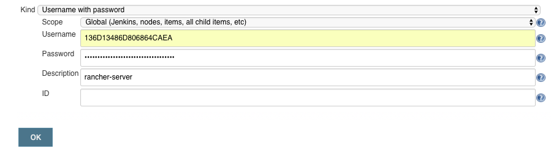
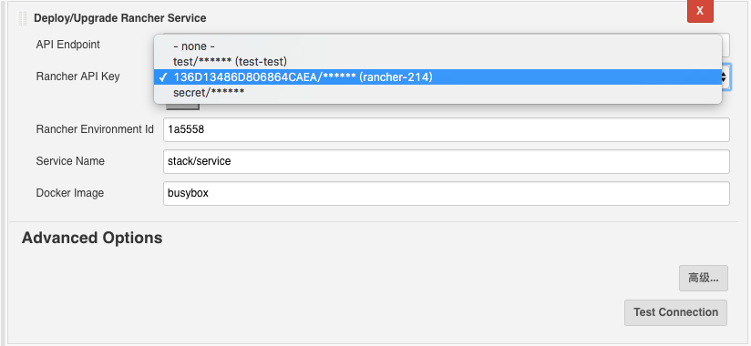

Enables Jenkins to deploy or upgrade Rancher stack service instance

[[RancherPlugin-Features]]
== Features

* Deploy docker image to Rancher 
* Upgrade exist service instance in Rancher
* Support options to finish the upgrade automatically 
* Support build environment variable as docker image tag, e.q.
busybox:$\{BUILD_NUMBER}

[[RancherPlugin-Potentialupcomingfeatures]]
=== Potential upcoming features

* Provision rancher stack with docker-compose and rancher-compose file

[[RancherPlugin-Requirements]]
== Requirements

[[RancherPlugin-Jenkins]]
=== Jenkins

Jenkins https://jenkins.io/changelog-stable/#v2.11[version 2.11] or
newer is required.

[[RancherPlugin-Rancher]]
=== Rancher

Rancher https://github.com/rancher/rancher/releases/tag/v1.2.2[version
1.2.2] or newer is required.

[[RancherPlugin-Setup]]
== Setup

[[RancherPlugin-Installplugin]]
=== Install plugin

Install this plugin via the Jenkins plugin manager.

Or if installing the plugin via other means.

[[RancherPlugin-CreateRancherAPIKey]]
=== Create Rancher API Key

. To enable access to your rancher server, you must create a account api
key:
. Siigin in to rancher server dashboard
. Select Menu → API
. Click "Add Account API Key"
. Give the  api key any name and description you like, e.g "Jenkins"
. Click the "Create Key"
. Save the "Access Key" and "Secret Key" any way you like, we will use
it later
. You can now close the dialog 

[[RancherPlugin-AddtheRancherAPIKeytoJenkins]]
=== Add the Rancher API Key to Jenkins

. Navigate to your Jenkins instance
. Select "Credentials" from the Jenkins sidebar
. Choose a credentials domain and click "Add Credentials"
. From the "Kind" drop-down, choose "Username with password"
. Enter a description for the credential — the actual value is not
important
. Click "OK" to create the credential

[.confluence-embedded-file-wrapper]##

[[RancherPlugin-Per-jobconfiguration]]
=== Per-job configuration

[[RancherPlugin-Freestylejobconfiguration]]
==== Freestyle job configuration

[[RancherPlugin-DeployorUpgradeServiceInstance]]
===== Deploy or Upgrade Service Instance

. Create a new free-style project
. Ensure. via whatever build stepds you need, tha the Docker image you
want to deploy to Rancher will be available in the docker registry
. Add "Deploy/Upgrade Rancher Service" post-build action
. Enter the target Rancher Service API endpoint, e.g
'http://rancher-server/v2-beta'
. Select the credential name from the drop-down list
. Enter the target rancher environment id, e.g '1a5558'
. Enter the target service name, e.g 'stack/service'
. Enter the docker image name, e.g 'busybox' (image name support current
build environment variable like 'busybox:$\{BUILD_NUMBER}' to
support dynamic image tag)
. Optionally choose "Auto Confirm" to finish the upgrade automatically
. Optionally choose "Public Ports" to export service ports. mutil port
shoule e split be ",". e.g 8080:80,9191:91

[.confluence-embedded-file-wrapper .confluence-embedded-manual-size]##

[[RancherPlugin-Versionhistory]]
== Version history

[[RancherPlugin-Version1.0.0(July13,2017)]]
=== Version 1.0.0 (July 13, 2017)

* Initial release

[[RancherPlugin-Version1.0.1(July17,2017)]]
=== Version 1.0.1 (July 17, 2017)

* Fixed dependencies info missing issue.

[[RancherPlugin-Version1.0.2(August042017)]]
=== Version 1.0.2 (August 04 2017)

* Preserves the log config while upgrading a service.

[[RancherPlugin-Version1.0.3(September032017)]]
=== Version 1.0.3 (September 03 2017)

* Support export service ports.

[[RancherPlugin-Version1.0.4(September122017)]]
=== Version 1.0.4 (September 12 2017)

* Support export environment variable.

[[RancherPlugin-Version1.0.5(October102017)]]
=== https://github.com/jenkinsci/rancher-plugin#version-105-october-10-2017[Version 1.0.5 (October 10 2017)]

* Support health check serialization.

[[RancherPlugin-Version1.0.7(December112017)]]
=== https://github.com/jenkinsci/rancher-plugin#version-107-december-11-2017[Version 1.0.7 (December 11 2017)]

* Support custom timeout, and build variable in all fields.

 

 

 
