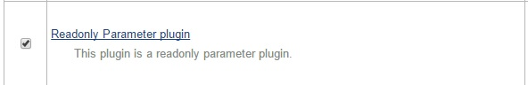
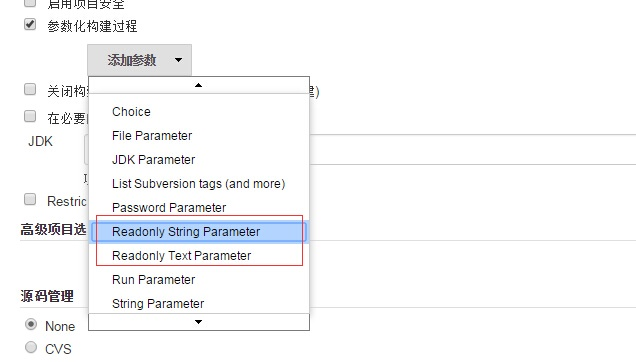
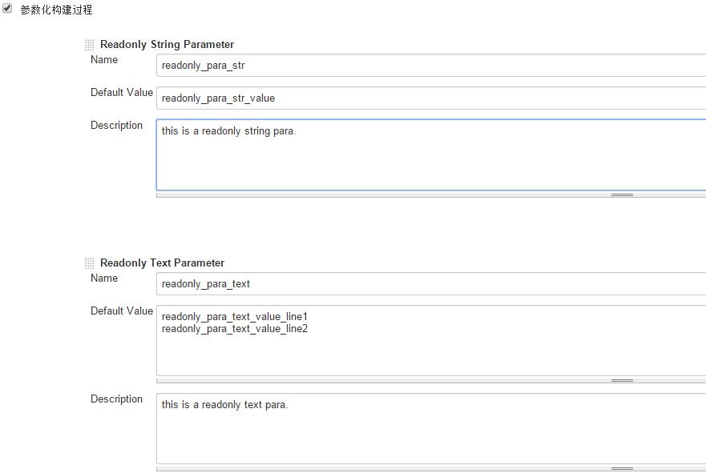
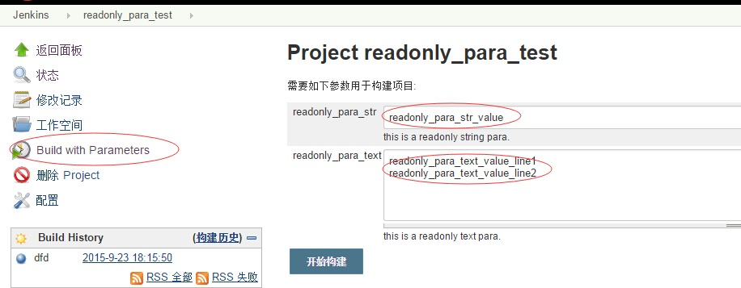

[[ReadonlyParameterPlugin-ReadonlyParameterPlugin]]
== Readonly Parameter Plugin

[[ReadonlyParameterPlugin-INLINEThispluginaddssupportforParameter.Afterthepluginisinstalled,injobconfiguration'spage,youcanseeReadonlyParameter.]]
== 

This plugin adds support for Parameter. After the plugin is installed,in
job configuration's page,you can see Readonly Parameter.

[[ReadonlyParameterPlugin-Characteristics]]
=== Characteristics 

{empty}1. Some key parameters, once modified in the build execution, can
lead to the risk.these parameters,only administrator can modify,to
reduce the risk.

{empty}2. Readonly parameter,readonly in the build execution, in job
configuration's page can modify.

{empty}3. Readonly parameter,readonly in the rebuild excution also.

{empty}4. This plugin contains string and text two readonly style.

[[ReadonlyParameterPlugin-Install]]
=== Install  [.confluence-embedded-file-wrapper]##

[[ReadonlyParameterPlugin-UseCase]]
=== Use Case

After the plugin is installed,in job configuration's page,you can see
readonly Parameter:
[.confluence-embedded-file-wrapper]##

for example,you add two readonly parameter,respectively called
readonly_para_str and readonly_para_text.click 'Build With Parameters'
link ,the parameter readonly_para_str and readonly_para_text of the set
before ,display readonly,and can not be edited in this page. 

[.confluence-embedded-file-wrapper]## +
click 'Build With Parameters' link ,the parameter readonly_para_str and
readonly_para_text of the set before ,display readonly,and can not be
edited in this page. 
[.confluence-embedded-file-wrapper]##

[[ReadonlyParameterPlugin-Contribute]]
=== Contribute

Fork me on Github
at https://github.com/wy-scm/readonly-parameter-plugin/ (http://).
