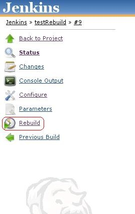
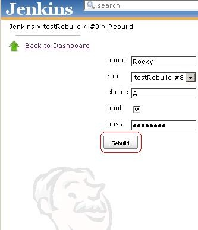
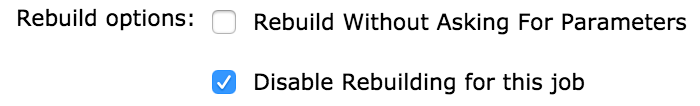

[.conf-macro .output-inline]##

[cols="",options="header",]
|===
|Plugin Information
|View Rebuilder https://plugins.jenkins.io/rebuild[on the plugin site]
for more information.
|===

[.aui-icon .aui-icon-small .aui-iconfont-info .confluence-information-macro-icon]##

Older versions of this plugin may not be safe to use. Please review the
following warnings before using an older version:

* https://jenkins.io/security/advisory/2018-09-25/#SECURITY-130[Cross
Site Scripting vulnerability]

[.conf-macro .output-inline]#This plug-in allows the user to _rebuild_ a
_parametrized build_ without entering the _parameters_ again.It will
also allow the user to edit the parameters before rebuilding.#

[[RebuildPlugin-Usage]]
== Usage

Once you installed this plug-in whenever you execute a parametrized
build you will get a rebuild button in the left pane of the run as shown
in the image. If you want to execute the build with same parameters,
rebuild plug-in will allow you to build it through rebuild button.If you
want to edit some of the existing parameters, the rebuild plug-in will
allow you to edit the existing parameters and build it.

[[RebuildPlugin-Howtorebuild]]
=== How to rebuild

*Steps to rebuild*

* Select the run of the job which you want to rerun.
* There will be a *_Rebuild_* button as shown in the image given below.

* [.confluence-embedded-file-wrapper]##

* Click on the *_Rebuild_* button. A configuration page contains the
existing parameters will appear as shown in the below image.

* [.confluence-embedded-file-wrapper]##

* If you want to edit some existing parameters(for ex: name and choice)
, you can edit it and Rebuild it by clicking the *_Rebuild_* button.

[[RebuildPlugin-ChangeLog]]
== Change Log

[[RebuildPlugin-Version1.31(Apr28,2019)]]
=== Version 1.31 (Apr 28, 2019)

* Make sure that a single instance of UserIDCause and RebuildCause are
added to the build causes

[[RebuildPlugin-Version1.30(Mar25,2019)]]
=== Version 1.30 (Mar 25, 2019)

* Fix CauseAction issues.
See https://github.com/jenkinsci/rebuild-plugin/pull/56

[[RebuildPlugin-Version1.29(Sep25,2018)]]
=== Version 1.29 (Sep 25, 2018)

* https://jenkins.io/security/advisory/2018-09-25/#SECURITY-130[Fix]
https://jenkins.io/security/advisory/2018-09-25/#SECURITY-130[security
issue]

[[RebuildPlugin-Version1.28(Mar28,2018)]]
=== Version 1.28 (Mar 28, 2018)

* Updated required Jenkins Core to 1.642.3
* Additional Null-checks
* Fix root-url
* Handle NodeParameters correctly

[[RebuildPlugin-Version1.27(Oct18,2017)]]
=== Version 1.27 (Oct 18, 2017)

* Display more informative error messages

* Ensure inherited parameters are added to rebuilds

[[RebuildPlugin-Version1.25(Jun25,2015)]]
=== Version 1.25 (Jun 25, 2015)

*Add option to disable the rebuild plugin on the project level

[.confluence-embedded-file-wrapper .confluence-embedded-manual-size]##

[[RebuildPlugin-Version1.20(Sept13,2013)]]
=== Version 1.20 (Sept 13, 2013)

*Fixed
https://issues.jenkins-ci.org/browse/JENKINS-15882[JENKINS-15882].

*Fixed
https://issues.jenkins-ci.org/browse/JENKINS-14828[JENKINS-14828].

*Blocked rebuilding matrix configuration alone.

*Rebuild option for parameter less build.

[[RebuildPlugin-Version1.18(Feb24,2013)]]
=== Version 1.18 (Feb 24, 2013)

* Fix https://issues.jenkins-ci.org/browse/JENKINS-16874[JENKINS-16874]
- java.lang.NullPointerException: Current Project is null

[[RebuildPlugin-Version1.17(Feb06,2013)]]
=== Version 1.17 (Feb 06, 2013)

*"Rebuild Last"  feature allows to rebuild last build implemented.

* https://issues.jenkins-ci.org/browse/JENKINS-14905[JENKINS-14905]
fixed.

[[RebuildPlugin-Version1.16(Nov14,2012)]]
=== Version 1.16 (Nov 14, 2012)

*Rebuild support for non parametrized build +
    implemented.

[[RebuildPlugin-Version1.16(Nov14,2012).1]]
=== Version 1.16 (Nov 14, 2012)

*Rebuild support for non parametrized build +
    implemented.

*Required Jenkins Core Version is 1.481.

[[RebuildPlugin-Version1.15(Oct12,2012)]]
=== Version 1.15 (Oct 12, 2012)

*Rebuild support for jobs having subversion/text parameter +
    implemented.

*Required Jenkins Core Version is 1.481.

[[RebuildPlugin-Version1.14(July8,2012)]]
=== Version 1.14 (July 8, 2012)

* fix https://issues.jenkins-ci.org/browse/JENKINS-11770[JENKINS-11770]
add support for NodeLabel parameter plugin

[[RebuildPlugin-Version1.13(June11,2012)]]
=== Version 1.13 (June 11, 2012)

* Enabled rebuild plugin support for parametrized triggered plugin with
basic type of parameters like String-parameter,Boolean-parameter, +
  File-parameter,Text-parameter and Password-parameter. Currently there
is no support for Run-parameter for Parametrized triggered plugin.

* Disabled the rebuild option for sub jobs of matrix build.

[[RebuildPlugin-Version1.12(June06,2012)]]
=== Version 1.12 (June 06, 2012)

* Fix reponed
https://issues.jenkins-ci.org/browse/JENKINS-13647[JENKINS-13647]

[[RebuildPlugin-Version1.11(May13,2012)]]
=== Version 1.11 (May 13, 2012)

* Fix NullPointerException for
https://issues.jenkins-ci.org/browse/JENKINS-13647[JENKINS-13647]

[[RebuildPlugin-Version1.7(Mar2,2011)]]
=== Version 1.7 (Mar 2, 2011)

* Enhanced the rebuild plug-in so that the editing option of build
parameters before rebuild is introduced. [Doesnt have backward
compatibility. An exception at startup. *Seems minor and e are working
on fix however doesnt affect functionality*]

[[RebuildPlugin-Version1.4(Sept15,2010)]]
=== Version 1.4 (Sept 15, 2010)

* Disabling the rebuild option while selecting Run and File parameters
is implemented

[[RebuildPlugin-Version1.1(Jul16,2010)]]
=== Version 1.1 (Jul 16, 2010)
