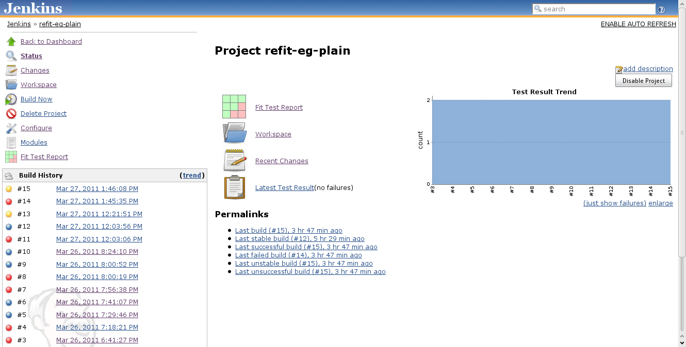
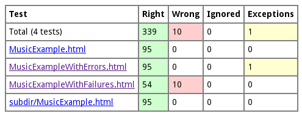

A plugin for publishing Fit test reports created by
http://refit.googlecode.com/[reFit], an implementation of the Framework
for Integrated Test (Fit).

[[reFitPlugin-Overview]]
== Overview

The reFit plugin collects and archives the test output and summaries
created by a Fit test suite. The reports of the latest build are
published under
http://jenkins/jobs/YOURJOB/refit/[http://JENKINS/jobs/YOURJOB/refit/].
An icon on the job status page links to this URL:

[.confluence-embedded-file-wrapper .confluence-embedded-manual-size]##

 Click on this icon to see the reFit test report, containing links to
the individual test results:

[.confluence-embedded-file-wrapper]##

[[reFitPlugin-FAQ]]
=== FAQ

[[reFitPlugin-WhatisFitandreFit?]]
==== What is Fit and reFit?

See the http://code.google.com/p/refit/wiki/FitInANutshell[reFit Wiki].

[[reFitPlugin-HowdoesthereFitpluginrelatetotheFitplugin?]]
==== How does the reFit plugin relate to the Fit plugin?

* The Fit plugin was never released, the reFit plugin will available via
Jenkins' update centre soon.
* The Fit plugin is based on the original Fit implementation. The reFit
plugin is based on http://code.google.com/p/refit[reFit], a recent
alternative implementation of Fit.

[[reFitPlugin-HowdoesthereFitpluginrelatetotheFitnesseplugin?]]
==== How does the reFit plugin relate to the Fitnesse plugin?

It doesn't. Fitnesse is incompatible with Fit. It is one of the driving
forces of reFit to go back to the Fit roots and to create an up-to-date
and maintained version of Fit, without any of the incompatible
extensions introduced in Fitnesse.

[[reFitPlugin-HowcanIrunFittestsinaJenkinsproject?]]
==== How can I run Fit tests in a Jenkins project?

If your project is based on Maven, just use the refit-maven-plugin.
Otherwise, you can wrap your Fit tests in a JUnit suite or run reFit
programmatically, e.g. from an Ant script. See
http://code.google.com/p/refit/wiki/RunningFitTests[Running Fit Tests]
for details.

[[reFitPlugin-CanIusethefit-maven-pluginorotherold-schoolFitrunnersinstead?]]
==== Can I use the fit-maven-plugin or other old-school Fit runners instead?

No, the reFit plugin parses an XML report produced by reFit. This is an
added feature of reFit. If you have an existing Fit suite, it should
also run under reFit. You need *reFit 1.7.0* or higher to produce XML
reports.

[[reFitPlugin-DoesthereFitpluginincludereFit?]]
==== Does the reFit plugin include reFit?

No, and it has no compile-time or run-time dependencies on reFit either.
The Jenkins reFit plugin only works with the files generated by reFit.
For this reason, the reFit plugin can be released under the MIT license
used by Jenkins, whereas reFit is released under GPL, being a derived
work from the original Fit framework which is also released under GPL.

[[reFitPlugin-ChangeHistory]]
=== Change History

[[reFitPlugin-Version0.3(5Apr2011)]]
==== Version 0.3 (5 Apr 2011)

* Reports get archived per build. Before, only the reports from the last
build were archived for the project.
* There is a trend graph for the Fit test results.

[[reFitPlugin-Version0.2(28Mar2011)]]
==== Version 0.2 (28 Mar 2011)

* Initial public release.
* Archives Fit reports and publishes them via a link on the project
page.
* Usable both for Maven and Freestyle builds, but the plugin does not
automatically extract configuration info from the Maven POM.
* No aggregation for multi-module Maven builds. You can only publish the
reports from one subproject.
* The plugin only archives the results of the last successful build.
