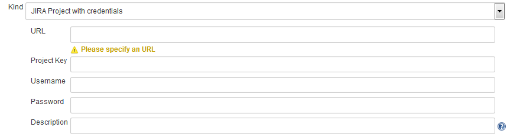
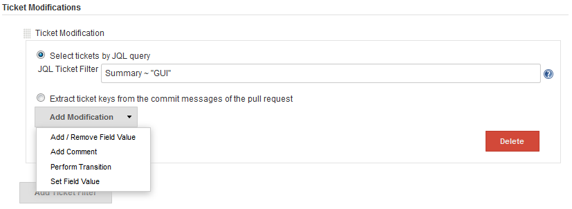
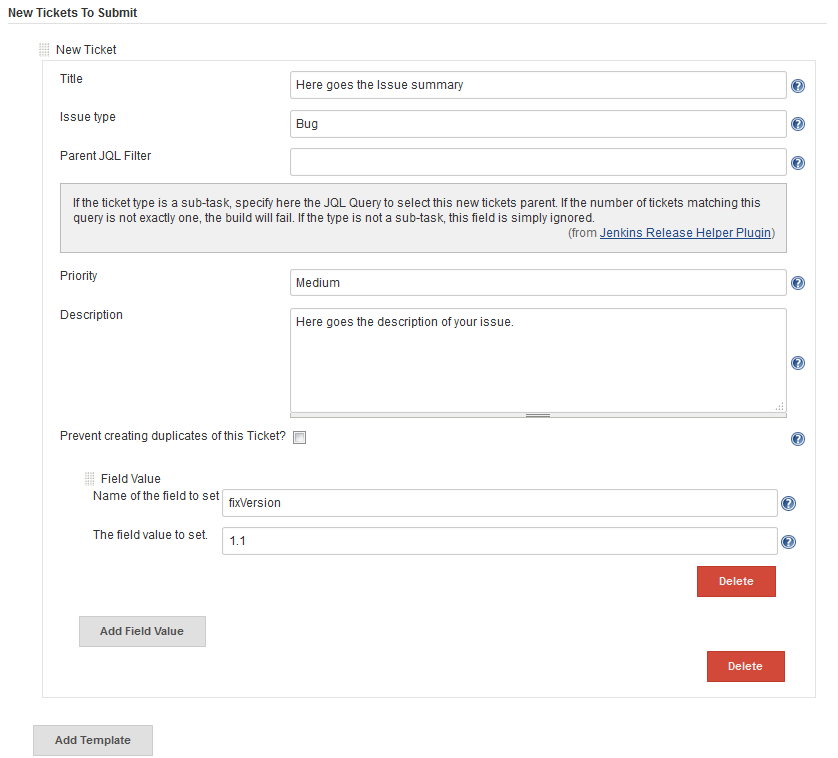
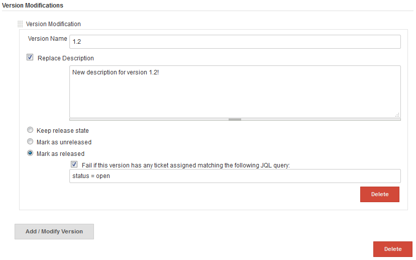
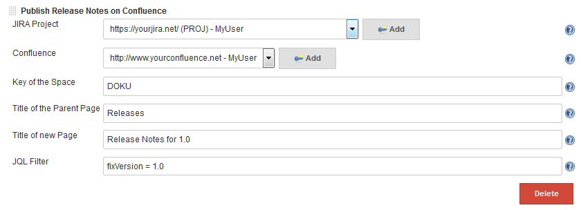
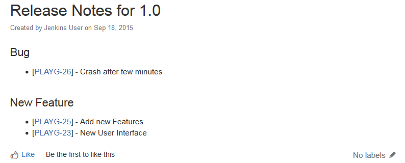

[.conf-macro .output-inline]# #

This plugin allows the automation of several release tasks regarding
Atlassian JIRA, Confluence, InfluxDB and Twitter. +
It offers the following features:

* update / create JIRA Tickets
* update / create JIRA Releases
* publish release notes and artifacts on GitHub
* publish release notes on Confluence
* publish status updates on Twitter
* publish measurement points in an InfluxDB

[[ReleaseHelperPlugin-Configuration]]
== Configuration

[[ReleaseHelperPlugin-Variables]]
=== Variables

Build Parameters as well as Environment Variables can be accessed from
every field using the *$\{variablename}* syntax. +
The plugin will then replace this placeholder with the actual contents
of the parameter or variable named *variablename*.

[[ReleaseHelperPlugin-Credentials]]
=== Credentials

The plugin adds two new credential types to your Jenkins: one for access
a certain JIRA Project, and another one for accessing Confluence. +
These credentials can be entered using the Jenkins credentials settings,
a screenshot of the JIRA credentials dialog is given below. +
Note that these dialogs do automatically check whether JIRA / Confluence
is accessible using the data you entered.

[.confluence-embedded-file-wrapper]##

[[ReleaseHelperPlugin-AddingandModifyingJIRATickets]]
=== Adding and Modifying JIRA Tickets

To add or Modify Tickets, add the *JIRA Ticket Editor* Build-Step to
your project. +
There are two ways to select the Tickets to be modified:

. Enter a JIRA-Query-Language (JQL) statement selecting your tickets
. If the Build was triggered by the GitHub Pull Request Builder Plugin,
you can give a regular expression to extract the Ticket-Keys from the
commit messages of the pull request.

Afterwards, you can select the modifications to apply to the tickets
matching these criteria.

[.confluence-embedded-file-wrapper]##

In a similar way, new JIRA Tickets can be published:

[.confluence-embedded-file-wrapper]##

[[ReleaseHelperPlugin-AddingandModifyingJIRAReleases]]
=== Adding and Modifying JIRA Releases

Select the *Add / Modify JIRA Project Versions* build-step. Using this
buildstep, you can modify or add multiple project versions. +
If the given version name already exists, it is updated, otherwise a new
version for the project is created.

[.confluence-embedded-file-wrapper]##

[[ReleaseHelperPlugin-PublishingReleaseNotesonConfluence]]
=== Publishing Release Notes on Confluence

The bundle also offers a build step called *Publish Release Notes on
Confluence* which creates a confluence page. +
This confluence page contains a list of tickets, selected using a JQL
Query provided by the user. +
Below you can see an example configuration, including the page which it
creates.

[.confluence-embedded-file-wrapper]##

[.confluence-embedded-file-wrapper]##

[[ReleaseHelperPlugin-PublishingReleasesonGitHub]]
=== Publishing Releases on GitHub

This feature is available as the *Publish A Release on GitHub*
post-build action. +
Using this action, you can create a release on GitHub and upload build
artifacts to it. +
The release description works in the same manner as for the confluence
release notes page.

[[ReleaseHelperPlugin-TwitterPublisher]]
=== Twitter Publisher

This build step offers you the possibility to publish a Twitter status
update. +
The build step checks whether a recent tweet with the same text already
exists in order to prevent duplicate tweets.

[[ReleaseHelperPlugin-InfluxDBPublisher]]
=== InfluxDB Publisher

The *InfluxDB Publisher* build step allows you to add measurement points
to an InfluxDB instance. +
The measurement points are given to the plugin in the format specified
https://docs.influxdata.com/influxdb/v0.9/write_protocols/line/[here].
