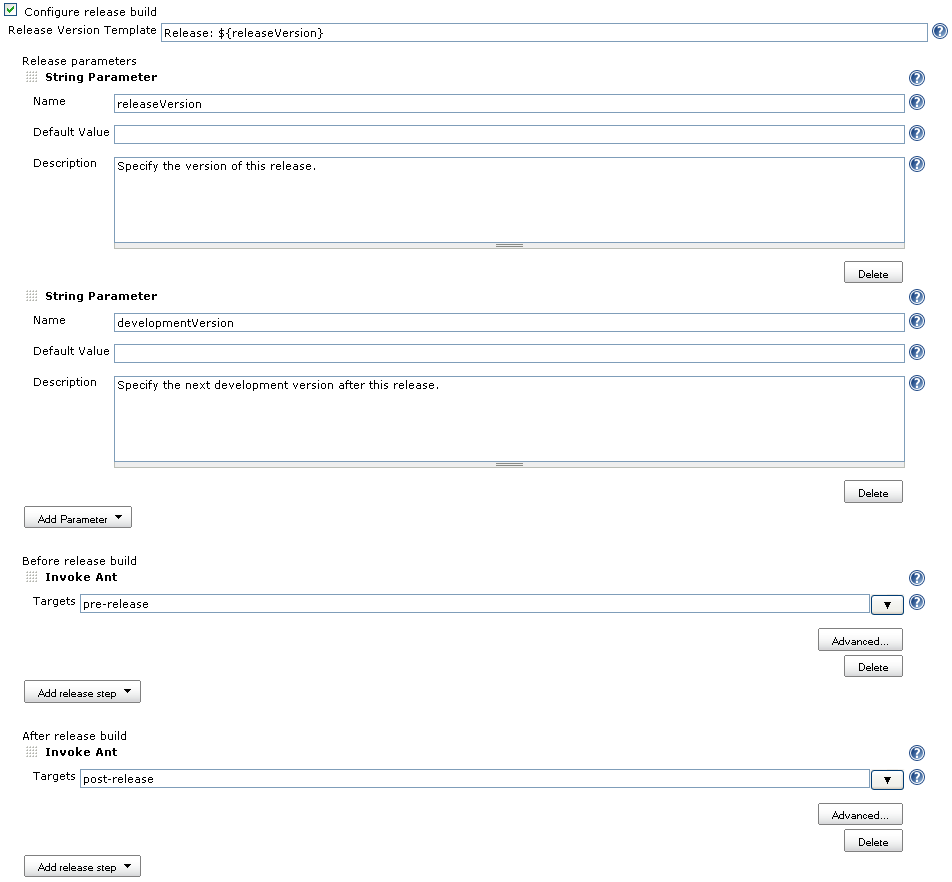
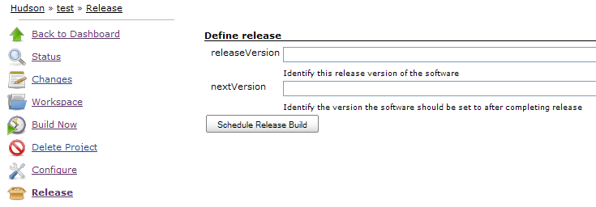
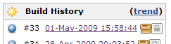
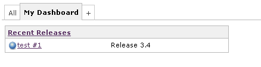
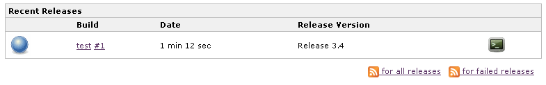

[.conf-macro .output-inline]# #

[.aui-icon .aui-icon-small .aui-iconfont-info .confluence-information-macro-icon]##

Older versions of this plugin may not be safe to use. Please review the
following warnings before using an older version:

* https://jenkins.io/security/advisory/2018-01-22/[Cross-site request
forgery (CSRF) vulnerability]

[.aui-icon .aui-icon-small .aui-iconfont-warning .confluence-information-macro-icon]##

*This plugin is up for adoption.* Want to help improve this plugin?
https://wiki.jenkins.io/display/JENKINS/Adopt+a+Plugin[Click here to
learn more]!

This plugin adds the ability to wrap your job with pre- and post- build
steps which are only executed when a manual release build is triggered.

Additional plugin integration

[.aui-icon .aui-icon-small .aui-iconfont-info .confluence-information-macro-icon]#
#

Supports the
https://wiki.jenkins.io/display/JENKINS/Dashboard+View[Dashboard View]
with the Recent Releases portlet and the
https://wiki.jenkins.io/display/JENKINS/Promoted+Builds+Plugin[Promoted
Builds Plugin] with the Release build condition.

[[ReleasePlugin-Configurethejobtoenablereleasing]]
== Configure the job to enable releasing

On the job configuration page, enable the release build configuration
under the Build Wrapper heading and add your required release version
template string, release
https://wiki.jenkins.io/display/JENKINS/Parameterized+Build[parameters],
pre and post build steps that you need to complete a release.

[[ReleasePlugin-ReleaseVersionTemplate]]
=== Release Version Template

The release version template was added in version 1.7 of the release
plugin.  This parameter lets you define how the release plugin
identifies the release of the project.  This is done by building a
parameter based template which is resolved at release time to a fully
resolved string.  For instance, the template can be: Release:
$\{releaseVersion}.  This will instruct the release plugin to use the
value of the parameter name releaseVersion to come up with the fully
identifying string which will then be used as a description of the
release build and as a tooltip on the release build icon on the
historical build list.

[[ReleasePlugin-ReleaseParameters]]
=== Release Parameters

The release parameters let you define various parameters that are
presented to the user when a release is requested.  The list of
available parameter types are the same as those available in the
parameterized build option for Jenkins.

[[ReleasePlugin-BuildSteps]]
=== Build Steps

The build steps section is used to define arbitrary actions to run
before and after the standard job build steps run. These are the same
build steps offered as the build steps available in the free style job
type.

[.confluence-embedded-file-wrapper]##

In my experience, a release build typically requires pre-build steps of
validating the project is releasable and bumping the version to the
release version. After the build runs as usual, the post build steps are
labeling the codebase and bumping the version to the next development
version.

[[ReleasePlugin-Executingarelease]]
== Executing a release

To run a release, click the Release icon from the job home page. This
will bring you to the release details page where you will be prompted to
fill in any parameters that you have defined (or the default
RELEASE_VERSION and DEVELOPMENT_VERSION if there were no parameters
defined).  As seen above, these values are then available at job
execution time in both the pre and post release steps as well as the
normal build steps. Finally, click the schedule release build and the
job is scheduled to run immediately, now including the execution of the
pre and post build steps.

[.confluence-embedded-file-wrapper]##

[[ReleasePlugin-Viewingresults]]
== Viewing results

Once the build is complete, the release plugin automatically locks the
build, preventing it from being automatically deleted and adds a release
icon denoting it as a release build.

[.confluence-embedded-file-wrapper]##

[[ReleasePlugin-SupportedJobTypes]]
== Supported Job Types

 The release plugin supports the Maven2 and Free Style Job type

[[ReleasePlugin-RecentReleasesPortlet]]
== Recent Releases Portlet

The release plugin contributes a recent releases portlet that can be
used in a
https://wiki.jenkins.io/display/JENKINS/Dashboard+View[Dashboard View]. 

This portlet shows the 5 most recent release builds in normal mode with
a link that brings you to the build page and the version string.
[.confluence-embedded-file-wrapper]## +
In the maximized mode, it shows the 50 most recent builds with
additional detail.  Additionally it offers an rss feed while in the
maximized mode so that you can get notified of all release builds or all
failing release builds.
[.confluence-embedded-file-wrapper]##

[[ReleasePlugin-VersionHistory]]
== Version History

[[ReleasePlugin-Version2.10.2(Nov18,2018)]]
=== Version 2.10.2 (Nov 18, 2018)

* https://issues.jenkins-ci.org/browse/JENKINS-53994[JENKINS-53994] -
Fix issue with visualization of parameters coming from plugins

[[ReleasePlugin-Version2.10.1(Mar13,2018)]]
=== Version 2.10.1 (Mar 13, 2018)

* No user-visible changes
* Developer: Upgrade the plugin to the latest plugin POM

[[ReleasePlugin-Version2.10(Jan22,2018)]]
=== Version 2.10 (Jan 22, 2018)

* https://jenkins.io/security/advisory/2018-01-22/[Fix security issue]

[[ReleasePlugin-Version2.9(Dec08,2017)]]
=== Version 2.9 (Dec 08, 2017)

* https://issues.jenkins-ci.org/browse/JENKINS-26895[JENKINS-26895] -
Prevent exception when Dashboard View plugin is not installed
* https://github.com/jenkinsci/release-plugin/pull/27[PR #27] - Update
Maven Plugin dependency to 3.0, cleanup other dependencies

[[ReleasePlugin-Version2.8(June27,2017)]]
=== Version 2.8 (June 27, 2017)

* https://github.com/jenkinsci/release-plugin/pull/25[PR #25] -
[.js-issue-title]#Enable release actions for
https://wiki.jenkins.io/display/JENKINS/Job+Generator+Plugin[Job
Generator Plugin]#

[[ReleasePlugin-Version2.7(Apr08,2017)]]
=== Version 2.7 (Apr 08, 2017)

* https://issues.jenkins-ci.org/browse/JENKINS-40765[JENKINS-40765] -
Add a new *release()* step
for https://wiki.jenkins.io/display/JENKINS/Pipeline+Plugin[Pipeline
Plugin]
* https://github.com/jenkinsci/release-plugin/pull/14[PR #14] - Enable
the plugin for https://wiki.jenkins.io/display/JENKINS/Ivy+Plugin[Ivy
Plugin]

[[ReleasePlugin-Version2.6.1(10/13/2016)]]
=== Version 2.6.1 (10/13/2016)

* http://issues.jenkins-ci.org/browse/JENKINS-20797[JENKINS-20797] - In
addition to the fix in 2.6, schedule new release builds with the actual
User Cause widely supported by plugins

[[ReleasePlugin-Version2.6(09/29/2016)]]
=== Version 2.6 (09/29/2016)

https://wiki.jenkins.io/display/~oleg_nenashev[Unknown User
(oleg_nenashev)] is a temporary maintainer.

* Core dependency has been updated from 1.481 to 1.609.3 LTS
(https://github.com/jenkinsci/release-plugin/pull/17#r81082784[justification])
* http://issues.jenkins-ci.org/browse/JENKINS-34996[JENKINS-34996] Fix
the compatibility with Jenkins cores containing the
https://wiki.jenkins-ci.org/display/JENKINS/Plugins+affected+by+fix+for+SECURITY-170[SECURITY-170]
fix (pull request #17, thanks to
https://wiki.jenkins.io/display/~amuniz[Antonio Muñiz])
* http://issues.jenkins-ci.org/browse/JENKINS-11176[JENKINS-11176] "If
the build is a release build" promotion criteria was broken due to the
improper descriptor handling in the plugin (pull request #15, thanks to
https://github.com/Dohbedoh[Allan Burdajewicz])
* http://issues.jenkins-ci.org/browse/JENKINS-28132[JENKINS-28132]
"Release" permission is now implied by Jenkins Administer permission
(pull request #16, thanks to aprueller)
* http://issues.jenkins-ci.org/browse/JENKINS-20797[JENKINS-20797]
Recent Releases Portlet should support extraction of users from the new
"triggered by user" cause being used in Jenkins 1.427+ (pull request
#18)
* https://github.com/jenkinsci/release-plugin/pull/18[PR #18] Recent
Releases Portlet should not create new users for non-existent usernames
when rendering the output page (pull request #18)
* Cleanup of minor issues discovered by FindBugs (pull request #19)

[[ReleasePlugin-Version2.5.4(10/26/2015)]]
=== Version 2.5.4 (10/26/2015)

* http://issues.jenkins-ci.org/browse/JENKINS-31159[JENKINS-31159] Fix
postMatrixBuildSteps (Pull request #13, thanks to Fiouz)

[[ReleasePlugin-Version2.5.3(4/25/2015)]]
=== Version 2.5.3 (4/25/2015)

* http://issues.jenkins-ci.org/browse/JENKINS-27722[JENKINS-27722]
upgrade to the release plugin has left the plugin broken (Pull request
#12, thanks to glenritchie)
* Change so that now you can select Publisher and Builders in the
(release) build steps (Pull request #11, thanks to glenritchie)
* Small translation fix (Pull request #10, thanks to Batmat)
* Add two custom view job filters "All Release Jobs" and "Release Jobs"
(Pull request #9, thanks to fritaly)
* Define a new RELEASE permission (Pull request #8, thanks to fritaly)
** *BEWARE:* *You need to adapt your permissions so that users still see
the release button*
* Set the description for the parent of a matrix build (Pull request #7,
thanks to fritaly)
* Add ability to run steps before/after all matrix configurations

[[ReleasePlugin-Version2.4.1(9/27/2013)]]
=== Version 2.4.1 (9/27/2013)

* Don't display release action in matrix configuration

[[ReleasePlugin-Version2.4(8/04/2013)]]
=== Version 2.4 (8/04/2013)

* http://issues.jenkins-ci.org/browse/JENKINS-5079[JENKINS-5079] Added
matrix projects support

[[ReleasePlugin-Version2.3(9/20/2012)]]
=== Version 2.3 (9/20/2012)

* http://issues.jenkins-ci.org/browse/JENKINS-13422[JENKINS-13422] Added
release button column
* Use package.png instead of package.gif to have transparent icons
* Fixed release link being shown when project was disabled

[[ReleasePlugin-Version2.2(9/13/2011)]]
=== Version 2.2 (9/13/2011)

* Disabled auto-refresh when triggering a new release (thanks rseguy)
* http://issues.jenkins-ci.org/browse/JENKINS-9705[JENKINS-9705] Option
to override regular build parameters during release

[[ReleasePlugin-Version2.1(3/13/2011)]]
=== Version 2.1 (3/13/2011)

* http://issues.jenkins-ci.org/browse/JENKINS-8816[JENKINS-8816] Wrapped
each build steps list in a f:block which seems to correct the drag and
drop behavior
* http://issues.jenkins-ci.org/browse/JENKINS-8829[JENKINS-8829] Create
permalinks for the latest release and latest successful release builds
* Added i8n for promotion support
* Added German translations

[[ReleasePlugin-Version2.0(2/15/2011)]]
=== Version 2.0 (2/15/2011)

* Migrated to Jenkins
* If release build result is not at least unstable, then don't keep
build forever.
* Expand release version template using build variables as well as
release parameters
* Add support for the promoted build plugin to add a condition that the
build must be a release build
* Show all previous release parameters when scheduling a release build
* Add post successful build steps and post failed build steps
* Prefill release parameters with previous release builds parameters
(supports text field, checkbox & select list (drop-down list) input
types)

[[ReleasePlugin-Version1.10(7/21/2010)]]
=== Version 1.10 (7/21/2010)

* Added new checkbox on job config page to allow the disabling of the
automated marking of the build as keep forever
* Fixed issue where if you had overlapping parameter names defined as
release and build parameters, the default build parameter values were
being used to resolve the release version template instead of the
release parameter values.

[[ReleasePlugin-Version1.9(11/15/2009)]]
=== Version 1.9 (11/15/2009)

* Fixed issue where release plugin would prevent Jenkins from starting
if dashboard view plugin was not installed
(https://issues.jenkins-ci.org/browse/JENKINS-4845[4845])
* Fixed issue where recent releases portlet would throw NullPointer if a
build was active

[[ReleasePlugin-Version1.8(10/13/2009)]]
=== Version 1.8 (10/13/2009)

* Added support for
https://wiki.jenkins.io/display/JENKINS/Dashboard+View[Dashboard View]
plugin by adding Recent Releases portlet

[[ReleasePlugin-Version1.7(08/30/2009)]]
=== Version 1.7 (08/30/2009)

*  After sleeping on it, changed the implementation to use the release
version template so that parameters types don't have to be aware of the
release plugin in order to be used as a release version string.

[[ReleasePlugin-Version1.6(08/29/2009)]]
=== Version 1.6 (08/29/2009)

* Added new Release String Parameter that, when configured as a release
parameter, will be used as the release value and the plugin will then
set description and tooltip.
(https://issues.jenkins-ci.org/browse/JENKINS-4022[4022])

[[ReleasePlugin-Version1.5(08/06/2009)]]
=== Version 1.5 (08/06/2009)

* Changed form submission to use post instead of get. File upload
parameters work now.

[[ReleasePlugin-Version1.4(05/16/2009)]]
=== Version 1.4 (05/16/2009)

* Fixed regression issue introducing release parameters
(https://issues.jenkins-ci.org/browse/JENKINS-3690[3690])

[[ReleasePlugin-Version1.3(05/11/2009)]]
=== Version 1.3 (05/11/2009)

* Fixed regression due to maven plugin change
(https://issues.jenkins-ci.org/browse/JENKINS-3628[3628])

[[ReleasePlugin-Version1.2(05/1/2009)]]
=== Version 1.2 (05/1/2009)

* Added support for user supplied release parameters leveraging Jenkins'
parameter capability
(https://issues.jenkins-ci.org/browse/JENKINS-3370[3370])

[[ReleasePlugin-Version1.1(03/26/2009)]]
=== Version 1.1 (03/26/2009)

* Add permissions on triggering a release
* Fixed issue where parameters were not being resolved
* Captured release parameters as build parameters which can now be
viewed via build parameters link

[[ReleasePlugin-Version1.0(02/10/2009)]]
=== Version 1.0 (02/10/2009)

* Initial release 
