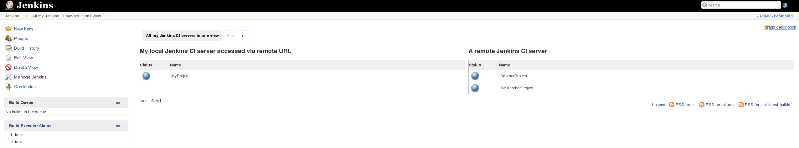
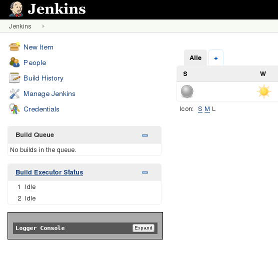
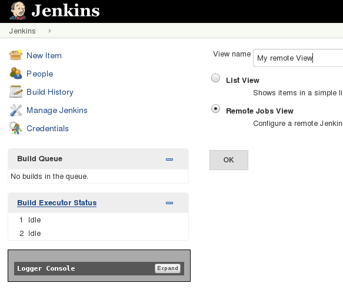
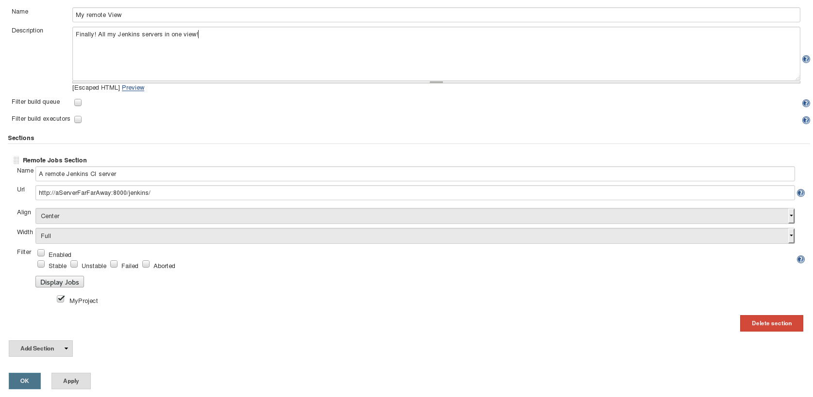

[[RemoteJobsViewPlugin-Summary]]
== Summary

View jobs executed on remote (master) Jenkins CI servers

In case you run several master Jenkins CI servers and you want to see
the jobs status from all your Jenkins servers in one view, you can use
this plugin to have them all in one view

[.confluence-embedded-file-wrapper .confluence-embedded-manual-size]##

[[RemoteJobsViewPlugin-Configuration]]
== Configuration

* Add a new view by clicking '_+_' +
[.confluence-embedded-file-wrapper .confluence-embedded-manual-size]##
* Select '_Remote Jobs View_' +
[.confluence-embedded-file-wrapper .confluence-embedded-manual-size]##
* Enter the remote Server URL -> Press '_Apply_' and reload (_F5_)
screen to fetch jobs list from remote server. Select the remote jobs to
display and you're done! +
[.confluence-embedded-file-wrapper .confluence-embedded-manual-size]##

[[RemoteJobsViewPlugin-KnownIssues]]
== Known Issues

* In case your remote Jenkins is only accessible via HTTPS you must
include the remote server certificate in your Java trust store. +
Or (if you really know what you're doing!) you could also add the
https://wiki.jenkins-ci.org/display/JENKINS/Skip+Certificate+Check+plugin[Skip
Certificate Check Plugin] to your Jenkins (which is running this view
plugin) in order to skip any certificate check
* Selecting 1/3 as width (for 3 remote servers - one left, one central,
one right) does not align the views correct

[[RemoteJobsViewPlugin-OpenTickets(bugsandfeaturerequests)]]
== Open Tickets (bugs and feature requests)

[[refresh-module-864852123]]
[[refresh-864852123]][[jira-issues-864852123]]
T

Key

Summary

Assignee

Reporter

P

Status

Resolution

Created

Updated

Due

[.refresh-action-group]# #

[[refresh-issues-loading-864852123]]
[.aui-icon .aui-icon-wait]#Loading...#

[#refresh-issues-button-864852123]##
[#refresh-issues-link-864852123]#Refresh#
[#error-message-864852123 .error-message .hidden]# #

[[RemoteJobsViewPlugin-Changelog]]
== Changelog

[[RemoteJobsViewPlugin-0.0.3(02-Oct-2015)]]
=== 0.0.3 (02-Oct-2015)

* Initial release
