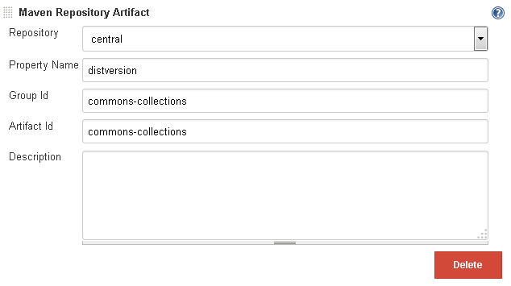
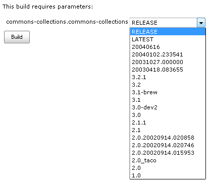
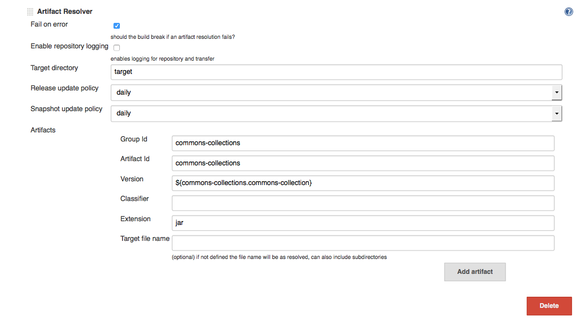
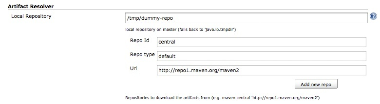

[.conf-macro .output-inline]##

[cols="",options="header",]
|===
|Plugin Information
|View Repository Connector
https://plugins.jenkins.io/repository-connector[on the plugin site] for
more information.
|===

[.aui-icon .aui-icon-small .aui-iconfont-info .confluence-information-macro-icon]##

Older versions of this plugin may not be safe to use. Please review the
following warnings before using an older version:

* https://jenkins.io/security/advisory/2019-03-06/#SECURITY-958[Credentials
stored in plain text]

Repository Connector adds features for resolving artifacts from a Maven
repository like Nexus or Artifactory.When installing this plugin, you'll
be given an additional build parameter 'Maven Repository Artifact' and a
build step 'Artifact Resolver', allowing you to select versions from a
remote repository and to download the artifact.

The Repository Connector Plugin can also be used to deploy artifacts to
target servers and it uses
http://www.sonatype.com/people/2010/08/introducing-aether/[Sonatype's
Aether API] internally to resolve artifacts from a repository and to
determine the sorting order of versions.

[[RepositoryConnectorPlugin-Usage]]
== Usage

The build parameter 'Maven Repository Artifact' allows for simple
version selection and the build step 'Artifact Resolver' lets you
download the artifact from a Maven repository without the need to
install Maven.

It is possible to use the version selection feature of this plugin alone
and let a Maven POM do the artifact download, or you can allow Jenkins
to do the download before a script is invoked.

The way you use the plugin is completely up to you.

Using only the version selection feature makes sense when you have
previously installed Maven and you want to have all aspects of the
artifact processing under version control (see Maven example below)

[[RepositoryConnectorPlugin-VersionSelection]]
=== Version Selection

[[RepositoryConnectorPlugin-StringParameter]]
==== String Parameter

You can use a simple string build parameter (e.g. 'VERSION') to enter a
version as free text:

* *1.0.0* - a regular version
* *RELEASE* - the latest release version
* *LATEST* - the latest version, which is usually a SNAPSHOT version
* *[0-SNAPSHOT,)* - a version range

This string parameter can be used in the later stages of the job by
specifying the property $\{VERSION}. It can even be used in the version
field of the Artifact Resolver build step.

[[RepositoryConnectorPlugin-MavenRepositoryArtifactParameter]]
==== Maven Repository Artifact Parameter

The version selection feature is provided by the build parameter 'Maven
Repository Artifact':

[.confluence-embedded-file-wrapper]##

When you click on "Build with Parameters" you will see a drop-down box
with all the versions that have been found in the Maven repository:

[.confluence-embedded-file-wrapper]##

The special versions "LATEST" and "RELEASE" are added to the list where
the latter is the default selection (new, not yet-released feature, see
https://issues.jenkins-ci.org/browse/JENKINS-28323[JENKINS-28323]).

The selected version is passed in 2 properties to the build:

* <groupId>.<artifactId>=<version> (e.g.
"commons-collections.commons-collections=1.0.0")
* <global-repo-name>=<version> (e.g. "central=1.0.0")

[[RepositoryConnectorPlugin-ArtifactResolverBuildStep]]
=== Artifact Resolver Build Step

The 'Artifact Resolver' build step allows you to download the specified
artifact in a build step. The location where the artifact is downloaded
to can be specified by the parameters "target directory" and "target
filename":

For passing the parameter version use

*Passing parameter version*

....
${<groupId>.<artifactId>}
....

*Passing parameter version example*

....
${commons-collections.commons-collections}
....

[.confluence-embedded-file-wrapper]##

[[RepositoryConnectorPlugin-GlobalConfiguration]]
=== Global Configuration

The repositories to resolve the artifacts from, can be configured in
Jenkins' global configuration section:

[.confluence-embedded-file-wrapper]##

[[RepositoryConnectorPlugin-Example]]
== Example

The following Maven POM downloads the artifact, and passes the path to
the artifact to a shell script for further processing. The shell script
also gets an environment parameter which comes from a "Choice Paramater"
to determine the target environment on which to deploy the artifact.

*Example deployment POM*

[source,syntaxhighlighter-pre]
----
<?xml version="1.0" encoding="UTF-8"?>
<project xmlns="http://maven.apache.org/POM/4.0.0" xmlns:xsi="http://www.w3.org/2001/XMLSchema-instance"
  xsi:schemaLocation="http://maven.apache.org/POM/4.0.0   http://maven.apache.org/maven-v4_0_0.xsd">
  <modelVersion>4.0.0</modelVersion>
  <groupId>com.foobar.deploy.maven</groupId>
  <artifactId>maven-deploy-template</artifactId>
  <version>0.0.1-SNAPSHOT</version>
  <packaging>pom</packaging>
  <name>Maven deployment template</name>

  <properties>
    <project.build.sourceEncoding>UTF-8</project.build.sourceEncoding>
  </properties>

  <dependencies>
    <dependency>
      <groupId>com.foobar.templates</groupId>
      <artifactId>maventemplate-ear</artifactId>
      <version>${distversion}</version>
      <type>ear</type>
    </dependency>
  </dependencies>

  <scm>
    <connection>scm:git:https://yourgitserver/jenkins-deploy-job-maven.git</connection>
    <developerConnection>scm:git:https://yourgitserver/jenkins-deploy-job-maven.git</developerConnection>
  </scm>

  <ciManagement>
    <system>jenkins</system>
    <url>https://yourjenkinsserver/jenkins/</url>
  </ciManagement>

  <repositories>
    <repository>
      <id>project</id>
      <url>https://yourreposerver/nexus/content/groups/public/</url>
    </repository>
  </repositories>

  <pluginRepositories>
    <pluginRepository>
      <id>project</id>
      <url>https://yourreposerver/nexus/content/groups/public/</url>
    </pluginRepository>
  </pluginRepositories>

  <build>
    <plugins>
      <plugin>
        <artifactId>maven-antrun-plugin</artifactId>
        <version>1.7</version>
        <executions>
          <execution>
            <phase>compile</phase>
            <configuration>
              <target>
                <!-- dump all available properties -->
                <echoproperties />
                <exec dir="." executable="cmd" osfamily="windows">
                  <arg value="/c"/>
                  <arg value="deploy.cmd ${maven.dependency.com.foobar.templates.maventemplate-ear.ear.path} ${environment} ${distversion}"/>
                </exec>
                <exec dir="." executable="/bin/bash" osfamily="unix">
                  <arg value="-c"/>
                  <arg value="./deploy.sh ${maven.dependency.com.foobar.templates.maventemplate-ear.ear.path} ${environment} ${distversion}"/>
                </exec>
              </target>
            </configuration>
            <goals>
              <goal>run</goal>
            </goals>
          </execution>
        </executions>
      </plugin>
    </plugins>
  </build>
  <profiles>
  </profiles>
</project>
----

NOTE: This is just a suggestion. Instead of forking a shell script, all
the necessary steps could als be performed by the Antrun Maven plugin.

[[RepositoryConnectorPlugin-HelpandSupport]]
== Help and Support

type

key

summary

[.icon-in-pdf]# # Data cannot be retrieved due to an unexpected error.

http://issues.jenkins-ci.org/secure/IssueNavigator.jspa?reset=true&jqlQuery=project%20=%20JENKINS%20AND%20status%20in%20%28Open,%20%22In%20Progress%22,%20Reopened%29%20AND%20component%20=%20%27repository-connector-plugin%27&src=confmacro[View
these issues in Jira]

For Help and support please use the
http://jenkins-ci.org/content/mailing-lists[Jenkins Users] mailing
list. +
The comment list below is not monitored.

[[RepositoryConnectorPlugin-VersionHistory]]
== Version History

[[RepositoryConnectorPlugin-1.2.6(05.June2019)]]
=== 1.2.6 (05. June 2019)

* fix https://issues.jenkins-ci.org/browse/JENKINS-52669[JENKINS-52669]:
IndexOutOfBoundsException after upgrade to 1.2.3

[[RepositoryConnectorPlugin-1.2.5(05.Mar2019)]]
=== 1.2.5 (05. Mar 2019)

* don't store repository credentials in plain text

[[RepositoryConnectorPlugin-1.2.4(18.May2018)]]
=== 1.2.4 (18. May 2018)

* fix https://issues.jenkins-ci.org/browse/JENKINS-50293[JENKINS-50293]:
Repository Connector Plugin does not use Jenkins configured proxy
correctly
* fix
[.js-issue-title]#https://issues.jenkins-ci.org/browse/JENKINS-50963[JENKINS-50963]:
UpdatePolicy reset to default on
edit[.overlay-icon .aui-icon .aui-icon-small .aui-iconfont-edit]## ###

[[RepositoryConnectorPlugin-1.2.3(31.Jan2018)]]
=== 1.2.3 (31. Jan 2018)

* partial fix for
https://issues.jenkins-ci.org/browse/JENKINS-33796[JENKINS-33796], adds
pipeline support for artifact resolution
* fix https://issues.jenkins-ci.org/browse/JENKINS-36149[JENKINS-36149]
(https://wiki.jenkins-ci.org/display/JENKINS/Plugins+affected+by+fix+for+SECURITY-170[SECURITY-170])
* NOTE: 1.2.0/1.2.1/1.2.2 were released versions that failed to upload
to nexus

[[RepositoryConnectorPlugin-1.1.3(29.March2016)]]
=== 1.1.3 (29. March 2016)

* integrate https://issues.jenkins-ci.org/browse/JENKINS-30671[JENKINS-30671]
expand tokens in file for artifact deploy

[[RepositoryConnectorPlugin-1.1.2(10.Sep2015)]]
=== 1.1.2 (10. Sep 2015)

* Implemented
https://issues.jenkins-ci.org/browse/JENKINS-28323[JENKINS-28323]: Add
RELEASE and LATEST to version selection dropdown list
* fix https://issues.jenkins-ci.org/browse/JENKINS-27678[JENKINS-27678]:
NullPointerException when non proxy hosts is not set
* Implemented
https://issues.jenkins-ci.org/browse/JENKINS-27641[JENKINS-27641]: Name
of version selection build parameter should be customized
* fix https://issues.jenkins-ci.org/browse/JENKINS-17541[JENKINS-17541]
target directory does not expand token macro parameters
* fix https://issues.jenkins-ci.org/browse/JENKINS-29166[JENKINS-29166]
list of artifacts stored on maven repository not refreshed
* fix https://issues.jenkins-ci.org/browse/JENKINS-20263[JENKINS-20263]
Artifact Resolver does not retrieve the latest version from central
Maven Repository

[[RepositoryConnectorPlugin-1.1.1(28.Feb2015)]]
=== 1.1.1 (28. Feb 2015)

* fix https://issues.jenkins-ci.org/browse/JENKINS-24243[JENKINS-24243]
respect nonProxySettings

[[RepositoryConnectorPlugin-1.1.0(2.Feb2015)]]
=== 1.1.0 (2. Feb 2015)

* fix https://issues.jenkins-ci.org/browse/JENKINS-25620[JENKINS-25620]
and https://issues.jenkins-ci.org/browse/JENKINS-24781[JENKINS-24781]
Repository Connector Plugin failed to resolve dependency after upgrade
(0.8.2 -> 1.0.1)

[[RepositoryConnectorPlugin-1.0.1(16.Aug.2014)]]
=== 1.0.1 (16. Aug. 2014)

* fix https://issues.jenkins-ci.org/browse/JENKINS-23946[JENKINS-23946]
Artifact Resolver failed to expand tokens

[[RepositoryConnectorPlugin-1.0.0(18.July2014)]]
=== 1.0.0 (18. July 2014)

* fix https://issues.jenkins-ci.org/browse/JENKINS-17541[JENKINS-17541]
target directory does not expand token macro parameters
* integrate
https://github.com/jenkinsci/repository-connector-plugin/pull/3[PR #3]
(thanks to mrumpf!)
** Sort the list of Maven repositories in the global configuration page
** Added I18N and translated all help files and texts to german
** Extracted the global configuration from the ArtifactResolver and
moved it into the central class GlobalConfiguration
** Added the version selection build parameter
** When your ArtifactResolver build step and the build parameter is used
in one job, the version, selected by the builld parameter overrides the
version of the ArtifactResolver build step.
** Added proxy support which makes the plugin usable in corporate
environments

[[RepositoryConnectorPlugin-0.8.2(18.Feb.2012)]]
=== 0.8.2 (18. Feb. 2012)

* use https://wiki.jenkins-ci.org/display/JENKINS/Token+Macro+Plugin[Token
Macro Plugin] to resolve variables in version, group, packaging ...

[[RepositoryConnectorPlugin-0.8.0(18.Sep.2011)]]
=== 0.8.0 (18. Sep. 2011)

* add support for variable resolving in configuration

[[RepositoryConnectorPlugin-0.7.0]]
=== 0.7.0

* update to aether 1.12 and fix a classloader issue

[[RepositoryConnectorPlugin-0.6.1]]
=== 0.6.1

* update to aether 1.11 and fix update policy issue

[[RepositoryConnectorPlugin-0.6]]
=== 0.6

* now supports to configure the repository update policy (for earch
builder individually)

[[RepositoryConnectorPlugin-0.5]]
=== 0.5

* Inital
