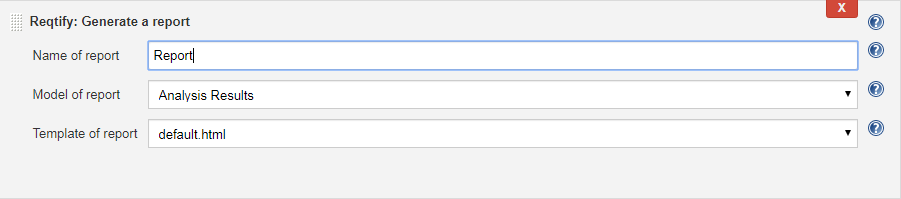

Dassault Systèmes's **Reqtify** is an easy to use interactive
application for managing requirement, traceability and impact analysis
across different systems, programs and project levels across the entire
hardware and software development lifecycle.

This plugin allows to configure Reqtify report generation from Jenkins
and then generate during the build.

[[ReqtifyPlugin-ConfigureReqtifyReportGeneration]]
== Configure Reqtify Report Generation

In the project configuration page, add a **Reqtify: Generate a
report** build step.

https://user-images.githubusercontent.com/37103100/60001844-0332fa00-9685-11e9-97d2-8c941af4f664.JPG[[.confluence-embedded-file-wrapper]#image:https://user-images.githubusercontent.com/37103100/60001844-0332fa00-9685-11e9-97d2-8c941af4f664.JPG[build_step]#]

This allows to fill following fields:

[.confluence-embedded-file-wrapper .confluence-embedded-manual-size]##

* **Name of report** - This is the name of report without any path or
suffix. This report file will be created at the root of the Jenkins
workspace.
* **Model of report** - This is the report model. The list contains both
library and project report models.
* **Template of report** - This is the template of report. The list
contains both library and project report templates.

[[ReqtifyPlugin-Note:]]
== Note:

The plugin will work only when Reqtify project is present in the Jenkins
workspace. 

*Reqtify version required: 2020x*

 +
