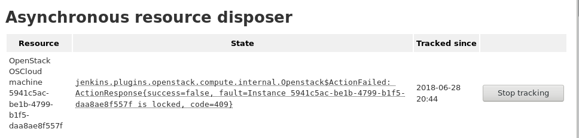

Track resources to be disposed
asynchronously.[.conf-macro .output-inline]##

[cols="",options="header",]
|===
|Plugin Information
|View Resource Disposer https://plugins.jenkins.io/resource-disposer[on
the plugin site] for more information.
|===

[.aui-icon .aui-icon-small .aui-iconfont-info .confluence-information-macro-icon]##

Older versions of this plugin may not be safe to use. Please review the
following warnings before using an older version:

* https://jenkins.io/security/advisory/2018-07-30/#SECURITY-997[CSRF
vulnerability and missing permission checks]

[.confluence-embedded-file-wrapper .image-right-wrapper .confluence-embedded-manual-size]##

Resource Disposer is a utility plugin for other plugins to depend on.
Resources that are no longer needed (VMs to delete, entries in other
systems, etc.) are registered in the plugin that attempts to delete it
repeatedly. Failures to do so will be reported in the form of
administrative monitor and can be examined at
JENKINS_URL/administrativeMonitor/AsyncResourceDisposer/. Such entries
are persisted between restarts and tracked until the plugin that has
contributed them either succeeds in disposing them or they get removed
some other way (ex: Administrator removes them manually). Provided the
problem preventing the disposal persists, instance administrators are
expected to resolve that based on administrative monitor reports.

 

Plugin developer documentation:
https://github.com/jenkinsci/resource-disposer-plugin

 

 
