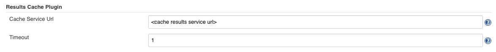
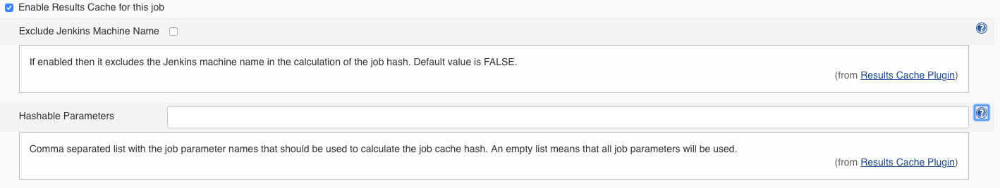

[[ResultsCachePlugin-Features]]
== Features

This plugin allows for avoiding the execution of the same job with the
same parameters more than once in order to save resources and time. +
To identify every job it uses a hash identifier which is composed by the
Jenkins master URL, the full job name (including the folder) and the
selected parameters with their values (selected in the job
configuration). +
It works using a complementary external Cache Service which has to
implement the following REST API:

[[ResultsCachePlugin-CacheServerAPI]]
=== Cache Server API

* GET /job-results/\{hash}: Returns a cached result from its job hash.
Returns 'NOT_BUILT' if the job hash is not found.
* POST /job-results/\{hash}/\{result}: Adds a new result in the cache
for the provided job hash.
* DELETE /job-results/clear: Removes all the cache values.

You can find a reference implementation in
https://github.com/king/results-cache-service[results-cache-service] or
implement it on your own.

[[ResultsCachePlugin-Requirements]]
== Requirements

[[ResultsCachePlugin-Jenkins]]
=== Jenkins

Jenkins https://jenkins.io/changelog#v2.19[version 2.19] or newer is
required.

[[ResultsCachePlugin-Setup]]
== Setup

[[ResultsCachePlugin-Installplugin]]
=== Install plugin

Install this plugin via the Jenkins plugin manager.

[[ResultsCachePlugin-Configureplugin]]
=== Configure plugin

Go to _Manage Jenkins → Configure System_ and set up the URL of the
Cache Service API mentioned above and the communication timeout with
that service.

If this URL is not defined or the connection timeout occurs then the
jobs will be considered as not executed before and they will work as if
no cache was configured for them.

 +

[.confluence-embedded-file-wrapper .confluence-embedded-manual-size]##

[[ResultsCachePlugin-Per-jobconfiguration]]
=== Per-job configuration

[[ResultsCachePlugin-Jobconfiguration]]
==== Job configuration

You can enable a job to cache its result in the Cache Service. To do
that you have to enable the option _Enable Results Cache for this job_
in the Configure page of the job.

The Cache Service will contain the latest result of every job using a
hash value that identifies every execution of the job.

A hash value is calculated using the following data of the job
execution:

* Jenkins master machine name (optional): this value can be excluded
from the hash calculation enabling the option _Exclude Jenkins Machine
Name_.
* Full job name (including the folder)
* Job execution parameter names and values (configurable): you can
specify which parameters names and values will be part of the hash
calculation in the option _Hashable Parameters_ (comma-separated list of
the job parameter names). If this option is left blank then all the job
parameters will be used.

[.confluence-embedded-file-wrapper .confluence-embedded-manual-size]##

[[ResultsCachePlugin-JobDSLconfiguration]]
==== Job DSL configuration

You can enable a job to cache its result in the Cache Service using Job
DSL, as well. You only need to configure it in the `wrappers` section of
your Job DSL.

[source,syntaxhighlighter-pre]
----
resultsCache(boolean excludeMachineName, String hashableProperties)
----

Example:

[source,syntaxhighlighter-pre]
----
wrappers {
    resultsCache(true, 'PARAM_1, PARAM_2')
}
----

[[ResultsCachePlugin-Versionhistory]]
== Version history

[[ResultsCachePlugin-Version1.2.0(May8,2019)]]
=== Version 1.2.0 (May 8, 2019)

* Initial release

[[ResultsCachePlugin-Contactus!]]
== Contact us!

The original King authors of this code:

* Francisco Javier García Orduña (francisco.orduna@king.com)
* David Campos Valls (david.campos@king.com)

With any questions or suggestions feel free to reach out to us an email
anytime!

 +
