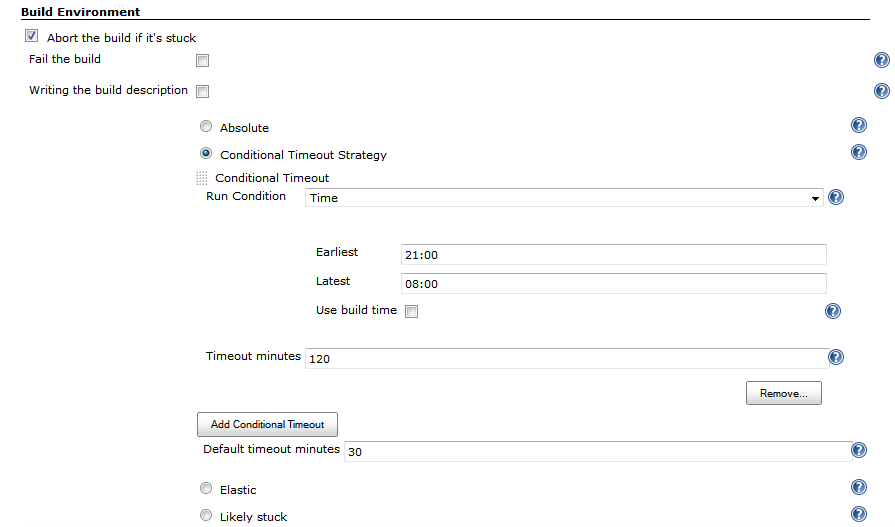

[.conf-macro .output-inline]##

[cols="",options="header",]
|===
|Plugin Information
|View Run Condition Extras
https://plugins.jenkins.io/run-condition-extras[on the plugin site] for
more information.
|===

[.aui-icon .aui-icon-small .aui-iconfont-warning .confluence-information-macro-icon]#
#

*This plugin is up for adoption.* Want to help improve this plugin?
https://wiki.jenkins.io/display/JENKINS/Adopt+a+Plugin[Click here to
learn more]!

 +

 +

 +

This plugin provides additional run conditions and integrations for
https://wiki.jenkins.io/display/JENKINS/Run+Condition+Plugin[Run
Condition Plugin]

[[RunConditionExtrasPlugin-Pagecontents]]
== Page contents

[[RunConditionExtrasPlugin-Contributors]]
=== Contributors

. Members of Jenkins CI community
. hhttp://www.linkedin.com/in/onenashev[Oleg Nenashev] (maintainer)

* Initial plugin version has been sponsored by Synopsys Inc.,
http://www.synopsys.com/[www.synopsys.com]

[[RunConditionExtrasPlugin-Featuressummary]]
=== Features summary

Plugin integrations:

. https://wiki.jenkins.io/display/JENKINS/Email-ext+plugin[Email-ext
plugin]
* Conditional e-mail trigger
. https://wiki.jenkins.io/display/JENKINS/Build-timeout+Plugin[Build-timeout
Plugin]
* Conditional build timeout

[[RunConditionExtrasPlugin-Examples]]
=== Examples

. "Use extended timeouts for nightly runs"

[.confluence-embedded-file-wrapper]##

[[RunConditionExtrasPlugin-Versionhistory]]
=== Version history

[[RunConditionExtrasPlugin-Version0.2(05/04/2015)]]
==== Version 0.2 (05/04/2015)

* image:docs/images/error.svg[(error)]
Classloading warnings in Jenkins logs during the startup
(https://issues.jenkins-ci.org/browse/JENKINS-28150[JENKINS-28150])
* image:docs/images/error.svg[(error)]
"Run condition trigger" for Email-ext does not retain "Send To"
information on Save/Apply
(https://issues.jenkins-ci.org/browse/JENKINS-26005[JENKINS-26005])

[[RunConditionExtrasPlugin-Version0.1(01/18/2014)]]
==== Version 0.1 (01/18/2014)

* Conditional e-mail trigger for
https://wiki.jenkins.io/display/JENKINS/Email-ext+plugin[Email-ext
plugin]
* Conditional build timeout for
https://wiki.jenkins.io/display/JENKINS/Build-timeout+Plugin[Build-timeout
Plugin]
