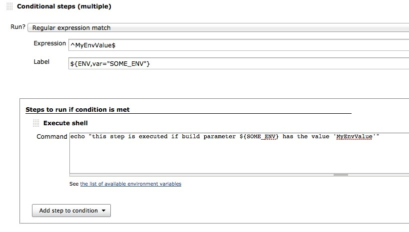
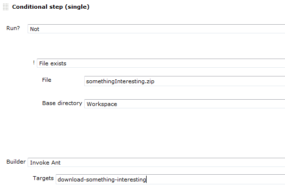
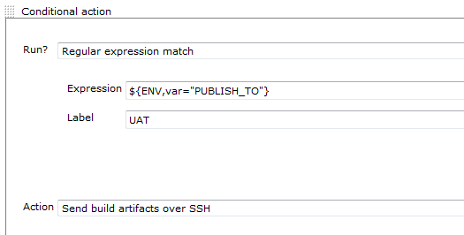
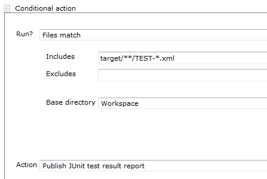
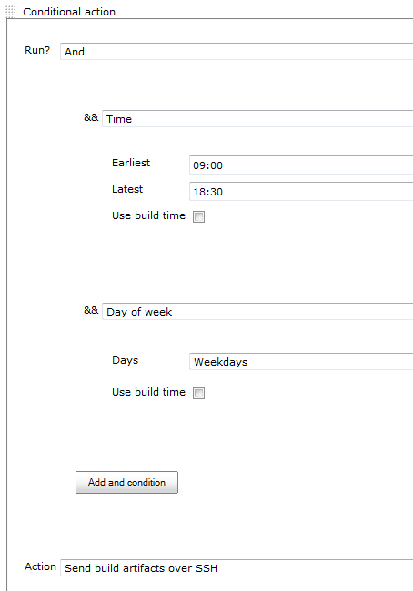

 +

[[RunConditionPlugin-Features]]
== Features

This plugin defines an ExtensionPoint that can be used by plugins to
define new Run Conditions and to use Run Conditions to decide whether to
run a build step.

This plugin defines a few core Run Conditions:

* Always / Never +
The always and Never conditions can be used to disable a build step from
the job configuration without losing the current configuration for that
build step
* Boolean condition +
Run the step if a token expands to a representation of true (or the
string "run")
* Current status +
Run the build step if the current build status is within the configured
range
* File exists / Files match +
Run the step if a file exists, or at least one file matches a pattern.
* Strings match +
Run if the two strings are the same
* Numerical comparison +
Run the build step depending on the result of comparing two numbers.
Very useful with the
https://wiki.jenkins-ci.org/display/JENKINS/Static+Code+Analysis+Plug-ins#StaticCodeAnalysisPlug-ins-tokens[tokens]
provided by the
https://wiki.jenkins-ci.org/display/JENKINS/Static+Code+Analysis+Plug-ins[Static
Code Analysis Plug-ins]
* Regular expression match +
Provide a regular expression and a label. The build step will run if the
expression matches the label. Both the expression and the label are
expanded with the
https://wiki.jenkins-ci.org/display/JENKINS/Token+Macro+Plugin[Token
Macro Plugin] enabling a dynamic (parameterized) regex, label or both.
* Time / Day of week +
Only run during a specified period of the day, or day of the week.
* And / Or / Not +
Logical operations to enable the combining and sense inversion of Run
Conditions
* Build Cause +
Run the build step depending on the cause of the build e.g. triggered by
timer, user, scm-change,...
* Script Condition +
Use shell script to decide whether a step should be skipped
* Windows Batch Condition +
Use windows batch to decide whether a step should be skipped 

[[RunConditionPlugin-RunConditionsarecurrentlyusedinthefollowingplugins]]
=== Run Conditions are currently used in the following plugins

* {blank}
+
[.icon .aui-icon .content-type-page]#Page:#
+
https://wiki.jenkins-ci.org/display/JENKINS/Build+Keeper+Plugin[Build
Keeper Plugin] [.smalltext]#— #

Select a policy for automatically marking builds as "keep forever" to
enable long term analysis trending when discarding old builds - or use
to protect logs and artifacts from certain builds
* {blank}
+
[.icon .aui-icon .content-type-page]#Page:#
+
https://wiki.jenkins-ci.org/display/JENKINS/Conditional+BuildStep+Plugin[Conditional
BuildStep Plugin] [.smalltext]#— A buildstep wrapping any number of
other buildsteps, controlling their execution based on a defined
condition.#
* {blank}
+
[.icon .aui-icon .content-type-page]#Page:#
+
https://wiki.jenkins-ci.org/display/JENKINS/Run+Condition+Extras+Plugin[Run
Condition Extras Plugin] [.smalltext]#— #

This plugin provides additional run conditions and integrations for
https://wiki.jenkins-ci.org/display/JENKINS/Run+Condition+Plugin[Run
Condition Plugin]

[[RunConditionPlugin-Install]]
== Install

This plugin is used by other plugins and will be installed automatically
when one of those is installed from the Update Center.

To install manually, download the latest plugin from
http://mirrors.jenkins-ci.org/plugins/run-condition/ and use the Upload
Plugin option in the Advanced tab of the Plugin Manager. +
If you do install manually, you will need to also install the
https://wiki.jenkins-ci.org/display/JENKINS/Token+Macro+Plugin[Token
Macro Plugin] from http://mirrors.jenkins-ci.org/plugins/token-macro/.

[[RunConditionPlugin-Examples]]
== Examples

[[RunConditionPlugin-Example:Controlexecutionbyastringparameter]]
=== Example: Control execution by a string parameter

... this one gets executed if 'SOME_ENV' (any environment variable)
matches the string 'MyEnvValue'. As any build parameter gets exposed as
an environment variable, the value can be controlled by a parameter.

[.confluence-embedded-file-wrapper]##

[[RunConditionPlugin-Example:Runabuildstepifafiledoesnotexist]]
=== Example: Run a build step if a file *does not* exist

Use the logical *Not* condition, and inside, select *File exists*

[.confluence-embedded-file-wrapper]##

[[RunConditionPlugin-Example:Useaparameterisedbuildtoselectwhichpublisherstorun]]
=== Example: Use a parameterised build to select which publishers to run

I.e. Set string parameter on a parameterized build to ^(UAT|DEMO)$ to
run all steps that are labeled with either DEMO or UAT

[.confluence-embedded-file-wrapper]##

[[RunConditionPlugin-Example:Onlypublishjunitreportsifwehavesomeresultfiles]]
=== Example: Only publish junit reports if we have some result files

[.confluence-embedded-file-wrapper]##

[[RunConditionPlugin-Example:Onlysoundthesirensduringworkhours]]
=== Example: Only sound the sirens during work hours

Add an *And* condition and then add *Time* and *Day of week* conditions
to it

[.confluence-embedded-file-wrapper]##

[[RunConditionPlugin-CreateanewRunCondition]]
== Create a new Run Condition

This plugin provides an ExtensionPoint which enables other plugins to
provide new Run Conditions to plugins that use them. +
See the wiki page for the
https://wiki.jenkins-ci.org/display/JENKINS/Run+Condition+Example+Plugin[Run
Condition Example Plugin]

[[RunConditionPlugin-Changelog]]
== Change log

[[RunConditionPlugin-1.0(10/5/2013)]]
=== 1.0 (10/5/2013)

* fix https://issues.jenkins-ci.org/browse/JENKINS-14438[JENKINS-14438]
Build cause condition fails on matrix projects
* fix https://issues.jenkins-ci.org/browse/JENKINS-14584[JENKINS-14584]
add more information about what a condition is evaluating (there might
be more conditions which need some more logging)
* implement
https://issues.jenkins-ci.org/browse/JENKINS-19300[JENKINS-19300] Allow
users to run conditional build steps if the build is running on a
specific node

[[RunConditionPlugin-0.10(25/5/2012)]]
=== 0.10 (25/5/2012)

* fix https://issues.jenkins-ci.org/browse/JENKINS-13853[JENKINS-13853]
Conditional step is not being executed by UserCause when Jenkins > 1.427

[[RunConditionPlugin-0.9(1/5/2012)]]
=== 0.9 (1/5/2012)

* new condition: Cause Condition
* new condition: Shell Condition
* new Condition: WindowsBatch Condition

[[RunConditionPlugin-0.7(14/01/2012)]]
=== 0.7 (14/01/2012)

* Fixed
https://issues.jenkins-ci.org/browse/JENKINS-12414[JENKINS-12414]. Now
if no result has been set, the "Current status" is SUCCESS ("Current
build status" run condition)
* https://issues.jenkins-ci.org/browse/JENKINS-12411[JENKINS-12411]
Expand environment and build variables directly wherever tokens can be
used

[[RunConditionPlugin-0.6(15/11/2011)]]
=== 0.6 (15/11/2011)

* Add a Strings match condition to test if two strings are the same
* Add a Time condition to only run during a particular time of the day
* Add a Day of week condition to only run on certain days

[[RunConditionPlugin-0.5(13/11/2011)]]
=== 0.5 (13/11/2011)

* Links in help files open in a new window

[[RunConditionPlugin-0.4(10/11/2011)]]
=== 0.4 (10/11/2011)

* Add File exists and Files match to the core conditions

[[RunConditionPlugin-0.3(09/11/2011)]]
=== 0.3 (09/11/2011)

* Add build step runners that enable the user to choose what happens if
something goes wrong when evaluating a condition +
Problems conditions may have when evaluationg - a regular expression is
not valid, token expansion fails, expanded token expected to be a
number, there is no spoon
* Add Boolean condition to the core run conditions

[[RunConditionPlugin-0.2(08/11/2011)]]
=== 0.2 (08/11/2011)

* Add Numerical comparison to the core run conditions

[[RunConditionPlugin-0.1(07/11/2011)]]
=== 0.1 (07/11/2011)

* Initial release

Questions, Comments, Bugs and Feature Requests

[.aui-icon .aui-icon-small .aui-iconfont-info .confluence-information-macro-icon]#
#

Please post questions or comments about this plugin to the
http://jenkins-ci.org/content/mailing-lists[Jenkins User mailing
list]. +
To report a bug or request an enhancement to this plugin please
http://issues.jenkins-ci.org/browse/JENKINS/component/16129[create a
ticket in JIRA].
