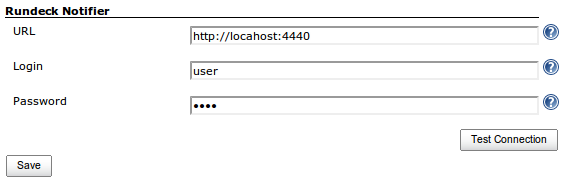
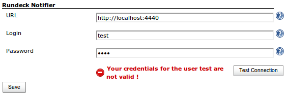
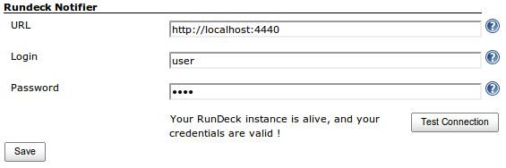
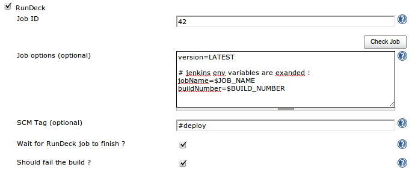
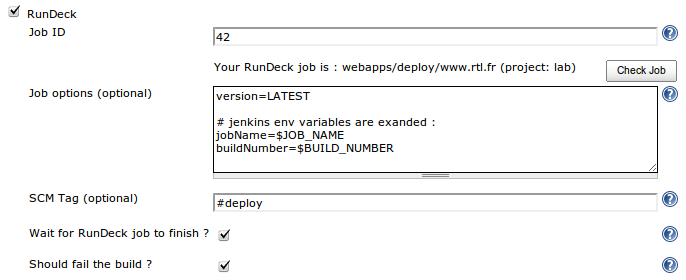
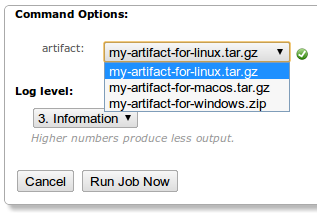
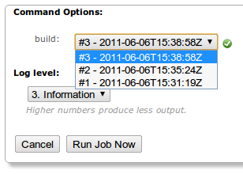

[.conf-macro .output-inline]# #

[.aui-icon .aui-icon-small .aui-iconfont-error .confluence-information-macro-icon]##

The current version of this plugin may not be safe to use. Please review
the following warnings before use:

* https://jenkins.io/security/advisory/2019-10-16/#SECURITY-1460[CSRF
vulnerability and missing permission check]

[.aui-icon .aui-icon-small .aui-iconfont-info .confluence-information-macro-icon]##

Older versions of this plugin may not be safe to use. Please review the
following warnings before using an older version:

* https://jenkins.io/security/advisory/2019-12-17/#SECURITY-1636[Credentials
stored in plain text]

This plugin is a Notifier that will talk to a
http://www.rundeck.org/[RunDeck] instance (via its HTTP API) to schedule
a job execution on RunDeck after a successful build on Jenkins. +
It is also a Trigger that will schedule a build on Jenkins after a job
execution on RunDeck (using RunDeck WebHook Notification). +
In addition, it turns Jenkins into an
http://rundeck.org/docs/RunDeck-Guide.html#option-model-provider[Option
provider] for RunDeck, if you want to use your Jenkins build artifacts
as an option to a RunDeck job.

[.confluence-embedded-file-wrapper]##

*Table of Contents*

[[RunDeckPlugin-Use]]
== Use

http://www.rundeck.org/[RunDeck] is an open-source tool for automating
tasks on multiple nodes, with both a CLI and a web-based interface. You
can use it to deploy your application to multiple nodes/appserv easily.
It has a concept of jobs and build similar to Jenkins.

You have 3 ways to use this plugin :

* build a "*deployment pipeline*", (the "0-click deployment process") :
you commit a change, Jenkins picks it up, build, test and so on, and
then triggers a job execution on RunDeck for deploying your application.
This requires some configuration on Jenkins (both global configuration
and job configuration), to link a Jenkins job with a RunDeck job.
* continue your pipeline after the deployment : RunDeck deploys your
application, then triggers a build on Jenkins to run some integration
tests (Selenium ?). This requires some configuration on RunDeck (WebHook
notification) and on Jenkins (Trigger configuration, and optionally
filter the notifications from RunDeck).
* use Jenkins as an
http://rundeck.org/docs/RunDeck-Guide.html#option-model-provider[*Option
provider*] for RunDeck : when you execute a RunDeck job, you can have an
(input) option, whose values could be retrieve from an external system
(here, Jenkins). So you can have a RunDeck-job that use a
Jenkins-artifact (from a Jenkins-build) as an input.

Note that you can combine those use-cases.

[[RunDeckPlugin-DeploymentPipeline]]
=== Deployment Pipeline

The goal is to have a *0-click deployment process* : you commit a
change, Jenkins picks it up, build, test and so on, and then triggers a
job execution on RunDeck for deploying your application. +
You can also have an "on-demand" process : configure a "tag" in the job
configuration (see below), and the plugin will only notify RunDeck if
the tag is present in the SCM changelog (= in the commit message).

[[RunDeckPlugin-Configuration]]
==== Configuration

First, you need to configure your RunDeck instance on the main Jenkins
configuration page : +
[.confluence-embedded-file-wrapper]##

As of Rundeck plugin version 3.0, you can specify an Authtoken instead
of Login/Password.  Additionally you can set the API version if you need
to use a lower number than the latest version.

You can use the "Test Connection" button to make sure that Jenkins can
talk to your RunDeck instance :

[cols=",",]
|===
|[.confluence-embedded-file-wrapper]##
|[.confluence-embedded-file-wrapper]##

|_Error message in case of error_ |_Success message when your
credentials are valid_
|===

Then, for each Jenkins job, configure the target RunDeck job that should
be executed, along with its options :

[cols=",",]
|===
|[.confluence-embedded-file-wrapper]##
|[.confluence-embedded-file-wrapper]##

|_The per-job configuration screen_ |_If you click_ "Check Job" _it will
display the job details (group, job name and project)_
|===

* Note that the "options" should be expressed in the java-properties
format, and that Jenkins environment variables are expanded when making
the RunDeck API calls (for more details, read the integrated-help in
your Jenkins instance by clicking the "?" icon next to the "options"
field).
* The "tag" field is used to perform "on-demand" job scheduling on
RunDeck : if the value is not empty, we will check if the SCM changelog
(= the commit message) contains the given tag, and only schedule a job
execution if it is present. For example you can set the value to
"#deploy". Note that if this value is left empty, we will ALWAYS
schedule a job execution.
* You can choose to wait for the RunDeck job to finish before finishing
the Jenkins build. Otherwise, the default behavior is to trigger a
RunDeck job, and finish the Jenkins build (usually before the RunDeck
job has ended).
* If the last checkbox is checked, then a failure to schedule the job
execution on RunDeck will fail the Jenkins build. Otherwise, the RunDeck
integration won't interact with the result of your Jenkins build (even
if RunDeck is down).

[[RunDeckPlugin-Post-deploymentjob]]
=== Post-deployment job

The goal is to continue the deployment pipeline after a successful
deployment : RunDeck deploys your application, and triggers a build on
Jenkins to run some integration tests (using Selenium for example).

[[RunDeckPlugin-Configuration.1]]
==== Configuration

First, you need to configure the
http://rundeck.org/docs/RunDeck-Guide.html#webhooks[WebHook
Notification] in your RunDeck jobs. Set it to the url
http://jenkins_host/plugin/rundeck/webhook/[http://JENKINS_HOST/plugin/rundeck/webhook/].

Then, configure the "RunDeck Trigger" on your Jenkins jobs : activate
it, and optionally filter the notifications from RunDeck.

[[RunDeckPlugin-Use.1]]
==== Use

If your Jenkins job is started by a RunDeck notification, you can access
the data of the RunDeck notification as environment variables :

* *RDECK_JOB_ID* : the ID (UUID) of the job
* *RDECK_JOB_NAME* : the name of the job
* *RDECK_JOB_GROUP* : the group of the job
* *RDECK_JOB_DESCRIPTION* : the description of the job
* *RDECK_PROJECT* : the name of the project
* *RDECK_EXEC_ID* : the ID of the execution
* *RDECK_EXEC_STATUS* : the status of the execution (one of SUCCEEDED,
FAILED or ABORTED)
* *RDECK_EXEC_STARTED_BY* : the user who started the execution
* *RDECK_EXEC_STARTED_AT* : the date at which the execution started
* *RDECK_EXEC_ENDED_AT* : the date at which the execution ended
* *RDECK_EXEC_ABORTED_BY* : the user who aborted the execution (if the
status is ABORTED)
* *RDECK_EXEC_DURATION_MILLIS* : the duration of the execution, in
milli-seconds
* *RDECK_EXEC_DURATION_SECONDS* : the duration of the execution, in
seconds
* *RDECK_EXEC_DURATION* : the duration of the execution, as a
human-readable string ("3 minutes 34 seconds")
* *RDECK_EXEC_SHORT_DURATION* : the duration of the execution, as a
short human-readable string ("0:03:34.187")
* *RDECK_EXEC_URL* : the url of the execution (on the RunDeck Web GUI)
* *RDECK_EXEC_DESCRIPTION* : the description of the execution
* *RDECK_EXEC_ARG_[NAME]* : the value of a Job option passed to the
execution _(plugin version 3.0 or later)_

[[RunDeckPlugin-OptionProvider]]
=== Option Provider

Using Jenkins as an
http://rundeck.org/docs/RunDeck-Guide.html#option-model-provider[Option
provider] for RunDeck is very easy, because you don't need to configure
anything on the Jenkins side. You just need to point your RunDeck option
"remote url" to one of the following url :

[[RunDeckPlugin-OptionProviderforartifacts]]
==== Option Provider for artifacts

List all artifacts for a given project / build, with a reference to the
absolute url of the artifact. Useful if you have multiple artifacts to
deploy (one per architecture for example). +
Example (RunDeck screen when executing a job with an "artifact" option,
taking its values from Jenkins) : +
[.confluence-embedded-file-wrapper]##

The url :
http://jenkins_host/plugin/rundeck/options/artifact[http://JENKINS_HOST/plugin/rundeck/options/artifact]

* The parameter *project* is mandatory (name of the job)
* The parameter *build* is optional (default value is 'last'). It could
be either a build number, or "last", "lastStable" or "lastSuccessful".
* The parameter *artifactRegex* is optional. It is a java-regex used to
filter the artifacts to return (if empty, all artifacts will be
returned).

Example :
http://JENKINS_HOST/plugin/rundeck/options/artifact?project=my-job&build=lastSuccessful&artifactRegex=.*\.war

[[RunDeckPlugin-OptionProviderforbuilds]]
==== Option Provider for builds

List all builds (versions) for a given project / artifact, with a
reference to the absolute url of the artifact. Useful if you have only 1
main artifact, but want to easily re-deploy an older version of the
artifact. +
Example (RunDeck screen when executing a job with a "build" option,
taking its values from Jenkins) : +
[.confluence-embedded-file-wrapper]##

The url :
http://jenkins_host/plugin/rundeck/options/build[http://JENKINS_HOST/plugin/rundeck/options/build]

* The parameter *project* is mandatory (name of the job)
* Either the parameter *artifact* (exact filename of the artifact) or
*artifactRegex* (java-regex matching the filename of the artifact) is
mandatory
* The parameter *limit* is optional. It should be an integer, and is
used to limit the number of builds (versions) to return.
* The parameters *includeLastStableBuild*, *includeLastSuccessfulBuild*
and *includeLastBuild* are optional booleans. If it is equals to "true",
then we will add an entry for the last / last stable / last successful
build.

Example :
http://jenkins_host/plugin/rundeck/options/build?project=my-job&artifact=my-webapp.war&limit=5&includeLastSuccessfulBuild=true&includeLastStableBuild=true[http://JENKINS_HOST/plugin/rundeck/options/build?project=my-job&artifact=my-webapp.war&limit=5&includeLastSuccessfulBuild=true&includeLastStableBuild=true]

[[RunDeckPlugin-OptionProviderAccess]]
==== Option Provider Access

*Note*: Rundeck will call the url anonymously which means the Jenkins
job should provide access to Discover and Read the job. See Matrix based
security
documentation: https://wiki.jenkins-ci.org/display/JENKINS/Matrix-based+security#Matrix-basedsecurity-Job

[[RunDeckPlugin-CompatibilityMatrix]]
== Compatibility Matrix

This plugin is not compatible with all versions of RunDeck

[width="100%",cols="34%,33%,33%",options="header",]
|===
|Plugin version |RunDeck 1.0 / 1.1 |RunDeck 1.2+
|1.x
|image:docs/images/check.svg[(tick)]
|image:docs/images/help_16.svg[(question)]

|2.x
|image:docs/images/error.svg[(error)]
|image:docs/images/check.svg[(tick)]

|3.x
|image:docs/images/error.svg[(error)] +
|image:docs/images/check.svg[(tick)] +
|===

If you are using Plugin version 3.x and need to access an older Rundeck
server, you can set the API version in the plugin settings.

You can find older versions of the plugin here :
http://maven.jenkins-ci.org/content/repositories/releases/org/jenkins-ci/plugins/rundeck/

[[RunDeckPlugin-FAQ]]
== FAQ

[[RunDeckPlugin-KnownIssues]]
=== Known Issues

* If you have invalid links to RunDeck executions, check your RunDeck
configuration : fix the property "grails.serverURL" in the file
$RDECK_HOME/server/config/rundeck-config.properties.
* With the versions 1.x of the plugin, you can't have RunDeck jobs with
the same groupPath/jobName on multiple projects.
* Remote options getting 400 server error from Jenkins probably mean you
need to grant anonymous access to Discover and Read the Jenkins project

[[RunDeckPlugin-Links]]
== Links

* Sources on github : https://github.com/jenkinsci/rundeck-plugin
* Download binaries (.hpi files) on nexus :
http://maven.jenkins-ci.org/content/repositories/releases/org/jenkins-ci/plugins/rundeck/

[[RunDeckPlugin-ChangeLog]]
== Change Log

[[RunDeckPlugin-Version3.6.1(Jan26,2017)]]
=== Version 3.6.1 (Jan 26, 2017)

* https://issues.jenkins-ci.org/browse/JENKINS-34510[JENKINS-34510]
Improve Jenkins startup time and Rundeck jobs generation with job-dsl
thanks to caching (*please note*: it has to be enabled explicitly in the
global config)
* https://issues.jenkins-ci.org/browse/JENKINS-31423[JENKINS-31423]
Allow build parameters or references to environment variables in 'Job
Identifier' field
* Add Jenkins Pipelines support to Option Provider
* Update RunDeck API Java client library to 13.1

[[RunDeckPlugin-TODOlist]]
=== TODO list

* Internationalization
* Option provider : add integration with the
https://wiki.jenkins-ci.org/display/JENKINS/Promoted+Builds+Plugin[Promoted
Builds Plugin] and/or
https://wiki.jenkins-ci.org/display/JENKINS/Promoted+Builds+Simple+Plugin[Promoted
Builds Simple Plugin] so that we can filter only "promoted" builds.
* Use a drop-down field to select the RunDeck job (list of jobs
retrieved using the API) instead of the basic text field

[[RunDeckPlugin-Previousversions]]
=== Previous versions

[[RunDeckPlugin-Version3.6.0-skipped]]
==== Version 3.6.0 - skipped

[[RunDeckPlugin-Version3.5.4(May19,2016)]]
==== Version 3.5.4 (May 19, 2016)

* New: https://issues.jenkins-ci.org/browse/JENKINS-31150[JENKINS-22851]
Support multiple Rundeck installations: Configure multiple Rundeck
instances (in the global config), and choose the instance to use in the
job configuration
* New: https://issues.jenkins-ci.org/browse/JENKINS-31150[JENKINS-31150]
Support Multiple SCM tags for rundeck notifier
* Fixed:
https://issues.jenkins-ci.org/browse/JENKINS-28697[JENKINS-28697]
Aborted job is marked as SUCCESS if "Wait for Rundeck" is used

[[RunDeckPlugin-Version3.5(Oct20,2015)]]
==== Version 3.5 (Oct 20, 2015)

* Use display name for the build name
* Set the build result to failure when rundeck fails AND
shouldFailTheBuild is set to true. Previously only "marked" the failure;
by changing the status of the build to FAIL, other plugins that might be
called after rundeck will then be able to detect the status, and handle
accordingly.
* Fixed bug where log tailer returned completed even though the job was
still running (output was completed). Now both execCompleted and
completed are validated
* Filtered out RundeckOutputEntries with empty messages
* No longer depend on last mod for sleep timing since behaviour seems to
be not aligned with expectations. Now checking if offset has changed.
* Fixed bug where checkbox wasn't visible in Jenkins
* [https://issues.jenkins-ci.org/browse/JENKINS-28059[JENKINS-28059]]
Validate API version in test connection

[[RunDeckPlugin-Version3.4(Apr16,2015)]]
==== Version 3.4 (Apr 16, 2015)

* Added support to include Rundeck logs in the Jenkins build log
* Support jobs inside folders
* Fix for Exception when using $ARTIFACT_NAME
* Fixed: Badge icons fail is jenkins is not root as "/"
* Changed "RunDeck" text items to the correct "Rundeck"
* Updated the Rundeck client to v12.0 [Fixes
https://issues.jenkins-ci.org/browse/JENKINS-27971[JENKINS-27971] — NPE
with Rundeck v2.4.2]

[[RunDeckPlugin-Version3.2(April15,2014)]]
==== Version 3.2 (April 15, 2014)

* Fixed issue with parsing Job options when option values have hyphens

[[RunDeckPlugin-Version3.1(March29,2014)]]
==== Version 3.1 (March 29, 2014)

* Build the URL using the getRootUrl method, which will use the user
configured root url

[[RunDeckPlugin-Version3.0(January28,2014)]]
==== Version 3.0 (January 28, 2014)

* Update rundeck API client lib to latest (9.3)
* Support Token authentication
* Fix authentication against Rundeck running as a war in Tomcat
* Support RDECK_EXEC_ARG_[NAME] in triggers from Rundeck webhook
notifications
* Update naming ("RunDeck" changed to "Rundeck"), update icon

[[RunDeckPlugin-Version2.11(January4,2012)]]
==== Version 2.11 (January 4, 2012)

* Fix https://issues.jenkins-ci.org/browse/JENKINS-12228[JENKINS-12228]
: allow to filter artifacts returned by the option provider, based on a
java-regex

[[RunDeckPlugin-Version2.10(October12,2011)]]
==== Version 2.10 (October 12, 2011)

* Fix icon path URL - Thanks to https://github.com/joepcds[Joe
Passavanti] for the
https://github.com/vbehar/jenkins-rundeck-plugin/pull/2[patch] !
* Small UI fix : don't display job's ID (in rundeck 1.3+, ID is an UUID,
and it breaks the UI because it is too long)

[[RunDeckPlugin-Version2.9(September18,2011)]]
==== Version 2.9 (September 18, 2011)

* Allow to filter nodes when triggering a rundeck job (using the
"nodeFilters" parameter)

[[RunDeckPlugin-Version2.8(September16,2011)]]
==== Version 2.8 (September 16, 2011)

* Configure RunDeck jobs with either a job ID, or an UUID (rundeck
1.3+), or a "reference". A job reference is expressed in the format
"project:group/job", for example :
"my-project-name:main-group/sub-group/my-job-name", or
"my-project-name:my-job-name" (for a job without a group).

[[RunDeckPlugin-Version2.7(September14,2011)]]
==== Version 2.7 (September 14, 2011)

* Add a build trigger, using RunDeck 1.3
http://rundeck.org/docs/RunDeck-Guide.html#webhooks[WebHook
Notification], so that you can run integration tests with Jenkins after
a RunDeck deployment (alternative to the "Wait for RunDeck job to finish
?" checkbox in the notifier configuration and a post-build action to
schedule another job)
* Upgrade http://vbehar.github.com/rundeck-api-java-client/[RunDeck API
Java client] to version 1.2

[[RunDeckPlugin-Version2.6(September2,2011)]]
==== Version 2.6 (September 2, 2011)

* Add token expansion for $ARTIFACT_NAME\{regex} in options (see
http://groups.google.com/group/rundeck-discuss/browse_thread/thread/94a6833b84fdc10b)

[[RunDeckPlugin-Version2.5(July11,2011)]]
==== Version 2.5 (July 11, 2011)

* Internal refactoring : use the
http://vbehar.github.com/rundeck-api-java-client/[RunDeck API Java
client]
* Never display the RunDeck password in logs (even in case of error)

[[RunDeckPlugin-Version2.4(June28,2011)]]
==== Version 2.4 (June 28, 2011)

* Change Job ID support to use Strings instead of Long, allowing UUIDs
(coming in RunDeck 1.3) - Thanks to https://github.com/gschueler[Greg
Schueler] for the
https://github.com/jenkinsci/rundeck-plugin/pull/1[patch] !

[[RunDeckPlugin-Version2.3.1(June22,2011)]]
==== Version 2.3.1 (June 22, 2011)

* Fix a bug introduced in version 2.3 : NPE related to the new field
(shouldWaitForRundeckJob) in already configured jobs. Workaround is to
re-save job configuration or use version 2.3.1

[[RunDeckPlugin-Version2.3(June21,2011)]]
==== Version 2.3 (June 21, 2011)

* Add an option to wait for the RunDeck job to finish (by polling the
execution every 5 seconds via the RunDeck API)
* Add a validation button on the job configuration screen, to check the
RunDeck job (display job name, group and project)

[[RunDeckPlugin-Version2.2(June17,2011)]]
==== Version 2.2 (June 17, 2011)

* Add SSL support for RunDeck REST API (trust all certificates and
hosts)

[[RunDeckPlugin-Version2.1(June8,2011)]]
==== Version 2.1 (June 8, 2011)

* New feature : display information about the RunDeck job on the page of
a Jenkins job (with a direct link to the RunDeck job details webpage)

[[RunDeckPlugin-Version2.0.1(June8,2011)]]
==== Version 2.0.1 (June 8, 2011)

* Rerelease 2.0 and mark it as incompatible with versions 1.x (jobs
configuration needs to be updated), so that users can see it in the
update-center before updating.

[[RunDeckPlugin-Version2.0(June6,2011)]]
==== Version 2.0 (June 6, 2011)

Compatibility Warning !

[.aui-icon .aui-icon-small .aui-iconfont-warning .confluence-information-macro-icon]#
#

This version won't work with RunDeck 1.0/1.1, and the configuration per
job has changed, you will need to update the configuration for all your
jobs that use this plugin !

* Use the new
http://rundeck.org/docs/RunDeck-Guide.html#rundeck-api[RunDeck 1.2+ HTTP
REST API], and thus is incompatible with RunDeck 1.0 or RunDeck 1.1
* Use "jobId" to reference RunDeck jobs, instead of the
"groupPath/jobName" couple, so you'll need to reconfigure your Jenkins
jobs. We switched to the "jobId" reference because it is unique across
all projects in a RunDeck instance, which is not the case for the
"groupPath/jobName" couple.
* Set required Jenkins version to 1.400

[[RunDeckPlugin-Version1.8(June5,2011)]]
==== Version 1.8 (June 5, 2011)

* Fix https://issues.jenkins-ci.org/browse/JENKINS-9876[JENKINS-9876] :
password field in system configuration should be hidden.

[[RunDeckPlugin-Version1.7(June1,2011)]]
==== Version 1.7 (June 1, 2011)

* New improvement to the option provider : you can now match artifacts
with a java-regex in addition to exact-match of the artifact filename
(see the new 'artifactRegex' parameter).

[[RunDeckPlugin-Version1.6(April6,2011)]]
==== Version 1.6 (April 6, 2011)

* Fix a bug with RunDeck 1.2 : scheduling a job with options did not
work on RunDeck 1.2.
* Set required Jenkins version to 1.399
(http://groups.google.com/group/jenkinsci-dev/msg/26408e6401dd6ee0[See
the thread on the jenkinsci-dev mailing-list]).

[[RunDeckPlugin-Version1.5.1(March24,2011)]]
==== Version 1.5.1 (March 24, 2011)

* Rerelease 1.5 to properly set required Jenkins version
(http://groups.google.com/group/jenkinsci-dev/msg/26408e6401dd6ee0[See
the thread on the jenkinsci-dev mailing-list]) : the plugin now depends
on Jenkins 1.398 (or higher).

[[RunDeckPlugin-Version1.5(March4,2011)]]
==== Version 1.5 (March 4, 2011)

* Fix bug : when using a "tag" to auto-deploy, we should also check the
SCM changelog from upstream builds. So that you can commit to an
upstream job, and have all downstream jobs redeployed.

[[RunDeckPlugin-Version1.4(March1,2011)]]
==== Version 1.4 (March 1, 2011)

* New improvement to the option provider : in addition to the list of
artifacts for a given build, you can now get the list of builds
(versions) for a given artifact.

[[RunDeckPlugin-Version1.3(February27,2011)]]
==== Version 1.3 (February 27, 2011)

* Jenkins can now be used as an
"http://rundeck.org/docs/RunDeck-Guide.html#option-model-provider[Option
provider]" for RunDeck, if you want to use your Jenkins build artifacts
as an option to a RunDeck job.

[[RunDeckPlugin-Version1.2(February27,2011)]]
==== Version 1.2 (February 27, 2011)

* Jenkins environment variables specified in the "options" are now
correctly expanded
(https://github.com/vbehar/jenkins-rundeck-plugin/issues/1[GitHub
issue])

[[RunDeckPlugin-Version1.1(February11,2011)]]
==== Version 1.1 (February 11, 2011)

* Do nothing if the build is failing
* Add a link to the RunDeck job execution page (on each Jenkins
successful build)
* Validation on the form fields (test if RunDeck is alive, test
credentials, etc)

[[RunDeckPlugin-Version1.0(February10,2011)]]
==== Version 1.0 (February 10, 2011)

* Initial release
* Compatible (and tested) with Jenkins 1.396 and RunDeck 1.1
