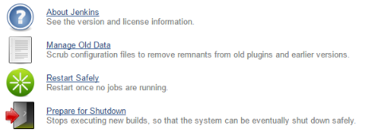

This plugin allows you to restart Jenkins safely.

 This plugin allows you to restart Jenkins safely: it's waiting that all
builds in progress finished before launching restart.

[[SafeRestartPlugin-Sidepanel]]
== Side panel

 +
[.confluence-embedded-file-wrapper]## +

[[SafeRestartPlugin-ManageJenkinspage]]
=== Manage Jenkins page

 +
[.confluence-embedded-file-wrapper]## +

[[SafeRestartPlugin-ChangeLog]]
== Change Log

[[SafeRestartPlugin-Version0.3(Apr.22,2013)]]
=== Version 0.3 (Apr. 22, 2013)

* Provide a better image
(https://issues.jenkins-ci.org/browse/JENKINS-12574[JENKINS-12574]).

[[SafeRestartPlugin-Version0.2(Sep.8,2011)]]
=== Version 0.2 (Sep. 8, 2011)

* updated for Jenkins 1.421
* lots of restructure, but brought back into the standards
* fixing safe restart exception when safe restart is not a valid option

[[SafeRestartPlugin-Version0.1(Oct.18,2010)]]
=== Version 0.1 (Oct. 18, 2010)

* Initial release.
