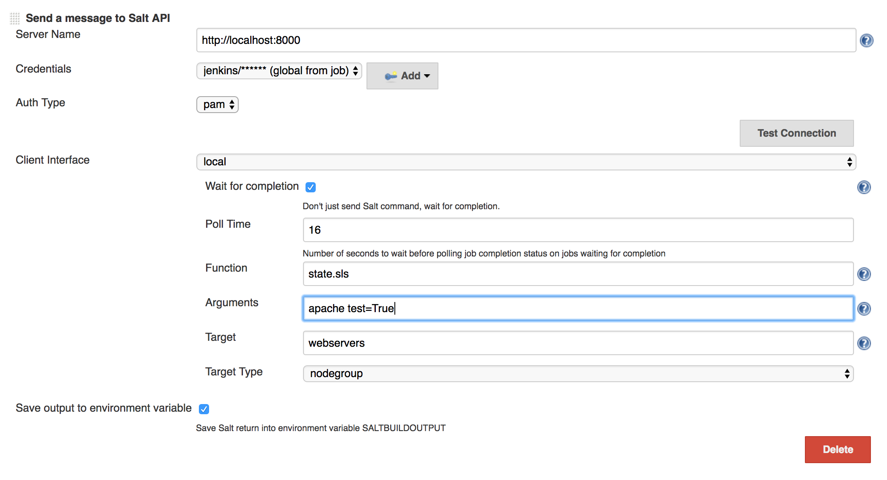
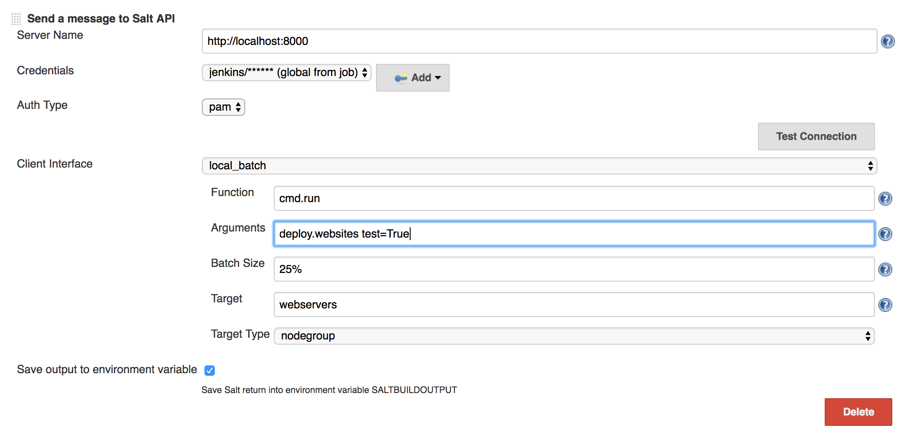
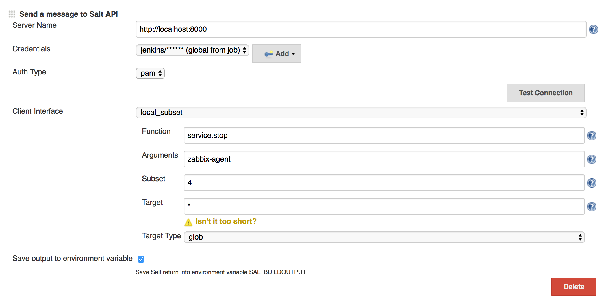
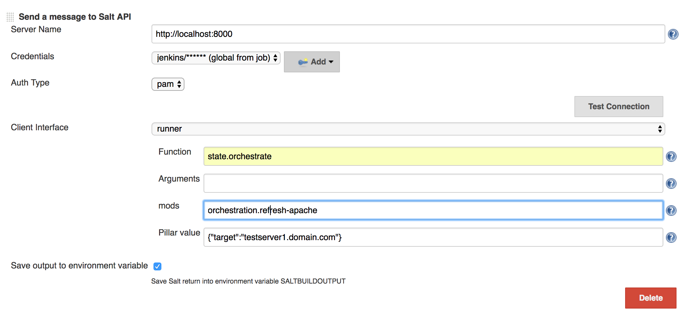
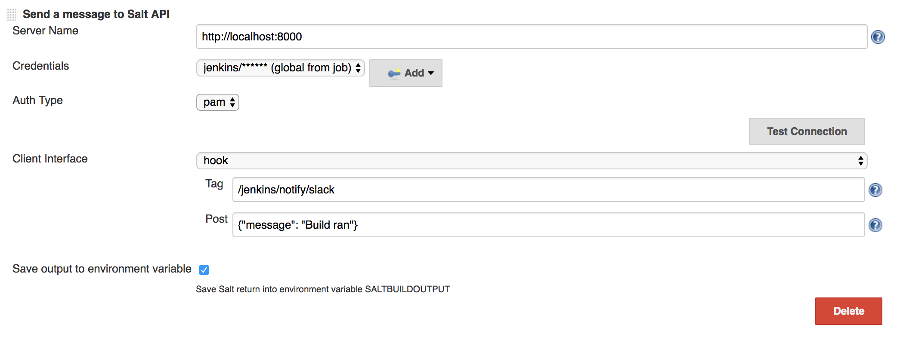
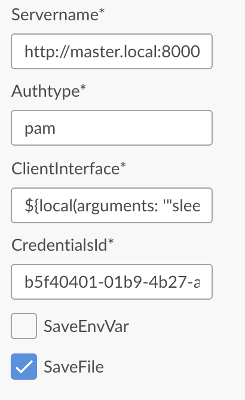

[.conf-macro .output-inline]# #

[.aui-icon .aui-icon-small .aui-iconfont-info .confluence-information-macro-icon]##

Older versions of this plugin may not be safe to use. Please review the
following warnings before using an older version:

* https://jenkins.io/security/advisory/2018-07-30/#SECURITY-1009[CSRF
vulnerability and missing permission checks allowed capturing
credentials]

This plugin sends a SaltStack API message as a build step

[[saltstack-plugin-Basicusage]]
== Basic usage

[[saltstack-plugin-Components]]
=== Components

Installing this plugin contributes following:

* *Send a message to Salt API* - Build step

There are a few options for how to run a salt job:

[[saltstack-plugin-local]]
==== local

This is the standard way to run a salt command. If command returns
quickly, the results will be returned. Otherwise, if the command is long
running, jenkins will not wait. +
If you wish to have jenkins wait for a long running command to finish,
check the "Wait for completion" checkbox.

....
Salt syntax: "salt -N nodegroup webservers state.sls apache test=True"
....

[.confluence-embedded-file-wrapper .confluence-embedded-manual-size]##

[[saltstack-plugin-local_batch]]
==== local_batch

Similar to the local operation, but allows for only running the command
on a few minions at a time. Jenkins will always wait for all minions to
return before finishing, so long running commands will always block the
build until finished.

....
Salt syntax: "salt -b '25%' -N nodegroup webservers state.sls deploy.websites test=True"
....

[.confluence-embedded-file-wrapper .confluence-embedded-manual-size]##

[[saltstack-plugin-subset]]
==== subset

Also similar to the local operation, but allows for only running the
command on a subset of the target match. Jenkins will always wait for
all minions to return before finishing, so long running commands will
always block the build until finished.

....
Salt syntax: salt --subset=4 '*' service.stop zabbix-agent
....

[.confluence-embedded-file-wrapper .confluence-embedded-manual-size]##

[[saltstack-plugin-runner]]
==== runner

This allows you to run salt-run commands. It was intended to be used to
kick off salt orchestration jobs

....
Salt syntax: salt-run state.orchestrate orchestration.refresh-apache pillar='{"target":testserver1.domain.com}'
....

[.confluence-embedded-file-wrapper .confluence-embedded-manual-size]##

[[saltstack-plugin-hook]]
==== hook

This publishes a message to the salt event bus. Useful for integrating
with reactors from Jenkins

....
Curl syntax: curl -sS localhost:8000/hook/jenkins/notify/slack \
    -H 'Content-type: application/json' \
    -d '{"message": "Build ran"}'
....

[.confluence-embedded-file-wrapper .confluence-embedded-manual-size]##

[[saltstack-plugin-Pipeline]]
=== Pipeline

As of the 2.0 release, Jenkins pipeline is supported

....
import groovy.json.*

node() {
  saltresult = salt authtype: 'pam', clientInterface: local(arguments: '"ls -la"', blockbuild: true,
    function: 'cmd.run', jobPollTime: 16, target: '*', targettype: 'glob'),
    credentialsId: 'a3d814c2-84ed-4752-94a8-271791bb5375', servername: 'http://localhost:8000'
  def prettyJson = JsonOutput.prettyPrint(saltresult)
  println(prettyJson)
}
....

[[saltstack-plugin-DeclarativePipeline]]
=== Declarative Pipeline

Declarative pipelines are supported and function with the blueocean
pipeline editor. As of blueocean 1.3 the pipeline editor does not fully
render the input fields and requires some adjustments.

[[saltstack-plugin-Addastep"SendamessagetotheSaltAPI"]]
==== Add a step "Send a message to the SaltAPI"

[[saltstack-plugin-]]
==== [.confluence-embedded-file-wrapper .confluence-embedded-manual-size]## 

[width="100%",cols="13%,87%",]
|===
|Servername |[.nolink]#http://master.local:8000#

|Authtype |pam

|ClientInterface |$\{local(arguments: '"sleep 3; ls -la"', blockbuild:
true, function: 'cmd.run', jobPollTime: 6, target: '*', targettype:
'glob')}

|CredentialsId |b5f40401-01b9-4b27-a4e8-8ae94bc90250

|Checkboxes |SaveFile
|===

[[saltstack-plugin-Addasecondstep"RunarbitraryPipelinescript"toprintresults]]
==== Add a second step "Run arbitrary Pipeline script" to print results 

....
env.WORKSPACE = pwd()
def output = readFile "${env.WORKSPACE}/saltOutput.json"
echo output
....

 +

All together this will create a declarative pipeline Jenkinsfile that
looks something like:

*JenkinsFile*

[source,syntaxhighlighter-pre]
----
pipeline {
  agent {
    node {
      label 'agent1'
    }
    
  }
  stages {
    stage('saltcommand') {
      steps {
        salt(authtype: 'pam', clientInterface: local(arguments: '"sleep 3; ls -la"', blockbuild: true, function: 'cmd.run', jobPollTime: 6, target: '*', targettype: 'glob'), credentialsId: 'b5f40401-01b9-4b27-a4e8-8ae94bc90250', saveFile: true, servername: 'http://master.local:8000')
        script {
          env.WORKSPACE = pwd()
          def output = readFile "${env.WORKSPACE}/saltOutput.json"
          echo output
        }
        
      }
    }
  }
}
----

[[saltstack-plugin-Configuration]]
===  +
Configuration

[[saltstack-plugin-Jenkins]]
==== Jenkins

Simply fill out the connection details on the build page.

If using the wait for long commands to finish option, then you may want
to adjust either the poll interval or the minion timeout. The default
for both options are set on in the Jenkins configuration page or the
default can be overwritten from on the individual job.

* poll interval - controls how often jenkins will check in with the
saltapi during a long running job. This can be set to something short
(like 5 seconds) if you have a job that completes somewhat quickly. If
you have a job that you know will run for an hour, checking every 5
seconds is a bit too frequent.
* minion timeout - If you have a job that should be run on multiple
minions but only some minions return, the minion timeout will set how
long to wait for the remaining minions to come back before assuming them
offline and marking the build as a failure. This is helpful as without
the timeout, the jenkins salt plugin will wait forever for the possibly
non-existent minions to return.

Allow the user accessing the salt api to have permission to the
necessary salt modules. Also grant access for the @runner returner.

....
external_auth:
  pam:
    jenkins:
      - test.*
      - pkg.*
      - cmd.*
      - state.*
      - '@runner'
....

This jenkins module was written to use SaltStack's
https://salt-api.readthedocs.org/en/latest/ref/netapis/all/saltapi.netapi.rest_cherrypy.html[cherrypy
api] and
https://docs.saltstack.com/en/latest/ref/netapi/all/salt.netapi.rest_tornado.html[tornado] (as
of 3.0.0). You will need to add something like the following to your
salt master's configuration

....
rest_cherrypy:
  port: 8000
  ssl_crt: /etc/pki/tls/certs/localhost.crt
  ssl_key: /etc/pki/tls/certs/localhost.key
  expire_responses: False

rest_timeout: 7200
....

_Note: some long running jobs may require increasing the rest_timeout or
setting the expire_responses options._

You can test if you can access the API with the following command
(changing the user and password to the right values).

....
$ curl -sSk https://<salt-master>:8000/login \
     -H 'Accept: application/x-yaml' \
     -d username=jenkins \
     -d password=jenkins \
     -d eauth=pam
....

Which would give you something similar to the following output.

....
return:
- eauth: pam
  expire: 1458563520.558709
  perms:
  - .*
  - test.*
  - pkg.*
  - cmd.*
  - state.*
  - '@runner'
  start: 1458520320.558709
  token: 634c66d581806e5e9dacefbdc721cba45b78f63c
  user: jenkins
....

[[saltstack-plugin-LoggingConfiguration]]
=== Logging Configuration

To see what is sent/received from the salt-api create a jenkins logger:

....
Name: salt logs
Logger: com.waytta.saltstack
Log level: ALL
....

To see what http requests are being sent:

....
Name: http
Logger: sun.net.www.protocol.http.HttpURLConnection
log level: ALL
....

_To get any output from http, you may also need to add a default FINEST
Jenkins logger on /jenkins/log/levels_

[[saltstack-plugin-Changelog]]
== Changelog

[[saltstack-plugin-Version3.2.1(December14,2018)]]
=== Version 3.2.1 (December 14, 2018)

* Fix github issue 131: ignore non-boolean "success" keys

[[saltstack-plugin-Version3.2.0(August7,2018)]]
=== Version 3.2.0 (August 7, 2018)

* Add file and auto auth types. Note: As mentioned in
https://docs.saltstack.com/en/latest/ref/auth/all/salt.auth.auto.html[upstream
documentation], auto is only for testing and not to be used in
production!
* Define global configuration option to specify saltapi version used.
This enables:
** Support tgt_type updates from 2017.7
** Add full_return to cmd.* modules
** Validate "success" key if it exists
* Support batch_wait option
* Only pass arg or kwarg when not empty (corrects issues with some
modules such as saltutil.refresh_grains)

[[saltstack-plugin-Version3.1.7(July30,2018)]]
=== Version 3.1.7 (July 30, 2018)

* https://jenkins.io/security/advisory/2018-07-30/#SECURITY-1009[Fix
security issue]

[[saltstack-plugin-Version3.1.6(March16,2018)]]
=== Version 3.1.6 (March 16, 2018)

* Runner mods key will only be passed to salt-api when not empty

[[saltstack-plugin-Version3.1.5(Feb1,2018)]]
=== Version 3.1.5 (Feb 1, 2018)

* Add option to skip validation of salt return

[[saltstack-plugin-Version3.1.4(Jan16,2018)]]
=== Version 3.1.4 (Jan 16, 2018)

* Fix for JEP-200

[[saltstack-plugin-Version3.1.3(Oct14,2017)]]
=== Version 3.1.3 (Oct 14, 2017)

* Increase timeout for saltapi response, which improves detection of
large results
* Better error message when minion target matches no minions

[[saltstack-plugin-Version3.1.2(Aug20,2017)]]
=== Version 3.1.2 (Aug 20, 2017)

* Don't force = inside of quotes to be kwargs

[[saltstack-plugin-Version3.1.1(July24,2017)]]
=== Version 3.1.1 (July 24, 2017)

* Correct an issue with hook pipeline jobs

[[saltstack-plugin-Version3.1.0(June20,2017)]]
=== Version 3.1.0 (June 20, 2017)

* Fix runner jobs with recent SaltAPI
* Correct Jenkins timeout on long running jobs
* Support pre 2.0 job import
** Due to human error, there is a manual step necessary to fully import
pre 2.0 build configs. If the Jenkins migrate old data page at
administrativeMonitor/OldData/manage shows the
error `+ConversionException: Cannot construct com.waytta.clientinterface.BasicClient+` then
delete the `+<clientInterface>*</clientInterface>+` line from the
config. This can be done with: +
`+sed -i'.bak' '/<clientInterface>.*<\/clientInterface>/d' jenkinshome/jobs/jobname/config.xml+`
+
At this point reloading configs should restore the job data.

[[saltstack-plugin-Version3.0.0(April28,2017)]]
=== Version 3.0.0 (April 28, 2017)

* Supports the Tornado SaltAPI
** Version bump due to the changes in the return +
Former Cherrypy results +
+
....
"return": [{
  "minionid": "Results and output"
}]
....
+
Tornado and Cherrypy as of this release
+
....
"Result": {
  "minionid": {
    "return": "Results and output"
  }
}
....
* Support setting a minion timeout that does not fail the build
* Display http errors from SaltAPI rather than showing a parsing problem
* Add ability to save SaltAPI return to a file - useful for large output
or declarative pipeline syntax
* Retry http connections on timeout
* Only raise exceptions on errors, don't mark build as failed. This
allows for try/catch blocks in pipeline

[[saltstack-plugin-Version2.1.0(March30,2017)]]
=== Version 2.1.0 (March 30, 2017)

* Support running from Jenkins agents
* Allow minion timeout to be configured per job

[[saltstack-plugin-Version2.0.1(March11,2017)]]
=== Version 2.0.1 (March 11, 2017)

* Correct issue where build always waits for minion timeout

[[saltstack-plugin-Version2.0.0(Feb11,2017)]]
=== Version 2.0.0 (Feb 11, 2017)

* Support Jenkins pipeline
* Support folder level credentials
* Simplify args and kwargs to single input
* Split on spaces rather than commas in args input to closer match salt
cli syntax
* Salt subset support
* Salt hook support
* Detect minion timeouts in order to fail build
* Allow parameterized batch size

[[saltstack-plugin-Version1.7.1(May6,2016)]]
=== Version 1.7.1 (May 6, 2016)

* Properly handle missing environment variables
* Use jenkins logging to record messages to/from salt-api (see above)

[[saltstack-plugin-Version1.7.0(February29,2016)]]
=== Version 1.7.0 (February 29, 2016)

* Convert from username/password fields to using jenkins credentials
* Detect additional salt failures
* Support saving salt return into SALTBUILDOUTPUT environment variable
* Support JSON pillar data in orchestrate calls

[[saltstack-plugin-Version1.6.1(February1,2016)]]
=== Version 1.6.1 (February 1, 2016)

* Properly detect salt runners that only return a boolean
(fileserver.update)
* Display a proper error message for runners that return a string
(failure of fileserver.update
image:docs/images/wink.svg[(wink)]
)

[[saltstack-plugin-Version1.6.0(January5,2016)]]
=== Version 1.6.0 (January 5, 2016)

* Correct quote handling of arguments and keyword arguments to support
both single and double quotes.
* Add configuration option to output yaml or json to console
* Improve failure detection
* Allow paramoized servername

[[saltstack-plugin-Version1.5.0(July10,2015)]]
=== Version 1.5.0 (July 10, 2015)

* Break out salt kwargs into a separate text input. Resolves issues
detecting args including "=" as kwargs.

[[saltstack-plugin-Version1.4.0(Nov24,2014)]]
=== Version 1.4.0 (Nov 24, 2014)

* Support SaltStack batch jobs
* Reconfigure GUI to support both "local" and "local_batch"
* Support arguments containing python lists

[[saltstack-plugin-Version1.3.0(Nov7,2014)]]
=== Version 1.3.0 (Nov 7, 2014)

* Now use JSON when speaking to SaltAPI instead of URL encoding. This
fixes some issues with kwarg handling.
* Improve error detection

[[saltstack-plugin-Version1.2.1(Oct30,2014)]]
=== Version 1.2.1 (Oct 30, 2014)

* Clean up space detection around argument separator. Fixes problem of
too aggressively removing whitespace in arguments list.

[[saltstack-plugin-Version1.2(Oct4,2014)]]
=== Version 1.2 (Oct 4, 2014)

* Allow comma separated arguments

[[saltstack-plugin-Version1.1(Sep7,2014)]]
=== Version 1.1 (Sep 7, 2014)

* Include blocking support

[[saltstack-plugin-Version1.0(Sep4,2014)]]
=== Version 1.0 (Sep 4, 2014)

* Initial Version
