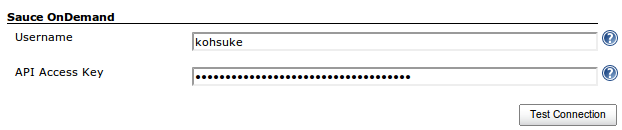
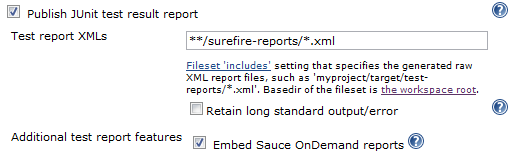

[.conf-macro .output-inline]#This plugin allows you to integrate
https://saucelabs.com/selenium[Sauce Selenium Testing] with Jenkins.#
Specifically, you can:

* Automate the setup and tear down of
http://saucelabs.com/docs/sauce-connect[Sauce Connect]
* Integrate the Sauce Labs result videos per test

[[SauceOnDemandPlugin-Configuration]]
== Configuration

After installing a plugin, specify your Sauce Labs access credentials in
the system configuration page as follows: +
[.confluence-embedded-file-wrapper .image-center-wrapper]##

Once this is set, on each job configuration page, you can tell Jenkins
to launch a Sauce Connect instance for the duration of the build. For
more details about the concept of SSH tunnel in the context of Sauce
Labs, see https://saucelabs.com/products/docs/sauce-ondemand/tunnel[the
documentation].

[[SauceOnDemandPlugin-EmbeddedTestReports]]
=== Embedded Test Reports

You can show an embedded Sauce Labs test report on the
https://wiki.jenkins-ci.org/download/attachments/43714367/sauceondemand-passed-test.png?version=1&modificationDate=1298225690000&api=v2[test
result pages] in Jenkins. To enable this, check 'Embed Sauce OnDemand
reports' as part of the 'Publish JUnit test result report section'.

[.confluence-embedded-file-wrapper]##

In addition, you will need to output the following line to your for each
test that is run using Sauce Labs:

[source,syntaxhighlighter-pre]
----
SauceOnDemandSessionID=YOUR_SESSION_ID job-name=YOUR_JOB_NAME
----

where YOUR_SESSION_ID is the SeleniumRC/WebDriver session id and
YOUR_JOB_NAME is the name of the test being executed.

[[SauceOnDemandPlugin-IssueTracking]]
=== Issue Tracking

Please raise any issues you find with the plugin or requests for
additional features within the plugin's
https://issues.jenkins-ci.org/browse/JENKINS/component/15751[Jira]
instance.

[[SauceOnDemandPlugin-Changelog]]
=== Changelog

See https://github.com/saucelabs/jenkins-sauce-ondemand-plugin/blob/master/CHANGELOG.md
