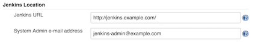
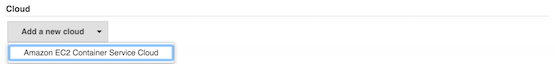
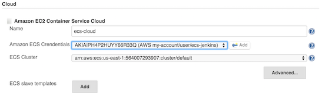
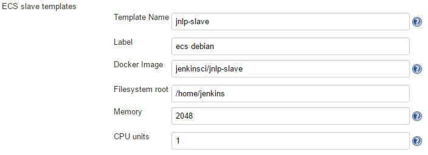
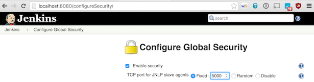
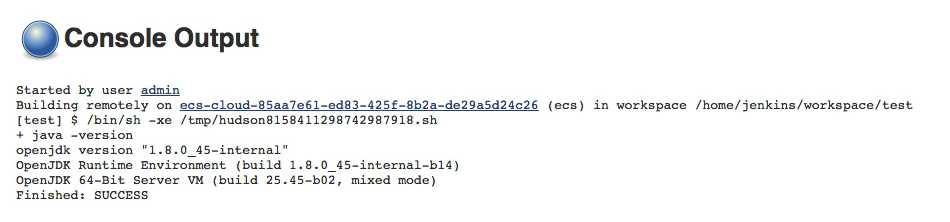

Use Amazon ECS Containers to setup (docker-based) elastic build
executors.

[[AmazonEC2ContainerServicePlugin-About]]
== About

https://aws.amazon.com/ecs/[Amazon EC2 Container Service (ECS)] is AWS'
service for Docker container orchestration letting you deploy Docker
based applications on a cluster.

This plugin lets you use Amazon ECS Container Service to manage Jenkins
cloud agents.

Jenkins delegates to Amazon ECS the execution of the builds on Docker
based agents. +
Each Jenkins build is executed on a dedicated Docker container that is
wiped-out at the end of the build.

The ECS cluster is composed of Amazon EC2 virtual machines instantiated
within the boundaries the user's account (typically in an Amazon VPC).
These virtual machines can be declared statically or can be managed
dynamically by AWS ECS thanks to AWS Auto Scaling and AWS
CloudFormation. 

Jenkins agents are connected to the Jenkins master using the JNLP
protocol.

[[AmazonEC2ContainerServicePlugin-Requirements]]
== Requirements

* Jenkins version 1.609 or later
* AWS account with permissions to create an ECS cluster

[[AmazonEC2ContainerServicePlugin-Installation]]
== Installation

Navigate to the "Plugin Manager" screen, install the "Amazon EC2
Container Service" plugin and restart Jenkins.

[.confluence-embedded-file-wrapper]#image:docs/images/01-plugin-install.png[image]#

[[AmazonEC2ContainerServicePlugin-Configuration]]
== Configuration

[[AmazonEC2ContainerServicePlugin-AmazonECScluster]]
=== Amazon ECS cluster

As a pre-requisite, you must have created an Amazon ECS cluster with
associated ECS instances. These instances can be statically associated
with the ECS cluster or can be dynamically created with Amazon Auto
Scaling.

The Jenkins Amazon EC2 Container Service plugin will use this ECS
cluster and will create automatically the required Task Definition.

[[AmazonEC2ContainerServicePlugin-JenkinsSystemConfiguration]]
=== Jenkins System Configuration

Navigate to the "Configure System" screen.

In the "Jenkins Location" section, ensure that the "Jenkins URL" is
reachable from the the container instances of the Amazon ECS cluster.
See the section "Network and firewalls" for more details.

[.confluence-embedded-file-wrapper]##

[.aui-icon .aui-icon-small .aui-iconfont-info .confluence-information-macro-icon]#
#

If the global Jenkins URL configuration does not fit your needs (e.g. if
your ECS agents must reach Jenkins through some kind of tunnel) you can
also override the Jenkins URL in the
https://wiki.jenkins-ci.org/display/JENKINS/Amazon+EC2+Container+Service+Plugin#AmazonEC2ContainerServicePlugin-advancedconfig[Advanced
Configuration] of the ECS cloud.

At the bottom of the screen, click on "Add a new Cloud" and select
"Amazon EC2 Container Service Cloud".

[.confluence-embedded-file-wrapper]##

[[AmazonEC2ContainerServicePlugin-AmazonEC2ContainerServiceCloud]]
==== Amazon EC2 Container Service Cloud

Then enter the configuration details of the Amazon EC2 Container Service
Cloud:

* Name: name for your ECS cloud (e.g. `ecs-cloud`)
* Amazon ECS Credentials: Amazon IAM Access Key with privileges to
create Task Definitions and Tasks on the desired ECS cluster
* ECS Cluster: desired ECS cluster on which Jenkins will send builds as
ECS tasks
* ECS Template: click on "Add" to create the desired ECS template or
templates

[#AmazonEC2ContainerServicePlugin-advancedconfig .confluence-anchor-link .conf-macro .output-inline]#
# +
Advanced Configuration

* Tunnel connection through: tunnelling options (when Jenkins runs
behind a load balancer...).
* Alternative Jenkins URL: The URL used as the Jenkins URL within the
ECS containers of the configured cloud. Can be used to override the
default Jenkins URL from global configuration if needed. 

[.confluence-embedded-file-wrapper]##

[[AmazonEC2ContainerServicePlugin-ECSAgentTemplates]]
==== ECS Agent Templates

One or several ECS agent templates can be defined for the Amazon EC2
Container Service Cloud. The main reason to create more than one ECS
agent template is to use several Docker image to perform build (e.g.
java-build-tools, php-build-tools...)

* Template name is used (prefixed with the cloud's name) for the task
definition in ECS.
* Label: agent labels used in conjunction with the job level
configuration "Restrict where the project can be run / Label
expression". ECS agent label could identify the Docker image used for
the agent (e.g. `docker` for the
https://hub.docker.com/r/jenkinsci/jnlp-slave/[jenkinsci/jnlp-slave]).
* Docker image: identifier of the Docker image to use to create the
agents
* Filesystem root: working directory used by Jenkins (e.g.
`/home/jenkins/`).
* Memory: number of MiB of memory reserved for the container. If your
container attempts to exceed the memory allocated here, the container is
killed.
* The number of cpu units to reserve for the container. A container
instance has 1,024 cpu units for every CPU core.

*Advanced Configuration*

* Override entrypoint: overwritten Docker image entrypoint. Container
command can't be overriden as it is used to pass jenkins agent
connection parameters.
* JVM arguments: additional arguments for the JVM, such as
`-XX:MaxPermSize` or GC options.

[.confluence-embedded-file-wrapper]##

[[AmazonEC2ContainerServicePlugin-Networkandfirewalls]]
=== Network and firewalls

Running the Jenkins master and the ECS container instances in the same
Amazon VPC and in the same subnet is the simplest setup and default
settings will work out-of-the-box.

[[AmazonEC2ContainerServicePlugin-Firewalls]]
==== Firewalls

If you enable network restrictions between the Jenkins master and the
ECS cluster container instances,

* Fix the TCP listen port for JNLP agents of the Jenkins master (e.g.
`5000`) navigating in the "Manage Jenkins / Configure Global Security"
screen
* Allow TCP traffic from the ECS cluster container instances to the
Jenkins master on the listen port for JNLP agents (see above) and the
HTTP(S) port.

[.confluence-embedded-file-wrapper]##

[[AmazonEC2ContainerServicePlugin-NetworkAddressTranslationandReverseProxies]]
==== Network Address Translation and Reverse Proxies

In case of Network Address Translation rules between the ECS cluster
container instances and the Jenkins master, ensure that the JNLP agents
will use the proper hostname to connect to the Jenkins master doing on
of the following:

* Define the proper hostname of the Jenkins master defining the system
property `hudson.TcpSlaveAgentListener.hostName` in the launch command
* Use the advanced configuration option "Tunnel connection through" in
the configuration of the Jenkins Amazon EC2 Container Service Cloud (see
above).

[[AmazonEC2ContainerServicePlugin-IAMrole]]
=== IAM role

We recommend you create a dedicated amazon IAM role to delegate Jenkins
access to your ECS cluster.

ecs:DescribeTaskDefinition

[cols=",,",options="header",]
|===
|Effect |Action |Resource
|Allow |ecs:ListClusters |*

|Allow |ecs:DescribeContainerInstances |*

|Allow |ecs:RegisterTaskDefinition |*

|Allow |ecs:DeregisterTaskDefinition |*

|Allow |ecs:ListTaskDefinitions |*

|Allow |ecs:DescribeTaskDefinition |*

|Allow |ecs:RunTask
|arn:aws:ecs:<region>:<accountId>:task-definition/<cloud name>-<template
name>:*

|Allow |ecs:StopTask
|arn:aws:ecs:<region>:<accountId>:cluster/<clusterName> +
arn:aws:ecs:<region>:<accountId>:task/*

|Allow |ecs:ListContainerInstances
|arn:aws:ecs:<region>:<accountId>:cluster/<clusterName> 

|Allow |ecs:DescribeTasks |arn:aws:ecs:<region>:<accountId>:task/*
|===

Here is a sample policy file if you prefer using one  :

....
{
    "Version": "2012-10-17",
    "Statement": [
        {
            "Sid": "Stmt1452746887373",
            "Action": [
                "ecs:RegisterTaskDefinition",
                "ecs:DeregisterTaskDefinition",
                "ecs:ListClusters",
                "ecs:DescribeContainerInstances",
                "ecs:ListTaskDefinitions",
                "ecs:DescribeTaskDefinition"
            ],
            "Effect": "Allow",
            "Resource": "*"
        },
        {
            "Sid": "Stmt1452746887374",
            "Action": [
                "ecs:StopTask",
                "ecs:ListContainerInstances"
            ],
            "Effect": "Allow",
            "Resource": "arn:aws:ecs:<region>:<accountId>:cluster/<clusterName>"
        },
        {
            "Sid": "Stmt1452746887375",
            "Action": [
                "ecs:RunTask"
            ],
            "Effect": "Allow",
            "Resource": "arn:aws:ecs:<region>:<accountId>:task-definition/jenkins-agent:*"
        },
        {
            "Sid": "Stmt1452746887376",
            "Action": [
                "ecs:StopTask",
        "ecs:DescribeTasks"
            ],
            "Effect": "Allow",
            "Resource": "arn:aws:ecs:<region>:<accountId>:task/*"
        }
    ]
}
....

[[AmazonEC2ContainerServicePlugin-Usage]]
== Usage

The ECS agents can be used for any job and any type of job (Freestyle
job, Maven job, Workflow job...), you just have to restrict the
execution of the jobs on one of the labels used in the ECS
Agent Template configuration. Sample with a label named `docker`:

[.confluence-embedded-file-wrapper]#image:docs/images/06-0-job-label.png[image]#

In the console output of the executed builds, you can verify that the
build was performed on the ECS cluster checking the agent name that is
composed of the ECS cloud name and of a random identifier. Sample
console output of a build executed on a agent managed by an ECS cloud
named `ecs-cloud`:

[.confluence-embedded-file-wrapper]##

[[AmazonEC2ContainerServicePlugin-DockerImagesforECSAgents]]
== Docker Images for ECS Agents

The Jenkins Amazon EC2 Container Service Cloud can use for the agents
all the Docker image designed to act as a Jenkins JNLP agent. Here is a
list of compatible Docker images:

* https://hub.docker.com/r/jenkinsci/jnlp-slave/[jenkinsci/jnlp-slave]:
Jenkins CI official image to run Docker based JNLP agents
* https://hub.docker.com/r/cloudbees/jnlp-slave-with-java-build-tools/[cloudbees/jnlp-slave-with-java-build-tools]:
a Docker image designed by CloudBees with convenient tools to build java
applications (openjdk8, maven, selenium, firefox, aws-cli...)

You can easily extend one of these images to add tools or you can create
your own Docker image.

[[AmazonEC2ContainerServicePlugin-Resources]]
== Resources

* https://www.youtube.com/watch?v=v0b53cdrujs[Youtube: Jenkins with
Amazon ECS slaves]

[[AmazonEC2ContainerServicePlugin-Versions]]
== Versions

see
https://github.com/jenkinsci/amazon-ecs-plugin/blob/master/Changelog.md[Changelog]
