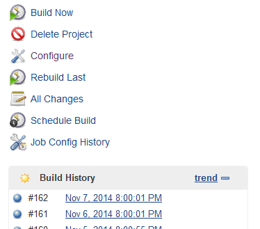
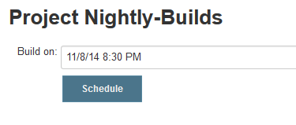
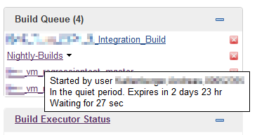
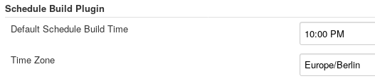

Adds capability to schedule a build for a later point in time. Asks the
user for a date and time and adds the build to the build queue with the
respective quiet period.[.conf-macro .output-inline]##

[cols="",options="header",]
|===
|Plugin Information
|View Schedule Build https://plugins.jenkins.io/schedule-build[on the
plugin site] for more information.
|===

[.aui-icon .aui-icon-small .aui-iconfont-warning .confluence-information-macro-icon]##

*This plugin is up for adoption.* Want to help improve this plugin?
https://wiki.jenkins-ci.org/display/JENKINS/Adopt+a+Plugin[Click here to
learn more]!

[[ScheduleBuildPlugin-SchedulingBuilds]]
== Scheduling Builds

Press the "Schedule Build" link on the project page or use the schedule
build action in the list view.

[.confluence-embedded-file-wrapper]##

[.confluence-embedded-file-wrapper]## +
Then select date and time when to schedule the build.

[.confluence-embedded-file-wrapper]## +
The build will be added to the build queue with the respective quiet
period.

[.confluence-embedded-file-wrapper]##

[[ScheduleBuildPlugin-ConfigureScheduleBuildPlugin]]
== Configure Schedule Build Plugin

The configuration of the schedule build plugin is very simple. There are
only two parameters on the Jenkins system configuration page.

The default time which is set when a user wants to schedule a build may
be configured and time zone used by the plugin, which might differ from
the system time zone.

[.confluence-embedded-file-wrapper .confluence-embedded-manual-size]##

[[ScheduleBuildPlugin-Changelog]]
== Changelog

[[ScheduleBuildPlugin-Version0.5.0]]
=== *Version 0.5.0 +
*

* Add support for scheduling with higher accuracy (thanks
https://github.com/matsuu[matsuu] for the PR)

[[ScheduleBuildPlugin-Version0.4.0]]
=== *Version 0.4.0 +
*

* Add support scheduling pipeline jobs (thanks
https://github.com/neuhausjulian[neuhausjulian] for the PR)
* Add possibility to configure time zone (thanks
https://github.com/ArKniiD[ArKniiD] for the PR)
* Fix 404 issue when running jenkins on non-standard port
https://issues.jenkins-ci.org/browse/JENKINS-42060[JENKINS-42060],
https://issues.jenkins-ci.org/browse/JENKINS-31261[JENKINS-31261]
* Fix https redirect error
https://issues.jenkins-ci.org/browse/JENKINS-38686[JENKINS-38686]
* Fix GET trigger link error
https://issues.jenkins-ci.org/browse/JENKINS-28961[JENKINS-28961]
(thanks https://github.com/phippu[phippu] for the PR) +
 +

 +
