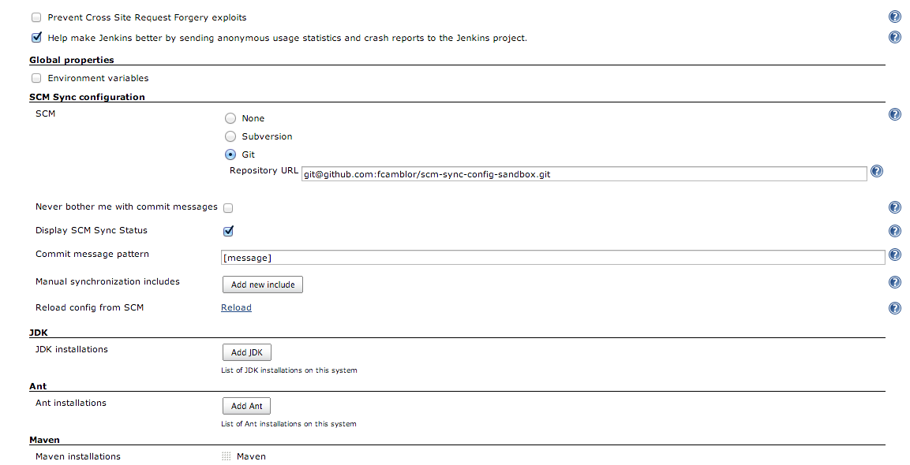
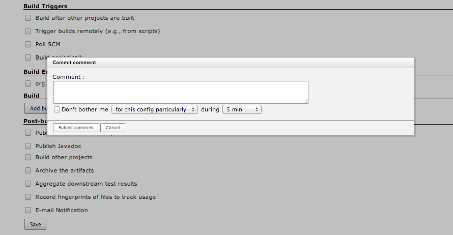
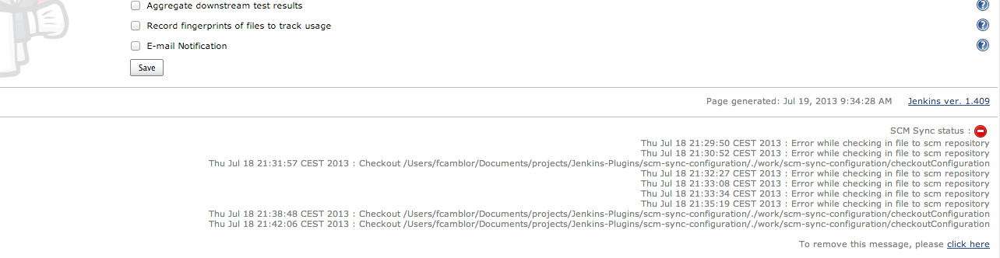

Deprecated: The SCM Sync plugin is deprecated

[.aui-icon .aui-icon-small .aui-iconfont-warning .confluence-information-macro-icon]#
#

* Users of this plugin are encouraged to migrate their jobs to
https://wiki.jenkins-ci.org/display/JENKINS/Pipeline+Plugin[Pipeline
Plugin], so that their jobs will be specified in pipeline code that can
be checked into an SCM, all without using the SCM Sync confguration
plugin.
* Users of this plugin are also encouraged to use the
https://wiki.jenkins-ci.org/display/JENKINS/Configuration+as+Code+Plugin[Configuration
as Code Plugin] to specify the configuration of their Jenkins server in
a file which can be checked into an SCM, all without using the SCM Sync
configuration plugin.

[[SCMSyncconfigurationplugin-Introduction]]
== Introduction

Syncs configuration files to a SCM repository and tracks changes done to
them

SCM Sync Configuration Jenkins/Hudson plugin is aimed at 2 main features
:

* Keep sync'ed your config.xml (and other ressources) jenkins/hudson
files with a SCM repository
* Track changes (and author) made on every file with commit messages

ATTN: https://issues.jenkins-ci.org/browse/JENKINS-32124[JENKINS-32124] details
an issue with the 0.0.9 version causing the UI to appear blank after
Jenkins restart in both Windows and Linux environments.

[[SCMSyncconfigurationplugin-Installation]]
== Installation

To install SCM Sync Configuration Plugin, Go to the "plugin management"
section in the administration Panel. +
Latest released version will be available. Install it from there (you
should need to restart Jenkins/Hudson after that).

To verify that the plugin is well installed, go to the Administration
panel, then in the "System configuration" section : you should notice a
"SCM Sync Configuration" section : +
[.confluence-embedded-file-wrapper]##

[[SCMSyncconfigurationplugin-Usage]]
== Usage

On the System configuration panel (seen above), you'll be prompted for a
SCM type (as of this writing, Subversion or Git) and a repository URL
for your SCM type.

When you'll complete this form section, and validate the form, the SCM
Sync Configuration will compute every configuration file he is able to
synchronize, and commit them, for initialization, on your SCM
repository. +
*Warning* : This first step can take a few minutes !

Once initialized, every time you'll submit a configuration view that can
be sync'ed by the SCM Sync Configuration plugin, you'll be prompted for
a comment that will be put on the commit message on your SCM
Repository. +
[.confluence-embedded-file-wrapper]##

For now, supported configuration files are the following ones :

* Job configuration files (/jobs/*/config.xml)
* Global Jenkins/Hudson system configuration file (/config.xml)
* Basic plugin configuration files (/hudson*.xml,
/scm-sync-configuration.xml)
* User-defined manual includes (see
https://wiki.jenkins-ci.org/display/JENKINS/SCM+Sync+Config+shared+additional+includes[this
dedicated page])

But more default configuration files are planned ! (see the Product
Backlog for further informations)

On every pages, you will have some scm sync config status at the bottom
of the page, saying if something went wrong : +
[.confluence-embedded-file-wrapper]##

Warning

[.aui-icon .aui-icon-small .aui-iconfont-warning .confluence-information-macro-icon]#
#

To use a Git server with SSH, you have to accept the server SSH key
before using the plugin (same for using Git in Jenkins jobs).

[[SCMSyncconfigurationplugin-Troubleshootings]]
== Troubleshootings

A page dedicated to
https://wiki.jenkins-ci.org/display/JENKINS/ScmSyncConfig+Troubleshootings[Scm
Sync Configuration troubleshoots] has been created. Don't hesitate to
participate on it by telling your stories.

[[SCMSyncconfigurationplugin-Whatissynchronized,andwhen]]
== What is synchronized, and when

[cols=",,,",options="header",]
|===
|Constraint |Target Configuration family |Target configuration files
|Modes
|version >= 0.0.1 |Job & children configuration |/job/*/config.xml
|Creation, Update

|version >= 0.0.2 |Jenkins/Hudson System configuration |/config.xml
|Creation, Update

|version >= 0.0.5 |Jenkins configuration files located directly in
JENKINS_HOME |/hudson*.xml |Creation, Update

|version >= 0.0.6 |Manual user-defined includes |Whatever you want
|Creation, Update

|version >= 0.0.7.2 |Users config files |/users/*/config.xml |Creation,
Update
|===

[[SCMSyncconfigurationplugin-Knownissues]]
== Known issues

type

key

summary

[.icon-in-pdf]# # Data cannot be retrieved due to an unexpected error.

http://issues.jenkins-ci.org/secure/IssueNavigator.jspa?reset=true&jqlQuery=project%20=%20JENKINS%20AND%20resolution%20=%20unresolved%20AND%20component%20=%20%27scm-sync-configuration-plugin%27&src=confmacro[View
these issues in Jira]

[[SCMSyncconfigurationplugin-Productbacklog]]
== Product backlog

[width="100%",cols="25%,25%,25%,25%",options="header",]
|===
|When I am... |I should be able to ... |More details ... |Implemented ?
|An administrator |Globally : Provide auth parameters to several SCM
repository +
types : subversion, cvs, git etc... |Jenkins/Hudson configuration files
will be sync'ed with this +
repository |Done !

|An administrator |Globally : Tell what types of configuration files
will be sync'ed : +
job configurations, system configuration, views configurations, +
user profiles |Each configuration type should be represented by +
 a specific strategy |Not yet

|An administrator |Globally : Should decide to initialize SCM repository
with every current configuration files |  |Done !

|An administrator |Globally : Should decide to retrieve (and override)
every sync'ed +
files (on initialization step for example) |  |Coming soon !

|An administrator |Globally : call a REST-like URL allowing to commit
files with a +
comment from outside of Jenkins/Hudson behaviour |For example, when
using groovy scripts which +
modify config files |Not yet !

|An administrator |Globally : Could check a "read-only" field allowing,
for an +
jenkins/hudson instance, to mirror another jenkins/hudson instance
configuration |Read only flag will implies to never commit anything +
(and don't prompt for commit message) but config +
file update will be performed either automatically, or manually |Not yet

|A privileged* user |Per type of sync'ed configuration file : Check if
current file is +
up-to-date with HEAD revision of the file in the SCM repository. |If
not, propose to checkout last revision of the file +
from the SCM repository, and replace the current one! |Coming soon !

|A privileged* user |Per type of sync'ed configuration file : When
submitting form, +
input a commit message saying what sort modifications has +
been done on form |New version of the file will be commited on SCM. +
Current user id & message will be used in the commit +
 message |Done !

|A privileged* user |Per type of sync'ed configuration file : Consult
commit history +
for target configuration file |  |Not yet !
|===

*Privileged user can be, for example, user having access to job
configuration update when job configuration is sync'ed.

[[SCMSyncconfigurationplugin-Releases]]
== Releases

[[SCMSyncconfigurationplugin-0.0.10(August3,2016)]]
=== 0.0.10 (August 3, 2016)

[[SCMSyncconfigurationplugin-Bugfixes]]
==== Bugfixes

* https://issues.apache.org/jira/browse/SCM-772[SCM-772] Improve Git
handling of file paths with spaces

[[SCMSyncconfigurationplugin-0.0.9(December11,2015)]]
=== 0.0.9 (December 11, 2015)

[[SCMSyncconfigurationplugin-Bugfixes.1]]
==== Bugfixes

* https://issues.jenkins-ci.org/browse/JENKINS-13593[JENKINS-13593]
Seems to not handle having builds in separate folder
* https://issues.jenkins-ci.org/browse/JENKINS-15128[JENKINS-15128]
Renaming job doesn't work with git
* https://issues.jenkins-ci.org/browse/JENKINS-16348[JENKINS-16348] Trim
& validate repository URL obtained from user
* https://issues.jenkins-ci.org/browse/JENKINS-16378[JENKINS-16378] All
build logs added and committed when renaming job
* https://issues.jenkins-ci.org/browse/JENKINS-16441[JENKINS-16441] Scm
sync fails completely if folder name starts with a hyphen
* https://issues.jenkins-ci.org/browse/JENKINS-18401[JENKINS-18401]
java.lang.NoClassDefFoundError: hudson/maven/MavenReporter
* https://issues.jenkins-ci.org/browse/JENKINS-19984[JENKINS-19984]
Groovy Postbuild Plugin does not like Jenkins Option: "Build Record Root
Directory"
* https://issues.jenkins-ci.org/browse/JENKINS-22540[JENKINS-22540]
Jenkins config files are not tracked
* https://issues.jenkins-ci.org/browse/JENKINS-22666[JENKINS-22666] No
popup window when committing changes to job config for putting in commit
message
* https://issues.jenkins-ci.org/browse/JENKINS-24686[JENKINS-24686]
scm-sync-configuration fails if job name contains whitespace
* https://issues.jenkins-ci.org/browse/JENKINS-24881[JENKINS-24881]
Rename job starts to sync workspace
* https://issues.jenkins-ci.org/browse/JENKINS-24993[JENKINS-24993]
scm-sync-configration plugin keeps on adding directory structure
scm-sync-configuration/checkoutConfiguration +
Many thanks to https://github.com/tomwolf[tomwolf] who provided all the
fixes in this release.

[[SCMSyncconfigurationplugin-0.0.8(August24,2014)]]
=== 0.0.8 (August 24, 2014)

[[SCMSyncconfigurationplugin-Tasks]]
==== Tasks

* Upgraded to maven scm api 1.9.1 (from 1.6)

[[SCMSyncconfigurationplugin-Bugfixes.2]]
==== Bugfixes

* https://issues.jenkins-ci.org/browse/JENKINS-22820[JENKINS-22820]
(major) Changes are not commited when using a recent git client (>= 1.9)
* https://issues.jenkins-ci.org/browse/JENKINS-15128[JENKINS-15128]
(major) Renaming job doesn't work with Git +
Thanks to Roger Hu who fixed
https://issues.jenkins-ci.org/browse/JENKINS-22820[JENKINS-22820] and
helped to fix
https://issues.jenkins-ci.org/browse/JENKINS-15128[JENKINS-15128] by
upgrading git scm api to 1.9.1.

[[SCMSyncconfigurationplugin-0.0.7.5(July5,2014)]]
=== 0.0.7.5 (July 5, 2014)

[[SCMSyncconfigurationplugin-Bugfixes.3]]
==== Bugfixes

* https://issues.jenkins-ci.org/browse/JENKINS-23036[JENKINS-23036]
(major) : Fix root URL issue on reload link +
Thanks to Kiana Tennyson for her contribution
https://github.com/jenkinsci/scm-sync-configuration-plugin/pull/20[PR
#20]

[[SCMSyncconfigurationplugin-0.0.7.4(February12,2014)]]
=== 0.0.7.4 (February 12, 2014)

[[SCMSyncconfigurationplugin-Improvements]]
==== Improvements

* Cloudbees folders support, thanks to ndeloof for his contribution
https://github.com/jenkinsci/scm-sync-configuration-plugin/pull/19[PR
#19]

[[SCMSyncconfigurationplugin-0.0.7.3(July24,2013)]]
=== 0.0.7.3 (July 24, 2013)

[[SCMSyncconfigurationplugin-Bugfixes.4]]
==== Bugfixes

* https://issues.jenkins-ci.org/browse/JENKINS-18867[JENKINS-18867]
(major) : New link allowing to purge fail logs for
scm-sync-configuration was breaking the page if jquery plugin was pulled
on the instance

[[SCMSyncconfigurationplugin-Improvements.1]]
==== Improvements

* Synchronized users config files

[[SCMSyncconfigurationplugin-0.0.7.2(July20,2013)]]
=== 0.0.7.2 (July 20, 2013)

[[SCMSyncconfigurationplugin-Bugfixes.5]]
==== Bugfixes

* https://issues.jenkins-ci.org/browse/JENKINS-18526[JENKINS-18526]
(major) : Better implementation for
https://issues.jenkins-ci.org/browse/JENKINS-17545[JENKINS-17545],
improving performance (thus, solving
https://issues.jenkins-ci.org/browse/JENKINS-18499[JENKINS-18499] and
https://issues.jenkins-ci.org/browse/JENKINS-18715[JENKINS-18715]) when
syncing files +
Thanks to Jean-Jacques Lafay for his contribution in
https://github.com/jenkinsci/scm-sync-configuration-plugin/pull/15[PR
#15]
* https://issues.jenkins-ci.org/browse/JENKINS-15734[JENKINS-15734]
(critical) : Being more defensive during http request filtering,
avoiding NPE

[[SCMSyncconfigurationplugin-Improvements.2]]
==== Improvements

* Allowing to reset scm sync status failing file, by clicking on an
hyperlink (administrators only) +
Thanks to Joey Jiao for his contribution in
https://github.com/jenkinsci/scm-sync-configuration-plugin/pull/16[PR
#16]

[[SCMSyncconfigurationplugin-0.0.7.1(May24,2013)]]
=== 0.0.7.1 (May 24, 2013)

[[SCMSyncconfigurationplugin-Bugfixes.6]]
==== Bugfixes

* https://issues.jenkins-ci.org/browse/JENKINS-17545[JENKINS-17545]
(critical) : On multimodules jobs, submodules' config.xml were
constantly (on every build) commited on repository, resulting in lots of
noise in commits history, and even
https://twitter.com/aheritier/status/337180792356732929[blacklistings on
github]

[[SCMSyncconfigurationplugin-0.0.7(January25,2013)]]
=== 0.0.7 (January 25, 2013)

_This release should likely have been tagged 0.0.6.2 instead of 0.7.0,
there isn't any big step by upgrading._

[[SCMSyncconfigurationplugin-Bugfixes.7]]
==== Bugfixes

* https://issues.jenkins-ci.org/browse/JENKINS-14893[JENKINS-14893] :
scm sync configuration causes memory leak (thanks mhelff)
* Not nesting RuntimeException into ServletException, fixing spring
security redirection to login page (thanks ndeloof)

[[SCMSyncconfigurationplugin-0.0.6.1(October28,2012)]]
=== 0.0.6.1 (October 28, 2012)

[[SCMSyncconfigurationplugin-Bugfixes.8]]
==== Bugfixes

* https://issues.jenkins-ci.org/browse/JENKINS-14640[JENKINS-14640] :
Create view form was not handled correctly on 1.466 and above
* https://issues.jenkins-ci.org/browse/JENKINS-15266[JENKINS-15266] :
Reducing SCM Sync commits logs to FINEST level (instead of INFO)
* https://issues.jenkins-ci.org/browse/JENKINS-15285[JENKINS-15285] :
Fixed blocking bug on Windows installations where plugin didn't start
correctly

[[SCMSyncconfigurationplugin-0.0.6(September18,2012)]]
=== 0.0.6 (September 18, 2012)

[[SCMSyncconfigurationplugin-Improvements.3]]
==== Improvements

* *User defined files being
committed* (https://issues.jenkins-ci.org/browse/JENKINS-8225[JENKINS-8225]
which implies
https://issues.jenkins-ci.org/browse/JENKINS-14642[JENKINS-14642],
https://issues.jenkins-ci.org/browse/JENKINS-14812[JENKINS-14812],
https://issues.jenkins-ci.org/browse/JENKINS-15018[JENKINS-15018]) :
Now, you can add user-defined custom paths to synchronize on the system
page. Don't hesitate to
https://wiki.jenkins-ci.org/display/JENKINS/SCM+Sync+Config+shared+additionnal+includes[share
yours] on the dedicated page.
* *Commits should be made asynchronously*
(https://issues.jenkins-ci.org/browse/JENKINS-14214[JENKINS-14214] which
implies, I think,
https://issues.jenkins-ci.org/browse/JENKINS-9166[JENKINS-9166] and
https://issues.jenkins-ci.org/browse/JENKINS-10967[JENKINS-10967]) :
now, commiting files is not blocking but postponed into an asynchronous
queue. This will lead in performance improvements on large jenkins
instance + lower the chance to have concurrent modifications on files
(file content to commit is saved).
* *Bulk transactional commit*
(https://issues.jenkins-ci.org/browse/JENKINS-13613[JENKINS-13613]) :
before v0.0.6, 1 file modified = 1 commit. Prior to 0.0.6, if during an
HTTP request, you modify several files, they will all be committed into
a single commit. +
It should greatly improve the commit readability, and lead to atomic
commits. +
Note that "automatic" (ie "non manual") file changes will remain
commited one by one (this is difficult to identify a "system-wide
transaction").
* *Allowing to reload configuration files from SCM* : added an hyperling
on global Jenkins configuration page for doing this
* Commit messages improved
(https://issues.jenkins-ci.org/browse/JENKINS-14568[JENKINS-14568]) :
now, deleted / renamed / updated files are labeled into the commit
"technical part" of the message

[[SCMSyncconfigurationplugin-Bugs]]
==== Bugs

* https://issues.jenkins-ci.org/browse/JENKINS-14582[JENKINS-14582] :
Fix issue when your jenkins webapp has a context path (not the context
root)

[[SCMSyncconfigurationplugin-KnownBugsonthisrelease]]
==== Known Bugs on this release

* If you're using Git, job rename won't work as expected. This is
related to
https://issues.jenkins-ci.org/browse/JENKINS-15128[JENKINS-15128] which
relies on http://jira.codehaus.org/browse/SCM-694[a bug in maven scm
api]. Once the bug will be fixed in maven scm api, I'll align on it and
it will fix the problem in the plugin.
* A regression has been identified
(https://issues.jenkins-ci.org/browse/JENKINS-15221[JENKINS-15221])
concerning the initial check in when jenkins starts. +
In previous version, if some files in jenkins_home were not present in
the scm, these files were added. In 0.0.6 it isn't the case and should
considered as a major regression.

[[SCMSyncconfigurationplugin-0.0.5(April25,2012)]]
=== 0.0.5 (April 25, 2012)

[[SCMSyncconfigurationplugin-Improvements.4]]
==== Improvements

* *Added Git support* – Big thanks to Bertrand Paquet
* *Allowing to display latest synchronization status * (configurable in
jenkins configuration screen) – thanks to Bertrand Paquet
* *Saving every Jenkins configuration files located directly in
JENKINS_HOME* – thanks to Bertrand Paquet
* Allowing to use a repository without credentials – thanks to Bertrand
Paquet
* Added checkbox to disable commit prompt, forever – thanks to Bertrand
Paquet
* Fixed
https://issues.jenkins-ci.org/browse/JENKINS-11817[JENKINS-11817] and
https://issues.jenkins-ci.org/browse/JENKINS-10858[JENKINS-10858] :
Allow to provide a commit message formatter (you will be able to add
prefixes to your commit messages, with issue id for example)
* Fixed
https://issues.jenkins-ci.org/browse/JENKINS-10802[JENKINS-10802] : In
relation to previous bugfix, provide a commit message on initial upload
of config. +
Note that you will have to make a trick to make this work, as I
described in
https://issues.jenkins-ci.org/browse/JENKINS-10802?focusedCommentId=162000&page=com.atlassian.jira.plugin.system.issuetabpanels:comment-tabpanel#comment-162000[this
comment]
* Fixed
https://issues.jenkins-ci.org/browse/JENKINS-11106[JENKINS-11106] :
Automatically set focus to commit message field when prompt appear

[[SCMSyncconfigurationplugin-Tasks.1]]
==== Tasks

* Welcome Bertrand Paquet aboard !
image:docs/images/smile.svg[(smile)]

[[SCMSyncconfigurationplugin-0.0.4(March9,2011)]]
=== 0.0.4 (March 9, 2011)

[[SCMSyncconfigurationplugin-Bugfixes.9]]
==== Bugfixes

* Fixed https://issues.jenkins-ci.org/browse/JENKINS-8453[JENKINS-8453]
: *NPE after updating to 0.0.3 (data migration problem)*
* Fixed https://issues.jenkins-ci.org/browse/JENKINS-8890[JENKINS-8890]
: SCM Sync plugins 0.0.3 throws NPE when called before having been
initialized (for example when using shelve plugin in correlation with
scm-sync-configuration plugin)

[[SCMSyncconfigurationplugin-Improvements.5]]
==== Improvements

* https://issues.jenkins-ci.org/browse/JENKINS-8259[JENKINS-8259] *Added
"don't bother me" checkbox on commit message popup*
* *Added log when credentials have not been entered when trying to
connect to scm*
* *Provided Data migration layer allowing to migrate
scm-sync-configuration.xml data* from 0.0.2 -> 0.0.3 -> 0.0.4 -> ...
* Replaced use of Embedder by DefaultPlexusContainer to ensure
compliance of the plugin with Hudson/Jenkins versions greater than 1.395
(apparition of sisu)
* Replaced "<" and ">" by "[" and "]" (the ones are hidden when used in
log console)

[[SCMSyncconfigurationplugin-Tasks.2]]
==== Tasks

* *Moved sources to Github !*
* *Lots of Unit tests added (especially about data migration between
plugin versions)*
* Refactored unit tests to use Mockito instead of EasyMock

[[SCMSyncconfigurationplugin-0.0.3(January4,2011)]]
=== 0.0.3 (January 4, 2011)

[[SCMSyncconfigurationplugin-Bugfixes.10]]
==== Bugfixes

* https://issues.jenkins-ci.org/browse/JENKINS-8197[JENKINS-8197] *Using
jenkins/hudson SVN credentials to authenticate against subversion server
instead of the ones in your .subversion cache !* +
This is more relevant with the UI, prompting for scm credentials and
storing them in jenkins/hudson credentials.
* https://issues.jenkins-ci.org/browse/JENKINS-7762[JENKINS-7762] Only
/jobs/*/config.xml are commited (instead of /jobs/**/config.xml) – This
fixes some plugin files (example : M2Release plugin files) which were
unintentionally synchronized with scm
* https://issues.jenkins-ci.org/browse/JENKINS-7982[JENKINS-7982] Fixed
NPE around ScmSyncConfigurationPlugin:59

[[SCMSyncconfigurationplugin-Improvements.6]]
==== Improvements

* *Deleting svn hierarchy on job deletion*
* *Renaming svn hierarchy on job renaming*
* Comment message prompted on "configure" job screen .. even if
configuring a job through a view
* *Improved logging*
* https://issues.jenkins-ci.org/browse/JENKINS-8259[JENKINS-8259]
Provided "no synchronisation" radio in system configuration page,
allowing to disable scm synchronisation after having enabled it
* Changed scm-sync-configuration.xml file representation (SCM is no more
an enum type, and become an abstract classes with subclasses) + provided
data migrator from 0.0.2 & 0.0.1 file representations

[[SCMSyncconfigurationplugin-Tasks.3]]
==== Tasks

* Provided plugin description for plugin rss feed
* Provided unit tests harness for testing scm synchronizations (~50%
test coverage) + refactored code to improve testability

[[SCMSyncconfigurationplugin-0.0.2(October15,2010)]]
=== 0.0.2 (October 15, 2010)

[[SCMSyncconfigurationplugin-Bugfixes.11]]
==== Bugfixes

* https://issues.jenkins-ci.org/browse/JENKINS-7241[JENKINS-7241] :
Critical bug: IE8 users wasn't able to submit their configuration form
due to a JS error.

[[SCMSyncconfigurationplugin-Improvements.7]]
==== Improvements

* *Jenkins/Hudson System configuration* is now sync'ed
* scm-sync-configuration v0.0.2 has been tested with IE8, Chrome 5, FF 2
under windows 7
* Added JS exception catching in order to not block the process if a JS
error occurs (because of an incompat with non tested browser)
* Some little refactorings on config files initialization in scm
repository

[[SCMSyncconfigurationplugin-Tasks.4]]
==== Tasks

* Provided name & wiki url to the POM. These information are used on
several pages of jenkins-ci/hudson-ci (especially RSS feeds)

[[SCMSyncconfigurationplugin-0.0.1(October12,2010)]]
=== 0.0.1 (October 12, 2010)

Warning

[.aui-icon .aui-icon-small .aui-iconfont-warning .confluence-information-macro-icon]#
#

This is an alpha release ! Don't use it in production,
http://issues.jenkins-ci.org/browse/JENKINS-7762[especially if you are
using M2Release jenkins/hudson plugin]

[[SCMSyncconfigurationplugin-Improvements.8]]
==== Improvements

* SCM Repository configuration in system panel
* Prompt for commit message each time a Job Configuration is modified

[[SCMSyncconfigurationplugin-Roadmap(futureversions)]]
== Roadmap (future versions)

[[SCMSyncconfigurationplugin-v0.1]]
=== v0.1

* (done) Provide a "commit everything modified with following comment"
button on system page (Will be useful if you want to globally edit your
config files (via a groovy console script for example) and commit
everything with a comment)
* Provide first strategy implementation allowing to backup every of your
job configuration files (when submitting job configuration form) with a
personnal commit message
* Refactor the SCM access layer, dropping usage of maven scm api in
favour to jenkins scm API which will allow credentials sharing

[[SCMSyncconfigurationplugin-v0.2]]
=== v0.2

* Provide up-to-date checker for the first implementation, allowing to
replace current job configuration with a newer one commited on the SCM
* (done) Provide several new strategies to sync various configuration
files : views, system, users related :
https://issues.jenkins-ci.org/browse/JENKINS-8225[JENKINS-8225]
* (done) Allow administrator to select which of configuration type
should be sync'ed (or not)

[[SCMSyncconfigurationplugin-v0.3]]
=== v0.3

* Provide configuration history on each configuration type page
* (done) Provide new SCM connection implementations : cvs, git, others?

[[SCMSyncconfigurationplugin-Currentbugstosolvebeforev0.1]]
=== Current bugs to solve before v0.1

* Replace special linux characters ( " for example) when syncing
* Check if updated repository on system config page is empty and display
a warning if not

[[SCMSyncconfigurationplugin-Greetingstooursponsors]]
== Greetings to our sponsors

I'm a proud user of
http://www.jetbrains.com/idea/[[.confluence-embedded-file-wrapper]#image:http://www.jetbrains.com/idea/opensource/img/all/banners/idea120x30_white.gif[image]#]. +
Feel free to download and test this IDE, it's worth a try !
