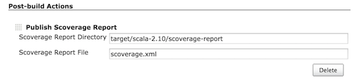
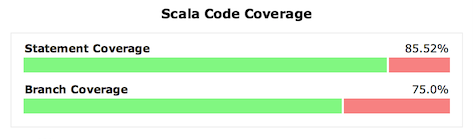

[.conf-macro .output-inline]#This plugin allows you to publish
https://github.com/scoverage[scoverage] results in Jenkins as a trend
graph.#

[[ScoveragePlugin-Configuration]]
== Configuration

[[ScoveragePlugin-Freestyle]]
=== Freestyle

. Enable "Publish Scoverage Report" in Post-build Actions.
. Specify the location where the scoverage.xml report is generated (e.g.
target/scala-2.10/scoverage-report, scoverage.xml).

[.confluence-embedded-file-wrapper]##

[[ScoveragePlugin-Pipeline]]
=== Pipeline

`+step([$class: 'ScoveragePublisher', reportDir: 'target/scala-2.11/scoverage-report', reportFile: 'scoverage.xml'])+`

[[ScoveragePlugin-Example]]
== Example

[.confluence-embedded-file-wrapper]##

[[ScoveragePlugin-Changelog]]
== Changelog

[[ScoveragePlugin-v1.4.0(Dec19,2018)]]
=== v1.4.0 (Dec 19, 2018)

* Fix ScoverageBuildAction for Jenkins 2.150.1+

[[ScoveragePlugin-v1.3.3(July5,2017)]]
=== v1.3.3 (July 5, 2017)

* Fix path regex on Windows.

[[ScoveragePlugin-v1.3.2(Mar10,2017)]]
=== v1.3.2 (Mar 10, 2017)

* Fix HTML table alignment when coverage is close to even 100%.

[[ScoveragePlugin-v1.3.1(Oct3,2016)]]
=== v1.3.1 (Oct 3, 2016)

* Fix path handling on Windows.

[[ScoveragePlugin-v1.3.0(Nov1,2015)]]
=== v1.3.0 (Nov 1, 2015)

* Expose data to list view.
* Jenkins version is updated to 1.609.1.

[[ScoveragePlugin-v1.2.2(Sep24,2015)]]
=== v1.2.2 (Sep 24, 2015)

* Fix duplicate charts.

[[ScoveragePlugin-v1.2.1(Sep6,2015)]]
=== v1.2.1 (Sep 6, 2015)

* Fix remote reports.
* Jenkins version is updated to 1.596.2.

[[ScoveragePlugin-v1.2.0(Jul4,2015)]]
=== v1.2.0 (Jul 4, 2015)

* Support workflow plugin.
* Jenkins version is updated to 1.580.1.

[[ScoveragePlugin-v1.1.2(Apr13,2015)]]
=== v1.1.2 (Apr 13, 2015)

* Add icon to Project and Build page.
* Fix NPE when there's only 1 successful build.
* Expose data to remote access API.

[[ScoveragePlugin-v1.1.1(Jan28,2015)]]
=== v1.1.1 (Jan 28, 2015)

* Make it work on Java 8.

[[ScoveragePlugin-v1.1.0(Jan12,2015)]]
=== v1.1.0 (Jan 12, 2015)

* Support both SBT and Maven.

[[ScoveragePlugin-v1.0.2(Apr29,2014)]]
=== v1.0.2 (Apr 29, 2014)

* Bug fix to copy HTML and XML reports separately, verified with
scoverage 0.98.2.

[[ScoveragePlugin-v1.0.1(Apr04,2014)]]
=== v1.0.1 (Apr 04, 2014)

* Bug fix to support scoverage 0.95.9 and 0.98.0.

[[ScoveragePlugin-v1.0(Mar22,2014)]]
=== v1.0 (Mar 22, 2014)

* Initial release, for scoverage 0.95.7.
