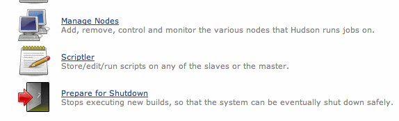
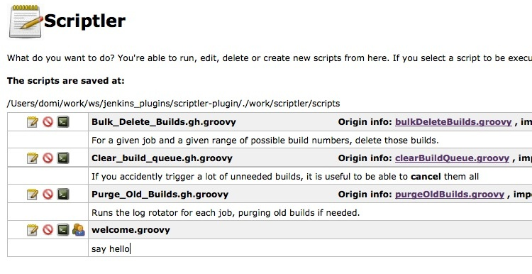
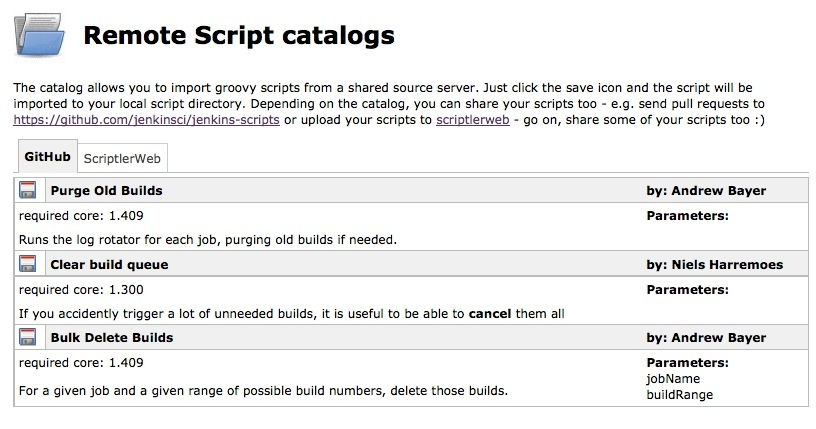
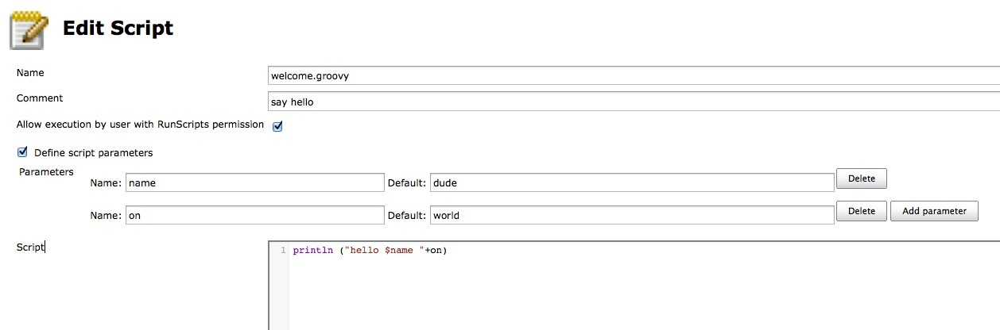
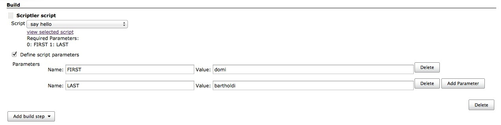
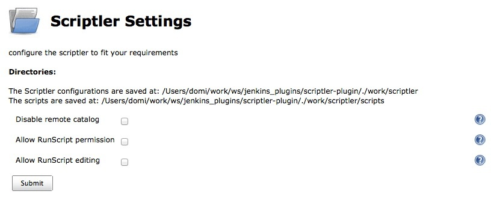

[.conf-macro .output-inline]# #

[.aui-icon .aui-icon-small .aui-iconfont-info .confluence-information-macro-icon]##

Older versions of this plugin may not be safe to use. Please review the
following warnings before using an older version:

* https://jenkins.io/security/advisory/2017-04-10/[Persistent cross-site
scripting vulnerability]
* https://jenkins.io/security/advisory/2017-04-10/[Cross-site request
forgery vulnerabilities in Scriptler script management]
* https://jenkins.io/security/advisory/2017-04-10/[Any user can add
Scriptler scripts to build configurations]
* https://jenkins.io/security/advisory/2017-04-10/[Arbitrary code
execution vulnerability in rare circumstances]
* https://jenkins.io/security/advisory/2017-04-10/[Any Scriptler script
can be executed as part of builds]

Scriptler allows you to store/edit groovy scripts and execute it on any
of the slaves/nodes... no need to copy/paste groovy code anymore.

Besides administering your scripts, Scriptler also provides a way to
share scripts between users via hosted script catalogs on the
internet. +
On GitHub at
https://github.com/jenkinsci/jenkins-scripts/tree/master/scriptler you
are not only able to find scripts and import it via scriptler in to your
Jenkins instance, but can also share your own scripts. Just send a pull
request to https://github.com/jenkinsci/jenkins-scripts/ and your
scripts will be available for everyone else too.

[[ScriptlerPlugin-Description]]
== Description

This plugin takes the idea of the script console one step further and
allows you to ease your daily work with the Jenkins script console.

* save/edit groovy scripts
* select the node to execute the script on
* download scripts from a shared catalog
* scripts repo is exposed via git, push/pull scripts into scriptler

Scriptler adds a new link to the manage Jenkins page:

 
[.confluence-embedded-file-wrapper]##

From within the Scriptlers view, you can create ("Add a new Script") or
import scripts via the "Remote script catalog".

[.confluence-embedded-file-wrapper]##

[[ScriptlerPlugin-Catalogs]]
=== Catalogs

Import a script from a public catalog:

[.confluence-embedded-file-wrapper]##

[[ScriptlerPlugin-Edit]]
=== Edit

The editor is syntax highlighted and allows you to define parameters
which have to be passed to the script...

[.confluence-embedded-file-wrapper]## +
Once you have created/imported some scripts, you run it right from the
same screen, just click on the little terminal icon on the scripts list.

You'll get forwarded to a page where you can select the node the script
should run on and can can even modify the script just before execution.
These modifications will not touch the saved version of the script and
are only active for you and only as long till you change to another
script.

After execution, the output of the command will appear in the below part
of the screen.

[[ScriptlerPlugin-Builder]]
=== Builder

Since version 2.2, Scriptler also provides a builder, with this support
one is able to integrate its admins scripts in any job. The dropdown
will provide all scripts which have been marked to be allowed with
'RunScript' permission.

*To be able to configure a Scriptler Builder, the user has to be
administrator or have 'RunScript' permission!* All changes made by a
user not having these permissions will get lost. The 'Value' also
supports parameter expansion and expansion by the
https://wiki.jenkins-ci.org/display/JENKINS/Token+Macro+Plugin[Token
Macro Plugin] .

[.confluence-embedded-file-wrapper]##

[[ScriptlerPlugin-Settings]]
=== Settings

You are able to configure whether you want to allow users which have
only the "RunScripts" permission to execute scripts (every script has to
be allowed separately). In addition you can also configure if these
users should be able to change a script (which would be a security
issue). +
[.confluence-embedded-file-wrapper]##

[[ScriptlerPlugin-Git]]
=== Git

Scriptler exposes its scripts via git. Browse to
`+JENKINS_URL/scriptler.git+` on your installation to get more info
about how to access the repo via git.

This allows an administrator to push/pull scripts from its
workstation/IDE into Scriptler. If such a script is pushed the first
time into scriptler, then it will parse the optional header info like
this:

*optional script header*

[source,syntaxhighlighter-pre]
----
/*** BEGIN META {
  "name" : "Clear build queue",
  "comment" : "If you accidently trigger a lot of unneeded builds, it is useful to be able to <b>cancel</b> them all",
  "parameters" : [],
  "core": "1.300",
  "authors" : [
    { name : "Niels Harremoes" }
  ]
} END META**/
println("hello world")
----

[[ScriptlerPlugin-TokenMacroSupport]]
=== TokenMacro Support

Scriptler supports the
https://wiki.jenkins-ci.org/display/JENKINS/Token+Macro+Plugin[Token
Macro Plugin] in two ways

. as a consumer, scriptler accepts tokens in the passed arguments (only
if the script is executed as a buildstep)
. as a producer, scriptler exposes all scripts marked as non admin
scripts via a macro: +
- the value returned by the script is the value returned by the
TokenMacro, it is NOT enough to write something to the console/log +
- scriptler exposes the current '_build'_ to the script executed (since
1.7)

*macro*

[source,syntaxhighlighter-pre]
----
${SCRIPTLER, scriptId="superscript.groovy"}
----

*superscript.groovy*

[source,syntaxhighlighter-pre]
----
def d = new Date()
return "TODAY is: ${d.toString()} - build number is: ${build.number}"
----

[[ScriptlerPlugin-REST]]
=== REST

since version 1.7, one can also run a script using GET or POST to the
URL _/scriptler/run/<your-script-id>_ with the optional parameters node,
script (alternative script text), contentType, and the parameters
defined for your stored script.

e.g.

_http://myserver/jenkins/scriptler/run/<yourScriptId>?param1=value1_

[[ScriptlerPlugin-VersionHistory]]
== Version History

[[ScriptlerPlugin-3.0-alpha(Oct.10,2018)]]
=== 3.0-alpha (Oct. 10, 2018)

This release is available via the experimental update
center: https://jenkins.io/doc/developer/publishing/releasing-experimental-updates/

* https://issues.jenkins-ci.org/browse/JENKINS-44242[JENKINS-44242] Persistent
cross-site scripting
* https://issues.jenkins-ci.org/browse/JENKINS-44243[JENKINS-44243]Script
management vulnerable to Cross-Site Request Forgery attacks
* https://issues.jenkins-ci.org/browse/JENKINS-44245[JENKINS-44245] Scriptler
Plugin allows any Scriptler script to be executed as build step +

[[ScriptlerPlugin-2.9(Oct.28,2015)]]
=== 2.9 (Oct. 28, 2015)

* https://issues.jenkins-ci.org/browse/JENKINS-29332[JENKINS-29332] disabled
scritplerweb script catalog
* fix NPE when uploading a script
https://github.com/jenkinsci/scriptler-plugin/pull/22[PR #22]

[[ScriptlerPlugin-2.7(Feb22,2014)]]
=== 2.7 (Feb 22, 2014)

* fixed
https://issues.jenkins-ci.org/browse/JENKINS-19988[JENKINS-19988]
Changes to script parameters in Run Script window affect permanent
definitions
* integrated https://github.com/jenkinsci/scriptler-plugin/pull/17[PR
#17] Pass current build to SCRIPTLER token macro (thanks to Andreas
Gudian)
* integrated https://github.com/jenkinsci/scriptler-plugin/pull/16[PR
#16] Add simple size-limited cache to avoid parsing of unchanged scripts
(thanks to Andreas Gudian)
* integrated https://github.com/jenkinsci/scriptler-plugin/pull/15[PR
#15] https://issues.jenkins-ci.org/browse/JENKINS-14964[JENKINS-14964]
Allow running scripts using the REST API (thanks to Andreas Gudian)

[[ScriptlerPlugin-2.6.1(May19,2013)]]
=== 2.6.1 (May 19, 2013)

* Implement
https://issues.jenkins-ci.org/browse/JENKINS-17708[JENKINS-17708] Expose
scriptler scripts via token macro token

[[ScriptlerPlugin-2.6(May5,2013)]]
=== 2.6 (May 5, 2013)

* fix https://issues.jenkins-ci.org/browse/JENKINS-16047[JENKINS-16047]
Scriptler plugin does not show Error/Exceptions anymore
* fix https://issues.jenkins-ci.org/browse/JENKINS-17259[JENKINS-17259]
don't fail if parameters can't be expanded
* integrate https://github.com/jenkinsci/scriptler-plugin/pull/13[pull
request #13] Expose build, launcher, listener to groovy scripts when run
on the master node
* fix some image/icon references

[[ScriptlerPlugin-2.5.1(Nov20,2012)]]
=== 2.5.1 (Nov 20, 2012)

* fix dependency to git-server plugin - this is a mandatory depedendency
now

[[ScriptlerPlugin-2.5(Nov7,2012)]]
=== 2.5 (Nov 7, 2012)

* implement
https://issues.jenkins-ci.org/browse/JENKINS-15276[JENKINS-15276] Store
Groovy Scripts into a local VCS
* implement
https://issues.jenkins-ci.org/browse/JENKINS-13468[JENKINS-13468] Would
like to create/use a central "catalog" . . . 
* Scriptler now understands the format for shared scripts also when
first time pushed via git into Scriptler (Format description:
https://github.com/jenkinsci/jenkins-scripts/tree/master/scriptler#scriptler-scripts
)
* now depends on the
https://wiki.jenkins-ci.org/display/JENKINS/Git+Server+Plugin[Git Server
Plugin]

[[ScriptlerPlugin-2.4.1(Okt11,2012)]]
=== 2.4.1 (Okt 11, 2012)

* fix issue when Jenkins is running with a different root context -
details of scripts could not be opened

[[ScriptlerPlugin-2.4(Aug31,2012)]]
=== 2.4 (Aug 31, 2012)

* https://github.com/jenkinsci/scriptler-plugin/pull/6[Pull #6] Enable
shortcut key
* https://github.com/jenkinsci/scriptler-plugin/pull/9[Pull #9] Fix
serialization issue and NPE

[[ScriptlerPlugin-2.3(June24,2012)]]
=== 2.3 (June 24, 2012)

* https://github.com/jenkinsci/scriptler-plugin/pull/8[Pull #8] /
https://issues.jenkins-ci.org/browse/JENKINS-13979[JENKINS-13979] allow
build step to fail build by using boolean return values
* allow to propagate job parameters into builder execution

[[ScriptlerPlugin-2.2.1(April27,2012)]]
=== 2.2.1 (April 27, 2012)

* https://issues.jenkins-ci.org/browse/JENKINS-13518[JENKINS-13518]
Wrong JSON syntax

[[ScriptlerPlugin-2.2(Mar.9,2012)]]
=== 2.2 (Mar. 9, 2012)

* add a builder, to enable scheduling of scripts
* add Japanese localization (thanks to ikikko!)
* fix https://issues.jenkins-ci.org/browse/JENKINS-10839[JENKINS-10839]
support HTML output

[[ScriptlerPlugin-2.1(Feb.21,2012)]]
=== 2.1 (Feb. 21, 2012)

* fix https://issues.jenkins-ci.org/browse/JENKINS-12748[JENKINS-12748]
- Scriptler remote catalog breaks when script name contains certain
characters
* fix https://issues.jenkins-ci.org/browse/JENKINS-12750[JENKINS-12750]
- Scriptler 2.0 breaks cc.xml-View for Anonymous User

[[ScriptlerPlugin-2.0(Jan.29,2012)]]
=== 2.0 (Jan. 29, 2012)

* integrate https://github.com/jenkinsci/scriptler-plugin/pull/2[pull
#2]: allow users with permission "RunScripts" to run scripts in
scriptler (thanks to lvotypko)
* integrate https://github.com/jenkinsci/scriptler-plugin/pull/5[pull
#5]: add 'all' and 'all slaves' to the options where to run the script
(thanks to eciramella)
* intergate https://github.com/jenkinsci/scriptler-plugin/pull/1[pull
#1]: ensure links open in new windows (thanks to bap2000)
* enable script sharing with github:
https://github.com/jenkinsci/jenkins-scripts (2. catalog)
* enable passing parameters to scripts
* make it configurable whether users with "RunScript" permission can
change a script before execution

[[ScriptlerPlugin-1.5(April16,2011)]]
=== 1.5 (April 16, 2011)

* fix https://issues.jenkins-ci.org/browse/JENKINS-9302[JENKINS-9302] -
allow to disable remote script download functionality
* fix https://issues.jenkins-ci.org/browse/JENKINS-9130[JENKINS-9130] -
Add a dynamic parser to colorize and indent groovy textareas

[[ScriptlerPlugin-1.4(Okt11,2010)]]
=== 1.4 (Okt 11, 2010)

* enable script sharing with
http://scriptlerweb.appspot.com/[http://scriptlerweb.appspot.com]

[[ScriptlerPlugin-1.2(Sep15,2010)]]
=== 1.2 (Sep 15, 2010)

* fix http://issues.jenkins-ci.org/browse/JENKINS-7424[JENKINS-7424]

[[ScriptlerPlugin-1.0]]
=== 1.0

* Inital (with suport for a static catalog)

[[ScriptlerPlugin-HelpandSupport]]
== Help and Support

type

key

summary

[.icon-in-pdf]# # Data cannot be retrieved due to an unexpected error.

http://issues.jenkins-ci.org/secure/IssueNavigator.jspa?reset=true&jqlQuery=project%20=%20JENKINS%20AND%20status%20in%20%28Open,%20%22In%20Progress%22,%20Reopened%29%20AND%20component%20=%20%27scriptler-plugin%27&src=confmacro[View
these issues in Jira]

For Help and support please use the
http://jenkins-ci.org/content/mailing-lists[Jenkins Users] mailing list.

The comment list below is not monitored.
