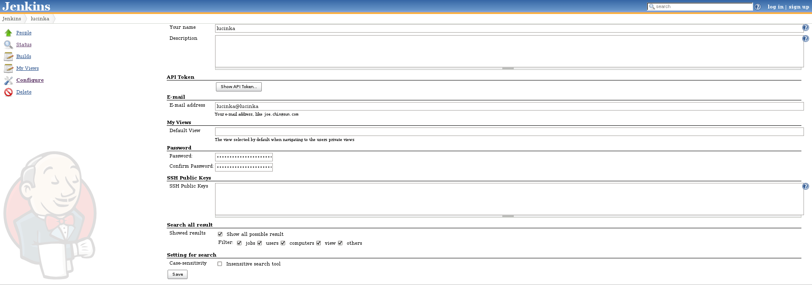

This plugin enables to show all searched results (not only suggestion)
and categorization.

[[Allsearchedresultsplugin-Setting]]
== Setting

It is necessary to set All search result plugin in user configure page.
There can be set filter too.

There are five categorization - jobs, users, computers, views and
others.

[.confluence-embedded-file-wrapper]##

[[Allsearchedresultsplugin-Resultofsearch]]
== Result of search

The results are categorized and filtered by filter in user settings.
This filter can be changed for one search (it do not change general
setting of filter, new filter is used only once).

[.confluence-embedded-file-wrapper]##
