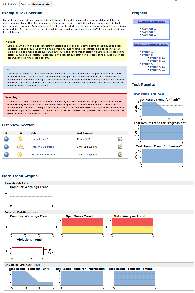
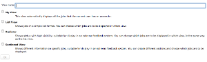
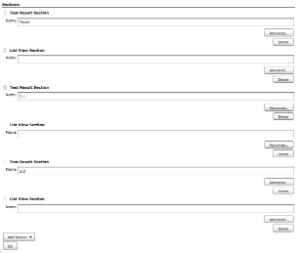
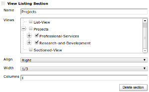
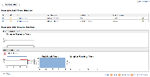

[[SectionedViewPlugin-SectionedViewPlugin]]
== Sectioned View Plugin

 +
This plugin provides a new view implementation that can be divided into
sections. Each section can display different information about the
selected jobs. An extension point is also provided to define new types
of sections. +

Description

Using this plugin you can combine different types of sections to create
a view that is tailored to your needs. Each section can contain
different jobs and can have an optional header.

The sections currently implemented are:

* Test Result Section
* Standard List View Section
* Job Graphs Section (first implementation released in version 1.2)
** currently only supports these trends: Test Result, Compiler Warnings,
Violations
* Text Section (no jobs, just a textbox)
* View Listing Section
** A great way to make a home screen for listing all your different
views
** Supports the
https://wiki.jenkins-ci.org/display/JENKINS/Nested+View+Plugin[Nested
View Plugin] for hierarchical views.

You can add as many different sections as you want to create an overview
of various projects.

For each section you can specify a width (Full, 1/2, 1/3, 2/3) and a
position (Center, Left, Right).

*Example:* +
[.confluence-embedded-file-wrapper]##

[[SectionedViewPlugin-Configuration]]
=== Configuration

After installing the plugin you'll see "Sectioned View" as an option
when creating a new view. +
[.confluence-embedded-file-wrapper]##

When editing the view, you get a new area for creating and organising
your sections. Each section can be further configured by expanding its
"Advanced" area. +
[.confluence-embedded-file-wrapper]##

[[SectionedViewPlugin-ViewListingSectionConfiguration]]
==== View Listing Section Configuration

The View Listing Section type presents a listing of all your views (as
an expandable tree if you're using the
https://wiki.jenkins-ci.org/display/JENKINS/Nested+View+Plugin[Nested
View Plugin]). +
Just check the ones you want to show in the listing. Any checked entries
will be given a box in the listing.

[.confluence-embedded-file-wrapper]##

If you use nested views, then all sub-views of a checked view will be
displayed as a hierarchical unordered list in the box (see the
"Projects" listing in the example pic above).

[[SectionedViewPlugin-Extensions]]
=== Extensions

New section types can be implemented by extending
`+SectionedViewSection+` as shown below.

[source,syntaxhighlighter-pre]
----
public class MyCustomViewSection extends SectionedViewSection {

    @DataBoundConstructor
    public MyCustomViewSection(String name) {
        super(name);
    }

    @Extension
    public static final class DescriptorImpl extends SectionedViewSectionDescriptor {

        @Override
        public String getDisplayName() {
            return "My Custom Section";
        }
    }
}
----

Then you can create a matching jelly include for displaying the jobs in
this section.

[source,syntaxhighlighter-pre]
----
<j:jelly xmlns...>
  <j:if test="${section.name.length() > 0}">
    <h2>${section.name}</h2>
  </j:if>
  <j:if test="${empty(section.items)}">
    
No jobs in this section.

  </j:if>
  <j:forEach var="job" items="${section.items}">
    <!-- Some custom logic for how to display each job -->
  </j:forEach>
</j:jelly>
----

[[SectionedViewPlugin-ToDo]]
=== ToDo

In no particular order:

* Allow configuration of columns in list section (same as in the
standard list view)
** *Done* - available in release 1.5 - *Requires Jenkins 1.329 or
higher*
* Add security matrix for each view (like Project-Based Matrix Security)
- not sure about this one. I think just using the existing project-based
security matrix would be better. The sections just need to respect those
permissions. See the other to-do item on this topic.
* Add a full-screen link to display view without the sidebar.
* Add support for more graph types in the Job Graphs Section
* Jobs should respect project-specific security settings.
** If the logged in user does not have read access to a job it shouldn't
appear in the section
** If no jobs in a section are viewable by the logged in user then the
whole section should not be displayed.
* Allow Text Sections to be easily styled/themed
** *Done* - Simple styling options available since the 1.8 release

[[SectionedViewPlugin-WorkInProgress]]
=== Work In Progress

*Update:* first implementation released in version 1.2

*Job Graphs Section* - a section that presents a mini overview of all
the trend reports for the selected jobs. +
[.confluence-embedded-file-wrapper]##

[[SectionedViewPlugin-Changelog]]
=== Changelog

See the
https://github.com/jenkinsci/sectioned-view-plugin/blob/master/CHANGELOG.md[CHANGELOG]
in the source repository.
