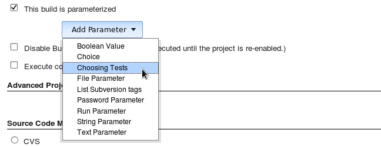
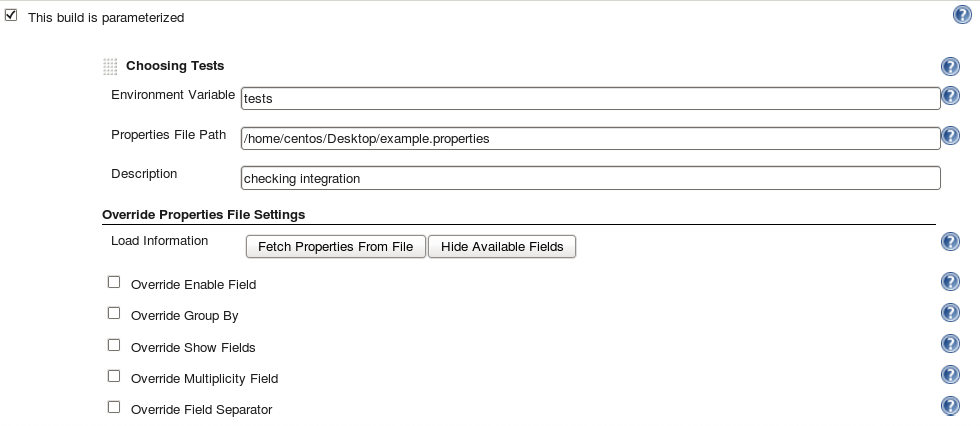
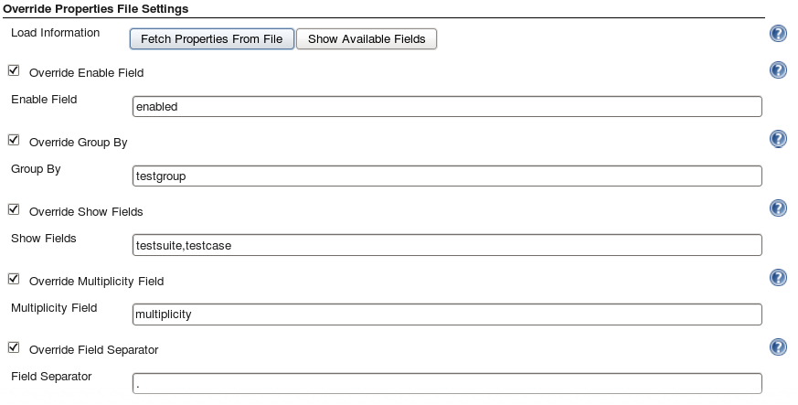
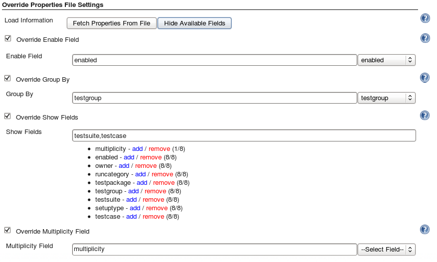
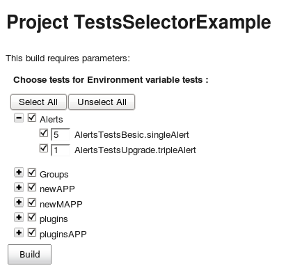

[[TestsSelectorPlugin-Overview]]
== Overview

This plugin allows you to choose specific tests you want to run.

[[TestsSelectorPlugin-Userguide]]
== User guide

[[TestsSelectorPlugin-EnablingThePluginInYourJob]]
== Enabling The Plugin In Your Job

. Navigate to the Job configuration page.
. Choose the checkbox _T__his build is parameterized._
. _Click on Add Parameter_ drop-down list.
. Select _Choosing Tests._

*_Screenshot_* +
[.confluence-embedded-file-wrapper]##

[[TestsSelectorPlugin-FillingTheParameters]]
=== Filling The Parameters

. Specify the name of the environment variable in which you want your
selected tests to be saved in.  +
After build the selected tests will be in this environment variable as a
JSON array.
. Enter the properties file path (see more information bellow).
. Add a description (optional).

[[TestsSelectorPlugin-AboutThePropertiesFile]]
=== About The Properties File

This file will contain all your tests and (maybe) some extra fields for
the plugin.

Your properties file *MUST* have a property called tests. +
The *tests* property value is a JSON array that contains a JSON object
for each test.  +
In each test object you need to specify it's attributes by a key/value
pairs. +
The following properties will allow you to select specific fields which
have a special meaning:

[width="100%",cols="50%,50%",]
|===
|*enableField* |The name of the field that will imply if the test is
enabled or not. +
If the value in the specified field, for some test(s), will be false
then the test will not be shown at all. +

|*groupBy* + |The field that the plugin will group the tests by. +
If 2 tests have the same value in this field, they will be in the same
group. +

|*showFields* + |The field(s) that will be shown in the tests tree. +

|*multiplicityField*  + |The field that will be set to the amount of
times the test should run. +

|*fieldSeparator* + |The character that will separate between the fields
in the tests tree. +
|===

All fields are case-sensitive. +
*Each property must* be defined either in the properties file *OR* in
the override section.  +
If you want to change the properties you defined in the file, you can
override them in the override section.

This is an *example* for a properties file which contains all above
properties:

[source,syntaxhighlighter-pre]
----
tests=[{"enabled":true,"owner":"shushu","testgroup":"A","testcase":"single"},{"enabled":false,"owner":"shushu","testgroup":"B","setuptype":"basic"}]
enableField=enabled
groupBy=testgroup
fieldSeparator=.
showFields=testsuite,testcase
multiplicityField=multiplicity
----

*_Screenshot_* +
[.confluence-embedded-file-wrapper]##

[[TestsSelectorPlugin-OverrideSection]]
=== Override Section

In this section you can override the properties you defined in the
properties file or define them for the first time. +
If you want the override to be done you must check the appropriate
checkbox. +
If you click on the _Fetch properties From File_ button it will fill the
properties bellow from the properties file above. +
*_Screenshot_* +
[.confluence-embedded-file-wrapper]##

If you click on the _Show/Hide Available Fields_ button it will
show/hide all the fields used in the tests you defined in the properties
file.* * +
In _Show Fields_ section, Next to each Available field appears
(howManyTestsHasThisField/amountOfTests). +
_Multiplicity Field_ can exist in some (all) of the tests. +
*_Screenshot_* +
[.confluence-embedded-file-wrapper]## +
After clicking on _Build Now_ button you will need to choose the tests
(organized as a tree). +
For each test you chose, you will need to fill the amount of times you
want it to run. +
*_Screenshot_* +
[.confluence-embedded-file-wrapper]## +
Clicking on _Build_ button will continue the build with the tests as
your parameter (in the environment variable you chose). 
