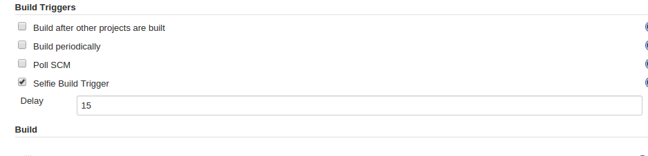

Selfie trigger plugin enables build to trigger itself after a configured
delay.

The delay (in seconds) can be set while configuring the build as shown
in the image below.

[.confluence-embedded-file-wrapper]##

[[SelfieTriggerPlugin-Versionhistory]]
== Version history

[[SelfieTriggerPlugin-Version1.0(April8,2015)]]
=== Version 1.0 (April 8, 2015)

* Initial release
