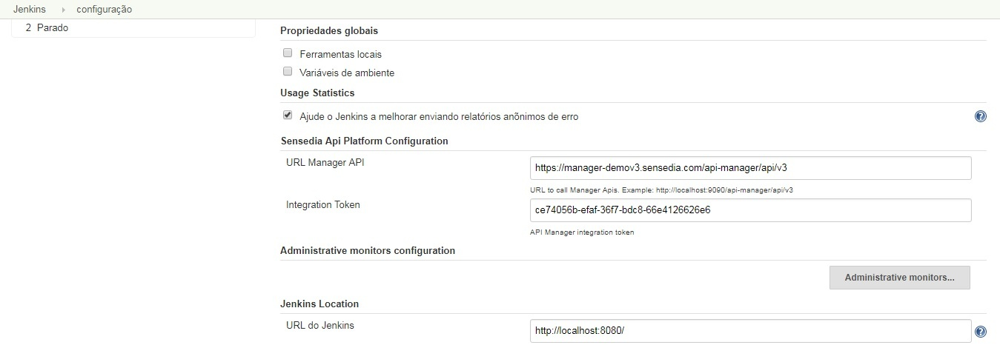
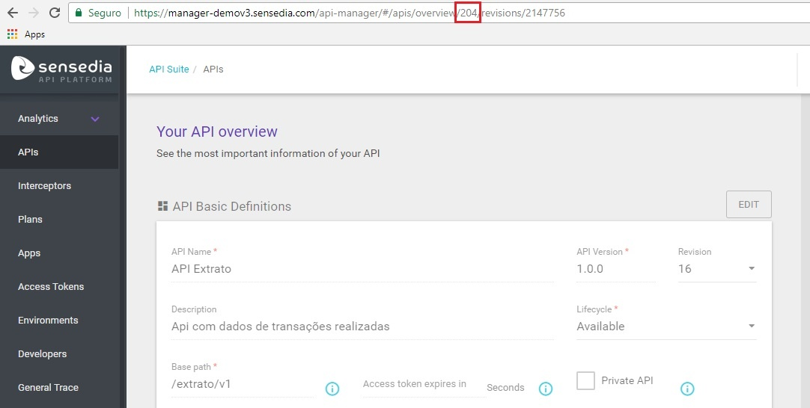
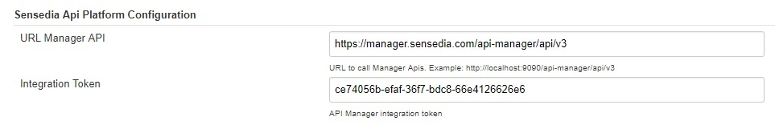
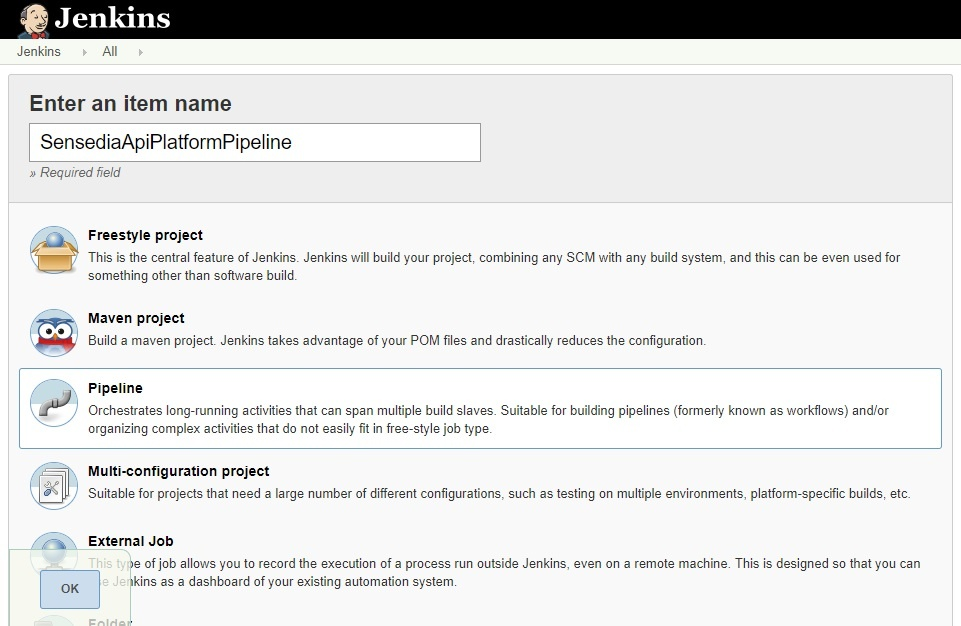
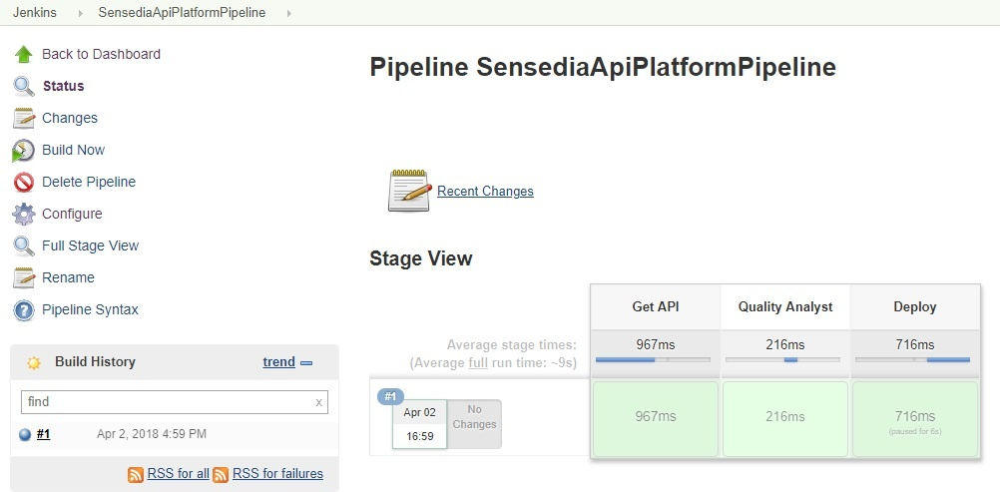

 

It is a *continuous integration* and *continuous delivery* plugin for
*Sensedia API Platform*

 +

[[SensediaApiPlatformPlugin-Configuration]]
==  Configuration

Sensedia Api Platform manager URL

URL Example

[.nolink]#[.nolink]#https://manager.sensedia.com/api-manager/api/v3##

 +
Sensedia Api Platform integration token

[.aui-icon .aui-icon-small .aui-iconfont-info .confluence-information-macro-icon]#
#

Request the integration token by Sensedia Zendesk

Set this informations in _Jenkins *>* Configuration *>* Sensedia API
Platform Configuration_

[.confluence-embedded-file-wrapper .confluence-embedded-manual-size]##

[[SensediaApiPlatformPlugin-Functions]]
== Functions

[[SensediaApiPlatformPlugin-GetApiJson]]
=== Get Api Json

 +
Get the Api code, by Id. This Id can be seen at the Api URL on Sensedia
API Platform Manager

https:/manager.sensedia.com/api-manager/#/apis/overview/*204*/revisions/2147756

[.confluence-embedded-file-wrapper .confluence-embedded-manual-size]##

• *sensediaApiJson* : string(ApiId)

*Pipeline script*

[source,syntaxhighlighter-pre]
----
..
stage ("Get Api"){
    sensediaApiJson "204" 
}
..
----

[.aui-icon .aui-icon-small .aui-iconfont-error .confluence-information-macro-icon]#
#

This function save de api code in the workspace job (filename =
api.json). The other functions uses this code to work. If you don't want
to use this function, will need to save a api code in the workspace with
a file name "api.json"

[[SensediaApiPlatformPlugin-QualityAnalyst]]
=== Quality Analyst

 +
It validate the best pratices on API. The *destination* search for hard
coded endpoints, *logInterceptor* validates if log interceptor is too
used and *resourceOutOfSize* if the path is too large

• *sensediaApiQA*: boolean (destination), boolean (logInterceptor),
boolean (resourceOutOfSize)

*Pipeline script*

[source,syntaxhighlighter-pre]
----
..
stage ("Quality Analyst"){
    sensediaApiQA(destination: true, logInterceptor: true, resourceOutOfSize: true)
}
..
----

_If one of them is not set, the test will be skipped_

[[SensediaApiPlatformPlugin-Deploy]]
=== Deploy

 +
Performs a deployment in the enviroment

• *sensediaApiJson* : string(enviroment name)

*Pipeline script*

[source,syntaxhighlighter-pre]
----
..
stage ("Production deploy"){
    sensediaApiDeploy(enviromentName: "Production")
}
..
----

_By default the Api revision deployed is the last_

[[SensediaApiPlatformPlugin-Step-by-stepguide]]
== Step-by-step guide

 

. Download and install Sensedia API Platform plugin
. In "Configure System" > "Sensedia Api Platform Configuration" section,
put the URL and Token values +
 +
[.confluence-embedded-file-wrapper .confluence-embedded-manual-size]## +
 +
. Create new Pipeline Job +
 +
[.confluence-embedded-file-wrapper .confluence-embedded-manual-size]## +
 +
. In section "Pipeline" put the script according to your process. See an
example below
+
*Pipeline script*

[source,syntaxhighlighter-pre]
----
node {
    stage ("Get API"){
        sensediaApiJson "204"
    }
    stage ("Quality Analyst"){
        sensediaApiQA(destination: true, logInterceptor: true, resourceOutOfSize: true)
    }
    stage ("Deploy"){
        sensediaApiDeploy(enviromentName: "Production")
    }
}
----
. Build pipeline +
[.confluence-embedded-file-wrapper .confluence-embedded-manual-size]## +
 +

 
