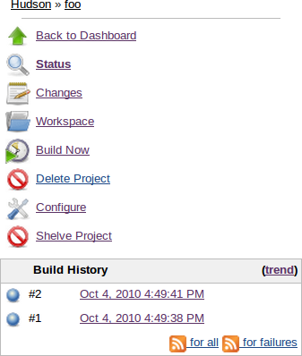
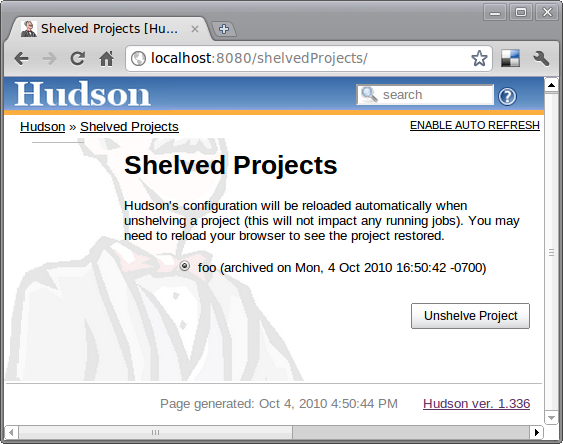

[.conf-macro .output-inline]##

[cols="",options="header",]
|===
|Plugin Information
|View Shelve Project https://plugins.jenkins.io/shelve-project-plugin[on
the plugin site] for more information.
|===

[.aui-icon .aui-icon-small .aui-iconfont-info .confluence-information-macro-icon]##

Older versions of this plugin may not be safe to use. Please review the
following warnings before using an older version:

* https://jenkins.io/security/advisory/2018-07-30/#SECURITY-1001[Stored
Cross-Site Scripting Vulnerability]

This plugin lets you shelve projects so that they can easily be
resurrected."Shelving a project" is like deleting a project into a
recycle bin. When you shelve a project, it'll disappear from the list of
projects and become inaccessible from Jenkins, just like how it goes
when a project is deleted, with one difference — instead of getting
deleted, the data is archived into a zip file and stored on the server.
This allows the administrator to resurrect it later (aka unshelving), in
an unlikely event that the job turned out to be necessary.

This feature is convenient when you have lots of old jobs lying around,
and you are 99% sure you won't need them but you can't rule out 1%
possibility that you might find them necessary later.

[[ShelveProjectPlugin-Usage]]
== Usage

When you install this plugin, you get "shelve project" in each job page,
as follows: +
[.confluence-embedded-file-wrapper .image-center-wrapper]##

You can click this icon and shelve the project. The shelved projects can
be resurrected from the Jenkins top page, with the following UI: +
[.confluence-embedded-file-wrapper .image-center-wrapper]##

[[ShelveProjectPlugin-Security]]
== Security

If security settings are enabled in Jenkins, shelving a project requires
DELETE permissions and unshelving a project requires CREATE permissions.

[[ShelveProjectPlugin-Knownissueandworkaround]]
== Known issue and workaround

Fixed in 2.5

[.aui-icon .aui-icon-small .aui-iconfont-info .confluence-information-macro-icon]#
#

This issue has been fixed in release 2.5 of the plugin however all the
shelves created using an earlier version of the plugin will have the
issue and you'll need to apply the workaround.

 +

There is a currently a known issue in Core, making the tar function
breaking the symlinks. Sadly, the Shelve Pipeline Plugin is using this
tar function, and therefore the symlinks are lost during the
shelving/unshelving process.

Up until Jenkins 2.90, this was mainly hidden from the end user, as
Jenkins was silently fixing the symlinks during a build. But since this
version, some changes made this issue visible.

This means that, when you unshelve a job, you will see a stack trace
like this in all your build logs:

[source,syntaxhighlighter-pre]
----
ln builds/lastSuccessfulBuild ***/jenkins-home/jobs/toto/lastSuccessful failed
java.nio.file.DirectoryNotEmptyException: ***/jenkins-home/jobs/toto/lastSuccessful
    at sun.nio.fs.UnixFileSystemProvider.implDelete(UnixFileSystemProvider.java:242)
    at sun.nio.fs.AbstractFileSystemProvider.deleteIfExists(AbstractFileSystemProvider.java:108)
    at java.nio.file.Files.deleteIfExists(Files.java:1165)
    at hudson.Util.createSymlink(Util.java:1333)
    at hudson.model.Run.createSymlink(Run.java:1866)
    at hudson.model.Run.updateSymlinks(Run.java:1847)
    at hudson.model.Run.execute(Run.java:1725)
    at hudson.model.FreeStyleBuild.run(FreeStyleBuild.java:43)
    at hudson.model.ResourceController.execute(ResourceController.java:97)
    at hudson.model.Executor.run(Executor.java:421)
----

While this won't affect the output of your build, this is far from
convenient. A workaround for this issue is to manually delete the
wrongly created files using something like:

 +

First make a dry run to ensure the script is not deleting something it
shouldn't:

 +

[source,syntaxhighlighter-pre]
----
find ${JENKINS_HOME}/jobs/ -type d \( -name lastFailedBuild -o -name lastSuccessfulBuild -o -name lastUnsuccessfulBuild -o -name lastStableBuild -o -name lastUnstableBuild -o -name lastFailed -o -name lastSuccessful -o -name lastUnsuccessful -o -name lastStable -o -name lastUnstable \)
----

 +

Then, do the real cleaning:

[source,syntaxhighlighter-pre]
----
find ${JENKINS_HOME}/jobs/ -type d \( -name lastFailedBuild -o -name lastSuccessfulBuild -o -name lastUnsuccessfulBuild -o -name lastStableBuild -o -name lastUnstableBuild -o -name lastFailed -o -name lastSuccessful -o -name lastUnsuccessful -o -name lastStable -o -name lastUnstable \) -exec rm -rfv "{}" \;
----

 +

[[ShelveProjectPlugin-VersionHistory]]
== Version History

From version 2.5 on,
https://github.com/jenkinsci/shelve-project-plugin/releases[the
changelog is available in github].

 +

Version 2.4 (2019-03-28)

* Add back public API methods and their documentation
(https://issues.jenkins-ci.org/browse/JENKINS-56181[JENKINS-56181])
* Allow users with Delete rights to shelve a project
(https://issues.jenkins-ci.org/browse/JENKINS-55462[JENKINS-55462])

Version 2.3 (2019-03-10)

* Fix an issue with shelving project not working without the (optional)
Folder plugin
(https://issues.jenkins-ci.org/browse/JENKINS-55331[JENKINS-55331])
* Rework the shelve progress bar so that it doesn't link to the non
existing _/console_ page
(https://issues.jenkins-ci.org/browse/JENKINS-20922[JENKINS-20922])
* Reintroduce compression on shelved folders
(https://issues.jenkins-ci.org/browse/JENKINS-55244[JENKINS-55244])

Version 2.2 (2018-11-13)

* Add Support for Pipeline Jobs
(https://issues.jenkins-ci.org/browse/JENKINS-26432[JENKINS-26432])

Version 2.1 (2018-07-20)

[.aui-icon .aui-icon-small .aui-iconfont-info .confluence-information-macro-icon]#
#

The way a project is backed up has now changed from zip to tar. This is
mainly a detail of implementation for you as your currently shelved
project can still be unshelved from zip files.

However if you have some sort of automation on the shelved project
directory (backup of the projects elsewhere for instance), you might
need to adapt your script to look for tars instead of zips.

 +

* Take folders into account when shelving/unshelving
(https://github.com/jenkinsci/shelve-project-plugin/commit/94e8e0193f81cf6f4ef4e8a1e2a6fef145bd74e5[JENKINS-43434]).
* Do not use a JobProperty to add the shelve action
(https://issues.jenkins-ci.org/browse/JENKINS-39929[JENKINS-39929]).
* Failure to display the shelve icon on the job page should have
disappeared.
*  Symlinks are now correctly unshelved.

Version 2.0 (2018-07-15)

* Switch development and tests to java 8.
* Bump minimum Jenkins core to 2.60.3.
* Various development third parties updates (JUnit...).
* Jenkinsfile for automated build of the plugin in the Jenkins infra.
* Fixed various issues detected by newly integrated tools (findbugs...).
* https://jenkins.io/security/advisory/2018-07-30/#SECURITY-1001[Fix
security issue]

Version 1.5 (2014-04-18)

* Ability to delete shelved projects (
https://issues.jenkins-ci.org/browse/JENKINS-11374[JENKINS-11374] )
* Bug fix on updated config (
https://issues.jenkins-ci.org/browse/JENKINS-10544[JENKINS-10544] )
* Bug fix (
https://issues.jenkins-ci.org/browse/JENKINS-8063[JENKINS-8063] )
* Hygienic updates (rev JUnit, base plugin version, port to JenkinsRule
for unit tests...)

Version 1.4.4 (2013-07-29)

* Wipe out workspace while shelving project (this saves disk usage).
(https://issues.jenkins-ci.org/browse/JENKINS-11023[issue #11023])

Version 1.3 (2011-08-06)

* Sort list of shelves projects by the project name.
(https://issues.jenkins-ci.org/browse/JENKINS-8570[JENKINS-8570])
* Allow unshelving of multiple projects at the same time.
(https://issues.jenkins-ci.org/browse/JENKINS-8571[JENKINS-8571])
* Don't display full path for archive when unshelving.
(https://issues.jenkins-ci.org/browse/JENKINS-8759[JENKINS-8759])

Version 1.2 (2011-02-08)

* Update for Jenkins.

Version 1.1 (2010-11-05)

* Update code making it compatible with Hudson 1.383. Older versions of
Hudson received 500 errors because the method "getEstimatedDuration" was
unimplemented.
(https://issues.jenkins-ci.org/browse/JENKINS-8016[JENKINS-8016])

Version 1.0 (2010-10-18)

* Change icon to a filing cabinet icon.
(https://issues.jenkins-ci.org/browse/JENKINS-7817[JENKINS-7817])

Version 0.3 (2010-02-27)

* Reload Hudson configuration after unshelving a project.
(https://issues.jenkins-ci.org/browse/JENKINS-5425[JENKINS-5425])
* Hudson version 1.336 or newer is now required for reloading Hudson's
configuration after  unshelving a project.

Version 0.2 (2010-01-25)

* Fix shelved projects link for views.
(https://issues.jenkins-ci.org/browse/JENKINS-5339[JENKINS-5339])

Version 0.1 (2010-01-05)

* Initial release

[[ShelveProjectPlugin-Todo]]
== Todo

* How to handle workspaces?
** Shelving a project running on master works - however, the project's
workspace located on the master is archived
** Shelving a project running on a slave works - however, project's
workspace located on the slave is not archived
