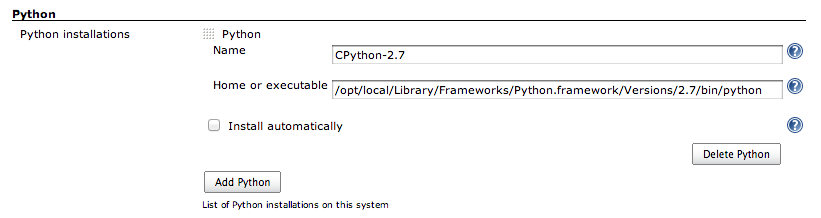

[.conf-macro .output-inline]#This plugin adds Python support to Jenkins
with some useful builders (Python builder,
http://pypi.python.org/pypi/virtualenv[virtualenv] builder,
https://bitbucket.org/hpk42/tox[tox] builder...) and the ability to use
a Python axis in multi-configuration projects (for testing on multiple
versions of Python).#

[.aui-icon .aui-icon-small .aui-iconfont-approve .confluence-information-macro-icon]#
#

This plugin is developed by http://shiningpanda.com/[ShiningPanda.], the
editor of https://requires.io/[requires.io], a web service to monitor
the dependencies of your Python projects.
https://requires.io/contact/[Contact us] for more informations!

[[ShiningPandaPlugin-ConfigurePythoninstallations]]
== Configure Python installations

To configure Python installations, step in
`+Manage Jenkins > Global Tool Configuration+`. Then look for the
`+Python+` section.

[.confluence-embedded-file-wrapper .image-center-wrapper]##

To configure a new Python installation click on `+Add Python+`, then
fill the following fields:

* `+Name+`: the name of this Python installation, make it meaningful by
including the Python's version for example.
* `+Home or executable+`: the path to the root folder of the Python
installation (CPython, PyPy, Stackless Python, Jython or IronPython) or
the path to the Python executable, such as:
** `+/opt/local/Library/Frameworks/Python.framework/Versions/2.7+` on
MacOS X (http://www.macports.org/[MacPorts]).
** `+C:\Python27+` on Windows.
** `+/usr/bin/python2.6+` on Unix.
** ...

A good practice is to install raw Pythons and then use the
`+Virtualenv Builder+` to setup your execution environment.

[[ShiningPandaPlugin-Builders]]
== Builders

Five builders dedicated to Python:

* `+Virtualenv Builder+` (recommended): creates an isolated environment
with http://pypi.python.org/pypi/virtualenv[virtualenv],
* `+Buildout Builder+`: use http://www.buildout.org/[Buildout] to build
your project,
* `+Tox Builder+`: use http://tox.readthedocs.org/en/latest/[tox] to
build your project, only available for Jenkins multi-configuration
projects,
* `+Python Builder+`: use a Python installation configured on Jenkins
via `+Manage Jenkins > Global Tool Configuration > Python+`,
* `+Custom Python Builder+`: use an arbitrary Python installation,
typically a manually created
http://pypi.python.org/pypi/virtualenv[virtualenv] environment.

[[ShiningPandaPlugin-Publishers]]
== Publishers

One publisher dedicated to Python:

* `+Publish coverage.py HTML reports+`: this publisher aims at
displaying HTML reports generated by the
http://nedbatchelder.com/code/coverage/[coverage] package.

[[ShiningPandaPlugin-FAQ]]
== FAQ

[[ShiningPandaPlugin-Whycan'tIseeallthebuilders?]]
=== Why can't I see all the builders?

Have you configured some Python installations in the `+Python+` section
of the `+Manage Jenkins > Global Tool Configuration+` page?

[[ShiningPandaPlugin-HowtoconfigureIronPythononUNIX?]]
=== How to configure IronPython on UNIX?

See this
http://shiningpanda.com/shiningpanda-plugin-ironpython-here-we.html[blog
post].

[#ShiningPandaPlugin-roadmap .confluence-anchor-link .conf-macro .output-inline]#
#

[[ShiningPandaPlugin-Roadmap]]
== Roadmap

. Support http://pypi.python.org/pypi/pip[pip]'s requirements.txt in
http://pypi.python.org/pypi/virtualenv[virtualenv] builders (thanks
@myusuf3 for the idea).
. Ease http://www.logilab.org/857[PyLint] code analysis (and associated
reporting).
. Improve http://pypi.python.org/pypi/coverage[coverage] reporing.
. Automate installation of Pythons.
. Your idea here... https://requires.io/contact/[contact us]!

[[ShiningPandaPlugin-VersionHistory]]
== Version History

[[ShiningPandaPlugin-Version0.24(15/07/2018)]]
=== Version 0.24 (15/07/2018)

* Bundle virtualenv https://pypi.org/project/virtualenv/16.0.0[16.0.0]
* Do not use `+pip.main+`

[[ShiningPandaPlugin-Version0.23(25/06/2016)]]
=== Version 0.23 (25/06/2016)

* Bundle virtualenv
http://pypi.python.org/pypi/virtualenv/15.0.2[15.0.2]
* Update `+Tox+` axis default environments

[[ShiningPandaPlugin-Version0.22(29/08/2015)]]
=== Version 0.22 (29/08/2015)

* Bundle virtualenv
http://pypi.python.org/pypi/virtualenv/13.1.2[13.1.2]
(https://issues.jenkins-ci.org/browse/JENKINS-30068[JENKINS-30068],
https://issues.jenkins-ci.org/browse/JENKINS-27551[JENKINS-27551]),
* Fix https://issues.jenkins-ci.org/browse/JENKINS-28428[JENKINS-28428]:
coverage 4 renames status.dat to status.json.

[[ShiningPandaPlugin-Version0.21(14/06/2014)]]
=== Version 0.21 (14/06/2014)

* Bundle virtualenv
http://pypi.python.org/pypi/virtualenv/1.11.6[1.11.6],
* Remove package manager selector on `+Virtualenv Builder+`,
* Remove hosted mode.

[[ShiningPandaPlugin-Version0.20(30/06/2013)]]
=== Version 0.20 (30/06/2013)

* Fix https://issues.jenkins-ci.org/browse/JENKINS-18415[JENKINS-18415]:
can't run shining panda jobs on Jenkins 1.519.

[[ShiningPandaPlugin-Version0.19(19/03/2013)]]
=== Version 0.19 (19/03/2013)

* Bundle virtualenv http://pypi.python.org/pypi/virtualenv/1.9.1[1.9.1].

[[ShiningPandaPlugin-Version0.18(24/02/2013)]]
=== Version 0.18 (24/02/2013)

* Add `+py33+` to `+Tox+` axis,
* Copyright 2013.

[[ShiningPandaPlugin-Version0.17(29/11/2012)]]
=== Version 0.17 (29/11/2012)

* Bundle virtualenv http://pypi.python.org/pypi/virtualenv/1.8.4[1.8.4].

[[ShiningPandaPlugin-Version0.16(21/11/2012)]]
=== Version 0.16 (21/11/2012)

* Fallback on virtualenv
http://pypi.python.org/pypi/virtualenv/1.7.2[1.7.2] for Python 2.4
(default is http://pypi.python.org/pypi/virtualenv/1.8.2[1.8.2]).

[[ShiningPandaPlugin-Version0.15(06/11/2012)]]
=== Version 0.15 (06/11/2012)

* Fix https://issues.jenkins-ci.org/browse/JENKINS-14188[JENKINS-14188]:
path to executable is now allowed in the `+Home+` field of a Python
installation,
* Configurable ShiningPanda working directory,
* Bundle virtualenv http://pypi.python.org/pypi/virtualenv/1.8.2[1.8.2].

[[ShiningPandaPlugin-Version0.14(25/07/2012)]]
=== Version 0.14 (25/07/2012)

* Bundle virtualenv http://pypi.python.org/pypi/virtualenv/1.7.2[1.7.2],
* Fix `+Buildout Builder+`: bootstrap.py of zc.buildout 2 always uses
distribute.

[[ShiningPandaPlugin-Version0.13(17/05/2012)]]
=== Version 0.13 (17/05/2012)

* Fix help.

[[ShiningPandaPlugin-Version0.12(30/04/2012)]]
=== Version 0.12 (30/04/2012)

* Add IronPython support,
* Switch from Affero GPL to something we could call a Lesser Affero GPL
(see
https://raw.github.com/jenkinsci/shiningpanda-plugin/master/LICENSE.txt[here]),
* Fix path to Jython 2.2.1 executable.

[[ShiningPandaPlugin-Version0.11(05/04/2012)]]
=== Version 0.11 (05/04/2012)

* Bundle the development branch of virtualenv
(1.7.1.2.post1@e299c87a1b9a63fcc2c3279cef3bf42e14ba0d32) to include PyPy
and Jython fixes for Windows,
* Fix the path to the binary of a PyPy based virtualenv on Windows in
`+Virtualenv Builder+`,
* Fix https://issues.jenkins-ci.org/browse/JENKINS-13339[JENKINS-13339]:
configuration file not set when calling `+buildout+` in
`+Buildout Builder+`.

[[ShiningPandaPlugin-Version0.10(20/02/2012)]]
=== Version 0.10 (20/02/2012)

* Bundle virtualenv
http://pypi.python.org/pypi/virtualenv/1.7.1.2[1.7.1.2],
* New builder for http://www.buildout.org/[Buildout].

[[ShiningPandaPlugin-Version0.9(26/01/2012)]]
=== Version 0.9 (26/01/2012)

* Improve the `+Virtualenv Builder+` cleanup algorithm to avoid useless
virtual environment creations,
* Move virtual environments generated by the `+Virtualenv Builder+`
under `+$JENKINS_HOME/shiningpanda+` to avoid deletions caused by full
checkouts, as a consequence the `+Virtualenv home+` field becomes a
`+Name+` field: two `+Virtualenv Builder+` with the same `+Name+` will
use the same virtual environment installation,
* Fix the workspace addition in the `+PATH+` for the `+XShell+` nature.

[[ShiningPandaPlugin-Version0.7(19/01/2012)]]
=== Version 0.7 (19/01/2012)

* Add a `+Nature+` field on `+Python Builder+`, `+Virtualenv Builder+`
and `+Custom Python Builder+` to specify the type of the `+Command+`
field. In addition to shell (`+Shell+` nature), you can now type some
Python with the `+Python+` nature, and some shell commands translated at
runtime to match the targeted platform (variables, separator, ...) with
the `+XShell+` nature,
* Add a coverage.py HTML report publisher,
* Add a `+TOXENV pattern+` field to the `+Tox Builder+` to compute the
test environment (an alternative to `+Tox+` axis),
* Detect Python installations in standard locations at first launch,
* Unable to submit job configuration if only `+Custom environments+`
field is used in `+Tox+` axis
(https://www.shiningpanda-ci.com/bugs/view.php?id=12[Mantis 12]),
* In specific cases the Python version was still asked in _Virtualenv
Builder_ and _Python Builder_ on multi-configuration projects
(https://www.shiningpanda-ci.com/bugs/view.php?id=14[Mantis 14]),
* Create symbolic links to Python shared libraries in
`+$VIRTUAL_ENV/lib+` on Unix (see
https://github.com/pypa/virtualenv/issues/216[virtualenv 216]),
* Copyright 2012.

[[ShiningPandaPlugin-Version0.6(05/12/2011)]]
=== Version 0.6 (05/12/2011)

* Embed http://pypi.python.org/pypi/virtualenv[virtualenv] 1.7 including
pull request https://github.com/pypa/virtualenv/pull/193[#193].
* As a consequence, `+No site packages+` becomes
`+System site packages+` (with the opposite value) for
`+Virtualenv Builder+`.
* Fix a 0.4 to 0.5 backward compatibility bug on Python installations.

[[ShiningPandaPlugin-Version0.5(24/11/2011)]]
=== Version 0.5 (24/11/2011)

* `+Tox+` `+Builder+`.
* http://pypi.python.org/pypi/virtualenv[Virtualenv] is no more required
in Python installations.
* Windows support.
* http://www.jython.org/[Jython] support.
* `+Custom Virtualenv Builder+` becomes `+Custom Python Builder+` and
handles now any kind of Python installation.
* `+Standard Python Builder+` becomes `+Python Builder+`.
* Full path to Python executable available via `+PYTHON_EXE+`
environment variable in `+Command+` fields.
* `+Python+` axis displayed as a tree on
https://www.shiningpanda-ci.com/[shiningpanda-ci.com].

[[ShiningPandaPlugin-Version0.4(28/09/2011)]]
=== Version 0.4 (28/09/2011)

* Adding ability to pass `+--no-site-packages+` to virtualenv (thanks
@amcfague).
* Remove `+(Default)+` Python version.
* Add an explicit option on builders with `+Command+` to ignore non-zero
exit code (previously done by specifying an header, which are now
ignored).

[[ShiningPandaPlugin-Version0.3(20/09/2011)]]
=== Version 0.3 (20/09/2011)

* Whitespace characters are not allowed in Python names (as they are
used to create the workspace path in multi-configuration projects).
* Make the build fail if there a some whitespace characters in
`+PYTHONHOME+` (see. https://bugs.launchpad.net/virtualenv/+bug/241581).
* Propagate `+User-defined Axis+` variables in all builders
(multi-configuration projects).

[[ShiningPandaPlugin-Version0.2(13/09/2011)]]
=== Version 0.2 (13/09/2011)

* PyPy support.

[[ShiningPandaPlugin-Version0.1(31/08/2011)]]
=== Version 0.1 (31/08/2011)

* Initial release.
+

 

[#ShiningPandaPlugin-running-tests .confluence-anchor-link .conf-macro .output-inline]#
#

[[ShiningPandaPlugin-Runningtests]]
== Running tests

If you want to run ShiningPanda plugin tests, ensure that you're on UNIX
and that following environment variables are not set: `+PYTHONHOME+`,
`+VIRTUAL_ENV+` and `+JYTHON_HOME+`.

You'll also need some Python installations:

* a CPython 2 installation,
* a CPython 3 installation,
* a PyPy installation,
* a Jython installation.

To declare them, create a new property file by copying the template
(only if template's configuration does not match your environment):

[source,syntaxhighlighter-pre]
----
cp src/test/resources/test.properties.model src/test/resources/test.properties
----

Then edit `+test.properties+` and modify the following entries:

* `+CPython.2.Home+`: CPython 2's home folder (`+PYTHONHOME+`),
* `+CPython.3.Home+`: CPython 3's home folder (`+PYTHONHOME+`),
* `+PyPy.Home+`: PyPy's home folder,
* `+Jython.Home+`: Jython's home folder (`+JYTHON_HOME+`),

You can also provide these values via command line:

[source,syntaxhighlighter-pre]
----
mvn -DCPython.3.Home=/path/to/cpython/3/home
----

To run all the tests:

[source,syntaxhighlighter-pre]
----
mvn clean install
----

To run a test:

[source,syntaxhighlighter-pre]
----
mvn -Dtest=jenkins.plugins.shiningpanda.builders.TestVirtualenvBuilder
----

And to debug one (with Eclipse for instance):

[source,syntaxhighlighter-pre]
----
mvn -Dmaven.surefire.debug -Dtest=jenkins.plugins.shiningpanda.TestVirtualenvBuilder
----

For those developing on Eclipse, its test runner is not compatible with
Jenkins's base test case. You'll need to run tests via command line.

And if you just want to check that everything is working for the
`+HEAD+`, just have a look on
https://jenkins.shiningpanda-ci.com/shiningpanda.org/job/shiningpanda-plugin/[our
continuous integration server].
