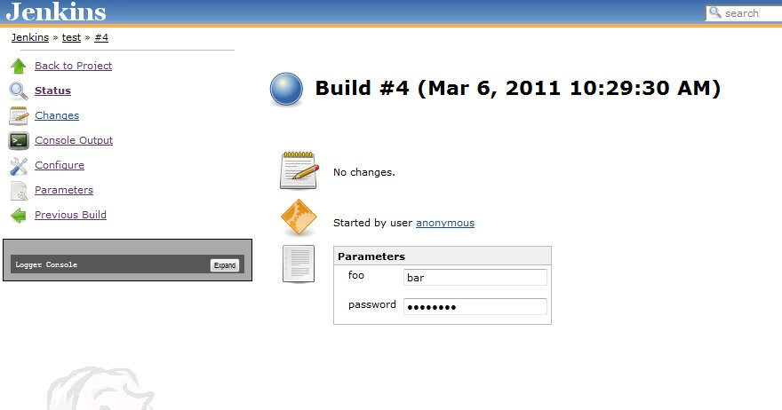

Show the parameters used for a build on the main build page

[[ShowBuildParametersPlugin-Usage]]
== Usage

This plugin is enabled by default once installed.  For new builds, the
parameter values used for a parameterized build will displayed on the
main build page. +
[.confluence-embedded-file-wrapper]##

[[ShowBuildParametersPlugin-VersionHistory]]
== Version History

[[ShowBuildParametersPlugin-Version1.0(6-Mar-2011)]]
=== Version 1.0 (6-Mar-2011)

* Initial Version
