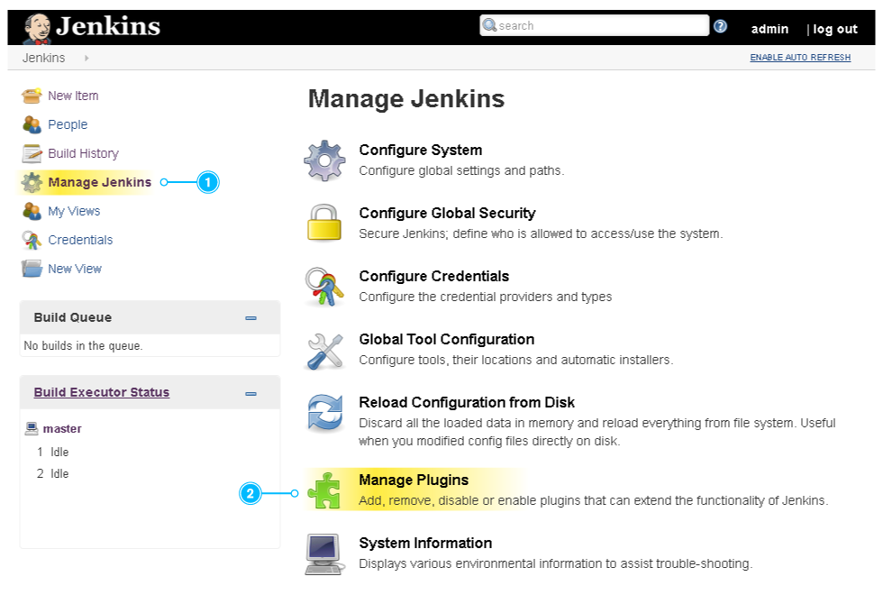
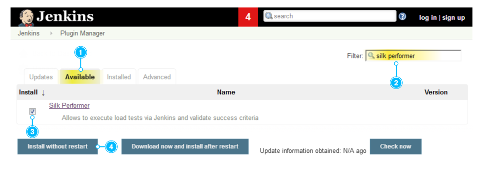
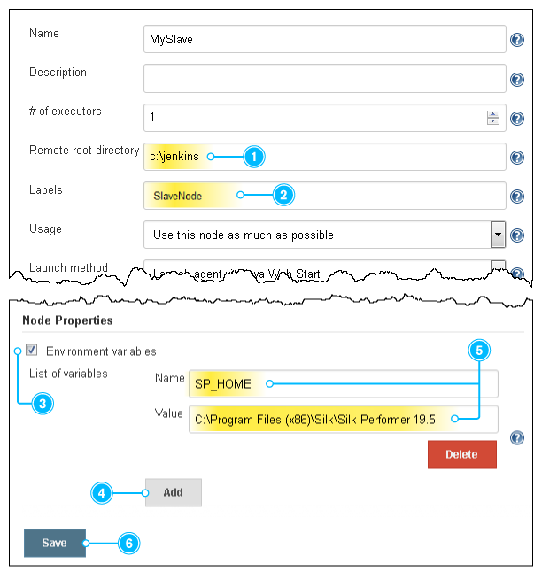
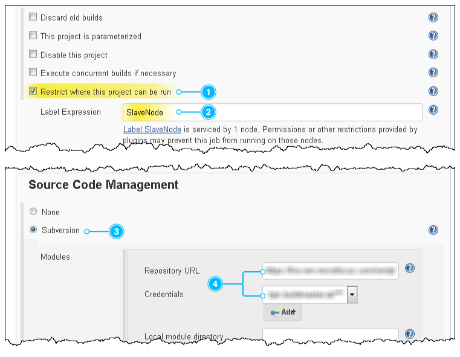
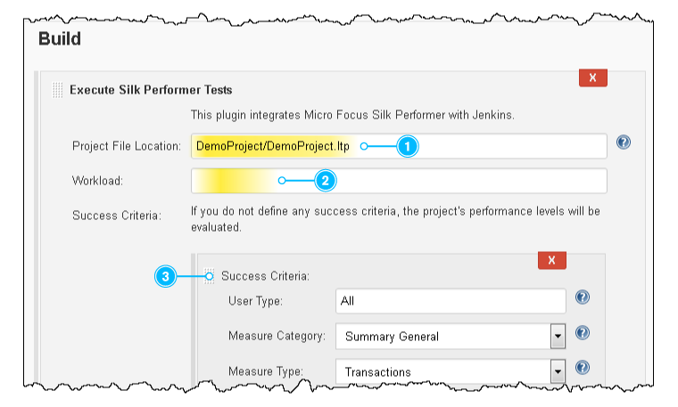
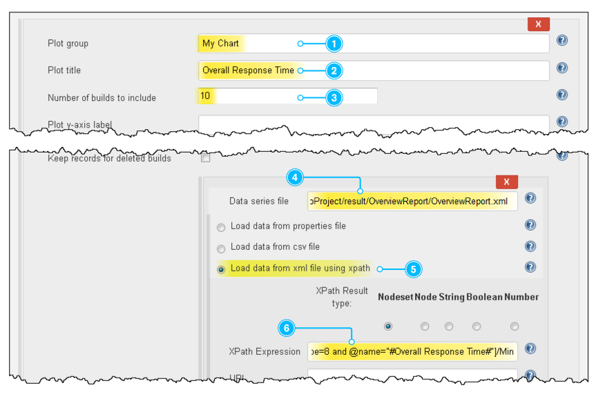
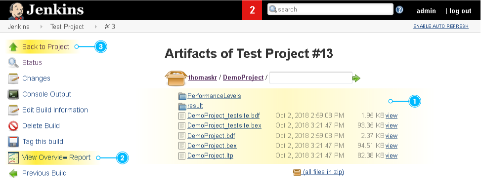
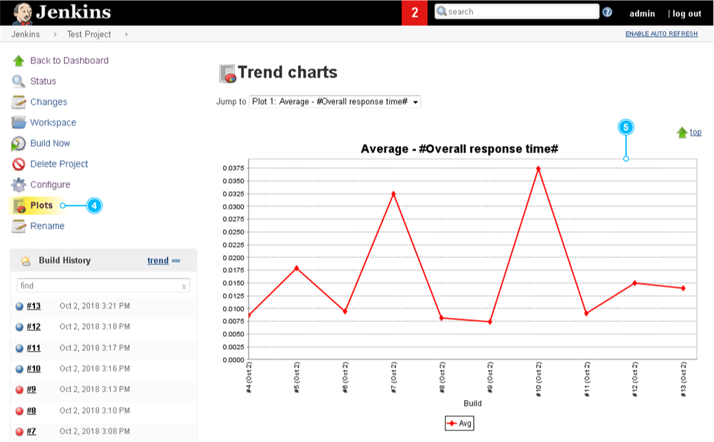
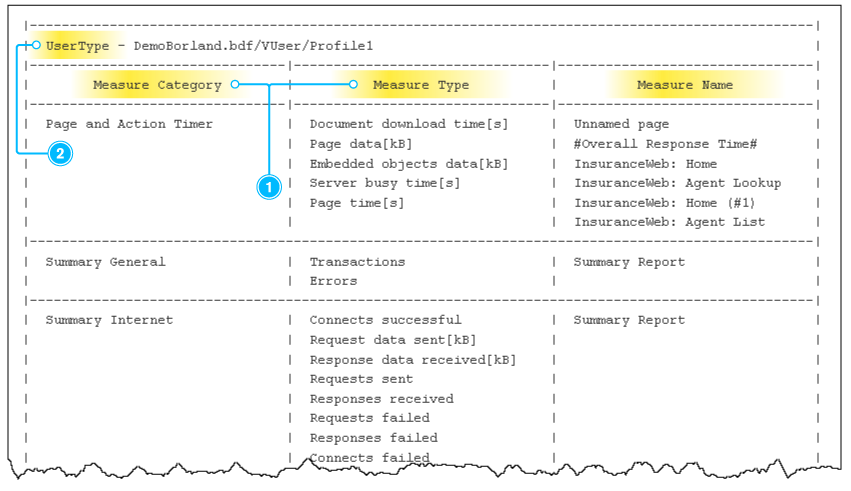

Allows users to execute a Silk Performer load test:
https://www.microfocus.com/products/silk-portfolio/silk-performer/[Silk
Performer] +
 +

The Silk Performer plugin for Jenkins has received a major upgrade and
now provides a number of new features. It lets you automate Silk
Performer projects, collect results, and evaluate success conditions.
This article guides you through setting up the plugin. To learn more
about the new features and enhancements of the plugin, read the blog
post
https://community.microfocus.com/borland/test/silk_performer_-_application_performance_testing/b/weblog/posts/released-silk-performer-19-5[Released:
Silk Performer 19.5].

Setting up the plugin involves the following steps:

. Installing the plugin
. Adding a Jenkins agent
. Creating a job
. Adding build steps
. Adding post-build actions
. Executing the job

 +

[[SilkPerformerPlugin-1.Installingtheplugin]]
== 1. Installing the plugin

First, open Jenkins in a browser. Click *Manage Jenkins* in the menu on
the top left ① and click *Manage Plugins* ②.

[.confluence-embedded-file-wrapper .confluence-embedded-manual-size]##

 +

Click the *Available* tab ① and enter _Silk Performer_ in the filter on
the top right ②. Now we can click the check box ③ and *Install without
restart* ④.

[.confluence-embedded-file-wrapper .confluence-embedded-manual-size]##

 +

[[SilkPerformerPlugin-2.Addinganagent]]
== 2. Adding an agent

The Silk Performer plugin is installed. To run a Silk Performer project
in Jenkins you need a Jenkins agent node running on Windows in a 32-bit
JRE. In addition, Silk Performer must be installed on the agent node. If
you don't have such an agent yet, create a new one:

* Click *Manage Jenkins*, *Manage Nodes*, and *New Node*.
* Enter a name, select *Permanent Agent*, and click *OK*.
* Configure the agent as follows: Specify a *Remote root directory* ①
and a label ②. +
In our example, we add the label _SlaveNode_.
* Check *Environment variables* ③ and click *Add* ④. Name the variable
_SP_HOME_ and +
specify the installation directory of Silk Performer as value ⑤. In most
cases, the installation directory will resemble the following: +
_C:\Program Files (x86)\Silk\Silk Performer 19.5_
* Click *Save* ⑥.

[.confluence-embedded-file-wrapper]##

 +

[[SilkPerformerPlugin-3.Creatingajob]]
== 3. Creating a job

Once the agent is online, you can create a new job using this agent.

* Click *New Item*, enter a name, click *Freestyle Project*, and click
*OK*.
* Restrict the project to the agent you have just created: Check
*Restrict where this project* *can be run* ① and specify the *Label
Expression* ②. +
In our example, this is the label _SlaveNode_, as defined above.
* Configure your *Source Code Management* system that holds your Silk
Performer projects. In our example, we use *Subversion* ③ including the
respective URL and credentials ④.

[.confluence-embedded-file-wrapper .confluence-embedded-manual-size]##

 +

[[SilkPerformerPlugin-4.Addingbuildsteps]]
== 4. Adding build steps

* In the *Build* section, click *Add build step* and *Execute Silk
Performer tests*.
* Specify the *Project File Location* ①. This is a relative path to your
workspace.
* Specify a *Workload* ②. If you omit this field, the project’s default
workload will be used.
* You can add custom *Success Criteria* ③ directly in the build step or
rely on the performance levels defined within the Silk Performer
project.

[.confluence-embedded-file-wrapper .confluence-embedded-manual-size]##

 +

[[SilkPerformerPlugin-5.Addingpost-buildactions]]
== 5. Adding post-build actions

* Click *Add post-build action* and *Archive the artifacts*. Then
specify the *Files to archive*. +
In our example, we defined _DemoProject/**/*_. +
Make sure to use the wildcards as shown here to get hold of all files in
all folders, including all subfolders.
* To get a trend chart, click *Add post-build action* and *Plot build
data*.
* Specify a *Plot group* ①, a *Plot title* ②, and the *Number of builds
to include* ③.
* Specify a *Data series file* ④. In our example, we use the
_OverviewReport.xml_, which is collected by the action *Archive the
artifacts*.
* Select *Load data from xml file using xpath* ⑤ and specify an *XPath
Expression* ⑥ to read any value of the .xml file. In our example, we use
the following expression:

 +

`+Overview_Report_Data/UserGroups/Group[Name="DemoProject_testsite.bdf/VUser-Profile1"]/Measures/+``+Measure[Class="Transaction" and Name="#Overall Response Time#" and Type ="Trans.(busy) ok[s]"]/+``+Avg+`

[.confluence-embedded-file-wrapper .confluence-embedded-manual-size]##

* To include additional values in the chart, for example the maximum,
click *Add*. +
In our example, we define the maximum value using the following
expression:

`+Overview_Report_Data/UserGroups/Group[Name="DemoProject_testsite.bdf/VUser-Profile1"]/Measures/+``+Measure[Class="Transaction" and Name="#Overall Response Time#" and Type ="Trans.(busy) ok[s]"]/+``+MaxMax+`

* Click *Save*. The job is now configured.

 +

[[SilkPerformerPlugin-6.Executingthejob]]
== 6. Executing the job

Everything is set up now. Execute the job on the agent to receive load
test results.

* Tip: The console provides valuable information while the job is being
executed.
* Once the job is completed, click *Last Successful Artifacts* to view
the artifacts of the load test ①.
* Click *View Overview Report* ② to open the report directly within
Jenkins.
* Click *Back to Project* ③ and *Plots* ④ to view the chart ⑤ you have
configured above.

[.confluence-embedded-file-wrapper .confluence-embedded-manual-size]##

[.confluence-embedded-file-wrapper .confluence-embedded-manual-size]##

 +

 +

Note: If you do not use _English_ as your Jenkins locale, the chart
might not display any data. To fix this problem, install the _Locale
plugin_. Then click *Manage Jenkins > Configure System*, and set the
*Default Language* to _English_.

After the first execution it can be helpful to take a look at the
console output. It shows a table with the columns *Measure Category*,
*Measure Type*, and *Measure Name* ① for each user type ②. You can use
these tables to define success criteria for upcoming executions. Review
the screenshot in step 4: it shows the very same parameters (user type,
measure category, etc.).

[.confluence-embedded-file-wrapper .confluence-embedded-manual-size]##

 +
