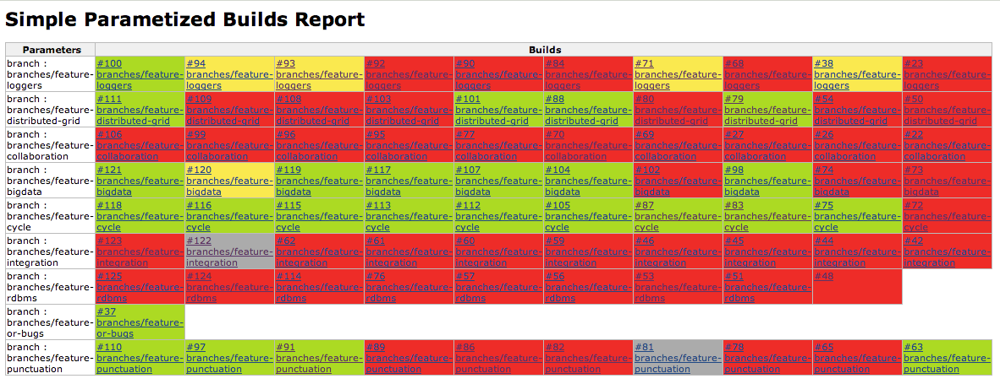

This Jenkins plugin makes it easy to visualize the various builds for a
parameterized project that were run using the same set of parameters.

Allows one to visualize the parameterized builds as:

[.confluence-embedded-file-wrapper .image-center-wrapper]##

[[SimpleParameterizedBuildsReportplugin-Usage]]
== Usage

Once installed, a new link "Parameterized Builds Report" should show up
in the sidebar for all parameterized jobs. Following that link will
display a table where (at max, latest 10) builds for a given parameter
set are displayed, grouped together based on the parameters used to
invoke the builds.

Users can also configure the parameters displayed in the list. Passwords
are never displayed in the report, but more passwords can be filtered by
setting either the inclusions or exclusions list. Configure a job to
enable "Customize Simple ParameterizedBuild Report" option and set a
comma separated list of parameters for inclusion or exclusion.

Only the builds that match the parameter set used in the latest build
are considered for inclusion in the table.

[[SimpleParameterizedBuildsReportplugin-Openissues]]
== Open issues

[[refresh-module-1987126247]]
[[refresh-1987126247]][[jira-issues-1987126247]]
T

Key

Summary

Assignee

Reporter

P

Status

Resolution

Created

Updated

Due

[.refresh-action-group]# #

[[refresh-issues-loading-1987126247]]
[.aui-icon .aui-icon-wait]#Loading...#

[#refresh-issues-button-1987126247]##
[#refresh-issues-link-1987126247]#Refresh#
[#error-message-1987126247 .error-message .hidden]# #

[[SimpleParameterizedBuildsReportplugin-ReleaseNotes]]
== Release Notes

[[SimpleParameterizedBuildsReportplugin-1.5(5/8/2016)]]
=== 1.5 (5/8/2016)

* Fixed:
https://wiki.jenkins-ci.org/display/JENKINS/Simple+Parameterized+Builds+Report+plugin#[JENKINS-34525]
Work around Groovy bug in Jenkins 2 (jglick)
* Added: Support for Matrix Jobs (JeremyMarshall)

[[SimpleParameterizedBuildsReportplugin-1.4(10/5/2014)]]
=== 1.4 (10/5/2014)

* Fixed: JENKINS-24928 - Spelling mistake
* Fixed: JENKINS-24927 - No table background colors

[[SimpleParameterizedBuildsReportplugin-1.3(7/20/2014)]]
=== 1.3 (7/20/2014)

* Fixed: Fix possible NPE reported in JENKINS-23841

[[SimpleParameterizedBuildsReportplugin-1.2(6/28/2014)]]
=== 1.2 (6/28/2014)

* Added: Configuration options for report
* Fixed: JENKINS-23604 - NPE when all builds are not parameterized

[[SimpleParameterizedBuildsReportplugin-1.1(08/17/2013)]]
=== 1.1 (08/17/2013)

* Fixed: JENKINS-19085 - Mask password properties
* Fixed: JENKINS-18565 - Only show build parameters and not all the user
defined build variables
* Fixed: Only display completed builds in the table

[[SimpleParameterizedBuildsReportplugin-1.0(01/01/2013)]]
=== 1.0 (01/01/2013)

* Initial release
