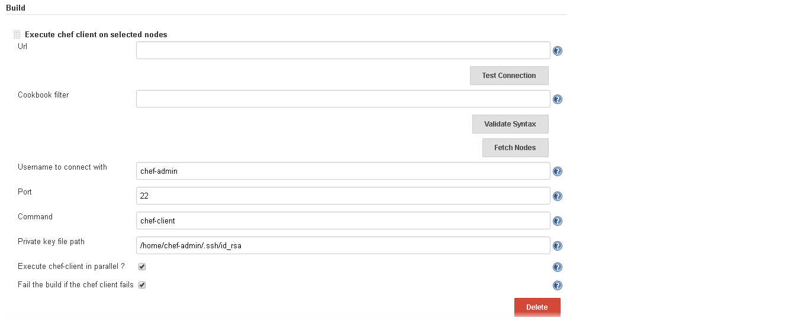

[.conf-macro .output-inline]##

[cols="",options="header",]
|===
|Plugin Information
|View Chef Sinatra https://plugins.jenkins.io/sinatra-chef-builder[on
the plugin site] for more information.
|===

[.aui-icon .aui-icon-small .aui-iconfont-error .confluence-information-macro-icon]##

The current version of this plugin may not be safe to use. Please review
the following warnings before use:

* https://jenkins.io/security/advisory/2019-04-03/#SECURITY-1037[CSRF
vulnerability and missing permission check allow SSRF]

 

[[ChefSinatraJenkinsPlugin-Summary:]]
== *Summary**:*

The plugin allows the auto code deployment when specific package is
ready to all the assigned nodes based on the Sinatra app running in
background.

*Detail Description*: At times when we do the auto code deployment using
chef configuration management tool, "chef-client" OR any another command
for that matter (E.x. : knife bootstrap) needs to be executed on the
remote hosts as per the configuration of run list. This plugin provides
the interface and several options to configure the behavior on how to
perform the deployment.

*Use case*:

* The plugin is useful when code needs to be deployed on multiple nodes
in parallel OR sequential.
* runs on-demand or scheduled "chef-client" OR any command on selected
nodes as per configuration.
* generates the report as a post build action once the deployment
completes. This is TODO

[[ChefSinatraJenkinsPlugin-Configuration:]]
== Configuration:

* Plugin refers to the Builder extension point and add the option in
Build section.
* Plugin provides several configuration options to validate the
connectivity before saving the job configuration 
* the current release supports freestyle project type. future release
may support other job types. stay tuned.

[[ChefSinatraJenkinsPlugin-Dependency:]]
== Dependency:

* The plugin is highly dependent on
: https://github.com/oswaldlabs/chef-rundeck
* above sinatra app exposes the xml containing all the nodes for each
project and environment.
* the plugin consumes this xml for further processing.
* this sinatra app is simple gem which you install very easily and
quickly.
* please ensure that, chef sinatra app is running always to work this
plugin properly.
** This can be possible command to run the app in background. *"ruby
./chef-rundeck -c /root/chef-repo/.chef/knife.rb -o 0.0.0.0 -u
chef-admin -p 9980 --partial-search=true"*

[[ChefSinatraJenkinsPlugin-JobConfiguration:]]
== Job Configuration:

* Here is the screenshot:
* [.confluence-embedded-file-wrapper .image-center-wrapper]##

[[ChefSinatraJenkinsPlugin-Manualtriggers:]]
== Manual triggers:

* NA

[[ChefSinatraJenkinsPlugin-KnownIssues:]]
== Known Issues:

* Report is not working in post build section. Should be available soon

[[ChefSinatraJenkinsPlugin-NeedHelp:]]
== Need Help:

* Join the jenkins user mailing list : jenkinsci-users@googlegroups.com

[[ChefSinatraJenkinsPlugin-Changelog:]]
== Changelog:

 

* 1.20 (July 20, 2017)
** added support for pipeline step
(https://issues.jenkins-ci.org/browse/JENKINS-45672[JENKINS-45672]) 
* 1.14 (Major release) (JAN 15 2017)
** Data binding issue fixed
** Findbug issues
** New field added in plugin configuration
* 1.3 (Initial release) (APR 22 2016
