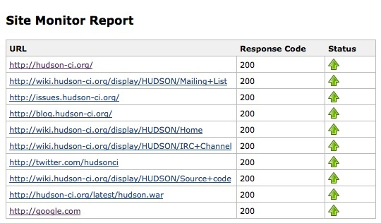
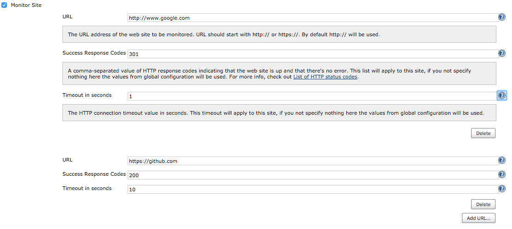
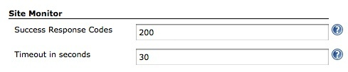

[.conf-macro .output-inline]##

[cols="",options="header",]
|===
|Plugin Information
|View SiteMonitor https://plugins.jenkins.io/sitemonitor[on the plugin
site] for more information.
|===

[.aui-icon .aui-icon-small .aui-iconfont-info .confluence-information-macro-icon]##

Older versions of this plugin may not be safe to use. Please review the
following warnings before using an older version:

* https://jenkins.io/security/advisory/2019-04-30/#SECURITY-930[SSL/TLS
certificate validation globally and unconditionally disabled]

Monitors web site up/down status.

[[SiteMonitorPlugin-Download&Installation]]
== Download & Installation

You can download the
http://updates.jenkins-ci.org/latest/sitemonitor.hpi[latest .hpi] and
install it from the Manage Plugins menu, or install this plugin directly
from the Plugins Update Center.

[[SiteMonitorPlugin-Usage]]
== Usage

. After installing the plugin, go to job configuration page, select 'Add
post-build action', and select 'Monitor Site'.
. Tick the checkbox, add the URL(s) that you want to monitor, add a
comma-separated list of response http status (optional) and a timeout
(optional), and save the configuration. If you do not specify a list of
http responses or a timeout, the monitor operation will get the default
values from global configuration.
. Run a build. After it's completed, a link to Site Monitor Report page
should appear on the build page. The report page would contain web site
status and response code.
. It is also possible to configure success response codes and timeout
settings in the global configuration page (Manage Jenkins -> Configure
System)

[[SiteMonitorPlugin-Screenshots]]
== Screenshots

[.confluence-embedded-file-wrapper]## +
[.confluence-embedded-file-wrapper]## +
[.confluence-embedded-file-wrapper]##

[[SiteMonitorPlugin-ChangeLog]]
== Change Log

[[SiteMonitorPlugin-Version0.5(April30,2019)]]
=== Version 0.5 (April 30, 2019)

* https://jenkins.io/security/advisory/2019-04-30/[Fix security issue]
* Add option to ignore SSL/TLS per site check

[[SiteMonitorPlugin-Version0.5(Dec14,2015)]]
=== Version 0.5 (Dec 14, 2015)

* Override default settings - You can define a custom list of http codes
and a timeout for each site
(https://issues.jenkins-ci.org/browse/JENKINS-20494)
* Added cookies support - You can now support current session with
cookies help (https://issues.jenkins-ci.org/browse/JENKINS-31921).
Thanks to @Federico Fissore for his pull request.
* Ignore blank sites - If the URL of a site is blank, that site is
ignored (https://issues.jenkins-ci.org/browse/JENKINS-31922).
* Default protocol - If no protocol is typed, http is assumed
(https://issues.jenkins-ci.org/browse/JENKINS-31923).

[[SiteMonitorPlugin-Version0.4(Nov1,2011)]]
=== Version 0.4 (Nov 1, 2011)

* https support - accepts any cert

[[SiteMonitorPlugin-Version0.2(Feb14,2011)]]
=== Version 0.2 (Feb 14, 2011)

* Translation updates (Chinese, Japanese)

[[SiteMonitorPlugin-Version0.1(Apr7,2010)]]
=== Version 0.1 (Apr 7, 2010)

* Initial release
