[.conf-macro .output-inline]##

[cols="",options="header",]
|===
|Plugin Information
|View Skytap Cloud CI https://plugins.jenkins.io/skytap[on the plugin
site] for more information.
|===

[.aui-icon .aui-icon-small .aui-iconfont-info .confluence-information-macro-icon]##

Older versions of this plugin may not be safe to use. Please review the
following warnings before using an older version:

* https://jenkins.io/security/advisory/2019-07-31/#SECURITY-1429[Credentials
stored in plain text]

This plugin allows you to use Jenkins to run continuous integration and
automated testing workflows using dynamically-created development and
testing environments in http://www.skytap.com/[Skytap]

Sections in this document:

[[SkytapCloudCIPlugin-Introduction]]
== Introduction

The *Skytap Cloud CI Plugin for Jenkins* allows you to create and
configure http://www.skytap.com/[Skytap Cloud] environments as part of
your Jenkins-based continuous integration workflow. 

In a matter of minutes, you can create a Skytap virtual environment from
a golden template and then use that environment to develop your
application or run test passes for unit testing, functional testing,
integration testing, stress/performance testing or user acceptance
testing. All of the VM and network settings are saved with the template,
so once you've created an environment, the network is already set up and
you're ready to go. 

With *Skytap Cloud CI Plugin for Jenkins*, you can add the following
actions to your Jenkins build steps:

[[SkytapCloudCIPlugin-BeforeYouBegin]]
== Before You Begin

To use the *Skytap Cloud CI Plugin for Jenkins*, you must have a Skytap
account.

If you do not have a Skytap account, you can sign up for a demo account
at http://www.skytap.com/

[[SkytapCloudCIPlugin-Step1:InstallingtheSkytapCloudCIPluginforJenkins]]
== Step 1: Installing the Skytap Cloud CI Plugin for Jenkins

You can install the plugin from the Jenkins web UI, or you can download
the plugin from the plugin repository. 

*Option 1:* +
*To install the plugin from the Jenkins Web UI:*

. Navigate to the Jenkins *Manage Plugins* page. +
[.confluence-embedded-file-wrapper]#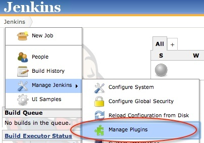#
. Select the *Available* tab and filter for “Skytap” +
[.confluence-embedded-file-wrapper]#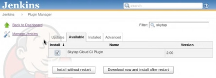#
. Select the “Install” checkbox next to “Skytap Cloud CI Plugin for
Jenkins.”
. Click *Download now and install after restart*.

*Option 2:* +
*To install the plugin from the Jenkins plugin repository:*

. Download the "skytap.hpi" plugin file from the Jenkins plugin
repository.
. Navigate to the Jenkins *Manage Plugins* page.
. Select the *Advanced* tab. +
[.confluence-embedded-file-wrapper]#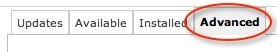#
. From the “Upload Plugin” section, click *Choose File*.  +
[.confluence-embedded-file-wrapper]#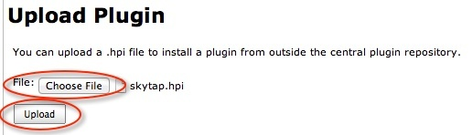#
. Navigate to the downloaded plugin file (skytap.hpi) and select it. 
. Click *Upload*. 
. After the plugin is uploaded, restart Jenkins by navigating to
http://_your-jenkins-server_/jenkins/restart
. Click *Yes* to confirm. +
[.confluence-embedded-file-wrapper]## 

[[SkytapCloudCIPlugin-Step2:ConfiguringthePlugin]]
== Step 2: Configuring the Plugin

To configure the plugin, you will need to enter to your Skytap
credentials. Optionally, you can also enable verbose logging.

. To enter your Skytap credentials:## Navigate to the configuration page
for your Jenkins build project.## Under *Build Environment*, enter your
Skytap User ID and API security token.  +
 
[.confluence-embedded-file-wrapper]#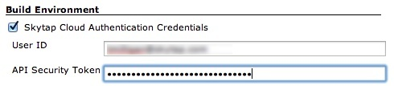# +
NOTE: You can retrieve your user ID (user name) and API security token
from your Skytap account settings page
(https://cloud.skytap.com/account). If you do not have an API security
token listed, use the instructions
at http://help.skytap.com/#Access_Policy.html to enable API security
tokens in your account.
. To enable verbose logging for Skytap actions:##  Navigate to *Manage
Jenkins* > *Configure System*. +
[.confluence-embedded-file-wrapper]#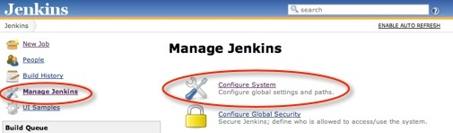###
In the Skytap Cloud Plugin settings, select *Enable Console Logging of
Skytap Actions*.  +
Logs will be sent to the Jenkins Project build console. +
[.confluence-embedded-file-wrapper]#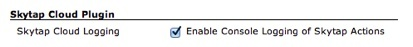#

[[SkytapCloudCIPlugin-Step3:AddingSkytapActionstoYourBuildSteps]]
== Step 3: Adding Skytap Actions to Your Build Steps

Once the plugin is installed and configured, you can add Skytap actions
to your Jenkins build steps:

. Navigate to the Jenkins Project Configuration screen.
. From the *Add build step* dropdown menu, select *Execute Skytap
Action*.  +
[.confluence-embedded-file-wrapper]#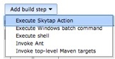#
. Select an available action: +
[.confluence-embedded-file-wrapper]#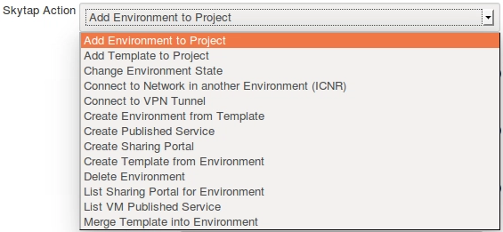#
. Enter any required parameters. For a description of each action and
the required parameters, see the sections below. 

[[SkytapCloudCIPlugin-Reference:SkytapActionsandRequiredParameters]]
== Reference: Skytap Actions and Required Parameters

NOTE: If you see different action names, please update the Skytap Cloud
CI Plugin to the latest version.

[[SkytapCloudCIPlugin-AddEnvironmenttoProject]]
=== Add Environment to Project

This action adds a Skytap environment to a Skytap project.

[.confluence-embedded-file-wrapper]#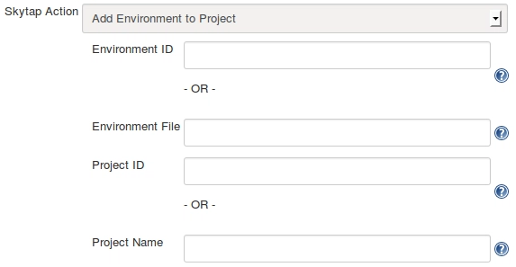# +
 

[width="100%",cols="50%,50%",options="header",]
|===
|Required Parameters |Description
|Environment ID or Environment File |Enter a Skytap Environment ID (an
integer), if one is known.  +
If the environment was created in an earlier step (using the "Create
Environment from Template” Skytap action), enter the Environment Data
Save File created from that step. +

|Project ID or Project Name |Enter a Skytap project ID (an integer) or a
Skytap project name. The project must already exist and be accessible
from your Skytap account. +
|===

[[SkytapCloudCIPlugin-AddTemplatetoProject]]
=== Add Template to Project

This action adds a Skytap template to a Skytap project.

[.confluence-embedded-file-wrapper]#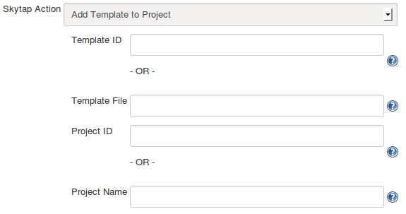#

[width="100%",cols="50%,50%",options="header",]
|===
|Required Parameters |Description
|Template ID or Template File |Enter a Skytap template ID (an integer),
if one is known.  +
If the template was created in an earlier step (using the "Create
Template from Environment” Skytap action), enter the Template Data Save
File created from that step. +

|Project ID or Project Name |Enter a Skytap project ID (an integer) or a
Skytap project name. The project must already exist and be accessible
from your Skytap account. +
|===

[[SkytapCloudCIPlugin-ChangeEnvironmentState]]
=== Change Environment State

This action will run, suspend, or shut down a Skytap environment.

[.confluence-embedded-file-wrapper]#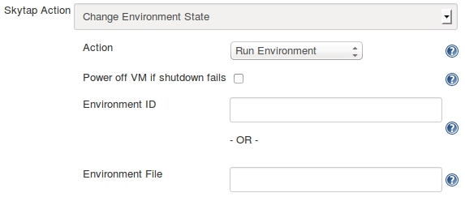#

[width="100%",cols="50%,50%",options="header",]
|===
|Parameters |Description
|Action (Required) |Select "Run Environment", "Suspend Environment", or
"Shutdown Environment"

|Power off VM if shutdown fails (Optional) |If this option is checked,
Skytap will forcibly power off any VMs that do not shut down within 5
minutes.

|Environment ID or Environment File (Required) |Enter a Skytap
environment ID (an integer), if one is known.  +
If the environment was created in an earlier step (using the "Create
Environment from Template” Skytap action), enter the Environment Data
Save File created from that step.
|===

[[SkytapCloudCIPlugin-ConnecttoNetworkinanotherEnvironment(ICNR)]]
=== Connect to Network in another Environment (ICNR)

This action connects two networks in different Skytap environments. The
networks must already be configured to allow an
http://help.skytap.com/#Networking_Between_Environments.html[Inter-Configuration
Network Routing (ICNR)] connection to occur. 

[.confluence-embedded-file-wrapper]#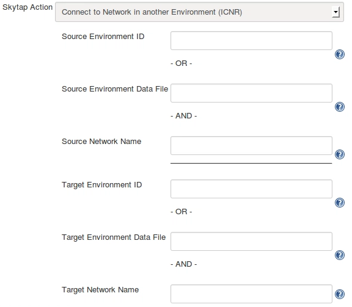#

[width="100%",cols="50%,50%",options="header",]
|===
|Required Parameters |Description
|Source Environment ID or Source Environment Data File |Enter a Skytap
environment ID (an integer), if one is known.   +
If the environment was created in an earlier step (using the "Create
Environment from Template” Skytap action), enter the Environment Data
Save File created from that step.

|Source Network Name |Enter the name of the network in the source
environment.

|Target Environment ID or Target EnvironmentData File |Enter a Skytap
environment ID (an integer), if one is known.   +
If the environment was created in an earlier step (using the "Create
Environment from Template” Skytap action), enter the Environment Data
Save File created from that step.

|Target Network Name |Enter the name of the network in the target
environment. This network must be visible to other networks.  +
|===

NOTE: If there is more than one network in the environment with the
specified name (not recommended), the plugin will use the first network
encountered in the metadata associated with the environment.

[[SkytapCloudCIPlugin-ConnecttoVPNTunnel]]
=== Connect to VPN Tunnel

This action will connect a Skytap environment to a Skytap VPN. +
[.confluence-embedded-file-wrapper]#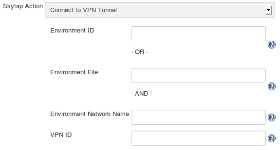#

[width="100%",cols="50%,50%",options="header",]
|===
|Required Parameters |Description
|Environment ID or EnvironmentFile) |Enter a Skytap environment ID (an
integer), if one is known.  +
If the environment was created in an earlier step (using the "Create
Environment from Template” Skytap action), enter the Environment Data
Save File created from that step.

|Environment Network Name |Enter the name of the network in the Skytap
environment. +
NOTE: If the environment contains multiple networks with the same name
(not recommended), the first network encountered in the metadata
associated with the environment will be used.

|VPN ID |Enter the Skytap VPN ID (an integer).
|===

[[SkytapCloudCIPlugin-CreateEnvironmentfromTemplate]]
=== Create Environment from Template

This action creates a Skytap environment from a Skytap template. +
[.confluence-embedded-file-wrapper]#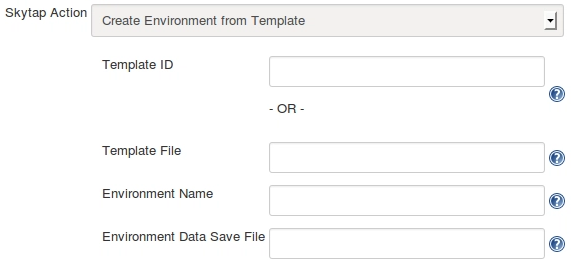#

[width="100%",cols="50%,50%",options="header",]
|===
|Required Parameters |Description
|Template ID or Template File |Enter a Skytap template ID (an integer),
if one is known.  +
If the template was created in an earlier step (using the "Create
Template from Environment” Skytap action), enter the Template Data Save
File created from that step.

|Environment Name |Enter a name for the new environment.

|Environment Data Save File |Enter a name for the output file (for
example, *env.json*). The plugin will create the output file and
populate it with Skytap environment metadata in JSON format. The
metadata includes the Skytap environment ID and other information about
the environment. This file can be used in Skytap actions that require a
Skytap environment ID or other environment metadata.
|===

[[SkytapCloudCIPlugin-CreateSharingPortal]]
=== Create Sharing Portal

This action creates a Sharing Portal for a Skytap environment.

[.confluence-embedded-file-wrapper]#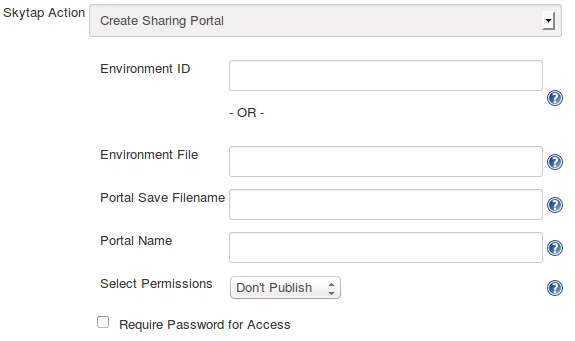#

[width="100%",cols="50%,50%",options="header",]
|===
|Required Parameters |Description
|Environment ID or Environment File |Enter a Skytap environment ID (an
integer), if one is known.  +
If the environment was created in an earlier step (using the "Create
Environment from Template” Skytap action), enter the Environment Data
Save File created from that step.

|URL Save Filename |Enter a name for the output file (for
example, *puburl.txt*). The plugin will create the output file and
populate it with the sharing portal's address.  +

|Select Permissions |Select a permission level for VMs in the sharing
portal. For more information about permissions, see the
http://help.skytap.com/#Published_URLs.html[Skytap Help Documentation].

|Require Password for Access |If checked, enter a password to restrict
access to the sharing portal.
|===

[[SkytapCloudCIPlugin-CreatePublishedService]]
=== Create Published Service

This action creates a
http://help.skytap.com/#Accessing_VMs_with_Published_Services.html[Published
Service] port opening on a VM's network adapter. This is commonly used
to open RDP or SSH access to a VM. +
    
[.confluence-embedded-file-wrapper]#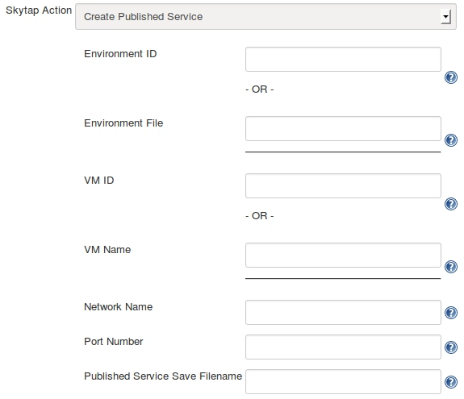#

[width="100%",cols="50%,50%",options="header",]
|===
|Required Parameters |Description
|Environment ID or Environment File |Enter a Skytap environment ID (an
integer), if one is known.  +
If the environment was created in an earlier step (using the "Create
Environment from Template” Skytap action), enter the Environment Data
Save File created from that step.

|VM ID or VM Name |Enter the ID or name of the virtual machine you want
to attach the published service to. Note: If the environment has more
than one VM with the same name, the first VM in the Skytap environment
metadata definition will be selected.

|Network Name |Enter the name of the network you want to attach the
published service to. +
NOTE: If the VM contains multiple networks with the same name, the first
network in the Skytap environment metadata definition will be selected.

|Port Number |Enter the port number you want to connect the published
service to (for example, 3389 for RDP access).

|Published Service Save Filename |Enter a name for the output file (for
example, *pubservice.txt*). The plugin will create the output file and
populate it with the “public-URL:port-number”. +
NOTE: The port number in this text will be different than the port
number specified above. Skytap uses port mappings to obscure the port
openings on the public Internet.
|===

[[SkytapCloudCIPlugin-CreateTemplatefromEnvironment]]
=== Create Template from Environment

This action creates a Skytap template from a Skytap environment.

[.confluence-embedded-file-wrapper]#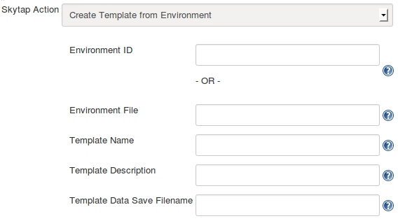#

[width="100%",cols="50%,50%",options="header",]
|===
|Required Parameters |Description
|Environment ID or Environment File |Enter a Skytap environment ID (an
integer), if one is known.  +
If the environment was created in an earlier step (using the "Create
Environment from Template” Skytap action), enter the Environment Data
Save File created from that step.

|Template Name |Enter a name for the new template.

|Template Data Save File |Enter a name for the output file (for
example, *template.json*). The plugin will create the output file and
populate it with Skytap template metadata in JSON format. The metadata
includes the Skytap template ID and other information about the
template. This file can be used in Skytap actions that require a Skytap
template ID or other template metadata. +
|===

[[SkytapCloudCIPlugin-DeleteEnvironment]]
=== Delete Environment

This action deletes a Skytap environment.

[.confluence-embedded-file-wrapper]#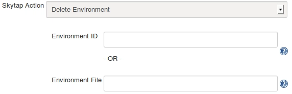#

[width="100%",cols="50%,50%",options="header",]
|===
|Required Parameter |Description
|Environment ID or Environment File |Enter a Skytap environment ID (an
integer), if one is known.  +
If the environment was created in an earlier step (using the "Create
Environment from Template” Skytap action), enter the Environment Data
Save File created from that step.
|===

[[SkytapCloudCIPlugin-ListSharingPortalforEnvironment]]
=== List Sharing Portal for Environment

This action returns the address for an existing sharing portal in a
Skytap environment.

[.confluence-embedded-file-wrapper]#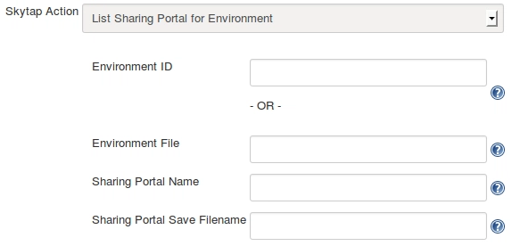#

[width="100%",cols="50%,50%",options="header",]
|===
|Required Parameters |Description
|Environment ID or Environment File |Enter a Skytap environment ID (an
integer), if one is known.  +
If the environment was created in an earlier step (using the "Create
Environment from Template” Skytap action), enter the Environment Data
Save File created from that step.

|Sharing Portal Name |Enter the name of the desired sharing portal. +
NOTE: If the environment has multiple sharing portals with the same
name, the first URL encountered in the environment metadata will be
selected.

|Sharing Portal Save Filename |Enter a name for the output file (for
example, *puburl.txt*).  The plugin will populate this file with the
sharing portal's address. +
|===

[[SkytapCloudCIPlugin-ListVMPublishedService]]
=== List VM Published Service

This action returns the "public-URL:port-number" for an
existing published service in a Skytap environment.

[.confluence-embedded-file-wrapper]#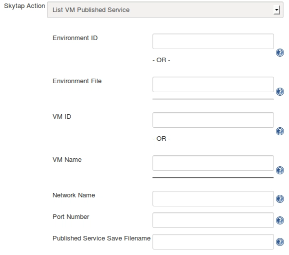#

[width="100%",cols="50%,50%",options="header",]
|===
|Required Parameters |Description
|Environment ID or Environment File |Enter a Skytap environment ID (an
integer), if one is known.  +
If the environment was created in an earlier step (using the "Create
Environment from Template” Skytap action), enter the Environment Data
Save File created from that step.

|VM ID or VM Name |Enter the ID or name of the virtual machine the
published service is attached to. +
NOTE: If the environment has multiple VMs with the same name, the first
VM in the Skytap environment metadata definition will be selected.

|Network Name |Enter the name of the network the published service is
attached to. +
NOTE: If the VM has multiple networks with the same name, the first
network in the Skytap environment metadata definition will be selected.

|Port Number |Enter the port number the published service is attached to
(for example, 3389 for RDP access).

|Published Service Save Filename |Enter a name for the output file (for
example, *pubservice.txt*). The plugin will create and populate this
file with the "public-URL:port-number." +
NOTE: The port number in this text will be different than the port
number specified above. Skytap uses port mappings to obscure the port
openings on the public Internet. +
|===

[[SkytapCloudCIPlugin-MergeTemplateintoEnvironment]]
=== Merge Template into Environment

This action will copy VMs from a Skytap template into a Skytap
environment. +
  
[.confluence-embedded-file-wrapper]#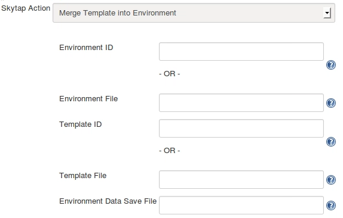#

[width="100%",cols="50%,50%",options="header",]
|===
|Parameters |Description
|Environment ID or Environment File (Required) |Enter a Skytap
environment ID (an integer), if one is known.  +
If the environment was created in an earlier step (using the "Create
Environment from Template” Skytap action), enter the Environment Data
Save File created from that step.

|Template ID or Template File (Required) |Enter a Skytap template ID (an
integer), if one is known.  +
If the template was created in an earlier step (using the "Create
Template from Environment” Skytap action), enter the Template Data Save
File created from that step.

|Environment Data Save File (Optional) |To create a new Environment Data
Save File with updated environment metadata, enter a new file name
(*updatedenv.json*). This file can be used in actions that require a
Skytap environment ID or other environment metadata.
|===
