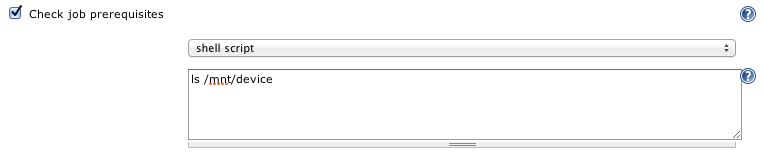

This plugin allows to check prerequisites on slave before a job can run
a build on it

[[SlavePrerequisitesPlugin-Goal]]
== Goal

Labels can be used to group slave nodes based on various criteria, but
in some cases such criteria may be dynamic : free disk space, available
license token, attached hardware. This plugin let a job define a script
to be executed on candidate nodes as the Queue is searching for the best
available executor to check if some dynamic prerequisites are met, and
to veto a node if not.

[[SlavePrerequisitesPlugin-Usage]]
== Usage

Job can define a shell script to be ran as the Build Queue is looking
for the best node to host the build.   
[.confluence-embedded-file-wrapper]##

This script will be executed asynchronously by the build queue, and the
job will stay in waiting state until one of the nodes successfully run
the script. On failure, a new attempt on the node will run as the next
Build Queue maintenance cycle occurs, so that the script can be used to
check for dynamic resources to be available just before the job starts
on the node.

Please note this plugin requires Jenkins 1.452 and later, as it depends
on https://github.com/jenkinsci/jenkins/commit/1ac4872ecdc500c63c0dbfce5e4beb5ce78369e5[1ac4872ecdc500c63c0dbfce5e4beb5ce78369e5]

[[SlavePrerequisitesPlugin-Changelog]]
== Changelog

[[SlavePrerequisitesPlugin-Version1.1(notreleasedyet)]]
=== Version 1.1 (not released yet)

*  

[[SlavePrerequisitesPlugin-Version1.0(releasedfebruary29,2012)]]
=== Version 1.0 (released february 29, 2012)

* initial release
