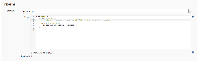
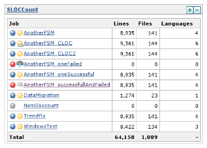
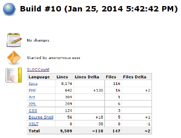
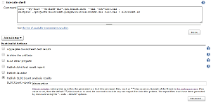
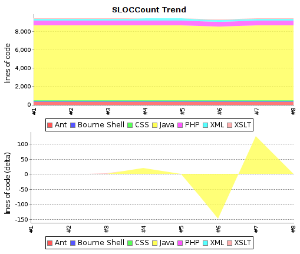
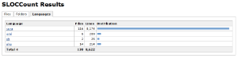
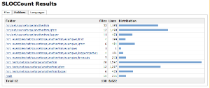
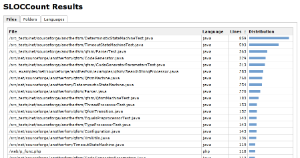
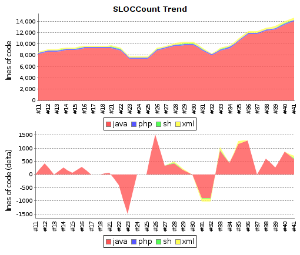
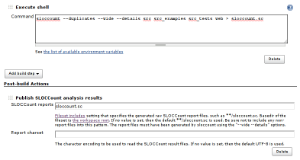

[.conf-macro .output-inline]#This plug-in generates trend report for
http://www.dwheeler.com/sloccount/[SLOCCount] and
http://cloc.sourceforge.net/[cloc] open source tools, that count number
of code lines written in many programming languages.#

[[SLOCCountPlugin-Description]]
== Description

The SLOCCount plug-in scans for
http://www.dwheeler.com/sloccount/[SLOCCount] or
http://cloc.sourceforge.net/[cloc] report files in the build workspace
directory and reports the number of lines they found.

The following features are provided by this plug-in:

* Parsing of reports generated by
http://www.dwheeler.com/sloccount/[SLOCCount] tool.
* Parsing of reports generated by http://cloc.sourceforge.net/[cloc]
tool.
* Configuration of the files to scan after a build.
* Trend reports showing the number of lines per language.
* Trend reports showing the number of added or deleted lines per
language.
* Overview of the lines per file, folder or language.
* https://wiki.jenkins-ci.org/display/JENKINS/Dashboard+View[Dashboard
View] portlet showing number of lines, files and languages per job.
* Remote access API
(https://wiki.jenkins-ci.org/display/JENKINS/Remote+access+API[REST
API]).
* Works with any project/job type.

This plug-in is developed and maintained by Nicolas Piguet. Please use
the https://wiki.jenkins-ci.org/display/JENKINS/Mailing+Lists[Mailing
Lists] or http://issues.jenkins-ci.org/[issue tracker] to ask questions,
create feature request or bug reports, since I don't read the comment
section on this page regularly.

[[SLOCCountPlugin-Screenshots]]
== Screenshots

[width="100%",cols="25%,25%,25%,25%",]
|===
|
|
|
|

a| a| a| a|

|
|
|
|

a| a| a| a|

|
|
| |

a| a| | |
|===

[[SLOCCountPlugin-Usage]]
== Usage

If you are not sure which type of report files to use, prefer *cloc*. It
is able to detect more programming languages than SLOCCount (Scala, Ant,
CSS, ...) and is able to count also lines with comments that often
contain Javadoc or Doxygen documentation. Cloc is also better portable,
SLOCCount requires https://www.cygwin.com/[cygwin] or similar
environment under MS Windows.

*Never switch between SLOCCount and cloc inside one job.* You would end
up with messy trend graph because they name programming languages
differently. Delete all affected builds and rebuild the job in such case
to fix the issue.

[[SLOCCountPlugin-Linux]]
=== Linux

* Install http://www.dwheeler.com/sloccount/[SLOCCount] or
http://cloc.sourceforge.net/[cloc] on the build slave machine. Note they
may be present in package repository of your distribution.
** Debian, Ubuntu, ...
*** `+apt-get install sloccount+`
*** `+apt-get install cloc+`
** Red Hat, CentOS, Fedora, ...
*** `+yum install sloccount+`
*** `+yum install cloc+`
* For each job configuration page:
** Add a *execute shell* build step to generate the report files, or
create them in your build scripts (Ant, Maven, Make, ...).
*** `+sloccount --duplicates --wide --details [source-folder] > [output-folder]/sloccount.sc+`
*** `+cloc --by-file --xml --out=[output-folder]/cloc.xml [source-folder]+`
** Activate the checkbox *Publish SLOCCount analysis results* and
provide the path to the generated report files.

[[SLOCCountPlugin-Windows]]
=== Windows

[[SLOCCountPlugin-cloc]]
==== cloc

* Download and install http://cloc.sourceforge.net/[cloc]
(http://sourceforge.net/projects/cloc/files/cloc/[cloc.exe]) on the
build slave machine. Optionally if you have Perl installed, you can run
cloc as a standalone Perl Script.
* For each job configuration page:
** Generate the report files
*** `+cloc.exe --by-file --xml --out=[output-folder]/cloc.xml [source-folder]+`
*** `+perl cloc.pl --by-file --xml --out=[output-folder]/cloc.xml [source-folder]+`
** Activate the checkbox *Publish SLOCCount analysis results* and
provide the path to the generated cloc report.

[[SLOCCountPlugin-SLOCCount]]
==== SLOCCount

Since SLOCCount does not run on a native Windows machine the setup for
Windows requires additional steps. Most of the setup is explained in
detail in the http://www.dwheeler.com/sloccount/sloccount.html[SLOCCount
documentation].

* Install https://www.cygwin.com/[Cygwin] on the build slave.
* Compile and install SLOCCount within the Cygwin environment.
* For each job configuration page:
** Add a build step to run Cygwin and SLOCCount. See the ANT example
below to learn how to start Cygwin and run SLOCCount from an ANT script.
*** `+/usr/bin/sloccount --duplicates --wide --details [source-folder] >[output-folder]/sloccount.sc+` +
You must convert Windows paths that are passed as parameters to
SLOCCount utility to Linux/Cygwin style (C:\ becomes /cygdrive/c/).
** Convert the SLOCCount results in sloccount.sc back to windows paths.
** Activate the checkbox *Publish SLOCCount analysis results* and
provide the path to the generated SLOCCount report.

[.aui-icon .aui-icon-small .aui-iconfont-warning .confluence-information-macro-icon]#
#

If you uses sloccount for multiple jobs sometimes two jobs end at the
same time and sloccount is executed simultaneously. This will fail since
SLOCCount (by default) uses one temp data folder in $HOME/.slocdata.

Either change sloccount to not use a temp data directory or change the
setup explanation so novice users (like me) are explained to use the
--datadir option in order to get a datadir per hudson job.

This seems to work: +
[ -d slocdata ] || mkdir slocdata +
sloccount --datadir slocdata --details "your source path" > sloccount.sc

[[SLOCCountPlugin-ANTexampleforWindowsbuild]]
===== ANT example for Windows build

The target converts Windows paths to Linux style cygdrive paths (C:\
becomes /cygdrive/c/) before SLOCCount runs. The converted paths are
passed as environment variables to Cygwin. After SLOCCount has been
executed, the results in sloccount.sc are converted back to windows
paths.

[[SLOCCountPlugin-ANTtarget]]
===== ANT target

Add this target to your Jenkins build:

*build.xml*

[source,syntaxhighlighter-pre]
----
<target name="sloccount" depends="createAllSrc">
  

  <exec executable="${cygwin.bin}\bash.exe">
    <arg line="-li '${cygdrive.build.scripts.dir}/cygwin_sloccount.sh'" />
    <env key="SLOCCOUNT_SOURCE_DIR" value="${cygdrive.allsrc.dir}" />
    <env key="SLOCCOUNT_OUTPUT_DIR" value="${cygdrive.workspace.dir}" />
  </exec>

  <replace file="${dir.workspace}/sloccount.sc" token="/cygdrive/c" value="C:" />
  <replace file="${dir.workspace}/sloccount.sc" token="/" value="\" />
</target>
----

You may have to adjust the paths used in the snippet, if your Jenkins
workspace is on another drive than C.

[[SLOCCountPlugin-Shellscript]]
===== Shell script

This shell script is called by Cygwin / ANT.

*cygwin_sloccount.sh*

[source,syntaxhighlighter-pre]
----
sloccount --duplicates --wide --details "$SLOCCOUNT_SOURCE_DIR" > "$SLOCCOUNT_OUTPUT_DIR/sloccount.sc"
----

[[SLOCCountPlugin-RemoteaccessAPI(RESTAPI)]]
== Remote access API (https://wiki.jenkins-ci.org/display/JENKINS/Remote+access+API[REST API])

Use the URLs below to access the SLOCCount specific data.

Description of possibilities

* http://server/job/JOB_NAME/BUILD_NUMBER/sloccountResult/api[http://SERVER/job/JOB_NAME/BUILD_NUMBER/sloccountResult/api]

Data

* http://server/job/JOB_NAME/BUILD_NUMBER/sloccountResult/api/xml[http://SERVER/job/JOB_NAME/BUILD_NUMBER/sloccountResult/api/xml]
* http://server/job/JOB_NAME/BUILD_NUMBER/sloccountResult/api/xml?depth=1[http://SERVER/job/JOB_NAME/BUILD_NUMBER/sloccountResult/api/xml?depth=1]
* http://server/job/JOB_NAME/BUILD_NUMBER/sloccountResult/api/json[http://SERVER/job/JOB_NAME/BUILD_NUMBER/sloccountResult/api/json]
* http://server/job/JOB_NAME/BUILD_NUMBER/sloccountResult/api/json?depth=1[http://SERVER/job/JOB_NAME/BUILD_NUMBER/sloccountResult/api/json?depth=1]
* etc.

Example of XML data:

....
<sloccountReportStatistics>
    <language>
        <files>7</files>
        <lines>513</lines>
        <name>xml</name>
    </language>
    <language>
        <files>116</files>
        <lines>8174</lines>
        <name>java</name>
    </language>
    <totalFiles>123</totalFiles>
    <totalLanguages>2</totalLanguages>
    <totalLines>8687</totalLines>
</sloccountReportStatistics>
....

Example of JSON data:

....
{
    "languages":
    [
        {"files":7,"lines":513,"name":"xml"},
        {"files":116,"lines":8174,"name":"java"},
    ],
    "totalFiles":123,
    "totalLanguages":2,
    "totalLines":8687
}
....

[[SLOCCountPlugin-Supportforcloctool]]
== Support for cloc tool

[.aui-icon .aui-icon-small .aui-iconfont-warning .confluence-information-macro-icon]#
#

Parsing of cloc XML reports is supported natively in the plugin from
version 1.20.

http://cloc.sourceforge.net/[Cloc] (Count Lines of Code) is a tool
similar to SLOCCount. It provides output to a XML file that can be
simply transformed to the SLOCCount format and used in this plugin. Cloc
is written in Perl and should be better portable than SLOCCount.

This howto was created and tested on Debian GNU/Linux, Jenkins 1.447,
SLOCCount plugin 1.12, cloc 1.60 and xsltproc 1.1.28.

[[SLOCCountPlugin-Installclocandxsltproc]]
=== Install cloc and xsltproc

Download cloc from http://cloc.sourceforge.net/ and install it. You need
also a whatever tool for XML transformations (xsltproc used) or you can
try https://gitorious.org/clokins[clokins] tool (not tested at all). You
can install the packages present in your GNU/Linux distribution.

[source,syntaxhighlighter-pre]
----
# Debian/Ubuntu specific
apt-get install cloc xsltproc
----

[[SLOCCountPlugin-ScriptforXSLTtransformation]]
=== Script for XSLT transformation

Copy-paste the script below and store it to cloc2sloccount.xsl file
accessible by your Jenkins server. If you are using master and slave
machines, store the script to all slaves where the jobs are executed.

*cloc2sloccount.xsl*

[source,syntaxhighlighter-pre]
----
<xsl:stylesheet version="1.0" xmlns:de="." xmlns:xsl="http://www.w3.org/1999/XSL/Transform">
<xsl:output method="text" version="4.0" encoding="iso-8859-1"
  doctype-public="-//W3C//DTD XHTML 1.0 Transitional//EN"
  doctype-system="http://www.w3.org/TR/xhtml1/DTD/xhtml1-transitional.dtd"/>

<xsl:template match="file">
  <xsl:variable name="file_path" select="translate(@name,'\\','/')"/>
  <xsl:variable name="file_path_part1" select="substring-after($file_path,'/')"/>
  <xsl:variable name="module" select="substring-before($file_path_part1,'/')"/>
  <xsl:value-of select="@code"/>
  <xsl:text>&#09;</xsl:text>
  <xsl:value-of select="@language"/>
  <xsl:text>&#09;</xsl:text>
  <xsl:value-of select="$module"/>
  <xsl:text>&#09;</xsl:text>
  <xsl:value-of select="@name"/>
  <xsl:text>&#13;&#10;</xsl:text>
</xsl:template>

<xsl:template match="files">
<xsl:apply-templates select="file"/>
</xsl:template>

<xsl:template match="cloc_url">For more details see: <xsl:value-of select="."/>
<xsl:text>&#13;&#10;</xsl:text>
</xsl:template>

<xsl:template match="cloc_version">This report has been generated by cloc <xsl:value-of select="."/>.<xsl:text>&#13;&#10;</xsl:text>
</xsl:template>

<xsl:template match="header">
<xsl:apply-templates select="cloc_version"/>
<xsl:apply-templates select="cloc_url"/>
</xsl:template>

<xsl:template match="results">
<xsl:apply-templates select="header"/>
<xsl:text>&#13;&#10;</xsl:text>
<xsl:apply-templates select="files"/>
</xsl:template>

<xsl:template match="/">
<xsl:apply-templates select="results"/>
</xsl:template>

</xsl:stylesheet>
----

[[SLOCCountPlugin-Executecloc]]
=== Execute cloc

Change configuration of your job to execute the following shell script.
Update the path to the directory where your source files are stored and
optionally pass http://cloc.sourceforge.net/#Options[additional
parameters] to cloc. Then execute XSLT transformation on cloc output to
get a SLOCCount compatible report.

[source,syntaxhighlighter-pre]
----
cloc --by-file --xml -out=cloc.xml DIRECTORY
xsltproc PATH/TO/cloc2sloccount.xsl cloc.xml > sloccount.sc
----

Enable SLOCCount publisher, enter path to the generated SLOCCount report
and that's all.

[.confluence-embedded-file-wrapper]##
[.confluence-embedded-file-wrapper]##

 

[[SLOCCountPlugin-UsingthepluginwithinaJenkinspipeline]]
=== Using the plugin within a Jenkins pipeline

Configure your pipeline in a similar way to this example:

*Jenkinsfile*

[source,syntaxhighlighter-pre]
----
node('master') {
    stage ("Analyse") {
        sh 'sloccount --duplicates --wide --details path-to-code/ > sloccount.sc'
    }
    stage ("Publish reports") {
        sloccountPublish encoding: '', pattern: ''
    }
}
----

 

[[SLOCCountPlugin-KnownIssues]]
== Known Issues

[[refresh-module-2121911699]]
[[refresh-2121911699]]=== https://issues.jenkins-ci.org/secure/IssueNavigator.jspa?reset=true&jqlQuery=project%20=%20JENKINS%20AND%20status%20in%20%28Open,%20%22In%20Progress%22,%20Reopened%29%20AND%20component%20=%20%27sloccount-plugin%27&tempMax=1000&src=confmacro[Open Issues]  ($\{entries.size()} issues)

[[jira-issues-2121911699]]
T

Key

Summary

P

Status

Resolution

Created

Updated

[.refresh-action-group]# #

[[refresh-issues-loading-2121911699]]
[.aui-icon .aui-icon-wait]#Loading...#

[#refresh-issues-button-2121911699]##
[#refresh-issues-link-2121911699]#Refresh#
[#error-message-2121911699 .error-message .hidden]# #

[[SLOCCountPlugin-ChangeLog]]
== Change Log

[[SLOCCountPlugin-Version1.24(Dec22,2017)]]
=== Version 1.24 (Dec 22, 2017)

* Fixed: Concurrent builds are serialized when publishing
(https://issues.jenkins-ci.org/browse/JENKINS-43658[JENKINS-43658])

[[SLOCCountPlugin-Version1.23(Nov26,2017)]]
=== Version 1.23 (Nov 26, 2017)

* Fixed: Lines and comments value are inversed in folders tab
(https://issues.jenkins-ci.org/browse/JENKINS-37056[JENKINS-37056])

[[SLOCCountPlugin-Version1.22(Nov12,2017)]]
=== Version 1.22 (Nov 12, 2017)

* Implemented: Support the new workflow/pipeline model
(https://issues.jenkins-ci.org/browse/JENKINS-35234[JENKINS-35234])

[[SLOCCountPlugin-Version1.21(Nov3,2015)]]
=== Version 1.21 (Nov 3, 2015)

* Implemented: Get total comment count in SloccountReportStatistics
(https://issues.jenkins-ci.org/browse/JENKINS-31221[JENKINS-31221]).
** Only in cloc based reports, pull request by Jim SERRA.

[[SLOCCountPlugin-Version1.20(Sep6,2014)]]
=== Version 1.20 (Sep 6, 2014)

* Implemented: Native support for cloc tool
(https://issues.jenkins-ci.org/browse/JENKINS-24602[JENKINS-24602]).
* Implemented: Folding help in configuration
(https://issues.jenkins-ci.org/browse/JENKINS-24094[JENKINS-24094]).
* Implemented: Clean jelly code
(https://issues.jenkins-ci.org/browse/JENKINS-24093[JENKINS-24093]).
* Implemented: Show statistics from last build on main job page
(https://issues.jenkins-ci.org/browse/JENKINS-24021[JENKINS-24021]).

[[SLOCCountPlugin-Version1.19(Apr15,2014)]]
=== Version 1.19 (Apr 15, 2014)

* Fixed: Error 404 when trying to access language details for "C/C++
Header"
(https://issues.jenkins-ci.org/browse/JENKINS-22597[JENKINS-22597]).

[[SLOCCountPlugin-Version1.18(Apr5,2014)]]
=== Version 1.18 (Apr 5, 2014)

* Implemented: Should have option to not care about build failure status
(https://issues.jenkins-ci.org/browse/JENKINS-22303[JENKINS-22303]).

[[SLOCCountPlugin-Version1.17(Apr2,2014)]]
=== Version 1.17 (Apr 2, 2014)

* Unsuccessful.

[[SLOCCountPlugin-Version1.16(Mar14,2014)]]
=== Version 1.16 (Mar 14, 2014)

* Fixed: Lazy loaded report details are never released
(https://issues.jenkins-ci.org/browse/JENKINS-21921[JENKINS-21921]).
* Fixed: Fix findings from FindBugs static analysis
(https://issues.jenkins-ci.org/browse/JENKINS-22160[JENKINS-22160]).
* Implemented: Remote access API (REST API)
(https://issues.jenkins-ci.org/browse/JENKINS-21922[JENKINS-21922]).

[[SLOCCountPlugin-Version1.15(Feb8,2014)]]
=== Version 1.15 (Feb 8, 2014)

* Fixed: Possibly too wide table on summary page
(https://issues.jenkins-ci.org/browse/JENKINS-21557[JENKINS-21557]).
* Fixed: Sorting using Distribution column/graph doesn't work
(https://issues.jenkins-ci.org/browse/JENKINS-21700[JENKINS-21700]).
* Implemented: Configurable Graph
(https://issues.jenkins-ci.org/browse/JENKINS-21552[JENKINS-21552]).
* Implemented: New Modules panel on report page
(https://issues.jenkins-ci.org/browse/JENKINS-21697[JENKINS-21697]).

[[SLOCCountPlugin-Version1.14(Jan26,2014)]]
=== Version 1.14 (Jan 26, 2014)

* Implemented: sloccount report formatting on build summary
(https://issues.jenkins-ci.org/browse/JENKINS-13235[JENKINS-13235]).
* Implemented: Create a dash-board view portlet that shows the SLOC of
the selected projectes
(https://issues.jenkins-ci.org/browse/JENKINS-6876[JENKINS-6876]).
* Implemented: add a sloccount portlet to dashboard
(https://issues.jenkins-ci.org/browse/JENKINS-12166[JENKINS-12166]).
* Rejected: Support multimodule sloccount report
(https://issues.jenkins-ci.org/browse/JENKINS-13382[JENKINS-13382]).

[[SLOCCountPlugin-Version1.13(Jan24,2014)]]
=== Version 1.13 (Jan 24, 2014)

* Fixed: Unable to copy the sloccount summary when the job has been
executed on a slave with a different OS
(https://issues.jenkins-ci.org/browse/JENKINS-21467[JENKINS-21467]).
* Fixed: Link to workspace root directory is not accessible in results
(https://issues.jenkins-ci.org/browse/JENKINS-21500[JENKINS-21500]).
* Implemented: Can this plugin support CLOC for even more languages and
better Windows support
(https://issues.jenkins-ci.org/browse/JENKINS-10274[JENKINS-10274]).
** Existing information in the task tested, a howto about
http://cloc.sourceforge.net/[cloc] support written and added to wiki.

[[SLOCCountPlugin-Version1.12(Jan18,2014)]]
=== Version 1.12 (Jan 18, 2014)

* Fixed: Can't open sloccount table portlet
(https://issues.jenkins-ci.org/browse/JENKINS-21419[JENKINS-21419]).
** Release for MS Windows, all long-term issues with Windows backslashes
'\' in paths should be fixed now.
* Outdated information about plugin version <= 1.6 removed from wiki to
clean it up.

[[SLOCCountPlugin-Version1.11(Jan15,2014)]]
=== Version 1.11 (Jan 15, 2014)

* Fixed: Memory consumption is huge
(https://issues.jenkins-ci.org/browse/JENKINS-4769[JENKINS-4769]).
** Changes in data storage that heavily reduces memory consumption and
increases performance during a common Jenkins use.
** Stored data now contains statistics per language (just several
numbers), full report is lazy-loaded only while it is needed in the
results page. Compare with parsing of giant XML that contains
information about each source file present in your sandbox multiplied by
number of builds just to show a simple trend graph.
** Data format is very different but the code should satisfy a backward
compatibility, migration tested with plugin versions 1.8 and 1.10.
** The plugin update will have full impact after builds from a previous
version will completely role out and only new data are present.
* Fixed: NoClassDefFoundError exception on job configuration page
(https://issues.jenkins-ci.org/browse/JENKINS-19629[JENKINS-19629]).
* Fixed: Support for matrix projects
(https://issues.jenkins-ci.org/browse/JENKINS-12816[JENKINS-12816]) and
IVY projects
(https://issues.jenkins-ci.org/browse/JENKINS-17024[JENKINS-17024]).
** All project types should be supported now.
** Unnecessary dependencies to Maven and FindBugs removed.
* Fixed: Summary is missing for the first build
(https://issues.jenkins-ci.org/browse/JENKINS-20646[JENKINS-20646]).
* Fixed: Broken link in menu on the job page before the first build
(https://issues.jenkins-ci.org/browse/JENKINS-21174[JENKINS-21174]).
* Fixed: Broken differences in build summary for failed builds
(https://issues.jenkins-ci.org/browse/JENKINS-21223[JENKINS-21223]).
* Fixed: Possible resource leak in parser
(https://issues.jenkins-ci.org/browse/JENKINS-21229[JENKINS-21229]).
* Fixed: Broken HTML code on results page
(https://issues.jenkins-ci.org/browse/JENKINS-21230[JENKINS-21230]).
* Fixed: Graphical artifacts in the trend graphs
(https://issues.jenkins-ci.org/browse/JENKINS-21258[JENKINS-21258]).
* Implemented: SLOCCount churn graph
(https://issues.jenkins-ci.org/browse/JENKINS-14504[JENKINS-14504]).
** New trend graph with differences in lines count between current and
previous build.
* Wiki updates - information, screenshots.

[[SLOCCountPlugin-Version1.10(Apr16,2013)]]
=== Version 1.10 (Apr 16, 2013)

* fixed java.io.InvalidClassException
(https://issues.jenkins-ci.org/browse/JENKINS-14255[JENKINS-14255]).
* Made the plugin applicable for Job Generator jobs.

[[SLOCCountPlugin-Version1.8(Jun16,2012)]]
=== Version 1.8 (Jun 16, 2012)

* sloccount trend report only works up to last failed build
(https://issues.jenkins-ci.org/browse/JENKINS-9309[JENKINS-9309]).
* SLOCCount plugin fails with Windows/Cygwin SLOCCount execution
(https://issues.jenkins-ci.org/browse/JENKINS-4836[JENKINS-4836]).

[[SLOCCountPlugin-Version1.7(May19,2012)]]
=== Version 1.7 (May 19, 2012)

* String index out of range
(https://issues.jenkins-ci.org/browse/JENKINS-13775[JENKINS-13775]).
* added Japanese localization.
* use commas in numbers for readability
(https://issues.jenkins-ci.org/browse/JENKINS-13235[JENKINS-13235]).
* sort lines and files numerically.
* fixed breadcrumb move down.

[[SLOCCountPlugin-Version1.6(Oct19,2011)]]
=== Version 1.6 (Oct 19, 2011)

* Allow Maven support

[[SLOCCountPlugin-Version1.5(Feb14,2011)]]
=== Version 1.5 (Feb 14, 2011)

* Update link in help
* Translation updates (French, Dutch)

[[SLOCCountPlugin-Version1.4(Feb10,2010)]]
=== Version 1.4 (Feb 10, 2010)

* Update code for more recent Hudson

[[SLOCCountPlugin-Version1.3(Jul7,2009)]]
=== Version 1.3 (Jul 7, 2009)

* Made to work with distributed builds
(http://www.nabble.com/sloccount-plugin-and-distributed-builds--%3E-exception-td22791316.html[patch])

[[SLOCCountPlugin-Version1.2(Feb28,2009)]]
=== Version 1.2 (Feb 28, 2009)

* Clicking on the SLOCCount icon in the left sidebar will now take you
directly to the last build's detailed sloccount report instead of that
build's general main page

[[SLOCCountPlugin-Version1.1(Feb24,2009)]]
=== Version 1.1 (Feb 24, 2009)

* Added breadcrumbs to help in the navigation of the result report

[[SLOCCountPlugin-Version1.0(Feb20,2009)]]
=== Version 1.0 (Feb 20, 2009)

* Initial release
